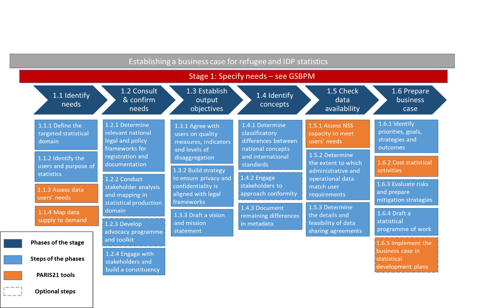

--- 
title: "Compilers-Manual-EGRIS"
author: "Expert Group on Refugee and IDP Statistics (EGRIS)"
date: "`r Sys.Date()`"
site: bookdown::bookdown_site
---

International Coordination
==========================

Mainstreaming Displacement Statistics
------------------------------------------

### Introduction {#introduction .ListParagraph}

11. The numbers of refugees, asylum seekers and internally displaced
    persons (IDPs) have increased rapidly in recent years. Moreover,
    almost every country in the world is affected by forced displacement
    either as a source, point of transit, or host of refugees, asylum
    seekers or IDPs, making forced displacement a global phenomenon.
    However, developing countries are disproportionately affected by
    forced displacement, and there is a growing consensus that greater
    international cooperation is required to assist host countries and
    affected host communities.

12. This manual is concerned with forced displacement, people who are
    forcibly displaced from their homes either by disaster or by
    conflict. These displaced people include those who cross an
    international border (refugees and related populations covered by
    the IRRS), and those who remain in the country from which they were
    displaced (Internally Displaced Persons covered by IRIS). Recent
    global estimates suggest that the majority of displaced people are
    displaced within the borders of their own countries (IDMC 2019).

13. The scale of the problem is growing, although it is difficult to
    obtain a global estimate for all types of displaced people as the
    mandates of the various international agencies providing estimates
    do not cover the universe of displaced people. The Institute of
    Migration tells us that "*by the end of 2017, 68.5 million
    individuals were forcibly displaced worldwide due to persecution,
    conflict, generalized violence and human rights violations. This is
    almost double the number of forcibly displaced people recorded in
    1997*[^1]*.* The IoM goes on to say that "*By the end of 2017, the
    world was hosting 25.4 million refugees. During 2017 alone, some 2.7
    million people became newly displaced to another country, double the
    amount in 2016".*

14. Using another more recent source for internal displacements, rather
    than for refugees seeking protection in another country, the
    Internal Displacement Monitoring Centre estimated that in 2018
    "*there were 28 million new internal displacements associated with
    conflict and disasters across 148 countries and territories were
    recorded in 2018, with nine countries each accounting for more than
    a million".* It should be noted that there were more displacements
    associated with natural disasters (17.2 million), than with conflict
    (10.8 million).

15. Forced displacement has gained prominence on the international
    agenda. The New York Declaration for Refugees and Migrants, adopted
    by the United Nations General Assembly on 19 September 2016,
    recognizes the unprecedented level of human mobility and
    acknowledges the shared responsibility to manage large movements of
    refugees and migrants through international cooperation (United
    Nations, 2016). It also reaffirms the intention of Member States to
    realize the full potential of the 2030 Agenda for Sustainable
    Development for refugees and migrants. Specifically, under the
    Sustainable Development Goal 10 to reduce inequality within and
    between countries, a key target is "to facilitate the orderly, safe,
    regular and responsible migration and mobility of people, including
    through the implementation of planned and well-managed migration
    policies." The New York Declaration for Refugees and Migrants
    explicitly recognizes the needs of refugees, IDPs and migrants in
    the pursuit of this target.

16. With the growing prominence of forced displacement internationally,
    there is increasing interest at national and international levels in
    statistics on refugees, asylum seekers, IDPs and refugee related
    populations, including complete, accurate, timely and
    internationally comparable estimates of the numbers of people
    displaced. Estimates of these populations are increasingly relevant
    for official statistics, which need to take account of forcibly
    displaced populations in a consistent manner. Incomplete or
    inadequate statistics on displaced populations undermine the
    estimation of population stocks, which in turn affects other
    statistics, particularly those measured in per capita terms.

17. Much of the available data on refugees and IDPs is not generated as
    official statistics produced by the statistical systems of national
    governments but arise from operational data that is collected by a
    variety of actors in response to a national emergency. This is data
    collected for the purpose of supporting displaced people, rather
    than for statistical purposes. Displacement contexts can pose
    specific challenges to NSOs, as collecting data during conflict or
    disaster can be challenging and impose obstacles which go beyond the
    usual planning for a new statistical series.

18. Given this, particular attention should be paid to coordination
    between the various partners operating in a country and national
    authorities. In emergency situations some humanitarian data is
    processed by international partners to become international
    estimates and, these estimates need to conform with the standards
    set for official statistics in order to be recognised as
    international statistics. Therefore, at the international level, a
    distinction should also be made between global estimates such as
    those published by the Internal Displacement Monitoring Centre,
    which draw on various statistics and data sources, and any
    international statistics which are produced in line with
    recommendations in the IRRS/IRIS, in accordance the quality
    standards set for UN and other international agencies , or published
    by any future custodian of IDP and refugee statistics.

19. The Inter-Agency and Expert Group on SDG Indicators accepted the
    proposal of EGRIS members to recommend disaggregation by forced
    displacement categories for 12 priority SDG indicators, as well as
    further broken down by age and sex whenever possible.[^2] In order
    to ensure availability of minimum quality statistics on refugees and
    IDPs, it is recommended that national statistics providers include
    statistics on these priority indicators in the reporting plans for
    the 2030 Agenda.

Coordination of International Partners
-------------------------------------------

20. Some statistical series, particularly those used for monitoring the
    achievement of the SDGs, have been allocated an international
    custodian agency[^3], usually a UN agency. This custodian agency,
    promotes adherence to international statistical principles for the
    thematic area under its control; it collects and publishes national
    official statistics and potentially anonymised micro-data; and
    provides technical support and capacity-building to NSOs and/or
    other national bodies responsible for the production of official
    statistics as part of the NSS.

21. While UNHCR is generally accepted as the custodian agency for
    refugee statistics, the IRIS does not make recommendations on a
    specific custodian, although it outlines the role and
    responsibilities of any future custodian. It envisages that a
    custodian for IDP statistics could be appointed in the future to
    compiling international IDP statistics through a questionnaire,
    follow-up, validation, global publication and re-assessment of data
    collection processes.

22. International coordination is important to prevent duplication, fill
    existing gaps, and to develop national capacity.

###### Phase References and Links

-   Principles Governing International Statistical Activities:
    <https://unstats.un.org/unsd/accsub-public/principles_stat_activities.htm>

UN Quality standards for international statistics:
<https://unstats.un.org/unsd/unsystem/Documents-March2017/UNSystem-2017-3-QAF.pdf>

[^1]: https://publications.iom.int/system/files/pdf/gmdacbulletins.pdf

[^2]: [[https://unstats.un.org/sdgs/iaeg-sdgs/disaggregation/]{.underline}](https://unstats.un.org/sdgs/iaeg-sdgs/disaggregation/)

[^3]: https://unstats.un.org/sdgs/iaeg-sdgs/tier-classification/

<!--chapter:end:index.Rmd-->

Specify needs
=============

> 'This phase is triggered when a need for new statistics is identified,
> or feedback about current statistics initiates a review. It includes
> all activities associated with engaging customers to identify their
> detailed statistical needs, proposing high level solution options and
> preparing business cases to meet these needs. In this phase the
> organisation: identifies the need for the statistics; confirms, in
> more detail, the statistical needs of the stakeholders; establishes
> the high level objectives of the statistical outputs; identifies the
> relevant concepts and variables for which data are required; checks
> the extent to which current data sources can meet these needs;
> prepares the business case to get approval to produce the statistics'
> (UNECE, 2013)

22. A comprehensive approach to understanding and specifying statistical
    needs will help to make national statistical systems meet users'
    needs, or in the case of a new statistical series potential users'
    needs. The development of a roadmap for statistical development can
    be guided by several tools and guidelines developed by PARIS21 based
    at OECD. *Figure 1.1: Tools available to support establishing a
    business case* shows the sub-processes set out the GSBPM and
    indicates where tools are available for establishing a business
    case. These are discussed below.

Figure 1.1: Tools available to support establishing a business case

{width="6.5in" height="4.065972222222222in"}

23. Advocacy from regional and international authorities can play a
    crucial part in raising the priority given to refugee and IDP
    statistics by governments, planning authorities and chief
    statisticians. Effective advocacy includes explicitly documenting
    and specifying the unaddressed needs, targeting a group within the
    national statistical system that can effect change, proposing a
    detailed business case for closing the data gap, and using hard
    evidence as a basis for the business case. Joint approaches in
    strengthening national statistical systems, whether regional or
    international, have often been more effective than individual
    national efforts in capacity building and fundraising for emerging
    areas of official statistics, such as refugee and IDP statistics.

24. As the international statistical system derives its input from
    national statistical systems, establishing a business case for a new
    statistical series requires substantial planning and co-ordination
    at national and international levels alike. Nationally, the
    production of refugee and IDP statistics can require several
    ministries, departments or agencies to cooperate with the national
    statistics office (NSO) to make the resulting statistics fit for
    purpose and relevant to users (Eurostat, 2018).

Identify the Needs of Users and Potential Users
----------------------------------------------------

> "1.1 - This sub-process includes the initial investigation and
> identification of what statistics are needed and what is needed of the
> statistics." (UNECE, 2013)

25. The IRRS and IRIS recommendations propose a list of basic data
    tabulations (IRRS Chapter 3 and IRIS Chapter 5) and indicators (IRRS
    Chapter 5 and IRIS Chapter 4) to be produced at the national level.
    These recommendations serve as the core set of official statistics
    in the displacement domain which includes refugee and related
    persons; and internally displaced persons. However, a country's
    range of statistics will vary, depending on the national policy
    priorities and the reporting requirements of regional international
    users, and the capacity of the National Statistical System and what
    statistics are possible to produce with a reasonable effort

26. In respect of international reporting obligations, it should be
    noted that the Inter-Agency and Expert Group on SDG Indicators
    accepted the proposal of EGRIS members to recommend disaggregation
    by forced displacement categories for 12 priority SDG indicators, as
    well by age and sex whenever possible.[^1] In order to ensure
    availability of minimum quality statistics on refugees and IDPs, it
    is recommended that national statistics providers include statistics
    on these priority indicators in the reporting plans for the 2030
    Agenda. However, governments should not feel limited to this
    priority list, and data collection on additional indicators is
    encouraged (IRIS, paragraph 130).

27. There are several potential users of statistics on displaced
    persons, including governments and national authorities, local
    authorities, international organisations, civil society, NGOs,
    researchers/academia, the media and the general public. They have
    different needs and priorities, requiring statistics for different
    purposes:

-   for administrative purposes,

-   for policymaking,

-   for monitoring the implementation of policies,

-   for evaluating policies,

-   to facilitate the allocation of resources,

-   to enable regional/international comparison,

-   to enable comparisons with the wider population,

-   to assess progress towards durable solutions or integration with
    host communities,

-   to inform the general public and enhance public debate.

28. Identifying important "needs gaps" and users' priorities requires
    research. Which can involve a mixed-methods approach, using a
    combination of qualitative and quantitative research methods. A
    useful source of information on the needs of both displaced people
    and the agencies supporting them may be provided by needs
    assessments undertaken by or on behalf on operational agencies
    supporting refugees and IDPs. Needs assessments not only inform
    humanitarian partners but can inform those considering the data
    needs of those supporting the displaced. The UNHCR Needs Assessment
    Handbook provides guidance on their conduct (see also Phase 4
    references *Phase Links and Examples of Training Manuals and Data
    Collection Advice)*. These needs assessments were promoted by the
    World Humanitarian Summit in 2016 and established "commitments for
    aid organizations and donors to work together efficiently,
    transparently, and harmoniously in order to better deliver
    protection and assistance to the millions of people facing emergency
    needs. One of these commitments calls for the improvement of needs
    assessments, notably by:

    1.  Providing a single, comprehensive, cross-sectoral,
        methodologically sound, and impartial overall assessment of
        needs for each crisis to inform strategic decisions;

    2.  Coordinating and streamlining data collection to ensure
        compatibility, quality and comparability, and avoid
        over-assessment and duplication;

    3.  sharing needs assessment data in a timely manner, with the
        appropriate mitigation of protection and privacy risks; and

    4.  Prioritizing humanitarian response across sectors based on
        evidence established by the analysis.[^2]"

Figure 1.2: Data gaps

{width="3.0115015310586175in"
height="2.2692300962379703in"}

29. PARIS21 has developed the [Advanced Data Planning Tool
    (ADAPT)](https://adapt.paris21.org/auth/login)[^3] for NSOs to adapt
    their data production processes to meet the data needs of users. It
    is a consultative tool, which brings data stakeholders together to
    identify data gaps, and define requirements within an established
    monitoring indicator framework such as the UN Sustainable
    Development Goals (SDGs) indicator framework or the basic statistics
    proposed by the IRIS and IRRS (see also the Sustainable Development
    Goal indicators website[^4].)

30. The results of ADAPT can contribute to the development of
    statistical plans, such as National Strategies for the Development
    of Statistics (NSDSs), and processes to strengthen the coordination
    of statistical planning at the national level. ADAPT offers three
    different options to identify indicators affiliated to a given
    statistical framework or specified topic, applicable to refugee and
    IDP statistics. Further details and an explanation of this tool can
    be found in PART III of the document (paragraph 739). Based on the
    information provided, the ADAPT tool can produce two main reports on
    the status of refugee and IDP statistics and identifies any data
    gaps at national level. The first report is able to summarise the
    status of refugee and IDP statistics in respect of the relevant
    national requirements, which could be based on the IRRS or IRIS
    tabulation indicator frameworks, or a national defined requirement.
    The second report presents the status of refugee and IDP statistics
    as a general domain of statistical production, considering all
    indicators that require a relevant disaggregation variable.

Consult and Confirm Needs
------------------------------

> "1.2 - This sub-process focuses on consulting with the stakeholders
> and confirming in detail the needs for the statistics." (UNECE, 2013)

31. National collaboration platforms, for example targeted workshops or
    thematic conferences, and regional fora can be an opportunity to
    engage with the identified strategic stakeholders and promote the
    need for refugee and IDP statistics. Connecting the topics with
    policy priorities at international and national levels can attract
    the attendance of high-level political representatives and help to
    gain government support.

32. Many countries are mandated by their statistics law to set out a
    statistical work programme, an example of this is Turkstat whose
    Official Statistics Programme is based on the Statistics Law of
    Turkey No 5429. Many other countries have statistical development
    plans such as the NSDS described below.

33. [National Strategies for the Development of Statistics
    (NSDSs)](https://nsdsguidelines.paris21.org/node/717) provide a
    framework for structuring support and developing statistical
    capacity in the national statistical system. These multi-annual
    strategies aim at mainstreaming sectors into the national
    statistical system (NSS), engaging with other data producers and
    coordinating the entire NSS, responding to data challenges, and
    building statistical capacity across the "the statistical value
    chain" (PARIS21, 2018). An NSDS can be an integral part of national
    ownership over statistical development, and secure funding at
    national and international level.

34. The implementation of refugee and IDP statistics in these
    statistical development plans, which cover all parts of official
    statistics, can be useful for mainstreaming these statistics into a
    wider national planning process and improving cooperation with the
    data producers involved. This is particularly important with
    displacement statistics as data is likely to be held by many
    agencies including non-traditional sources and the humanitarian
    sector.

35. The NSDS should be firmly linked to national development plans and
    involve several different sectors. Refugee and IDP statistics could
    be considered a sector. The identification of targeted sectors
    varies from country to country depending on national priorities and
    administrative structures. Usually, sectoral strategies correspond
    to line ministries, government departments or agencies with separate
    and well-defined areas of concern, mandate and budget. However, most
    countries do not have a corresponding government ministry or agency
    responsible for monitoring forced migration or displacement, and the
    level political sensitivity within these domains remains at a high
    level.

36. As part of the NSDS process, making the case for developing a
    sectoral strategy for refugee and IDP statistics is important.
    Traditionally in the NSDS process, technical committees are in
    charge of defining sectoral statistical needs, and the number of
    sectors involved is often constrained. Depending on its strategic
    importance to government, refugee and IDP statistics could face
    challenges in being "recognised" as a sectoral statistical area
    within the NSDS process and may require specific advocacy and the
    allocation of a lead government Ministry, Department or Agency.

37. Depending on whether the country has developed a NSDS or not, the
    mid-term evaluation or a new phase of the NSDS can be the right
    moment for integrating a new sectoral strategy related to refugee
    and IDP statistics. Integration of refugee and IDP statistics into
    the NSDS should occur at all stages of the design and implementation
    phases. The process of developing a sectoral strategy for refugee
    and IDP statistics involves the following steps:

### Establishing a Sector Statistics Committee for Displacement Statistics {#establishing-a-sector-statistics-committee-for-displacement-statistics .ListParagraph}

38. Sector Statistics Committees (SSC) are responsible for defining and
    confirming the statistical needs for sectors. The Refugee and IDP
    Statistics Committee should be constituted by those leading of the
    sector at the request of the NSO, and a sector Coordinator should be
    designated. A large number of departments, ministries and agencies
    could be involved, including migration authorities, social
    development ministries, urban planning authorities, rural
    development authorities, and the humanitarian sector. Experience
    shows that five active members are the ideal number for the
    committee, but the Sector Statistics Committee should involve actors
    from the wider data ecosystem and goes beyond the traditional
    boundaries of the NSS, to humanitarian agencies including UNHCR and
    OCHA.

39. The responsibilities of a potential Refugee and IDP Statistics
    Committee would be similar to those of other sectors, including: a)
    proposing a vision for refugee and IDP statistics for approval, b)
    prioritising statistical activities over the lifespan of the
    Sectoral Strategy for the Development of Statistics, c) identifying
    major agencies currently collecting relevant statistics for refugees
    and IDPs, d) preparing an inventory of existent current data systems
    in existence operated by stakeholders, e) identifying major data
    needs related to the sector, f) developing strategic actions,
    including organisational and HR development, IT strategy,
    dissemination policy and other areas.

40. The role of the NSO is important for statistics coordination and to
    ensure that the potential data sources relevant for refugee and
    displacement statistics are able to be used, and that data
    confidentiality is adequately protected under the relevant
    statistics law.

41. The sector statistics design team should consist of staff from
    several ministries (e.g. Interior and External Relations Ministries,
    Migration agency) to ensure commitment and assurance of staff time
    through a more formal process, including memoranda of understanding
    between the agencies and participating ministries. As NSSs are not
    always able to capture forced migration and displacement within
    officially produced data sources, data may be needed from
    non-traditional data producing institutions, such as civil society
    and humanitarian agencies.

### Using operational data from humanitarian agencies for official statistics {#using-operational-data-from-humanitarian-agencies-for-official-statistics .ListParagraph}

42. Where there is insufficient data from government sources for
    statistical purposes, operational data from humanitarian agencies
    present a possible resource for establishing or augmenting a new
    statistical series for refugee and IDP statistics. Operational data
    are produced during regular activities of humanitarian agencies are
    intended for internal use in planning operations only and do not
    usually meet the standards set for official statistics, before use
    they should be carefully assessed using a national or international
    statistical data (e.g. UN Statistics *Quality Assurance Framework
    quality assessment tool).*

43. The quality of any operational data identified for use in a new
    statistical series should be assessed focusing on standardisation,
    coverage, accuracy and confidentiality. Ultimately, the statistical
    authority (e.g. NSO, line ministry, specialised statistical unit
    within NSS) in charge will determine the usefulness of operational
    data as input for the new statistical series after assessing crucial
    quality issues and negotiating data sharing agreements (see IRRS,
    Chapter 6 pp 136-140).

44. One source of operational data is the IASC Common Operational
    Datasets, are developed and endorsed by the Inter-agency Standing
    Committee (IASC) and disseminated by OCHA. These are Common
    Operational Data sets (CODs) and fundamental operational datasets
    (FODs) used in humanitarian emergencies to support technical
    standards, improve the quality of data, and strengthen
    interoperability. In the IASC Common Operational Datasets there are
    three levels of accountability: Guardian, Sponsor and Source. For
    more information see the [IASC Guidelines on Common Operational
    Datasets in Disaster Preparedness and
    Response](https://fscluster.org/sites/default/files/documents/IASC_Guidelines_on_Common_Operational_Datasets_in_Disaster_Preparedness_and_Response_1_Nov._2010%5B1%5D.pdf).

45. The Protection Information Management for Quality Protection
    Outcomes (PIM) Initiative[^5] is a collaborative project, bringing
    together UN, NGO, and other protection and IM partners working to
    respond to protection needs in situations of displacement. The
    objective of PIM is to provide quality data and information on
    people in displacement situations in a safe, reliable, and
    meaningful way. Data on refugees and IDPs can be extremely sensitive
    and confidentiality and data protection are of paramount importance.
    Data collection should be consistent with national legislation on
    data protection and international obligations related to privacy.
    Data protection considerations may limit the access of statisticians
    to information in administrative systems, unless national laws
    establish the right of access to administrative data for statistical
    purposes. This project identifies three different roles for the use
    of PIM data;

    1.  **Guardian:** OCHA is the "Guardian" of the agreed upon datasets
        and will facilitate the distribution of the "best" available
        common operational and fundamental datasets in emergencies while
        managing forums for updates and distribution communication. If
        OCHA is unable to provide this service in a specific country, a
        suitable substitute Guardian should be identified by
        Humanitarian Country Teams or equivalent decision-making body
        during contingency planning. Quality assurance for compliance
        with minimum format and data characteristics in datasets will be
        conducted by OCHA, or the substitute Guardian, prior to
        distribution. This will include assigning a common GLIDE number
        to be associated with the dataset after the onset of a natural
        disaster[^6].

    2.  **Sponsor:** Each dataset has a designated "Sponsor" who is
        responsible for identifying and liaising with relevant "Sources"
        to analyse, collate, clean and achieve consensus around a
        specific operational dataset If possible dataset Sponsors will
        proactively identify and collate information prior to
        emergencies in the data preparedness phase in support of the
        contingency planning process. If this is not possible, Sponsors
        will be identified in relation to their specific dataset early
        in the emergency and will assume responsibilities related to
        their thematic dataset. OCHA will maintain lists of dataset
        Sponsors at the country and global levels and coordinate between
        data Sponsors.

    3.  **Source:** Each dataset will have designated source(s) or
        owner(s), such as: national authority/agency, Cluster, NGO, UN
        agency, International Organization, International Red Cross/Red
        Crescent that agrees to be fully responsible for the
        development, maintenance and metadata associated with a dataset
        and control distribution restrictions.

46. In many countries where governments have limited capacity to
    register refugees, the UNHCR collects administrative data on asylum
    seekers and refugees on behalf of governments. Part III of this
    manual includes an example of the data sharing Agreement on the
    Transfer of Personal Data of Refugees and Asylum-seekers to
    governments under certain conditions (see Part III *UNHCR Agreements
    and Memoranda of* *Understand*ing). They acknowledge the importance
    of registration as a protection tool and expect States to take
    responsibility for registration as quickly as possible. The sharing
    of data needs to be "*subject to the data protection safeguards as
    contained in UNHCR's Policy on the Protection of Persons of
    Concern*[^7]*".* The agreement allows for the *'*compiling
    statistical data' among the allowable purposes for personal data
    transfer. Data may not be transferred to a third party except with
    the prior written authorisation of UNHCR and/or the consent of the
    data subject (the refugee or displaced person). Any third party must
    conform with the conditions set out in the UNHCR data sharing
    agreement. In the case of refugees, the data may not be shared with
    the refugee's country of origin, except under the circumstances of
    voluntary repatriation under the auspices of UNHCR with the consent
    of the individual refugee.

47. The minimum set of indicators identified in the IRRS and IRIS
    recommendations should be considered as the core statistics to
    monitor internal and international displacement and for reporting to
    the global statistical system. However, it is recognised that most
    countries will not reach this minimum initially, and that time will
    be needed to build the capacity to produce these.

Establish Output Objectives
--------------------------------

> "This sub-process identifies the statistical outputs that are required
> to meet the user needs identified in the previous sub-processes."
> (UNECE, 2013)

48. Once a need has been established, the practicalities of developing
    the statistical series will have to be defined. Establishing the
    practicalities include the agreement of users on the suitability of
    and quality measures for the proposed statistical outputs, and the
    recommendation of indicators and levels of disaggregation.
    Furthermore, this sub-process can be used to address any special
    concerns of refugees and IDP through the statistical series that
    could be relevant in the national context (trauma, sensitivity,
    confidentiality, migrating children etc.).

49. There are inherent potential risks of producing displacement
    statistics, as data use would include politically sensitive issues
    such as refugee support, population displacement, integration,
    disaster response and crossing borders. Any data collection effort
    in these domains needs to observe people\`s rights to consent,
    privacy, security and ownership, and consider legal frameworks
    relating to confidentiality, which are both likely to be constraints
    when defining the output objectives.

Identify Concepts
----------------------

> "This sub-process clarifies the required concepts to be measured by
> the business process from the point of view of the user
>
> ." (UNECE, 2013)

50. An internationally agreed refugee and related persons classification
    was agreed in the IRRS 2018 (see Chapter 3) and a similar
    classification for IDPs is set out in IRIS 2020 (see Chapter 3).
    When referring to the refugee population within a given country, the
    IRRS include persons who are "primarily classified in legal terms by
    their claim to refugee status, or their descent from those with or
    seeking international protection" (IRRS, 2018). There are three
    major categories; a) Persons in need of international protection
    which includes refugees, asylum seekers and others granted temporary
    or subsidiary forms of protection; b) Persons with a refugee
    background which includes naturalized former refugees, the children
    and other family members of refugees, and c) Persons returned from
    abroad after seeking international protection. (see IRRS Figure 3.1
    page 30).

51. For IDPs and related populations there are four major categories; a)
    Persons who have displacement-related protection needs (subdivided
    into IDPs in locations of displacement, IDPs in location of return,
    and IDPs in other settlement locations); b) IDP-related populations
    who are the children born after displacement to at least one IDP
    parent; c) Other non-displaced family members of IDPs; and d) Those
    who have overcome key displacement-related vulnerabilities. (See
    IRIS Figure 3.1 page 26).

52. From the point of view of the statistics users, nationally and
    internationally, classificatory differences between national laws
    and international recommendations may be identified. These
    differences may reflect the specific needs of data users. If the
    concepts do not align, the stakeholder should agree on a process to
    approach conformity, and any remaining differences need to clearly
    be identified in the accompanying metadata.

    Classificatory differences mainly may arise due to differences in
    national legislation and it may be required to add the reasons for
    granting asylum. The reference metadata for a new statistical series
    on refugee statistics should pay special attention to describing and
    defining these differences to achieve international comparability of
    refugee statistics. The structure of the reference metadata should
    follow established statistical standards, such as Statistical Data
    and Metadata eXchange (SDMX)[^8].

Check Data Availability
----------------------------

> "This sub-process checks whether current data sources could meet user
> requirements, and the conditions under which they would be available,
> including any restrictions on their use." (UNECE, 2013)

53. The production of refugee and IDP statistics often requires the
    combination of data from several data producers within the national
    statistical system, including line ministries, government
    departments and agencies, and civil society. As national statistical
    systems differ in their level of centralization, the effort needed
    to foster consultation and collaboration between statistical
    producers varies accordingly. Therefore, establishing a statistical
    programme of work, developed jointly by the statistical producers,
    requires an initial mapping of strategic stakeholders to be
    consulted in the consultation for and the confirmation of the
    business case.

54. Accessing data produced by the agencies responsible for displaced
    people for statistical use can be problematic. There are a number of
    reasons why data sharing between agencies for statistical purposes
    can be difficult. These involve legal restrictions and issues of
    trust between officials. While the statistics law is usually clear
    about data confidentiality and the uses to which data can be put,
    the agency collecting the data will also have its own laws and
    regulations which may prohibit data sharing, and the issue becomes
    one of legal precedence. The situation in the European Statistical
    System as at 2015-2017 is set out below in *Table 1.2: National
    Legal Framework - Clarity and coverage of legislation; restrictions
    and limitations. (European Statistical System).*

55. Member States of the European Union and EFTA have statistics laws
    which enables data sharing among government stakeholders. This legal
    framework authorises the NSOs to access administrative sources
    without imposing any restrictions with reference to the provisions
    laid down in the [Regulation (EC)
    223/2009](https://eur-lex.europa.eu/LexUriServ/LexUriServ.do?uri=OJ:L:2009:087:0164:0173:En:PDF).
    In this regulation *Article 24, Access to administrative records*
    states;

    *"In order to reduce the burden on respondents, the NSIs and other
    national authorities and the Commission (Eurostat) shall have access
    to administrative data sources, from within their respective public
    administrative system, to the extent that these data are necessary
    for the development, production and dissemination of European
    statistics." *

56. The [ESS Vision
    2020](http://ec.europa.eu/eurostat/web/ess/about-us/ess-vision-2020) highlights
    the importance of cooperation with stakeholders and of developing
    strategic alliances with private and public partners (key area
    \"identifying user needs and cooperation with stakeholders\"). A
    workshop was organised in 2016 in order to allow the National
    Statistical Institutes to identify and share best practices on
    cooperating with the owners of administrative sources in order to
    access to administrative data sources ([Workshop on Access to
    Administrative Data
    Sources](https://ec.europa.eu/eurostat/cros/content/2016-workshop-access-administrative-sources_en),
    Brussels, 13-14 September 2016). Between 2015 and 2017, information
    was collected on the obstacles that the NSOs still face in accessing
    administrative data and how they have managed to overcome some of
    the difficulties. On this basis, two reports were finalised in 2018:

    4.  **Report on the legal and institutional environment in Member
        States**: [Final
        report](https://ec.europa.eu/eurostat/cros/system/files/admin-wp1.1_analysis_legal_institutional_environment_final.pdf)

    5.  **Good practices regarding the relation with data
        providers**: [Final
        report](https://ec.europa.eu/eurostat/cros/system/files/admin-wp1.2_good_practices_final.pdf)

57. The above reports set out the situation in European countries which
    illustrate the differences which exist between member states.

Table 1.1: National Legal framework - Scope and extent of mandate to
access administrative data (European Statistical System)

{width="6.055555555555555in"
height="7.422426727909011in"}

{width="6.022222222222222in"
height="0.44166666666666665in"}

{width="5.375in" height="0.1527777777777778in"}

Source: Eurostat: [Analysis of the Legal and Institutional Environment
in the
ESS](https://ec.europa.eu/eurostat/cros/system/files/admin-wp1.1_analysis_legal_institutional_environment_final.pdf)

Table 1.2: National Legal Framework - Clarity and coverage of
legislation; restrictions and limitations. (European Statistical System)

{width="6.188888888888889in"
height="4.318552055993001in"}

Source: Eurostat: [Analysis of the Legal and Institutional Environment
in the
ESS](https://ec.europa.eu/eurostat/cros/system/files/admin-wp1.1_analysis_legal_institutional_environment_final.pdf)

58. Examples of other legal provisions for the production of statistics
    about displaced people can be found in Part II Examples and Cases
    studies.

    6.  *The Bosnia and Herzegovina Case Study* cites several examples
        of enabling legal and policy frameworks for the production of
        displacement statistics (see paragraph 542).

    7.  *The Turkey Case Study* cites the ability of Turkstat to access
        administrative data collected under the *Foreigners and
        International Protection law* by the Ministry of the Interior,
        Director General of Migration Management (see Part II Case
        Studies Turkey) under its legally mandated 5-year statistical
        planning cycle (see paragraph 637 for reference to Law mandating
        statistical planning). The Statistics Law of Turkey No 5429 also
        mandates Turkstat for determining the basic principles and
        standards for national registration systems, and for supporting
        and monitoring the organisations involved in the statistical
        production process.

59. Where data is being integrated to combine various sources in order
    to increase the scope and coverage of a statistical series, the
    legal constrains are particularly important. Readers should see also
    *Phase 2D* *a. Legal environment and data protection legislation*
    which discusses data availability at length in respect of data
    integration.

###### Phase Links and References 

Eurostat (2018), "International Recommendations on Refugee Statistics
(IRRS)", Eurostat, Brussels,
<https://ec.europa.eu/eurostat/documents/3859598/9315869/KS-GQ-18-004-EN-N.pdf/d331c9cc-1091-43c2-b589-2c250bccc281>.

Flowminder (2015), "Nepal Earthquake 2015 Case Study", Flowminder,
Stockholm,
<https://web.flowminder.org/case-studies/nepal-earthquake-2015>.PARIS21
(2018), \"NSDS Guidelines\", PARIS21, Paris,
<https://nsdsguidelines.paris21.org/NSDS-GUIDELINES-full-lang-en.pdf>.

PARIS21 (2018), "Assessing the capacity of national statistical systems:
a user's guide ", PARIS21, Paris,
<https://paris21.org/sites/default/files/2018-08/NSS-Assessment-Guide%20-%20WEB.pdf>.

PARIS21 (2019), "The Advanced Data Planning Tool Version 1.2 Manual for
Users", PARIS21, Paris,
<https://paris21.org/sites/default/files/inline-files/ADAPT_Manual_April%202019_Final_v1.2.pdf>.

UNECE (2013), "Generic Statistical Business Process Model", UNECE,
Geneva,
<https://statswiki.unece.org/display/GSBPM/V._+Descriptions+of+Phases+and+Sub-processes#V._DescriptionsofPhasesandSub-processes-_Toc375051204>.

UNHCR (2017), "Global Trends Forced Displacement in 2017", UNHCR,
Geneva,
<https://www.unhcr.org/statistics/unhcrstats/5b27be547/unhcr-global-trends-2017.html>.

[^1]: [[https://unstats.un.org/sdgs/iaeg-sdgs/disaggregation/]{.underline}](https://unstats.un.org/sdgs/iaeg-sdgs/disaggregation/)

[^2]: http://needsassessment.unhcr.org

[^3]: the Advanced Data Planning Tool (ADAPT) Manual and Capacity
    Development 4.0 (CD4.0) implementation guidelines provide resources
    to provide content and steps to the roadmap for building a
    sustainable business case.

[^4]: <https://unstats.un.org/sdgs/iaeg-sdgs/disaggregation/> and
    [https://unstats.un.org/sdgs/iaeg-sdgs/tier-classification/](https://unstats.un.org/sdgs/iaeg-sdgs/disaggregation/%20%20%20%20https:/unstats.un.org/sdgs/iaeg-sdgs/tier-classification/).

[^5]: <http://pim.guide/wp-content/uploads/2018/05/Framework-for-Data-Sharing-in-Practice.pdf>
    and
    <http://pim.guide/guidance-and-products/product/principles-protection-information-management-may-2015/>.

[^6]: Accessing disaster information can be a time consuming and
    laborious task. Not only is data scattered but frequently
    identification of the disaster can be confusing in countries with
    many disaster events. To address both of these issues, **Asian
    Disaster Reduction Center (ADRC)** proposed a globally common Unique
    ID code for disasters. This idea was shared and promoted by the
    Centre for Research on the Epidemiology of Disasters (CRED) of the
    University of Louvain in Brussels (Belgium), OCHA/ReliefWeb,
    OCHA/FSCC, ISDR, UNDP, WMO, IFRC, OFDA-USAID, FAO, La Red and the
    World Bank and was jointly launched as a new initiative
    \"GLIDE\". <http://glidenumber.net/glide/public/about.jsp>

[^7]: https://www.unhcr.org/uk/4b040a429.pdf

[^8]: <https://sdmx.org> and
    https://ec.europa.eu/eurostat/web/sdmx-web-services/sdmx

<!--chapter:end:01-SpecifyNeeds.Rmd-->

Design
======

> "This phase describes the development and design activities, and any
> associated practical research work needed to define the statistical
> outputs, concepts, methodologies, collection instruments and
> operational processes. It includes all the design elements needed to
> define or refine the statistical products or services identified in
> the business case. This phase specifies all relevant metadata, ready
> for use later in the statistical business process, as well as quality
> assurance procedures. For statistical outputs produced on a regular
> basis, this phase usually occurs for the first iteration, and whenever
> improvement actions are identified in the Evaluate phase of a previous
> iteration." (UNECE, 2013)

60. This Phase is subdivided into four main data sources in sub-phases
    2.3 to 2.5 in order to clarify and simplify the steps for dealing
    with the different sources. There are different sub-sections dealing
    with refugees and IDPs in some of the sections.

> 2A. Census
>
> 2B. Surveys
>
> 2C. Admin data
>
> 2D. Integrated Data

Design Outputs
-------------------

"This includes the detailed design of the statistical outputs, products
and services to be produced, including the related development work and
preparation of the systems and tools used in the \"Disseminate\" phase.
Disclosure control methods, as well as processes governing access to any
confidential outputs are also designed here.

Outputs should be designed to follow existing standards wherever
possible, so inputs to this process may include metadata from similar or
previous collections, international standards, and information about
practices in other statistical organisations from sub-process 1.1
(Identify needs)." (UNECE, 2013)

### Refugee statistics outputs {#refugee-statistics-outputs .ListParagraph}

61. Basic refugee tabulations are recommended as outputs in the
    guidelines for basic tabulations in Chapter 3 of IRRS. In addition,
    there are analytical recommendations in Chapter 5 of the IRRS which
    propose a list of indicators for measuring refugee integration and
    the measurement of their immediate and ongoing needs (see IRRS,
    Table 5.1), these are closely aligned with the SDGs. These
    recommendations may need to be modified in response to national
    needs as determined in Phase 1 (1.1. Identify the Needs of Users and
    Potential Users) of this manual.

<!-- -->

1)  #### Refugee stock tabulations

2)  #### Refugee flow tabulations

3)  #### Refugee stock indicators

<!-- -->

62. In addition to tabulations key indicators for the refugee and
    refugee related populations are shown below.

Table 2.3: Refugee Stock indicators

63. Stock indicators are recommended for all three categories of refugee
    and refugee related populations, whereas flow indicators are
    recommended only for those in need of international protection, and
    not for those with a refugee background or returned to their country
    of habitual residence.

Table 2.4: Refugee Flow Indicators

### IDP statistics outputs {#idp-statistics-outputs .ListParagraph}

64. Basic tabulations are recommended as outputs in the guidelines for
    basic stock and flow tabulations in Chapter 5 of IRIS. These
    recommendations may need to be modified in response to national
    needs as determined in Phase 1 (1.1. Identify the Needs of Users and
    Potential Users) of this Manual.

65. IDP statistics are separated into four population groups; a) Persons
    who have displacement-related protection needs (subdivided into IDPs
    in locations of displacement, IDPs in location of return, and IDPs
    in other settlement locations); b) IDP-related populations who are
    the children born after displacement to at least one IDP parent; c)
    Other non-displaced family members of IDPs; and d) Those who have
    overcome key displacement-related vulnerabilities. (See IRIS Figure
    3.1 page 26).

66. The Section C of IRIS suggests basic flow tabulations divided into
    inflow, outflows and flows between sub-stocks, while Section D
    recommends basic stock tabulations.

#### IDP and IDP-related population flow tabulations

67. The in-flow tabulations distinguish between a) IDPs with protection
    needs and b) IDP-related populations. Capturing flows may be
    difficult and challenging for national statistical systems depending
    on the data collection methodology used. The flows of IDPs are more
    complex to estimate than the flows of refugees, as the ending of IDP
    status is not legally defined in international law as is the case
    for refugees. IDP status ceases when a durable solution has been
    reached, and this can only be achieved if displacement related
    vulnerabilities have been overcome according to the IASC framework
    on durable solutions (see IRIS, 2020 Chapter 4).

68. The IRIS proposes a methodology to measure the progress that IDPs
    have made in overcoming key displacement-related vulnerabilities,
    and to assess statistically when IDPs have reached a durable
    solution and can be taken out of the IDP stock. The methodology is
    to be tested in a variety of contexts and will be amended to take
    account of country conditions.

Table 2.5: Flows of IDPs and IDP-Related Populations

#### IDP and IDP-related population stocks tabulations

69. The most basic statistics are the counts of IDP and IDP-related
    persons, the tabulations recommended below represent the basis
    analysis of IDP stocks

70. Chapter 4, Section C of IRIS, 2020 recommends a measure of the
    progress made by IDPs in overcoming their displacement related
    vulnerabilities. Basic progress statistics for IDPs are recommended
    for capturing their progress towards reaching durable solutions,
    measured against a reference population, either the national or
    regional average, or the host community.

71. population (see IRIS, 2020 paras 145 to 157).

####  {#section .ListParagraph}

#### Key IDP Stock Indicators

72. In addition to the basic tabulations a set of key indicators for the
    stock estimates of IDPs and IDP-related persons have also been
    recommended. For people who have overcome key displacement
    vulnerabilities indicators i, ii and viii to x apply.

Table 2.8: Key stock indicators of IDP, IDP-related, and those who have
overcome key displacement related vulnerabilities

### Examples of Outputs Illustrated in PART II {#examples-of-outputs-illustrated-in-part-ii .ListParagraph}

73. Examples of refugee tabulations can be found in Phase 6 of this
    manual

    1.  **Norway** refugee tabulations see paragraph 412 onwards for
        details of outputs.

    2.  **Bosnia and Herzegovina** see paragraph 537 onwards and for
        examples of publications in the local language see;
        <http://www.mhrr.gov.ba/PDF/Izbjeglice/INFORMACIJA%20O%20POVRATKU%20DO%202010.pdf>

    3.  **Georgia** case study includes IDP tabulations by a) age, sex
        and urban/rural and b) by sex and place of current usual
        residence and habitual place of residence, from the 2014 General
        Population Census, see paragraph 582.

    4.  **Turkey** case study sets out the outputs published in their
        5-year Official Statistics Programme of work, see paragraph 649.

    5.  **MED-HIMS** Case Study includes recommended tabulations for
        forced migrants -- see Part II paragraph 697.

Design variable descriptions
---------------------------------

> "This sub-process defines the statistical variables to be collected
> via the collection instrument, as well as any other variables that
> will be derived from them in sub-process 5.5 (Derive new variables and
> units), and any statistical classifications that will be used. It is
> expected that existing national and international standards will be
> followed wherever possible.
>
> This sub-process may need to run in parallel with sub-process 2.3
> (Design collection), as the definition of the variables to be
> collected, and the choice of collection instrument may be
> inter-dependent to some degree"[^1]. (UNECE, 2013)

74. Preparation of metadata descriptions of both collected and derived
    variables and classifications is needed for subsequent phases of the
    statistical process. The lists of variables described below may be
    modified and supplemented by the users' needs as described in *Phase
    1 of this Manual.*

-   The variables and classifications recommended refer to guidelines in
    Chapter 3 of IRRS (2018) and Chapter 5 of IRIS (2020).

### Variables for refugee statistics {#variables-for-refugee-statistics .ListParagraph}

75. Most of the variables to be used are common to other areas of social
    statistics, but several are unique to refugee statistics. The
    classifications of asylum seekers, refugees and those with a refugee
    background ae unique, and more detail can be found in IRRS
    Chapter 3. These variables required are set out in below in *Table
    2.9: Variables for refugee statistics*.

76. Variable xi in the table, *Legal residential/international
    protection status as applicable to the national context* in the
    table refers to the persons legal status in respect of international
    protection. The classification is set out in IRRS (2018) Figure 3.1
    and reproduced here in *Table 2.10: Classification of legal
    protection status of refugees and refugee related populations.*

77. Another variable that is unique to displacement statistics is linked
    to the legal concept of place or country of habitual residence. This
    refers to the place or country where a person was usually resident
    at the time they were displaced. This concept occurs in variable
    viii listed below for refugee statistics and in IDP statistics.

78. The usual place or country of residence is where a person is living
    now, and has been or intends to continue living for one year. The
    habitual place of residence is the place or country from where the
    person was displaced. IRIS (2020) Box 3.3 describes the differences.
    The concepts are equally applicable to country and place of
    residence. The concept is used in the *Bosnia and Herzegovina Case
    Study* (see paragraph *537 onwards)* and captures the address before
    the war and the current address in its Database of Displaced Persons
    (DDPR). Georgia asks in its census "Where are you a refugee from"
    (see paragraph 579).

Table 2.9: Variables for refugee statistics

Table 2.10: Classification of legal protection status of refugees and
refugee related populations

### Variables for IDP statistics {#variables-for-idp-statistics .ListParagraph}

79. The list of variables for IDP statistics is very similar to those of
    refugees but omits the international migration related questions and
    includes the date of first and last displacement. The reason for
    displacement is required in a more extensive form, and the type of
    dwelling or habitation they are currently living in is also
    required. In order to identify the IDP-related population the IDP
    status of parents is also required.

Table 2.11: Variables for IDP statistics

80. Variables vii and viii are used to assess whether or not individuals
    have returned to their habitual place of residence. This return
    enables the IDP to be classified according to the three sub-stocks
    (see IRIS, 2020 Figure 3.1 - i. IDPs in locations of
    displacement, ii. IDPs in locations of return, and iii. IDPs in
    other settlement locations) and to be counted as flow within the
    stock.

81. As a simple return does not mean that IDPs have overcome all their
    displacement related vulnerabilities, additional variables will be
    needed to assess the IDPs progress and to contribute to the
    composite measure to assess overcoming key displacement-related
    vulnerabilities. The *Criteria and sub-criteria included in the
    Composite Measure of Overcoming Displacement-Related
    Vulnerabilities* is explained in the IRIS Chapter 4 and is
    illustrated in Figure 4.3 reproduced below. The same chapter
    discusses the choice of the variables to be used, and future
    progress on recommendations made will be included in future versions
    of this Manual.

82. Therefore, in addition to classificatory variables described above,
    a set of variables should be chosen to assess the IDPs progress
    towards overcoming their displacement related vulnerabilities.
    *Table 2.12: Criteria and sub-criteria included in the composite
    measure of overcoming displacement-related vulnerabilities* lists
    the criteria.

83. To make the assessment of the progress of the IDP and IDP-related
    population a comparator population is needed, this may be the
    general population or sub-national population in the vicinity of the
    initial displacement who have not themselves suffered displacement.
    These variables should also be available in the comparator
    population where relevant to enable comparisons to be made.

Table 2.12: Criteria and sub-criteria included in the composite measure
of overcoming displacement-related vulnerabilities

  ----------------------------------------------- ---- -------------------------------------------
  Criteria                                             Sub-criteria
  1\. Safety and security                         1    1.1 Victims of violence (protection from)
                                                  2    1.2 Freedom of movement
  2\. Adequate standard of living                 3    2.1 Food security
                                                  4    2.2 Shelter and housing
                                                  5    2.3 Medical services
                                                  6    2.4 Education
  3\. Access to livelihoods                       7    3.1 Employment and livelihoods
                                                  8    3.2 Economic security
  4\. Restoration of housing, land and property   9    4.1 Property restitution and compensation
  5\. Access to documentation                     10   5.1 Documentation
  Source: IRIS, 2018 Table 4.3                         
  ----------------------------------------------- ---- -------------------------------------------

84. For each sub-criterion, there are many different indicators which
    can be chosen, although a final list has not yet been agreed. The
    indicators selected in each national context should, as far as
    possible, be aligned with already tested and standardized
    indicators. The Durable Solutions indicator library[^2] provides a
    thorough overview of potential options (see IRIS,2020 paragraph
    127-128). Where relevant, they should also mirror the SDG indicators
    recommended to be disaggregated by different categories of
    displacement. Indicators selected should be carefully chosen to
    ensure they are relevant for all three sub-stocks of the displaced
    population: IDPs in locations of displacement, IDPs in locations of
    return and IDPs in other settlement locations.

85. For the purposes of statistical measurement, to make it as unbiased
    and cost efficient as possible, the following aspects should be
    taken into account when selecting the indicators:

    6.  Commonly used: It is an advantage if the indicator in question
        is collected for other purposes as well to facilitate population
        group comparison and to incorporate displacement analysis into
        existing larger data collection processes. SDG indicators are a
        good example here as most surveys and censuses will cover a
        number of these at least up until 2030.

    7.  Tested and evaluated. Linked to the previous point, it is also
        an advantage to select indicators or questions which have been
        tested and satisfy quality criteria. This is the case for most
        of the indicators and related questions asked in standard
        household surveys, for example on education, food security or
        employment.

    8.  Covering the population in question: There are several potential
        indicators which may be relevant in the context, but do not
        cover all of the population in question.

86. This manual discusses four types of data sources: A. Census of
    Population and Housing, B. Sample Surveys, C. Administrative Data
    and D. Integrated Data Sources. Each of these data sources is
    described in turn, and subprocesses 2.3, 2.4 and 2.5 are separately
    described for each of the sources where relevant.

87. The design of the data collection should at a minimum aim to collect
    data to populate the variables described above in sub-phase 2.2.
    Design variable descriptions. In many cases the data collection
    exercise will need to identify both the refugee and related
    populations, and the IDP and related populations. Compromises may
    need to be made to keep the questioning to manageable proportions.

Data Source A: Censuses of Population and Housing
-------------------------------------------------

Design collection
------------------------

"This sub-process determines the most appropriate collection method(s)
and instrument(s). The actual activities in this sub-process will vary
according to the type of collection instruments required, which can
include computer assisted interviewing, paper questionnaires,
administrative data interfaces and data integration techniques. This
sub-process includes the design of collection instruments, questions and
response templates (in conjunction with the variables and statistical
classifications designed in sub-process 2.2 (Design variable
descriptions))". (UNECE, 2013)

88. In designing the Census of Population Housing there are two
    questions to consider:

    9.  Are displaced people included in the census coverage? If so, is
        > it possible to identify them as such in the data?

    10. How coherent are the results when compared to other sources such
        > as surveys and administrative data?

### EGRIS recommendations {#a.1.-egris-recommendations .ListParagraph}

89. The IRRS, 2018 includes a recommendation on identifying refugees in
    the population census, by asking about the main reason for the
    immigration to the country and allowing for an option on forced
    displacement. If internal migration is also included in a census,
    then there is the potential to screen for IDPs as well as refugees
    by asking similar questions on the reason for internal moves within
    a country. Typically, a census asks about a person's location a year
    ago, and in some cases 5 years ago. Where there have been large
    displacements in a country the date selected often coincides with a
    significant displacement event, as this not only helps people to
    recall where they were on the date chosen improving accuracy, but
    also helps to identify IDPs.

90. The IRIS, 2020 also make census recommendations. Recognising that
    relying on internal migration questions in a census is likely to
    lead to an under-estimation of IDP stocks because the last move of
    an IDP is not always the most relevant one. The limitations are as
    follows;

    11. Place of habitual residence will usually not be identified,

    12. Those who have returned to their habitual place of residence
        within the period specified by the census,

    13. Those who within the period specified by the census have moved
        one or several times after their initial displacement, and

    14. Those who have moved within the same administrative area used in
        census geographical classifications.

91. Ideally every census would ask questions about the reasons for both
    internal and international migration and include a response on
    forced displacement. This would capture IDPs, refugees, asylum
    seekers, those under temporary protection and those returning to
    their country of habitual residence. The reason should refer to the
    main reason for the most recent move. The question should be asked
    of all individuals, not just adults and also be asked to those
    living in camps and other temporary accommodation. Camps are often
    treated as institutional buildings and respondents are asked a brief
    subset of questions which are unsuitable for identifying displaced
    people.

Table 2.13: Census questions for the identification of refugees

#### Institutional questionnaires

92. In many censuses there are several questionnaire forms, there is
    usually one form for a private household and another for
    'institutional establishments'. These institutions often comprise
    schools, hospitals, hotels, workers camps and so on. They may also
    be used to cover camps for IDPs or refugees. Institutional
    questionnaires may not be suitable for camps for the displaced,
    particularly where these are more than short term arrangements. As
    the question content is often much shorter in the institutional
    questionnaire than in the household questionnaire, the information
    will be insufficient to provide for the requirements of users
    interested in displaced people. Wherever possible the camps should
    be enumerated using the questionnaires designed for private
    households.

93. It may also be possible to distinguish the type of camp and to
    record that on the questionnaire forms. The type of living quarter
    as recommended by the UN/ECE manual is a single response question
    including alternatives for "Refugee camp" and "IDP" camp. Use of
    this question makes it possible to distinguish between IDPs and
    Refugees, and "camp dwellers".

#### Questions for IDP populations where displacement is a priority topic for users

94. If it is important to capture the entire IDP population a specific
    set of questions on forced displacement could be asked, but this is
    only likely to be justifiable in cases where there have been major
    national displacements and where;

    15. IDPs have started to return to their places of habitual
        residence and it is expected that they still have key
        displacement related vulnerabilities,

    16. IDPs are expected to have settled elsewhere after their initial
        displacement, but still have key displacement related
        vulnerabilities,

    17. Multiple forced displacements have occurred to the same
        population,

    18. Displacements are expected to have happened within the smallest
        administrative area proposed by the census, or

    19. Displacement might be for a combination of these reasons.

95. The IRIS, 2020 recommends a set of questions for identifying IDPs
    and/or refugees in contexts where users require a more complete
    estimate of stocks and flows than is likely to be obtained from
    using regular internal migration census questions.

    Has \*(NAME) ever been forced to flee? (adding reason)

    If yes;

-   When was this?

-   Where did you move from?

-   Where did you reside before you were forcibly displaced?

-   Where did you move to? (Within country borders/abroad)?

### UNECE Recommendations for the 2020 Census Round {#a.2.-unece-recommendations-for-the-2020-census-round .ListParagraph}

96. The UNECE makes recommendations for the 2020 Population Census round
    which cover many of the core variables required to screen the
    population for Refugees (♥) and IDPs (♣), although several of the
    items are non-core topics which are at the discretion of countries
    to add. The reason for migration, both international and internal,
    would need to include an answer category which includes the concept
    of forced migration. The UNECE recommendation on the reason for
    international migration is '*admittance for humanitarian or
    political reasons*.

97. The UNECE document also provides a definition of the population
    group "*Population with a refugee background".* The definition of
    this population group includes:

> "(a) Persons who declared that their main reason for migration
> international migration was 'forced migration.' Some examples of
> categories that would qualify as 'forced migration' are; armed
> conflict, situations of general violence, violations of human rights,
> natural or human-made disasters.
>
> \(b)  Foreign-born persons who declared that their main reason for
> migration was 'Family' and are members of the same family nucleus of a
> person in group (a).
>
> \(c)  Native-born children members of the same family nucleus of the
> parents and having both parents in group (a) or one parent in the group
> (a) and the other parent of the group (b)."

Table 2.14: UNECE recommendations in the 2020 Population Census round

98. The UNECE recommendations cover IDPs as a non-core topic in the
    internal migration section, which is defined as "*Internal migrants,
    as identified in the census, are, therefore, specifically defined as
    those who are usually resident in a civil division at the* *census
    reference time and who have previously been resident in another
    civil division within the country*". This is slightly problematic
    for IDPs who need not cross an administrative boundary in order to
    quality as an IDP (IRIS, 2020 paragraph 115). To capture these IDPs
    who do not move administrative areas a direct question about
    displacement may be required for all individuals (see above 49).

99. In paragraph 689 of the UNECE Recommendations[^3] "Internally
    Displaced Persons (IDPs) are defined as nationals or citizens who
    were 'forced migrants' within their country of residence together
    with their dependents living in the same household at the census
    reference time, including children born after the forced migration
    took place". This differs from these recommendations, as family
    members who were not themselves displaced are not treated as IDPs,
    although children with at least one IDP parent are allocated to the
    category 'IDP-related'.

### Country Examples of Census Questions for Identifying Refugees and IDPs {#a.3.-country-examples-of-census-questions-for-identifying-refugees-and-idps .ListParagraph}

100. Many countries have already taken steps towards identifying
    refugees. In the 2010 census round, there were 14 countries that
    asked questions on residents' status, including refugee status.
    Details of the types on questions asked can be found in *Table 2.15:
    Refugee questions in selected censuses of population and housing*
    below, and in Table 4.1 in IRRS.

-   Morocco and Algeria had special questionnaires for their nomadic
    population.

-   35 countries asked the question 'reason for migration' and 14
    countries provided response options referring to "involuntary
    return", or "displacement".

-   Census data from Kenya 2009 census include conventional households,
    unconventional households (i.e. group quarters and those included in
    special populations), and households in refugee camps.

-   Bosnia and Herzegovina (see Case Study Part II of this Manual,
    paragraph 546) includes questions about citizenship, displacement
    and return. It asks about residence at the time of the 1991 census
    which took place a year before the armed conflict in the country.

-   Cameroon collected information on refugees and IDPs in its fourth
    General census of Population and Housing (see Case Study Part II of
    this Manual, paragraph 553 onwards).

-   Georgia during its 2014 General Population Census asks directly
    about IDP or refugee status and asks about previous place or country
    or residence (see Case Study Part II of this Manual, paragraph 579
    onwards).

Table 2.15: Refugee questions in selected censuses of population and
housing

+-----------------+-----------------+-----------------+-----------------+
| Country         | Year            | Question        | Responses       |
+=================+=================+=================+=================+
| Belarus         | 2009            | Why did you     | 6\. Asylum      |
|                 |                 | arrive to the   | seeking         |
|                 |                 | Republic of     |                 |
|                 |                 | Belarus for the |                 |
|                 |                 | permanent       |                 |
|                 |                 | abiding place?  |                 |
|                 |                 | (Indicate only  |                 |
|                 |                 | one main        |                 |
|                 |                 | reason)         |                 |
+-----------------+-----------------+-----------------+-----------------+
| Bosnia and      | 2013            | Was the person  | Yes/No          |
| Herzegovina     |                 | a refugee from  |                 |
|                 |                 | BIG (after 30   |                 |
|                 |                 | April 1991)?\   |                 |
|                 |                 | Has the person  |                 |
|                 |                 | returned from   |                 |
|                 |                 | refuge?\        |                 |
|                 |                 | Is the person   |                 |
|                 |                 | still           |                 |
|                 |                 | formally-legall |                 |
|                 |                 | y               |                 |
|                 |                 | considered a    |                 |
|                 |                 | displaced       |                 |
|                 |                 | person in BIH?  |                 |
+-----------------+-----------------+-----------------+-----------------+
| Burkina Faso    | 2006            | Motif de la     | 3\. Expulse     |
|                 |                 | venue ou du     | situation       |
|                 |                 | retour: Porquoi | ireguliere      |
|                 |                 | (NOM) est-il    |                 |
|                 |                 | venu ou revenu  |                 |
|                 |                 | pour la         |                 |
|                 |                 | premiere fois   |                 |
|                 |                 | au Burkina?     |                 |
+-----------------+-----------------+-----------------+-----------------+
| Burundi         | 2008            | Former          | 4\. Family      |
|                 |                 | household       | reunification   |
|                 |                 | member leaving  |                 |
|                 |                 | Burundi since   | 6\. War,        |
|                 |                 | 1/10/1993 --    | crisis,         |
|                 |                 | Country of      | conflict or     |
|                 |                 | destination,    | insecurity      |
|                 |                 | reason for      |                 |
|                 |                 | move.           | 1. Repatriation |
|                 |                 |                 |                 |
|                 |                 | Has anyone      | 2\. Voluntary   |
|                 |                 | returned to the | repatriation    |
|                 |                 | household from  |                 |
|                 |                 | abroad or       | 3\. Refoulé     |
|                 |                 | another         | (repression)    |
|                 |                 | settlement      |                 |
|                 |                 | before August   | 4\. Returned    |
|                 |                 | 2000? Reason    | to a camp       |
|                 |                 | for             |                 |
|                 |                 | displacement,   | 5\. Resume      |
|                 |                 | year of return, | studies         |
|                 |                 | place returned  |                 |
|                 |                 | from            | 6\. Other       |
+-----------------+-----------------+-----------------+-----------------+
| Cayman Islands  | 2010            | Which one of    | 8.              |
|                 |                 | the following   | Non-Caymanian   |
|                 |                 | best describes  | -- Asylum       |
|                 |                 | ...'s status in | holder/seekers  |
|                 |                 | the Cayman      |                 |
|                 |                 | Islands?        |                 |
+-----------------+-----------------+-----------------+-----------------+
| Cote d'Ivoire   | 2014            | *Residents born | Yes/No          |
|                 |                 | before          |                 |
|                 |                 | September 2002* | 2002, 2010/11,  |
|                 |                 |                 | or 2002 &       |
|                 |                 | Were you ever   | 2010/11         |
|                 |                 | forced to leave |                 |
|                 |                 | your place of   | Returned        |
|                 |                 | habitual        | (Year), intend  |
|                 |                 | residence       | to return, stay |
|                 |                 | because of war  | here, go        |
|                 |                 | or armed        | elsewhere.      |
|                 |                 | conflict?       |                 |
|                 |                 |                 |                 |
|                 |                 | When did you    |                 |
|                 |                 | leave?          |                 |
|                 |                 |                 |                 |
|                 |                 | Place of        |                 |
|                 |                 | habitual        |                 |
|                 |                 | residence.      |                 |
|                 |                 |                 |                 |
|                 |                 | Do you intend   |                 |
|                 |                 | to or have you  |                 |
|                 |                 | returned to     |                 |
|                 |                 | your place of   |                 |
|                 |                 | habitual        |                 |
|                 |                 | residence?      |                 |
+-----------------+-----------------+-----------------+-----------------+
| Djibouti        | 2005            | Years at place  | Professional    |
|                 |                 | of residence.   | reasons         |
|                 |                 | Last place of   | (hiring,        |
|                 |                 | residence,      | transfer,       |
|                 |                 | reason for      | establishment   |
|                 |                 | move.           | of business),   |
|                 |                 |                 | urgent reasons  |
|                 |                 |                 | (drought,       |
|                 |                 |                 | flooding, food  |
|                 |                 |                 | shortages,      |
|                 |                 |                 | war), personal  |
|                 |                 |                 | reasons (family |
|                 |                 |                 | reunification,  |
|                 |                 |                 | health          |
|                 |                 |                 | reasons),       |
|                 |                 |                 | school reasons, |
|                 |                 |                 | seeking         |
|                 |                 |                 | amenities       |
+-----------------+-----------------+-----------------+-----------------+
| Ethiopia        | 2018            | Reason for      | 1\. Search for  |
|                 |                 | migration       | job             |
|                 |                 |                 |                 |
|                 |                 |                 | 2\. Join        |
|                 |                 |                 | family          |
|                 |                 |                 |                 |
|                 |                 |                 | 3\. Education   |
|                 |                 |                 |                 |
|                 |                 |                 | 4.              |
|                 |                 |                 | Marriage/divorc |
|                 |                 |                 | e               |
|                 |                 |                 |                 |
|                 |                 |                 | 5.              |
|                 |                 |                 | Drought/environ |
|                 |                 |                 | mental          |
|                 |                 |                 | degradation     |
|                 |                 |                 |                 |
|                 |                 |                 | 6.              |
|                 |                 |                 | Dispute/conflic |
|                 |                 |                 | t               |
|                 |                 |                 |                 |
|                 |                 |                 | 7\. Health      |
|                 |                 |                 |                 |
|                 |                 |                 | 8\. Other       |
+-----------------+-----------------+-----------------+-----------------+
| Georgia         | 2014            | Are you an IDP  | Yes/No; free    |
|                 |                 | or refugee? If  | response        |
|                 |                 | yes, where are  |                 |
|                 |                 | you IDP or      |                 |
|                 |                 | refugee from?   |                 |
+-----------------+-----------------+-----------------+-----------------+
| Greece          | 2018            | Reason for      | Work,           |
|                 |                 | settlement in   | Repatriation    |
|                 |                 | Greece          | family,         |
|                 |                 |                 | Reunification,  |
|                 |                 |                 | Studies, Asylum |
|                 |                 |                 | seeking,        |
|                 |                 |                 | Refugee, Other  |
|                 |                 |                 | reason          |
|                 |                 |                 | (specify)       |
+-----------------+-----------------+-----------------+-----------------+
| Jordan          | 2015            | Asylum status   | 1\. Registered  |
|                 |                 | (for            | and has         |
|                 |                 | non-Jordanian   | document; 2.    |
|                 |                 | persons): Is    | Apply an        |
|                 |                 | (name of        | application;    |
|                 |                 | person)         | 3.              |
|                 |                 | registered as a | Unregistered;   |
|                 |                 | refugee in      | 8. Don't know   |
|                 |                 | records of the  |                 |
|                 |                 | government of   |                 |
|                 |                 | Jordan or       |                 |
|                 |                 | UNHCR?          |                 |
+-----------------+-----------------+-----------------+-----------------+
| Kazakhstan      | 2009            | Purpose to      | 5\. Refugee     |
|                 |                 | visit to        |                 |
|                 |                 | Kazakhstan      | Yes/No          |
|                 |                 |                 |                 |
|                 |                 | Refugee status  |                 |
+-----------------+-----------------+-----------------+-----------------+
| Kenya           | 2019            | Why did         | 8\. Refugee;    |
|                 |                 | \<NAME\> move   | 9. Asylum       |
|                 |                 | to current      | Seeker          |
|                 |                 | place of        |                 |
|                 |                 | residence?      |                 |
+-----------------+-----------------+-----------------+-----------------+
| Liberia         | 2008            | Displacement.   | Yes/No          |
|                 |                 | Has...been      |                 |
|                 |                 | displaced by    | Yes/No          |
|                 |                 | war since 1990? |                 |
|                 |                 |                 |                 |
|                 |                 | Has ....been    |                 |
|                 |                 | resettled       |                 |
+-----------------+-----------------+-----------------+-----------------+
| Mauritania      | 2013            | What is the     | Refugee/Asylum  |
|                 |                 | main cause of   |                 |
|                 |                 | the arrival of  |                 |
|                 |                 | (name) in       |                 |
|                 |                 | Mauritania?     |                 |
+-----------------+-----------------+-----------------+-----------------+
| Sudan           | 2008            | Population      | Private         |
|                 |                 | Group/Type of   | Household,      |
|                 |                 | Household       | Nomads,         |
|                 |                 |                 | Internally      |
|                 |                 |                 | Displaced,      |
|                 |                 |                 | Institutional   |
|                 |                 |                 | Household,      |
|                 |                 |                 | Homeless,       |
|                 |                 |                 | Refugees,       |
|                 |                 |                 | Cattle Camp,    |
|                 |                 |                 | Overnight       |
|                 |                 |                 | Travelers       |
+-----------------+-----------------+-----------------+-----------------+
| Somalia         | 2013/14         | What was the    | Insecurity,     |
| (population     |                 | main reason the | drought,        |
| survey)         |                 | household left  | floods, loss of |
|                 |                 | its place of    | livelihood,     |
|                 |                 | origin?         | economic        |
|                 |                 |                 | opportunities,  |
|                 |                 |                 | access to       |
|                 |                 |                 | services, other |
+-----------------+-----------------+-----------------+-----------------+
| Zambia          | 2010            | What was the    | 5.              |
|                 |                 | main purpose of | Refugee/Asylum  |
|                 |                 | your stay in    |                 |
|                 |                 | Zambia?         |                 |
+-----------------+-----------------+-----------------+-----------------+

101. There are several countries who have introduced specific IDP
    question content into their Census of Population and Housing.
    Several examples can be found in the *Table 2.16: IDP questions in
    selected censuses of population and housing* below.

Table 2.16: IDP questions in selected censuses of population and housing

+-----------------+-----------------+-----------------+-----------------+
| Country & Year  | Year            | Census          | Response        |
|                 |                 | Question/Topic  | Category        |
+=================+=================+=================+=================+
| Azerbaijan      | 2009            | For those who   | Year;           |
|                 |                 | changed the     |                 |
|                 |                 | former place of | State, Region;  |
|                 |                 | residence:      |                 |
|                 |                 | refugee (forced |                 |
|                 |                 | migrant);       |                 |
|                 |                 |                 |                 |
|                 |                 | Since when has  |                 |
|                 |                 | (\...) been     |                 |
|                 |                 | living here?    |                 |
|                 |                 |                 |                 |
|                 |                 | Place of former |                 |
|                 |                 | residence?      |                 |
|                 |                 | (state, region) |                 |
+-----------------+-----------------+-----------------+-----------------+
| Bosnia and      | 2013            | Was the person  | State           |
| Herzegovina     |                 | displaced in    | settlement and  |
|                 |                 | B&H (after 30   | municipality    |
|                 |                 | April 1991)?    | the person was  |
|                 |                 |                 | displaced from; |
|                 |                 | Has the person  |                 |
|                 |                 | returned to the | Yes/No;         |
|                 |                 | settlement      |                 |
|                 |                 | he/she was      | Yes/No;         |
|                 |                 | displaced from? |                 |
|                 |                 |                 |                 |
|                 |                 | Is the person   |                 |
|                 |                 | still           |                 |
|                 |                 | formally-legall |                 |
|                 |                 | y               |                 |
|                 |                 | considered      |                 |
|                 |                 | displaced       |                 |
|                 |                 | person?         |                 |
+-----------------+-----------------+-----------------+-----------------+
| Colombia        | 2018            | The main cause  | Difficulty in   |
|                 |                 | for changing    | finding a job   |
|                 |                 | your place of   | or shortages in |
|                 |                 | residence on    | your means of   |
|                 |                 | that occasion   | subsistence,    |
|                 |                 | was:            | Risk or as a    |
|                 |                 |                 | consequence of  |
|                 |                 |                 | natural         |
|                 |                 |                 | disaster        |
|                 |                 |                 | (flood,         |
|                 |                 |                 | landslide,      |
|                 |                 |                 | earthquake),    |
|                 |                 |                 | Threat or risk  |
|                 |                 |                 | to your life,   |
|                 |                 |                 | freedom of      |
|                 |                 |                 | integrity, due  |
|                 |                 |                 | to violence,    |
|                 |                 |                 | Education       |
|                 |                 |                 | needs, Health   |
|                 |                 |                 | reason, Family  |
|                 |                 |                 | reasons, Member |
|                 |                 |                 | of a nomadic    |
|                 |                 |                 | community,      |
|                 |                 |                 | other reason;   |
+-----------------+-----------------+-----------------+-----------------+
| Côte d'Ivoire   | 2014            | Have you been   | Yes/No          |
|                 |                 | forced to leave |                 |
|                 |                 | your place of   | 2002,           |
|                 |                 | usual residence | 2010/2011, 2002 |
|                 |                 | due to war or   | and 2010/2011   |
|                 |                 | armed conflict? |                 |
|                 |                 |                 | Name of S/P or  |
|                 |                 | When did you    | commune         |
|                 |                 | leave your      |                 |
|                 |                 | place of usual  | Returned        |
|                 |                 | residence?      | already         |
|                 |                 |                 | (place), Intend |
|                 |                 | Where was your  | to return,      |
|                 |                 | place of usual  | Intend to       |
|                 |                 | residence?      | remain here,    |
|                 |                 |                 | Intention to    |
|                 |                 | Have you        | move elsewhere  |
|                 |                 | returned to or  |                 |
|                 |                 | do you have the |                 |
|                 |                 | intention to    |                 |
|                 |                 | return to your  |                 |
|                 |                 | usual place of  |                 |
|                 |                 | residence       |                 |
|                 |                 | before the      |                 |
|                 |                 | war/crisis?     |                 |
+-----------------+-----------------+-----------------+-----------------+
| Kosovo          | 2011            | What was the    | Employment      |
|                 |                 | main reason why | reasons,        |
|                 |                 | you moved to    | Education or    |
|                 |                 | your current    | training,       |
|                 |                 | place of        | Family reasons, |
|                 |                 | residence?      | 1998-1999       |
|                 |                 |                 | conflict        |
|                 |                 |                 | reasons, Other  |
|                 |                 |                 | reasons         |
+-----------------+-----------------+-----------------+-----------------+
| Philippines     | 2007 (not in    | Questions for   | Yes/No          |
|                 | 2010)           | households      |                 |
|                 |                 | residing in     | Month/Year      |
|                 |                 | temporary       |                 |
|                 |                 | relocation or   | Barangay,       |
|                 |                 | settlement      | City/Municipali |
|                 |                 | area:           | ty/Province     |
|                 |                 |                 |                 |
|                 |                 | Current         | Yes/No          |
|                 |                 | residence in    |                 |
|                 |                 | temporary       |                 |
|                 |                 | relocation      |                 |
|                 |                 | area;           |                 |
|                 |                 |                 |                 |
|                 |                 | Date moved to   |                 |
|                 |                 | current         |                 |
|                 |                 | residence;      |                 |
|                 |                 |                 |                 |
|                 |                 | Previous        |                 |
|                 |                 | residence;      |                 |
|                 |                 |                 |                 |
|                 |                 | Intention to    |                 |
|                 |                 | return to       |                 |
|                 |                 | previous        |                 |
|                 |                 | residence       |                 |
|                 |                 | within one      |                 |
|                 |                 | year?           |                 |
+-----------------+-----------------+-----------------+-----------------+
| Somalia         | 2014            | What was the    | Insecurity;     |
| (Population     |                 | main reason why | drought,        |
| Estimation      |                 | this household  | floods; total   |
| Survey, not a   |                 | left its place  | loss of         |
| full census)    |                 | of origin?      | livelihood      |
|                 |                 |                 | (destitution);  |
|                 |                 | What are your   | better economic |
|                 |                 | plans regarding | opportunities   |
|                 |                 | the place of    | elsewhere; lack |
|                 |                 | origin for the  | of access to    |
|                 |                 | coming year?    | services; other |
|                 |                 |                 |                 |
|                 |                 |                 | Stay here in    |
|                 |                 |                 | this current    |
|                 |                 |                 | location;       |
|                 |                 |                 | return to place |
|                 |                 |                 | of origin;      |
|                 |                 |                 | temporarily     |
|                 |                 |                 | return to place |
|                 |                 |                 | of origin;      |
|                 |                 |                 | relocate to     |
|                 |                 |                 | another place   |
|                 |                 |                 | permanently;    |
|                 |                 |                 | have no plan    |
+-----------------+-----------------+-----------------+-----------------+

####  {#section-1 .ListParagraph}

### Hybrid census techniques {#a.4.-hybrid-census-techniques .ListParagraph}

102. A hybrid census produces population estimates for small areas or
    for uniform, detailed grids in the absence of a traditional national
    census. Hybrid censuses rely on complete counts of population within
    small, defined areas, through 'micro-census surveys' selected across
    an area. These data are collected relatively rapidly and at a
    fraction of the cost of a full national census. Statistical models
    are then used to link these micro-census data to spatial data with
    full coverage to predict population numbers in the unsampled
    locations. Population totals can also be produced for administrative
    units or for the national level by aggregating these high-resolution
    predictions.

103. This approach can never replace the data generated by a traditional
    population and housing census, which provides full coverage of data
    on individuals, families, households and communities. However, where
    a traditional census cannot be fully executed in all locations of a
    country due to insecurity or other concerns, then this hybrid
    approach can produce population estimates for small areas in the
    absence of traditional census data.

104. Population data for a sample of areas across the area or country
    are needed as a primary input for a hybrid census. These data may
    come from a partial census, a census-like population survey or a
    specifically designed micro-census survey. Robust geo-referencing of
    the geographical areas where population data has been acquired is
    also a requirement.

105. The design must capture the range of population densities,
    demographics and environmental dimensions that exist across the
    area. Enumeration can be conducted within administrative units or
    within other arbitrarily designed polygons, as long as the
    population data is explicitly linked to the correct geographical
    area. Global Positioning Systems (GPS) can be used to ensure
    enumeration is occurring in the correct location, and the inclusion
    of GPS technology in smart phones and tablet computers can integrate
    navigation and the recording of geographical coordinates into
    enumeration activities, minimising locational error and human
    effort. Depending on the questions included in the micro-census,
    disaggregation for certain population groups can be achieved.

106. There are several limitations to the approach:

    20. Micro-census data must be collected with the same care and rigor
        as a full census.

    21. Population data are highly political and contentious, affecting
        all per capita rate estimates, shifting political representation
        and changing claims to power or resources. Conflicts,
        environmental hazards, or large population displacements make it
        difficult to accurately collect information on the dynamic
        population, and misrepresenting populations at risk should be
        avoided.

Box 2.2: Afghanistan hybrid census

Design Frame
-------------------

### Dynamic population mapping {#a.-dynamic-population-mapping .ListParagraph}

107. In order to ensure coverage of refugee and IDP population in a
    census it is essential to have an image of the places where the
    people of interest, the refuges and/or IDPs are currently
    concentrated as mapping exercises can become outdated very quickly
    in times of displacement. A very useful method is to collect data
    from mobile phones using call connection records. From there we can
    have up to date information about sudden changes of population
    density in small areas. With this method it is possible to have also
    a picture for the size of the new refugee or IDP settlement which
    can help in planning census operations.

Design Processing and Analysis
-------------------------------------

### Quality Assessment -- the Post Enumeration Survey {#a.1.-quality-assessment-the-post-enumeration-survey .ListParagraph}

108. Assessing the quality of population and housing census data is an
    integral part of the census operation. UNFPA advocates for more
    countries to carry out some sort of quality assessment exercise. The
    Post Enumeration Survey (PES) of a Population Census is a sample
    survey that evaluates the results of the Census with regard to
    potential underestimation or overestimation of the size of the
    permanent population as well as to the capturing of the
    characteristics of the population.

109. Of the 134 countries or territories responding to a UN Statistics
    Division (UNSD) questionnaire on census implementation in the 2010
    census round, 89 had conducted a PES to evaluate the coverage of the
    census; among them 75% used the PES to evaluate content errors. In
    Africa, Asia and South America, 78% of countries undertook a PES,
    compared to only 40% of countries in Oceania. One third of the
    countries implementing a PES used the results to adjust census
    figures.

110. Any census Post Enumeration Survey should look at the coverage of
    refugees and IDPs and the accuracy of data collected about them. To
    do this it is essential to carry out the PES in refugee camps,
    shelters, rented homes or any other institutional or other places
    where refugees and IDPs may be staying. Special attention must be
    paid for the demographic characteristics and the refugee status of
    the persons concerned. This may need a special design component
    within the PES

111. Such assessments need to consider two kinds of quality measures,
    namely:

    22. Census coverage: This is the percentage of actual
        population/households enumerated. The most common problem is
        under-coverage. Although with populations on the move
        over-coverage is also possible. Over-coverage also happens, if
        local authorities, with an interest in exaggerating their
        populations, are able to influence the data collection. An
        aggregate undercount of 3 to 6% is considered acceptable, but
        some population groups tend to be disproportionately affected,
        e.g. children under low age, young mobile men and undocumented
        migrants.

    23. Content errors: This is the extent of incorrect answers for some
        key variables. Individual data are often provided by an
        informant (the head of household or other adult household
        member) who may not know all the details regarding each person.
        The household members themselves may be unsure or misunderstand
        the question. They may also hide or distort information on
        purpose. As a result, data quality may be poor, despite
        excellent coverage.

112. There are several methods for quality assessment. Content errors
    can often be detected through internal consistency analysis.
    Inconsistencies (e.g. between children's ages and educational
    status, or young girls' ages and number of children, etc.) indicate
    poor data quality. But not all errors lead to inconsistencies.

### PES Design {#a.2.-pes-design .ListParagraph}

113. Depending on the design of the PES sample, the household
    identification can be more or less rigorous. The following designs
    can be considered:

    i.  The PES sample consists of census enumeration areas that are
        completely re-enumerated in the PES. This design requires
        sufficient cases to provide results for relevant sub-samples
        including displaced people). It is easier to administer than the
        other options and reduces the travel time taken by enumerators.
        There are several requirements for this kind of PES; the
        enumeration areas must be well defined, with explicit
        geographical boundaries, based on good census cartography;
        out-of-area enumeration in the census should be almost
        non-existent; and the interval between the census and the PES
        should be very short (1-3 months).

    ii. The PES sample consists of a larger number of census enumeration
        areas in each of which a certain fraction of households is
        sampled.

    iii. The PES sample contains no clusters, but simply re-enumerates
        every n-th household from a newly produced national household
        listing. This design is efficient from a sampling viewpoint, but
        it is difficult to administer.

114. To apply designs ii) or iii) it is essential to use a rigorous
    household identification system. In its absence, design i) is the
    only viable option and even this may be challenging if the
    conditions listed above are not satisfied.

### PES Analysis {#a.3.-pes-analysis .ListParagraph}

115. A specific subject that requires planning and attention is how to
    deal with any changes in the situation of the households, that could
    be as a result of forced displacement. This displacement may have
    occurred between the census and the PES, and may impact on the
    household's composition. Specific questions have to be included in
    the PES that allow the detection of such changes, taking either the
    census or the PES as a base line. If the PES is taken as a base
    line, a code has to be included for each household member to
    indicate whether (s)he:

    i.  Was also present in this household and dwelling at census time;

    ii. Was temporarily absent from the household and dwelling at census
        > time;

    iii. Was born after the census; or

    iv. Resided in a different household and dwelling at the time of the
        > census.

116. Note that iv) also includes the situation in which the entire
    household has moved from one physical dwelling to another. In
    cases ii) and iv), it may be wise to ask if the person was
    enumerated at the place where he or she spent census night. In
    addition, it must be verified if any residents at the census time
    have:

    i.  Died since then; or

    ii. Become residents of a different household and dwelling since
        > then.

117. If the census is taken as a base line, the entire PES questionnaire
    has to be filled out according to the situation at census time and
    any changes have to be justified in terms of births, deaths and
    migrations, or changes of physical dwelling.

118. Although the number of changes should be small, especially if the
    PES is carried out very soon after the census, correctly classifying
    them can be time-consuming, especially if the information is found
    to be inconsistent at the time of matching. Take the case of a
    household member who is declared in the PES as having been
    temporarily absent from the household at census time, but who is
    present in the household at the time of the PES (alternative ii).
    The following possibilities exist:

    i.  The person was declared as member of the household at census
        time and the census was organized according to the de jure
        criterion. This would be correct. The best practice (which is
        not attainable in countries without well-defined postal
        addresses) is to verify the census records of the place where
        this person was at census time to check if (s)he was enumerated
        there, to detect any potential double counting.

    ii. The person was declared as member of the household at census
        time and the census was de facto. This would be wrong. If the
        person was also enumerated at the place where (s)he spent census
        night, it would be a case of double counting. If not, it would
        be a classification error.

    iii. The person was not declared as a household member at census
        time and the census was organized according to the de jure
        criterion. Depending on the person's enumeration status in the
        place where (s)he was at census time, it would be a
        classification error or an omission.

    iv. The person was not declared as a household member at census time
        and the census was de facto. This would be correct. But in this
        case, it would be particularly important to verify if (s)he was
        enumerated elsewhere.

119. Deciding whether a person was enumerated elsewhere in the census
    also arises if the person permanently resided elsewhere at census
    time. The best information obtainable in this case may be based on
    his/her answer to the question, but verification may be impossible
    in all but the most sophisticated PES operations.

120. A slightly different situation presents itself in the case of
    persons who moved out of the household and dwelling after the
    census. In theory the PES should try to locate these individuals, to
    obtain their answers to the PES, to compare it to the census.
    Countries with a long history and high level of technical expertise
    in PES execution, such as Australia, actually collect this
    information. But in the PES processes of most developing countries
    this is impossible, and one has to assume that the PES data of such
    persons coincide with what they declared in the census.

Data Source B: Sample Surveys
-----------------------------

Design Collection
------------------------

121. This section includes recommended modules and modes of collecting
    data from probability samples, most often household surveys. The
    type and cause of displacement should be considered in designing a
    survey. This section covers additional questions which could be
    added to existing household surveys in order to identify the
    displaced, and a displacement module which could be added to surveys
    to collect information specifically about the displaced.

### Refugee questionnaires and methodology {#b.1.-refugee-questionnaires-and-methodology .ListParagraph}

122. There are several examples of methodologies for collecting refugee
    statistics from household surveys. There are two possible
    methodologies, the first is to design a specialist refugee survey,
    which could be part of a migrant survey and example of this is the
    [MED-HIMS
    survey](https://ec.europa.eu/eurostat/web/european-neighbourhood-policy/enp-south/med-hims)
    (see also Case Study in Part II of this Manual) designed for
    Mediterranean countries; the second is to include refugee screening
    questions in a more general household survey such as a Labour Force
    or Living Conditions Survey. The [European Union Labour Force Survey
    had a special module in
    2014](https://ec.europa.eu/eurostat/documents/1978984/6037334/Model-questionnaire-LFS-AHM-2014.pdf)
    designed to collect data on the labour market situation of migrants
    and their descendants and includes questions to identify and
    describe the situation of refugees and asylum seekers. It asks if
    respondents migrated as a *refugee or seeking international
    protection* in the previous 10 years and about obstacles to
    participating and integrating in the labour market.

123. Where data on stocks and flows, and comparisons with the living
    conditions of other groups in the population are required, then
    screening questions on a regular survey may be the most
    cost-effective methodology. This will depend on the incidence and
    distribution of the refugee and refugee-related population in the
    country and will require the input of a specialist sampling expert
    to determine if adequate samples of the target population of refuges
    are likely to be obtained.

124. Where detailed information about refugees and related populations
    is required, then a specialist survey may be the preferred option,
    but this likely to expensive and carried out rather infrequently. It
    also depends on having a good quality sampling frame from which to
    draw the sample.

Box 2.3: Jordan: The living conditions of Syrian refugees in Jordan:
Results from the 2017-2018 survey of Syrian refugees inside and outside
camps

### IDP Survey questionnaires {#b.2.-idp-survey-questionnaires .ListParagraph}

125. IRIS, 2020 recommends adding a set of screening questions to
    national household surveys similar to those recommended for
    population census (see paragraph 94 to 95) where the sample design
    is suitable for obtaining reliable estimates. It also advises that
    camps, reception centres, informal settlements and other
    institutional accommodation should be included in the sampling
    frame. Suitable questioning will be developed and included in future
    editions of this Manual.

126. To measure IDPs' living conditions globally, and particularly
    whether they have overcome key displacement related vulnerabilities,
    a core module will be developed and proposed as a standard approach
    for periodic use in existing national multi-topic household surveys
    such as the Living Standards Measurement Survey (LSMS), Demographic
    Health Survey (DHS), Multiple Indicators Cluster Surveys (MICS) or
    other multi-purpose surveys.

127. In order to maximize the quality, utility and comparability of data
    collected globally, it is recommended that the model questionnaire
    to be recommended is used to develop, design and test national
    survey instruments, particularly related to questions on key
    displacement related vulnerabilities. Maintaining consistency in
    questions over time also allows for the creation of time-series for
    IDP statistics.

128. There is some recent research work on methodologies improving the
    estimates of consumption obtained from displaced households and
    avoiding misreporting.

"Indeed, survey respondents in IDP camps may believe that their
responses will influence the provision of humanitarian aid and will thus
misreport consumption in an attempt to influence its distribution. If
survey respondents are underreporting, the inaccuracies generated in the
data are highly problematic. At best, it makes the data spurious and
unusable. At worst, it could lead to misallocations of aid, from more
vulnerable areas to less vulnerable areas, or from solutions emphasizing
sustainability to immediate relief when immediate relief is unnecessary.
Given this context, light touch adaptations to the design of the survey
that prime the idea of honesty offer to make big improvements to the
quality of the data and support provisions the data informs.[^4]

### Country Examples of Questionnaires found in PART II {#b.3.-country-examples-of-questionnaires-found-in-part-ii .ListParagraph}

129. Cameroon example of survey questions for identifying refugees and
    IDPs (See Part II of this Manual paragraph 557)

130. An example of this modular design is the *2017 South Sudan High
    Frequency Survey and Conflict Recovery Survey* which has a number of
    modules. The Module I has 4 subsections, two of which are reproduced
    in The South Sudan Country Case Study in Part II paragraph 616) of
    this report.

> MODULE A: Interview and Household Information - Questions: 4
>
> MODULE B: Household Roster Questions: 99
>
> MODULE C: Household Characteristics - Questions: 132
>
> MODULE D: Food Consumption - Questions: 108
>
> MODULE E: Non-Food Consumption - Questions: 13
>
> MODULE F: Livestock - Questions: 13
>
> MODULE G: Durable Goods - Questions: 24
>
> MODULE H: Wellbeing and Opinions - Questions: 41
>
> MODULE I: Conflict and Displacement - Sub-sections: 4, Questions: 69
>
> MODULE J: End of Interview - Questions: 9
>
> MODULE K: Enumerator Feedback - Questions: 12.

Design Frame
-------------------

"This only applies to processes which involve data collection based on
sampling, such as statistical surveys. It identifies and specifies the
population of interest, defines a sampling frame (and, where necessary,
the register from which it is derived), and determines the most
appropriate sampling criteria and methodology (which could include
complete enumeration).

Common sources for a sampling frame are administrative and statistical
registers, censuses and information from other sample surveys. This
sub-process describes how these sources can be combined if needed.
Analysis of whether the frame covers the target population should be
performed. A sampling plan should be made: The actual sample is created
in sub-process 4.1 (Create frame and select sample), using the
methodology, specified in this sub-process". (UNECE, 2013)

### Sampling Frames {#b.1.-sampling-frames .ListParagraph}

131. A sample is a subset of units drawn from the target population of
    interest. It is not usually convenient, efficient or possible to
    examine every member of an entire population. Sampling reduces the
    resources needed and, if done properly, provides estimates of the
    population characteristics with known accuracy. Sampling is the
    process of selecting units (e.g., households or individuals) from a
    population of interest so that by studying the sample we may
    generalize our results back to the population from which units were
    selected.

132. Sampling design describes how the final sampling units are selected
    and reached for the study. It is determined by the substantive goals
    of the study, and by resource and logistical constraints. There are
    different forms of designs in sampling.

133. Probability-based sampling ensures that every unit in the
    population has a known chance (greater than zero) of being selected
    in the sample, and its probability of selection can be accurately
    determined. This makes it possible to produce unbiased estimates of
    population totals, by weighting sampled units according to their
    probability of selection.

134. Non-probability-based sampling is any sampling method where we do
    not know the chance respondents have to be selected to the sample.
    In most cases some elements of the population have no chance of
    selection because the sampling strategy is based on decisions
    related to convenience, quotas or deliberate choice of elements of
    the population. In these cases, the probability of selection cannot
    be determined. Because the selection of elements is non-random,
    non-probability-based sampling does not allow the estimation of
    sampling errors, and it is not possible to assume that biases cancel
    each other out. When using non-probability based sampling the
    ability of making inferences about the population is limited, and
    the information generated needs to be treated carefully. Some
    adaptations of non-probability-based sampling have been made to
    allow for limited inferences. An example of this is
    Respondent-Driven Sampling, (RDS) or Snowball Sampling that propose
    ways of estimating weights to try to account for biases. See the
    example below from Turkey of a two-stage sampling methodology
    combining spatial and respondent driven sampling.

135. There are sampling constraints which should be considered when
    designing a sample survey of displaced persons. Displaced people may
    be a small proportion of the population, and it is likely that they
    live in specific locations and are not evenly distributed around the
    country or region. Any sample must be of a sufficient size and
    design to yield reliable results. Each survey has its own sampling
    design, even if it is similar from most national household surveys.
    Using the sampling design for an existing national survey will
    introduce a selection bias, if it is not amended to take account of
    the living circumstances of displaced people. Refugees and IDPs can
    live either in camps specially designated for displaced people or
    they can live in houses among the general population, either as part
    of another household or as an independent household.

136. In Somalia where security considerations prevented the usual
    sampling techniques to be carried out an innovative technique was
    used[^5], (see ^Utz\ Pape\ and\ Philip\ Wollburg^)^.^ To address
    security concerns, the Somalia High Frequency Survey adapted
    logistical arrangements, sampling strategy, and questionnaire design
    to limit time on the ground. In logistical arrangements, a detailed
    and timely security assessment ensured that the enumeration areas
    to‐be‐visited were safe on the day of fieldwork. The fieldwork
    protocol was designed such that teams would spend as little time as
    possible in any given region and draw little attention, ensuring
    enumerator and respondent safety. Concerning sampling strategy, it
    was not feasible to conduct a full listing of all households in an
    enumeration area, as this was too time‐intensive and may have raised
    suspicion. Instead, a micro‐listing approach was used, which
    required enumeration areas to be segmented into smaller enumeration
    blocks using satellite imagery. Enumeration blocks are small enough
    for enumerators to list and select households immediately before
    conducting the interview. (see also paragraph 350 and The High
    Frequency Survey in South Sudan[^6] also described in Part II of
    this Manual - South Sudan).

Box 2.4: Turkey example: Two-Stage Sampling Methodology Combining
Spatial Survey and Respondent-Driven (Snowball) Sampling

Box 2.5: Enumeration and Profiling of IDPs, refugees and migrants in
Hargeisa, Somaliland (December 2015)

137. Several types of frames could be considered:

<!-- -->

i.  Using list of displaced people drawn from administrative sources.

ii. Those drawn from a population census, a surveys or satellite
    imagery, or a combination of all three.

iii. Those drawn from operational data sources such as the Displacement
    Tracking Matrix (IOM-DTM) (e.g. "Comprehensive Food Security and
    Vulnerabilities Analysis" (CFSVA) 2016 in Kurdistan Region of Iraq.

iv. Innovative sampling methodology (e.g. example above of Turkey
    Two-Stage Sampling Method applied by WFP for a study of their
    Emergency Social Safety Net programme in 2018[^7]).

<!-- -->

138. The selection of a sampling methodology depends on a number of
    factors:

    24. The type of population to be covered and their mobility within
        the population. IDPs are usually more mobile and often not
        registered with the authorities, versus refugees who are likely
        to more stable and often registered with the authorities once an
        application for asylum has be made and processed.

    25. Their living arrangements, those living in camps will be easier
        to find, versus those living outside of camp, and where these
        are located.

    26. The temporal aspect of displacement event (recent versus
        protracted).

    27. Size of displacement population in comparison to resident
        population.

139. The geographical scope and characteristics of the target population
    should be determined. This involves describing where the members of
    the target population are located, defining the boundaries of the
    area they are in (e.g. administrative or natural boundaries), and,
    if relevant to the study, adding any other information that
    characterises the physical space of the target population such as
    natural hazards or political situation.

140. The target population should further be narrowed down by
    determining what differentiates them from the general resident
    population of the study area (unless of course the latter is the
    target population). This can for example be descriptions such as
    "IDPs in urban settings in Colombia" or "refugees living in a camp".
    Vulnerabilities, specific age groups, socio-economic
    characteristics, displacement status and legal immigration status
    are examples for such a description.

141. Especially in a volatile and fast-changing setting like forced
    displacement, a clear definition of the time frame or point in time
    covered by the study with respect to the target population is
    important in order to develop a well-defined sampling scheme.

###  {#section-2 .ListParagraph}

### Challenges in defining the target population and constructing a sampling frame and sample size {#b.2.-challenges-in-defining-the-target-population-and-constructing-a-sampling-frame-and-sample-size .ListParagraph}

142. **Ineligibles**: Ineligibles are elements of the general population
    who are not part of the target population of the study. These may be
    non-IDPs who are erroneously selected in a sample of IDPs.

143. **Inaccuracies**: Sampling frames obtained from previous surveys,
    censuses or administrative data might contain outdated information.
    For example, when using 5-year old census data of urban and rural
    areas to draw a representative sample of the population, we need to
    carefully assess whether population growth rates have been different
    for rural and urban areas during these 5 years, or whether there
    have been large population movements caused by displacements. If
    there have been more people have been moving from the countryside to
    cities than the other way around, but our sampling frame does not
    account for it, then using the old census data would lead to
    under-sampling of urban areas.

144. **Missing information**: In the context of forced displacement, it
    can be difficult to obtain information to define target population
    and construct sampling frames, especially for unregistered
    out-of-camp populations. In such situations, alternative information
    sources should be considered. These could include but are not
    limited to; previous studies, scoping exercises, qualitative
    assessments, key information interviews, desk review,
    community-based methods to build sampling frames.

145. **Multiple listing**: Multiple listing denotes the situation where
    a final sampling unit such as a household gets listed more than once
    in the sampling frame. This can be a problem for example in
    respondent-driven non-probability sampling frames where listed
    households are asked if they know of other households that fit the
    target population. One household can easily be mentioned more than
    once. Sampling frames need to be carefully assessed and cleaned to
    ensure no final sampling unit appears more than once.

###### Sampling Examples and References 

-   Afghanistan Hybrid Census (see *Box 2.2: Afghanistan hybrid census)*

-   Jordan survey of Syrian refugees (*see
    <https://datacatalog.worldbank.org/dataset/jordan-survey-syrian-refugees-and-host-communities-2015-2016>)*

-   MED-HIMS Surveys -- see Part II of this Manual Paragraph 697

-   Enumeration and Profiling of IDPs, refugees and migrants in
    Hargeisa, Somaliland (December 2015) (see *Box 2.5: Enumeration and
    Profiling of IDPs, refugees and migrants in Hargeisa, Somaliland
    (December 2015*)

-   South Sudan High Frequency Survey -- sampling methodology and
    Conflict and Displacement Module Questionnaires, see Part II of this
    Manual Paragraph 616

-   Turkey example of Snowball sampling (see *Box 2.4: Turkey example:
    Two-Stage Sampling Methodology Combining Spatial Survey and
    Respondent-Driven (Snowball) Sampling*)

-   *Data Collection in Fragile States, Innovations from Africa and
    Beyond;* Editors Johannes Hoogeveen *and* Utz Pape
    https://link.springer.com/book/10.1007%2F978-3-030-25120-8

Data Source C: Administrative Data Including Population Registers
-----------------------------------------------------------------

Design Collection
------------------------

146. There are several potential sources of non-survey data on displaced
    people, the first is national population registers, the second is
    administrative data maintained by governments for the purpose of
    administering a range of services, controlling migration or issuing
    documentation, and the third is operational data kept by
    humanitarian agencies and governments for the purposes of supporting
    displaced people. This section gives examples of population
    registers, supplemented administrative records; and describes the
    operational data maintained by UNHCR about displaced populations and
    the way it is used.

147. Eurostat, in its Reference and Management of Nomenclatures system
    (RAMON) defines administrative data as a **"**Database which is
    updated continuously (often for administrative purposes, such as
    population registers or building registers) and from which
    statistics can be extracted / aggregated / computed".[^8]

148. Administrative data are a useful source of information for
    measuring both the stock of displaced populations, and potentially
    the flows. If they include variables allowing the identification of
    the target population, or if the specific administrative source can
    be linked at the individual level to another data source such as
    another register, a survey or a census, then they provide potential
    for integrating a number of sources (See next section Data Source D:
    Integrated Data). This can potentially be a rich source of
    statistics.

149. Very diverse types of primary administrative data may be of
    interest from a statistical point of view, these include:

    28. Specific registers maintained by administrations or
        organisations responsible for refugees and IDPs (including
        registration of displaced people in camps and/or elsewhere).

    29. Databases maintained by humanitarian organisations supporting
        refuges in informal settlements. These are often linked to the
        beneficiaries accessing displacement specific services and
        benefits.

    30. General population registers of the total resident population of
        a country and/or registers of foreign citizens.

    31. Other administrative registers (residence permit registers, tax
        registers, social security registers, register of border
        crossings etc.).

150. Such administrative registers are, in particular, the main data
    source for statistics on asylum applicants and decisions taken
    during the asylum application process in regions such as Europe and
    Northern America. In the EU and in some additional neighbouring
    countries, they are also the main source of statistics on the number
    of refugees living in the country through specific sub-categories of
    reasons to stay in the residence permits statistics (refugees legal
    status, subsidiary protection, humanitarian reasons) and statistics
    on persons who are the subject of pending applications for
    international protection (asylum seekers whose application is still
    being examined).

151. In many countries without the current capacity to maintain
    administrative registers, UNHCR maintains registers on behalf of the
    government until the necessary capacity is developed. Arrangements
    can be made for accessing these registers for statistical purposes.

152. A number of countries keep population registers, and several
    examples of these are described in this manual. The United Nations'
    *Recommendations on Statistics on International Migration Revision
    1* (1998) provides useful guidance for utilising administrative data
    sources for migration statistics in general, and refugee statistics
    in particular. These recommendations can be adapted for IDP
    registers, however IDPs are often not included, and if they are then
    they may not be identifiable as IDPs because their movements have
    not been captured.

153. According to these recommendations, two types of administrative
    sources should be considered for the collection of migration
    statistics:

    32. Administrative registers, defined as "a data system providing
        for the continuous recording of selected information pertaining
        to each member of the target population" and including
        "population registers, registers of foreigners and other special
        type of registers covering particular groups of persons, such as
        registers of asylum seekers" (United Nations, 1998, p. 17).

    33. Other administrative sources derived "from the operation of
        administrative procedures designed to control international
        migration" including sources related to "the issuance of
        residence permits", "the issuance of work permits",
        "applications for asylum", "tax or social security", and "border
        collections" (United Nations, 1998, pp. 20, 23).

154. To be useful for IDP statistics the system must be accessible to
    those who have been displaced and be regularly updated to reflect
    recent movements, changes of circumstances and to reflect flows in
    the stock by either adding new cases or removing those who have
    exited from the stock.

155. For refugees and refugee related populations asylum seekers are
    often not treated as part of the usually resident population and are
    therefore omitted from the population register. Registers of asylum
    seekers or foreigners may also be required to complete the
    statistical estimates, (see Part II of this Manual: Hungary see
    para. 589, and Turkey Case Studies see para. 630 and 654.

156. The use of "registers of asylum seekers" is specifically
    recommended for estimating the stock of asylum seekers (by length of
    stay in the country) and the number of new asylum applications
    within a given year (United Nations, 1998, p. 19), and for producing
    statistics on the outcome of the asylum procedure.

157. Two types of units are used to record applications, "cases or
    applications" and "persons \[covered by these cases or
    applications\]" and consequently to be registered.

### Population Registers {#c.1.-population-registers .ListParagraph}

158. Part 2 of this Manual provides a number of Case Studies, and
    several case studies of Population Registers as the basis for
    displacement statistics are described briefly below, more
    information can be found in Part II.

#### Hungary (see Part II Hungary)

159. In Hungary both the National Directorate-General For Aliens
    Policing (NDGAP) and the Hungarian Central Statistical Office (HCSO)
    publish official statistics on persons involved in forced migration.
    National Directorate-General for Aliens Policing (NDGAP) is the
    authority which is responsible for the asylum procedure in Hungary.
    The NDGAP produces statistics on the asylum procedure, on numbers of
    persons taken under international protection status (refugees under
    the Geneva Convention and persons taken under subsidiary protection)
    and the figures of the persons who receive national humanitarian
    status (persons who are taken under the principle of non-
    refoulement).

160. The NDGAP decides on the asylum applications[^9], recognising
    refugees under the Geneva Convention and persons who are under
    subsidiary protection. Data is forwarded to the Ministry of Interior
    which runs the Population and Address Register (PAR). In Hungary the
    persons taken under international protection are issued with an
    identity card (and have similar rights to Hungarian citizens) and
    therefore their data is stored in the population register.

161. In contrast to asylum seekers who are not considered to be part of
    the usually resident population and are not included on the PAR,
    refugees and subsidiary protected persons are part of the usual
    residence population in Hungary and included in the PAR.

162. The Hungarian Central Statistics Office (HCSO) receives the
    aggregated statistical data on asylum applicants from the NDGAP on a
    monthly basis and the aggregated data on positive decisions
    (refugees, subsidiary protected, and persons taken under subsidiary
    protection) on a quarter-year basis.

#### Norway (see also Part II Norway)

163. Refugee statistics in Norway are produced from administrative data.
    All asylum seekers must register with the Norwegian immigration
    authorities, and their case data and personal data are stored in a
    database maintained by the Norwegian Directorate of Immigration
    (UDI). The database contains data on UN convention refugees as well
    as refugees who enter Norway on their own and apply for asylum.

164. The UDI statistics division has access to copies of raw data from
    the database and has the ability to extract, aggregate and process
    the data in whatever way it chooses. At the same time, selected
    personal and case data are transferred directly from the case
    processing system to the Central Population Register (CPR), and from
    there transferred to Statistics Norway through daily batch jobs. UDI
    also provides supplemental, processed data to Statistics Norway in a
    data set that is compiled every year. The most important variable in
    this data set is each immigrant's reason for immigration.

165. An obvious [advantage]{.underline} of this system is that the
    producers of official statistics on refugees -- Statistics Norway
    and UDI -- have excellent access to data as well as control of how
    the data is processed, analysed and disseminated.

166. A major [challenge]{.underline} is that data collection first and
    foremost is designed and built for case processing, not to produce
    statistics. Hence, the main purpose of the data collection is to
    facilitate the flow of applications through the administrative
    systems, while keeping track of the applicants' legal status and
    rights. Many people are involved in the handling of each
    application, and the system is built to enable each case handler to
    finish tasks and transfer the case to the next person, through all
    the steps from application to final decision. For this purpose, it
    may not even be necessary to access or collect structured data, as
    many case processing tasks can be resolved simply based on case
    documents.

#### Turkey Refugee Statistics (see Part II Turkey)

167. All addresses within the boundaries of the country were registered
    in the National Address Database (NAD) in 2006, and by linking
    addresses of Turkish citizens living within the boundaries of the
    country with the Turkish identification number, Address Based
    Population Registration System (ABPRS) was established in 2007.
    Subsequently, in order to obtain information which was not available
    in the ABPRS at provincial level, Population and Housing Survey
    (PHS) was conducted using a combined methodology (by linking the
    ABPRS to a large-scale sample survey) in 2011. According to the
    Official Statistics Programme, annual information on population size
    by administrative division (province, district, town, village and
    quarter), and its basic characteristics (age-sex structure, place of
    registration, nationality, literacy and educational attainment,
    legal marital status, place of birth, type of households, and
    internal migration in province level) are produced from ABPRS and
    announced to the public in January of the following year.

168. TurkStat is responsible for producing stock and flow statistics on
    international migration by demographic and other related indicators
    of migrants. For foreigners residing in Turkey, citizenship and
    country of birth statistics are produced from ABPRS. In addition,
    TurkStat produced information on immigration and emigration, namely
    annual migration flow statistics, for the first time based on
    administrative registers in 2018 for the years 2016 and 2017.
    Similar to the statistics on foreign stock population, migration
    flow statistics covering both Turkish citizens and foreigners are
    produced in "country of birth" and "country of citizenship"
    breakdowns (no disaggregation by refugee or refugee like
    populations). In order to obtain the statistics on foreign
    population residing in Turkey, foreign registers held by the General
    Directorate of Civil Registration and Nationality (GDCRN) and the
    residence-work permit registers are mainly used.

169. Along with the Göç-Net (migration management system), registers of
    residence permits, international protection (applications, refugee,
    conditional refugee, subsidiary protection, and temporary protection
    under international protection), illegal migration and other events
    related to foreigners are kept in connection to each other.
    Directorate General of Migration Management (DGMM) is responsible
    for collection, analysis and dissemination of the data on
    international protection, residence permits and irregular migration.

170. Principal variables defined concerning applicants of international
    protection are age, gender, educational status, nationality and
    marital status etc. Statistical figures on international protection
    applications are shared on DGMM's official website and published in
    Annual Migration Reports of DGMM on a yearly basis.

171. With the *"Temporary Protection Regulation"* issued in 2014,
    Syrians seeking international protection were given temporary
    protection status in Turkey. Syrians are granted a foreign
    identification number to benefit from health, education, labour
    market access and social support services. Based on the legal
    (de-jure) population definition, Syrians under temporary protection
    are not covered in the Address Based Population Registration System
    (ABPRS). Thus, this population group is not officially accepted as
    "resident population". Only the Syrians who entered the country
    legally (with the required official documents such as a passport)
    are included in ABPRS population like other foreigners holding a
    residence permit/work permit. Briefly, while approximately 3.5
    million Syrians under temporary protection are not covered in ABPRS,
    the number of Syrians in the ABPRS was just 87,955 as of December
    31, 2018.

172. The number of persons under temporary protection in Turkey was
    14,000 in 2012 reached 225,000 thousand in 2013, 1.5 million in
    2014, 2.5 million in 2015, 3.5 million in 2017 and almost 3.6
    million as of June 2018.

### Refugee and IDP Registers {#c.2.-refugee-and-idp-registers .ListParagraph}

173. Registration data provides valuable information humanitarian
    agencies about the **overall demographic and other characteristics**
    of the population of concern, including population figures, levels,
    rates, averages and other patterns. When disaggregated, it also
    facilitates the **identification of individuals and groups** for
    support programmes and interventions, for designing, planning,
    targeting, delivering, tracking and monitoring protection and
    assistance interventions. The data is potentially available for
    statistical analysis if the appropriate inter-agency agreements are
    in place (see Phase 1.5. Check Data Availability in this Manual and
    Part II for a specimen 'Agreement on the Transfer of Personal Data
    of Refugees and Asylum-seekers' between UNHCR and a host government)

174. Registration activities can be a major source of population data,
    which are essential for humanitarian agencies programming purposes
    and of universal relevance to the entire humanitarian community.
    This section provides examples of registers maintained by both
    governments and the UNHCR registration system.

#### Bosnia and Herzegovina (see Part II Bosnia and Herzegovina)

175. Statistics on IDPs and refugees are produced by a member of the
    National Statistical System, the Ministry of Human Rights and
    Refugees. This is a state level organisation responsible for
    unifying the data from other entities and districts, and for
    producing statistical reports. The country's municipalities and
    cantons are responsible for collecting the data and for delivering
    it to the Ministry, together with The Ministry of Refugees and DPs
    of the Republika Srpska Entity; and the Government of Brčko District
    B&H, Department of Displaced Persons, Refugees, and Housing.

176. Producing statistics on refugees and IDPs was initiated by the
    government at the beginning of the war in the 1990s. When war ended
    the first comprehensive official registration of persons in B&H was
    carried out in late 2000 by Ministries and local authorities. The
    registration and estimation of the number and the status of
    displaced persons was completed on 31/03/2005.

177. The administrative records in the Database of Displaced Persons
    (DDPR) are the main source of statistics on refugees and IDPs,
    supplemented by census data. Details of the variables found in the
    DDPR can be found in the Part II Case Study, as can the census form
    which included specific questions on persons displaced since 1991.
    These questions include their habitual place of residence place of
    residence and returns and legal status.

#### Colombia (see Part II Colombia)

178. The National Planning Department and the National Department for
    Social Prosperity collect and produce official statistics on the
    country\`s most vulnerable population. These datasets account for
    most of the administrative records used by the Victims\` Unit to
    update socio economic variables of IDPs at an individual level.
    Other relevant datasets are the official education enrolment system,
    the social security system, the registers´ office, the housing and
    agricultural subsidies registers, among others. 

179. The official source to count the stock of IDPs in Colombia is the
    Single Victims\` Registry managed by the Victims\` Unit, a
    government agency responsible for providing assistance and
    reparation to victims of the armed conflict. The Single Victims´
    Registry has been counting IDPs since 1985. At October 2019, 7.5
    million IDPs were registered.  IDP households who wish to be
    included in the Single Victims´ Registry present a declaration
    before the Public Ministry (Ombudsman´s Regional Office,
    Procurator´s Municipal Office).  According to the national
    legislation an IDP has to declare within two years after the event
    of displacement took place. Once an IDP is granted the status of
    victim, they are included in the Single Victims´ Registry. Once
    registered they are entitled to access relevant assistance and
    reparation. 

180. An individual assessment of vulnerability is run twice a year for
    IDPs registered in the Single Victims´ Registry. The data used to
    run the assessment comes from both primary and secondary sources. 
    Primary data is collected through a survey conducted by phone on a
    continuous basis. Secondary data, which is the main source of data,
    involves the exchange of official administrative records with other
    government agencies at both national and local level. Additionally,
    IDPs update their location directly to the Victims´ Unit through
    services points located throughout the country.  

181. There is a Protocol for Information Exchange between the Victims\`
    Unit and all the government agencies which form part of the National
    System for the Assistance and Reparation of Victims. The process of
    information exchange is formalised through a Memorandum of
    Understanding, in compliance with the relevant legislation. 

182. Various statistics can be calculated out of the Single Victims´
    Registry: these are disaggregation by sex, age, ethnicity, type of
    human right violation (displacement, forced disappearance, homicide,
    threat, among others), geographic location or number of victims per
    year.

183. For statistical purposes, an IDP is taken out of the stock when
    they overcome displacement related vulnerabilities.

#### Ukraine (see Part II Ukraine)

184. The Ministry of Social Policy in Ukraine is responsible for
    ensuring the creation and maintenance of a Unified Information
    Database (UIB) on Internally Displaced Persons. Registration of the
    place of residence of the IDP is carried out in accordance with the
    laws of 2014 and 2015. However, the State Statistics Committee of
    Ukraine receives only very aggregated information from the UIB, and
    is unable to use that data in its demographic calculations.

185. In addition, several studies have been made of IDPs in Ukraine.
    Most of them by humanitarian organisations providing assistance to
    IDPs. The studies do not generate official statistics. The
    International Organization for Migration regularly produce
    statistics on IDPs in Ukraine through their National Monitoring
    System, based on their Displacement Tracking Matrix approach. It
    collects and analyses information on the socio-economic
    characteristics of IDPs and IDP households. One challenge the IOM
    faces, is to have an updated sample for their survey.

#### UNHCR Registration Systems (see Part III for more information and Part II for a specimen data sharing agreement between UNHCR and national governments (page 222)

186. Registration data for 'Operational Planning and Programming' is
    required for designing, planning and delivering suitable programmes
    for the population of concern. Registration data analysis
    strengthens the overall operational intelligence for protection and
    solutions, helping to facilitate early identification of protection
    risks and highlights protection gaps as well as target resources for
    the greatest protection impact.

187. **Registration data can only be usefully analysed if the data
    collected at registration is complete, of a good quality and
    regularly updated**. A good registration system should also include
    mechanisms to manage its data, making it reliable and effective for
    planning and programming. There are many reasons why registration
    data may be of poor quality: data entry error, inadequate training
    for staff, ill-designed processes and insufficient oversight,
    cultural misunderstanding or weak standard operating procedures.

188. The personal data of persons of concern must be managed in a
    way that protects confidentiality and is consistent with privacy and
    data protection principles set out in UNHCR's **[Data Protection
    policy](http://www.refworld.org/pdfid/55643c1d4.pdf)[.]{.underline}**
    To this end, data repositories (databases) should be designed so
    that access rights for each content material are determined
    individually per user, based on a "need-to-know" and "need-to-use"
    basis. A framework on the segregation of duties aims to clearly
    define and grant the level of access that corresponds with the
    user's specific role and responsibilities, in line with the [**Data
    Protection policy**](http://www.refworld.org/pdfid/55643c1d4.pdf)
    (para. 4.2) and related
    [**Guidance**](https://www.refworld.org/cgi-bin/texis/vtx/rwmain?page=search&docid=5b360f4d4&skip=0&query=guidance%20data%20protection%20unhcr)
    (para. 6.3.8).

189. UNHCR's population, Registration and Identity Management Eco-System
    (PRIMES)[^10] contains a Data Port element that uses registration
    data to generate reports, statistics and trends analysis based on
    global aggregate data. The Data Port was developed to maximize the
    potential of the data collected and contribute to global data
    analysis on displacement. The Data Port can be used by UNHCR and
    Partner Users of PRIMES tools; and will eventually be accessible to
    persons of concern as well as others looking for statistics on
    forced displacement. The tool is simple enough to be used by regular
    users and not exclusively technical users.

190. **Registration data also provides the basis for identity management
    during assistance distribution. Individuals** are verified against
    their registration record (biographic and biometric) at the point of
    distribution, and records of those receiving assistance updated
    after each distribution, ensuring accountability and reconciliation.

191. For assistance activities related to food security for persons of
    concern, the [2011 MoU between UNHCR and
    WFP](https://collaborate.unhcr.org/teams/DPSM_IMRS/imrs_docs/_layouts/15/WopiFrame2.aspx?sourcedoc=/teams/DPSM_IMRS/imrs_docs/Shared%20Documents/Assistance/WFP/MoU%20Cash%20Addendum/2011%20Global%20MoU.pdf&action=default),
    complemented by the [Cash Addendum
    (May 2017)](https://www.refworld.org/cgi-bin/texis/vtx/rwmain?page=search&docid=596f5ef74&skip=0&query=Cash%20Addendum%20unhcr%20WFP)
    the [Joint Principles on Targeting
    (December 2017)](https://www.unhcr.org/protection/health/5ad9e6407/unhcr-wfp-joint-principles-targeting-assistance-meet-food-other-basic-needs.html)
    [ ]{.underline} and the [ ]{.underline} [Data Sharing Addendum
    (September 2018)](https://www.refworld.org/docid/5bbcac014.html)[^11]
    establish areas of cooperation between UNHCR and WFP, namely in the
    areas of preparedness planning, joint assessment of the eligibility
    of refugees and returnees for food assistance, the composition of
    the food basket or cash equivalent and the modality of the
    assistance to be distributed.

192. The Joint Data Centre (JDC), a collaboration between the World Bank
    and UNHCR, supports the alignment of data and information between
    humanitarian and development actors, pursuant to the Global Compact
    on Refugees. It also supports the World Bank's IDA 18 programme,
    which dedicates World Bank grants to refugee populations and their
    host communities.

193. Registration data in proGres is a key source of both population
    data (e.g. aggregate numbers, age, sex and disability
    disaggregation, location) and socio-economic data (e.g. microdata on
    income, consumption, skills, health status, economic activity). When
    complemented with additional socio-economic household surveys and
    assessments, this data can provide UNHCR and its partners, as well
    as the World Bank and its partners, with **demographic and welfare
    information on persons of concern to support tailored programming
    and planning.**

194. UNHCR and the World Bank also collaborate on the anonymization of
    registration data for open data access. Open data access via
    [*UNHCR's Microdata
    Library*](https://microdata.unhcr.org/index.php/home) allows for
    high-quality analysis and research on refugee and other populations
    of concern, including for the purposes of identifying gaps in the
    implementation of services to populations of concern as well as
    informing broader national development and humanitarian planning.

195. The data available in UNHCR registration systems is set out in the
    Table *UNHCR registration data variables* to be found in Part III of
    this Manual.

Data Source D: Integrated Data, Combining Data from Different Sources
---------------------------------------------------------------------

Design Collection
------------------------

196. Because of the variety and the varying coverage of the possible
    sources containing statistical information on refugee and internally
    displaced persons (IDPs), data integration is a promising solution
    for improving the quality of refugee and IDPs statistics. Recent
    projects like the UNECE High Level Group for the Modernisation of
    Official Statistics (HLG-MOS) or the Eurostat ESS 2020 vision
    project in the area of data integration witness of the growing
    interest for data integration.

197. In particular, data integration can answer several challenges
    raised when compiling official statistics on refugee and IDPs by:

    34. Improving the coverage of target groups,

    35. Improving data availability, especially socio-economic variables
        related to refugee and IDP populations,

    36. Improving accuracy through the crossing of different sources in
        order to assess refugee and IDP status.

198. The objective of this part of the Manual is to present the main
    steps related to data integration as well as an overview on the
    possible data integration techniques which can help and guide
    practitioners in NSOs interested in applying data integration to
    refugee and IDPs statistics. As far as possible, the provided
    information will be illustrated by existing good practices in NSOs
    and will be completed by more detailed technical information and
    references about the presented methods.

199. This section is an edited version of the full text on data
    integration. A much fuller description of options and techniques can
    be found in Part 3 of this report PART III -- 2D Data Integration
    Techniques.

200. The first step is to clearly define the output objectives of
    integration and to agree this with the providers of the data sources
    to be used. This is followed by a discussion of the several issues
    that NSOs will face if they want to apply data integration
    techniques; these issues relate to the legal environment and data
    protection legislation, the relationships with external data
    providers, the required IT resources and the skills needed. The next
    section addresses issues pertaining to the main sources which could
    be the object of data integration and is followed by the main data
    integration statistical methods. These methods are illustrated by
    examples of good practices. Since any data integration process
    actually covers all the phases of the GSBPM, practitioners and data
    compilers can refer to the other parts of the Compilers' Manual for
    more detailed information on the statistical tasks common to all
    statistical processes, such as the quality assessment or the design
    of the process.

### Output objectives of data integration {#d.1.-output-objectives-of-data-integration .ListParagraph}

201. *The output objectives of data integration* should be defined at
    the very first stage. The feasibility and quality of the foreseen
    outputs need also to be assessed during this phase. When
    establishing contacts with possible data providers establishing
    outputs has to be undertaken simultaneously, in order to have a
    clear vision and understanding of the data requirements between all
    stakeholders. Among possible output objectives which could be
    achieved through data integration, the following list shows the main
    objectives:

    37. Production of new variables of interest (socio-economic
        variables related to refugees and IDPs)

    38. Improve statistical classification (profiling)

    39. Editing and imputation

    40. Improve the coverage (detection of duplicates, use of
        capture/recapture methods)

    41. Produce geographically very detailed data (integration with GIS)

    42. Improve sampling frame for surveys (Administrative sources, New
        digital sources)

    43. Quality assessment

202. The advantages and limitations of integrating data from different
    sources are set out below in the *Table 2.17: Advantages and
    disadvantages of integrating data from different data sources**.***
    The starting point is the administrative register of individuals, to
    which can be added other data. These other data sources can improve
    quality, add variables and improve coverage and where new digital
    sources are used add geographic and movement details.

Table 2.17: Advantages and disadvantages of integrating data from
different data sources

+-----------+-----------+-----------+-----------+-----------+-----------+
| **Sources | **Adminis | **General | **Specifi | **Operati | **New     |
| **        | trative   | populatio | c         | onal      | digital   |
|           | registers | n         | surveys   | data**    | sources   |
|           | **        | surveys** | (Refugees |           | (Satellit |
|           |           |           | ,         |           | e         |
|           |           |           | IDPs)**   |           | images,   |
|           |           |           |           |           | mobile    |
|           |           |           |           |           | phones,   |
|           |           |           |           |           | GIS)**    |
+===========+===========+===========+===========+===========+===========+
| Administr | Determina | Add       | Add       | Improve   | Geographi |
| ative     | tion      | variables | variables | coverage  | c         |
| registers | of status |           |           |           | context,  |
|           |           |           | Improve   | Determina | e.g.      |
|           | Add       |           | coverage  | tion      | proximity |
|           | variables |           |           | of status | to        |
|           |           |           | Improve   |           | nearest   |
|           | Improve   |           | quality   |           | school or |
|           | coverage  |           |           |           | hospital  |
|           |           |           |           |           |           |
|           | Improve   |           |           |           | Movement  |
|           | quality   |           |           |           | patterns, |
|           |           |           |           |           | e.g.      |
|           |           |           |           |           | daily     |
|           |           |           |           |           | commutes  |
|           |           |           |           |           |           |
|           |           |           |           |           | Detailed  |
|           |           |           |           |           | geographi |
|           |           |           |           |           | cal       |
|           |           |           |           |           | breakdown |
|           |           |           |           |           |           |
|           |           |           |           |           | Improve   |
|           |           |           |           |           | Coverage  |
|           |           |           |           |           |           |
|           |           |           |           |           | Improve   |
|           |           |           |           |           | timelines |
|           |           |           |           |           | s         |
+-----------+-----------+-----------+-----------+-----------+-----------+
| General   |           |           | Add       | Add       |           |
| populatio |           |           | variables | variables |           |
| n         |           |           |           |           |           |
| surveys   |           |           |           |           |           |
+-----------+-----------+-----------+-----------+-----------+-----------+
| Specific  |           |           | Improve   | Improve   | Improve   |
| surveys   |           |           | coverage  | sampling  | sampling  |
| (Refugees |           |           |           | frame     | frame     |
| ,         |           |           | Improve   |           |           |
| IDPs)     |           |           | quality   | Improve   | Detailed  |
|           |           |           |           | coverage  | geographi |
|           |           |           |           |           | cal       |
|           |           |           |           | Improve   | breakdown |
|           |           |           |           | quality   |           |
+-----------+-----------+-----------+-----------+-----------+-----------+
| Operation |           |           |           |           | Estimatio |
| al        |           |           |           |           | n         |
| data      |           |           |           |           |           |
+-----------+-----------+-----------+-----------+-----------+-----------+
| New       |           |           |           |           | Estimatio |
| digital   |           |           |           |           | n         |
| sources   |           |           |           |           |           |
| (Satellit |           |           |           |           | Improve   |
| e         |           |           |           |           | coverage  |
| images,   |           |           |           |           |           |
| mobile    |           |           |           |           | Geographi |
| phones,   |           |           |           |           | cal       |
| GIS)      |           |           |           |           | informati |
|           |           |           |           |           | on        |
|           |           |           |           |           |           |
|           |           |           |           |           | New       |
|           |           |           |           |           | indicator |
|           |           |           |           |           | s         |
|           |           |           |           |           |           |
|           |           |           |           |           | Sustainab |
|           |           |           |           |           | ility     |
|           |           |           |           |           | and       |
|           |           |           |           |           | accessibi |
|           |           |           |           |           | lity      |
+-----------+-----------+-----------+-----------+-----------+-----------+

### Data availability, accessibility and other requirements {#d.2.-data-availability-accessibility-and-other-requirements .ListParagraph}

203. The design of the integration methodology constitutes one of the
    main tasks to be realised in data integration. Besides the technical
    tasks, good collaboration with external data providers and other
    involved stakeholders is of high importance when designing the data
    collection, production system and workflows. Very often, the sources
    that are considered for data integration are not under the direct
    responsibility of statistical authorities. The first requirement is
    to ensure the data's availability and accessibility, as well as to
    have in place the capacities to use them (see also Phase 1.5. Check
    Data Availability).

204. This process is obviously strongly dependent on the national
    context, in particular the legal environment as well as the status
    of the various statistical authorities. The following paragraphs
    will describe in more detail the main tasks to achieve taking into
    account the potential national context. Assessment of the points set
    out below should be undertaken at the very first stage and help to
    construct a business plan for data integration.

    *a. Legal environment and data protection legislation*

205. Some countries provide a legal basis for the NSO to access data and
    metadata for all available administrative data sources for
    evaluating their potential use in official statistics. If, based on
    the metadata, the data source is judged to be useful to build new or
    improve existing official statistics, then test data can be
    requested to further assess data quality and to produce prototype
    statistics.

206. A guarantee of data confidentiality, ethical standards, as well as
    the legal environment obliges NSOs to guarantee the confidentiality
    of data, either for dissemination or when sharing data with other
    providers. In particular, NSOs shall avoid direct identification or
    indirect identification of the respondent (statistical unit). Direct
    identification means identification of the respondent from their
    formal identifiers (name, address, identification number), whereas
    indirect identification means inferring a respondent\'s identity by
    a combination of variables or characteristics (e.g. age, gender,
    education etc). Concerning dissemination, statistical disclosure
    control can use methods like tabular data protection for aggregate
    information on respondents presented in tables (use of suppression,
    rounding, randomisation and/or interval publication) and micro-data
    protection (using local suppression, sampling, global recoding, top
    and bottom coding, rounding, rank swapping and micro-aggregation).
    Concerning the storage of data, physical protection guarantee that
    the data is securely stored and not accessible to anyone without
    explicit authorisation. When coming to data integration (micro-data
    sharing with external data providers), the use of anonymisation
    techniques (see also *g. Security environment* discussed below)
    shall guarantee the confidentiality of the data shared.

    *b. Cooperation with external data providers*

207. Political willingness and technical readiness are essential.
    Considerations of data security tend to dominate, and a data sharing
    agreement is a requirement, this should identify the data points to
    be shared, and the modalities of data transfer. The following issues
    are recommended:

    44. Building trust, depoliticizing the discourse.

    45. Define cooperation with data providers and other involved
        stakeholders (administration, NGOs, other) through clear MOUs
        ("data used for this and only this", safeguard of
        confidentiality by statistical authorities). What are the
        precise requirement and limits of use of the data, access to
        micro or macro data?

    46. Undertaking a comprehensive mapping of the systems and of the
        data.

    47. Ownership of the results by statistical authorities.

    48. Presentation to external stakeholders of the foreseen output
        (data to be collected, flows, stocks and other variables to be
        produced, analytical purposes).

    49. Mapping in collaboration with data providers between the
        information contained in various sources and the official
        statistics needs.

    50. Design of the data collection process in cooperation with
        external data providers (including metadata).

    51. Design production systems and workflows in cooperation with
        external data providers (software, connection between various
        stakeholders, IT resources, etc).

    52. Sustainability of the envisaged process.

        *c. IT Resource requirements*

208. Data integration has specific IT requirements which are as follows:

    1.  Necessary software capable of integrating data sources.

    2.  Compatible data format for receiving and sharing data, for
        extraction.

    3.  Secure connections to allow data sharing (VPN, API...).

        *d. Skills needed*

209. In addition to IT data integration needs high level skills which go
    beyond the statistical:

    53. Software architect and engineer to look at integration part.

    54. Database developer to then look at structure.

    55. Data management expert.

    56. Legal advisor.

    57. Statisticians/data scientists for building and implementing
        integration methods.

        *e. Statistical requirements*

210. The availability of unique identifiers (UID) for statistical units
    or the possibility to build them is necessary. These may be obtained
    from:

    58. Population register number.

    59. ID-Card or passport number for IDPs.

    60. Residence permit number for refugees.

    61. Tax or social security numbers.

    62. Operational data: UNHCR asylum seeker and refugee certificates
        registration number.

    63. Building of a synthetic UID based on data matching.

    64. Probabilistic data matching.

    65. Respect of the legislation on data protection.

211. There should be a quality assessment of the chosen data integration
    methods including:

    66. Assessment of the data linkage quality.

    67. Assessment of the estimation quality when integrating various
        data sets.

    68. Assessment of the applicability and relevancy of the chosen
        method.

        Documentation on the methods used in order to guarantee
        transparency and clarity of produced statistics.

*f. Capacity requirements*

212. Data integration requires considerable statistical capacity
    including:

    69. In house skills which vary depending on the adopted systems but
        in general which include data science and statistical modelling
        skills, necessary IT skills to exchange and store data in a
        secure and efficient way, as well as database administration
        skills including data mapping documentation, extraction,
        transformation and load (ETL), database performance tuning for
        load and retrieval of data.

    70. Capacity building.

    71. Costs.

Table 2.18: Access requirement according to various sources

+-----------+-----------+-----------+-----------+-----------+-----------+
| **Sources | **Legal   | **Availab | **Sustain | **Statist | **Require |
| /Access   | environme | ility**   | ability** | ical      | d         |
| requireme | nt**      |           |           | requireme | resources |
| nts**     |           |           |           | nts**     | (Cost, IT |
|           |           |           |           |           | environme |
|           |           |           |           |           | nt,       |
|           |           |           |           |           | technical |
|           |           |           |           |           | skills)** |
+===========+===========+===========+===========+===========+===========+
| Censuses  | Statistic | Micro/mac | Depends   | Low       | Costly    |
|           | al        | ro        | on        | Frequency |           |
|           | law       | data      | statistic |           |           |
|           |           |           | al        | UID       |           |
|           |           |           | authoriti |           |           |
|           |           |           | es        |           |           |
+-----------+-----------+-----------+-----------+-----------+-----------+
| Administr | MOUs      | Micro/mac | Changes   | Confident | Compatibi |
| ative     |           | ro        | in        | iality    | lity      |
| registers | Statistic | data      | collected |           | between   |
|           | al        |           | data:     | Statistic | IT        |
|           | law       |           |           | al        | systems   |
|           |           |           | Consultat | unit      |           |
|           |           |           | ion       |           | Data      |
|           |           |           | of        | Statistic | modelling |
|           |           |           | statistic | al        |           |
|           |           |           | al        | concept   |           |
|           |           |           | authoriti | vs        |           |
|           |           |           | es        | administr |           |
|           |           |           | by data   | ative     |           |
|           |           |           | owners.   |           |           |
|           |           |           |           |           |           |
|           |           |           | Cooperati |           |           |
|           |           |           | on        |           |           |
|           |           |           | between   |           |           |
|           |           |           | stakehold |           |           |
|           |           |           | ers       |           |           |
+-----------+-----------+-----------+-----------+-----------+-----------+
| General   | Statistic | Micro/mac | Depends   | Frequency | Compatibi |
| populatio | al        | ro        | on        |           | lity      |
| n         | law       | data      | statistic | UID       | between   |
| surveys   |           |           | al        |           | IT stems  |
|           |           |           | authoriti | Size of   |           |
|           |           |           | es        | the       | Data      |
|           |           |           |           | sample of | modelling |
|           |           |           |           | the       |           |
|           |           |           |           | populatio |           |
|           |           |           |           | n         |           |
|           |           |           |           | of        |           |
|           |           |           |           | interest  |           |
+-----------+-----------+-----------+-----------+-----------+-----------+
| Specific  | Refugee   | Micro/mac |           | Event     | Data      |
| surveys   | law       | ro        |           | driven    | modelling |
| (Refugees |           | data      |           |           |           |
| ,         | Data      |           |           | Coverage  |           |
| IDPs)     | protectio |           |           |           |           |
|           | n         |           |           |           |           |
|           | policy &  |           |           |           |           |
|           | consent   |           |           |           |           |
+-----------+-----------+-----------+-----------+-----------+-----------+
| Operation | Data      | Micro/mac | Depends   | Event     | Data      |
| al        | protectio | ro        | on data   | driven    | matching  |
| data      | n         | data      | collector |           |           |
|           | policy &  |           |           | Coverage  |           |
|           | consent   |           |           |           |           |
+-----------+-----------+-----------+-----------+-----------+-----------+
| New       | Memorandu | Often     | Problem   | Problem   | Data      |
| digital   | m         | unstructu | of market | of biases | scientist |
| sources   | of        | red       | entries   | in usage  | s;        |
| (Social   | Understan | data e.g. | and exits | of        | Problem   |
| media,    | ding      | Tweets,   | of data   | digital   | of        |
| satellite | (MOUs)    | Google    | providers | devices   | competiti |
| images,   |           |           |           | and       | on        |
| mobile    | Commercia |           |           | media;    | between   |
| phones,   | l         |           |           | frame for | NSOs and  |
| GIS)      | agreement |           |           | grossing- | businesse |
|           |           |           |           | up        | s         |
|           | Statistic |           |           | required  | for       |
|           | al        |           |           | to remove | skilled   |
|           | law       |           |           | biases    | employees |
|           |           |           |           | (e.g.     |           |
|           |           |           |           | census    |           |
|           |           |           |           | data) or  |           |
|           |           |           |           | other     |           |
|           |           |           |           | data      |           |
|           |           |           |           | selectivi |           |
|           |           |           |           | ty        |           |
|           |           |           |           | models    |           |
+-----------+-----------+-----------+-----------+-----------+-----------+

*g. Security environment*

213. When exchanging or sharing data from multiple data providers, this
    process shall be in conformity with the data protection legislation.
    It means in particular that any data exchange is secure, and that
    micro-data confidentiality is respected. In addition,
    confidentiality of data disseminated must also be respected. Secure
    data exchange can be realised through data encryption, whereas
    hashing techniques can be used for ensuring micro-data
    confidentiality. Lastly, confidentiality of data for processing and
    analysis can be done with pseudonymisation techniques. Part III *1.
    Confid*entiality provides a short presentation of data encryption,
    pseudonymisation and anonymisation techniques.

### Possible sources of data for integration  {#d.3.-possible-sources-of-data-for-integration .ListParagraph}

214. The possible sources for refugee and IDPs statistics are various
    and extensive. Before considering any kind of data integration, a
    review of the possible sources of information should be undertaken.
    This review should focus on checking their availability, defining
    the possible outputs that can be derived through
    combination/integration of several sources as well as assessing the
    quality of those outputs.

215. In the field of statistics on refugee and IDP statistics, an
    indicative list of main possible sources is presented below:

    72. Administrative registers on refugees and IDPs: asylum seekers
        registers (applications), registers on decisions granting
        international protection, resettled persons register, residence
        permits registers, population registers, IDP registers.

    73. Other administrative registers: social and health registers, tax
        registers, social security registers, electricity subscribers,
        etc.

    74. Census.

    75. General population surveys: general sample survey (labour force,
        education, income, living conditions, ...).

    76. Dedicated surveys on refugees and IDPs.

    77. Operational data collected by UNHCR or NGOs, e.g. movement
        tracking systems (Displacement Tracking Matrix).

    78. Geographical Information system (GIS).

    79. New digital sources: Passively collected information from
        satellite images, mobile phones, web-scraping and web-crawling
        of internet platforms or social media content?

Table 2.19: Main characteristics of potential data sources for
integration

+-------------+-------------+-------------+-------------+-------------+
| **Sources** | **Content** | **Statistic | **UID\***   | **Limitatio |
|             |             | al          |             | ns**        |
|             |             | unit**      |             |             |
+=============+=============+=============+=============+=============+
| Administrat | Information | Individual, | Yes         | Presence of |
| ive         | on the      | Household   |             | duplicates  |
| registers   | number of   |             |             |             |
| on refugees | refugees    |             |             | Time lag in |
| and IDPs    | and IDPs.   |             |             | registering |
|             |             |             |             |             |
|             | Identificat |             |             | Update of   |
|             | ion         |             |             | the         |
|             | of the      |             |             | registers   |
|             | legal       |             |             |             |
|             | refugee/IDP |             |             | Quality     |
|             | s           |             |             | considerati |
|             | status      |             |             | ons         |
+-------------+-------------+-------------+-------------+-------------+
| Other       | Socio-econo | Individual  | Yes         | Accessibili |
| administrat | mic         |             |             | ty          |
| ive         | information |             |             |             |
| registers   |             |             |             | Identificat |
|             | Stock       |             |             | ion         |
|             | estimation  |             |             | of          |
|             |             |             |             | refugees/ID |
|             |             |             |             | Ps          |
|             |             |             |             |             |
|             |             |             |             | Update of   |
|             |             |             |             | the         |
|             |             |             |             | registers   |
|             |             |             |             |             |
|             |             |             |             | Quality     |
+-------------+-------------+-------------+-------------+-------------+
| Census      | Socio-econo | Individual  | Yes         | Frequency   |
|             | mic         | or          |             |             |
|             | information | household   |             | Cost        |
|             |             |             |             |             |
|             | Stock       |             |             | Identificat |
|             | estimation  |             |             | ion         |
|             |             |             |             | of refugee  |
|             |             |             |             | or /IDP     |
|             |             |             |             | status      |
+-------------+-------------+-------------+-------------+-------------+
| General     | Socio-econo | Individual, | Yes or      | Sampling    |
| population  | mic         | household   | Composite   | design for  |
| surveys     | information |             | UID         | targeted    |
|             |             |             |             | sub-populat |
|             |             |             |             | ion         |
|             |             |             |             |             |
|             |             |             |             | Identificat |
|             |             |             |             | ion         |
|             |             |             |             | of          |
|             |             |             |             | refugees/ID |
|             |             |             |             | Ps          |
|             |             |             |             | status      |
|             |             |             |             |             |
|             |             |             |             | Cost        |
+-------------+-------------+-------------+-------------+-------------+
| Surveys on  | Socio-econo | Individual  | Yes or      | Sampling    |
| refugees    | mic         | household   | Composite   | design      |
| and IDPs    | information |             | UID         |             |
|             |             |             |             | Cost        |
|             | Identificat |             |             |             |
|             | ion         |             |             | Coverage    |
|             | of the      |             |             |             |
|             | self-percei |             |             |             |
|             | ved         |             |             |             |
|             | refugee/IDP |             |             |             |
|             | s           |             |             |             |
|             | status      |             |             |             |
+-------------+-------------+-------------+-------------+-------------+
| Operational | Number of   | Individual  | Yes or      | Coverage    |
| data        | refugees/ID |             | Composite   | and quality |
|             | Ps          |             | UID         | concerns/   |
|             | in camp     |             |             | suitability |
|             |             |             |             | for         |
|             |             |             |             | official    |
|             |             |             |             | statistics  |
+-------------+-------------+-------------+-------------+-------------+
| GIS         | Geographica | Individual  | Yes         | Availabilit |
|             | l           | household   |             | y           |
|             | breakdown   |             |             |             |
+-------------+-------------+-------------+-------------+-------------+
| New digital | Detection   | Individual  | Yes or      | Accessibili |
| sources     | of          | household   | Composite   | ty          |
|             | population  |             | UID         |             |
|             | inflows     |             |             | Need        |
|             |             |             |             | resources   |
|             | Definition  |             |             | and robust  |
|             | of areas to |             |             | methods     |
|             | be surveyed |             |             | Sustainabil |
|             |             |             |             | ity         |
|             |             |             |             |             |
|             |             |             |             | Cost?       |
+-------------+-------------+-------------+-------------+-------------+

\*UID = Unique identification number

216. As the list of possible sources presented in *Table 2.19: Main
    characteristics of potential data sources for integration* shows, a
    unique source does not exist that is capable of drawing a complete
    statistical picture of refugees and IDPs. Either in term of coverage
    or data availability, usually only integration of several sources
    can lead to the production of the necessary statistics for the
    users. Most often, integration of several sources, requires the
    linking of several data sources at the micro-level by using an
    identifier common to all the involved sources. Sometimes, data
    integration can also consist in using several sources at a more
    aggregated level in order to derive the best estimate of a target
    value, in particular the total number of a population. In both
    cases, micro and macro data integration, output objectives of the
    foreseen process must be well defined.

### Overview on linking several data sources {#d.4.-overview-on-linking-several-data-sources .ListParagraph}

217. One of the main challenges in any data integration project is how
    to establish the link between the different data sets, and the fact
    that those data sources usually have different structures. Depending
    on how the data need to be integrated, this can be generalized into
    2 main categories;

    80. **Data linking (Join):** normally a common variable is required
        in multiple data sets to establish a link. This common variable
        or variables is called a Join Key. It could be one unique
        identifier used in 2 data sets such as a national ID number, or
        it could be set of quasi identifiers that exists in both data
        sets. The figure below illustrates an example of what needs to
        be done to expand the data set horizontally or by adding more
        variables to analysed data set.

{width="3.415277777777778in"
height="2.7402777777777776in"}

81. **Data consolidation (Union, or data alignment):** when data sets
    come from multiple sources and the aim is to create one unified
    dataset with all records. As data sets might have different
    structure and variable scopes, there might be a need to transform
    the variables before adding them to the consolidated dataset. For
    example, in one data set there might be date of birth while the
    target dataset uses the year of birth. In that case one needs to
    transform date of birth before loading the data into the target
    dataset. As under the previous example, one can think of what needs
    to be done to expand the data set vertically or by adding more
    observations to analysed dataset.

{width="2.545138888888889in"
height="2.415277777777778in"}

218. In most projects both are needed i.e. relevant variables have to be
    selected from different data sets and transformed before injecting
    them to target database. This process is known as ETL (Extract,
    Transform, Load).

{width="6.298611111111111in"
height="4.065277777777778in"}

###  {#section-4 .ListParagraph}

2.5.D. Design, processing and analysis
--------------------------------------

219. This section describes the different tasks required by data
    integration and provides a description and references on the methods
    that could be applied. This part is mainly based on the work done
    within the framework of the ESS Vision 2020 ADMIN (Administrative
    data sources), in particular the one on data integration and
    estimation methods[^12]. Nevertheless, this section shows as far as
    possible how integration and estimation methods could be applied to
    the field of refugee and IDP statistics.

### Data editing and imputation {#d.1.-data-editing-and-imputation .ListParagraph}

220. When using multisource data, inconsistencies at micro level are
    frequently encountered. Integration of data sources at micro-level
    may give rise to composite records that consist of a combination of
    values obtained from several different sources. For instance, a
    register could be combined with values obtained from a survey for
    the same units (obtained by record linkage); or from an integration
    of several surveys with non-overlapping units, in which case a unit
    from one source is matched with a similar (but not identical) unit
    from another source. Records with values obtained from different
    sources can also arise as a consequence of item non-response and
    subsequent imputation, in which case the two sources are the
    directly observed values versus the values generated by the
    imputation method. In all these cases the composition of a record by
    combining information obtained from different sources may lead to
    consistency problems because the information is conflicting, in the
    sense that edit rules that involve variables obtained from the
    different sources are violated. The purpose of editing conflicting
    micro-data is to achieve numerical consistency in the first instance
    and, ultimately, statistical consistency of the resulting
    aggregates.

221. For example, a survey provides an aggregated value A for the total
    income received from social allowances received by person x; this
    value A should be equal to the sum of two types of allowances B
    (health) and C (education) collected through administrative sources.
    If A is not equal to the sum of B and C, this inconsistency should
    be removed by using micro integration methods[^13] like prorating,
    minimum adjustment methods, or generalised Ratio Adjustments. In the
    case of data on refugee and internally displaced persons, such
    aggregation rules when integrating several sources should be rather
    rare, but their existence should be checked on a case by case basis,
    and data compilers should take them into account if necessary. Micro
    integration or editing conflicting micro-data needs to be
    distinguished from variable harmonisation (later on described) which
    applies to situations where there exist similar versions of the same
    target variable, for instance due to different definitions across
    the sources.

### Creation of joint statistical micro data {#d.2.-creation-of-joint-statistical-micro-data .ListParagraph}

222. A full description of a) *data linkage: combining data from several
    sources belonging to the same group, and b) data matching: inference
    of joint distribution from marginal observations, can be found in
    greater detail in Part III of this Manual* *Creation of joint
    statistical micro data. *

223. The integration of data at micro level with the main purpose of
    accurately reflecting the individual's real-world circumstances at
    individual micro level, even when the data are stored in different
    sources of various types, is known as record linkage. Ultimately,
    the record linkage process creates a micro dataset where the
    corresponding separate observations are combined into joint
    statistical data drawn from information which originate in multiple
    sources. Record linkage is also referred to as object
    identification, record matching, entity matching, entity resolution,
    or reference reconciliation. In the case of the National Statistical
    Institutes (NSIs) the joint use of statistical and administrative
    sources is a product of a rationalization of all the available
    sources in order to reduce costs, response burden and, most of all,
    to enrich the information collected in order to produce high quality
    statistics.

224. An important distinction between record linkage and statistical
    matching needs to be made, the former regards the "fusion" of
    sources composed mainly of the same units, partially or completely
    overlapping, e.g., in the case of integration of administrative
    registers and sample surveys, while the latter concerns the
    integration of different units, e.g. derived from different sample
    surveys.

225. The record linkage problem requires statistical estimation methods
    when unique identifiers are not available for all the units in the
    sources, or the unique keys are affected by errors, or a unique
    composite key can be derived from a combination of error-prone
    variables. The presence of errors in the unit identifiers and the
    use of statistical estimation methods for linking data files, may
    introduce linkage errors in the integrated data. This point needs to
    be taken into consideration by data compilers' during the design of
    the data linkage process. Actually, a standard statistical
    estimation approach can produce inaccurate results in case of
    linkage errors, which requires the use of statistical methods in
    order to evaluate and adjust for linkage errors.

226. In **statistical matching**, also referred to as data fusion, the
    ultimate aim is to provide estimates on variables observed in
    distinct data sources by exploiting the available common information
    (variables observed in both data sources). The data to be joined is
    characterized by representing the same population but not
    necessarily having common units. Thus, statistical matching can be
    framed as an imputation problem in which a missing target variable
    for units in a recipient data set is predicted based on information
    on similar units ("statistical twins") observed in a donor data set.

227. A statistical matching problem can be defined according to its
    objective and data availability:

    82. (objective) knowledge on a (possibly conditional) joint
        distribution function of a couple of random variables, or on
        some of the parameters representing the (conditional) joint
        relationship between the two random variables, or on a data set
        representative of the (conditional) joint distribution of the
        two variables, is requested;

    83. (available data) the two random variables of interest are not
        available jointly in any datasets, but it is possible to use two
        random samples, each one observing one of the two random
        variables, both observing all the conditioning variables.
        Furthermore, the two samples should be representative of the
        same population, but the overlap between the two observed sets
        of units is either null or consists of subsets of units that are
        not representative of the population itself.

228. The two most important outputs that statistical matching can
    produce are: either macro (estimation of a joint distribution or of
    a relationship parameter) or micro (a data set with complete
    observations on the variables of interest, i.e. both the couple of
    random variables and the conditioning variables). It is worthwhile
    noting that the macro approach to statistical matching may be also
    be considered as a 'Multisource estimation at aggregated level'. In
    the field of refugee and IDP statistics, the micro-objective (fusion
    of two datasets) is the most frequent possible use of data matching.

229. A full description of deterministic and probabilistic linking, with
    examples, can be found in Part III) Creation of joint statistical
    micro data.

### Alignment of populations and measurements {#d.3.-alignment-of-populations-and-measurements .ListParagraph}

*a. Alignment of populations: Unit harmonisation*

230. When data originating from multiple sources are used, one needs to
    transform objects into statistical units referring to the target
    population. This is a mandatory requirement valid both for usages
    based on a single data source, and for cases based on multisource
    data. After a preliminary analysis aimed at verifying such a
    consistency, it is sometimes necessary to start a process of
    harmonisation or alignment of statistical units. For example, when
    combining survey data with administrative registers, to create a
    living household as the ideal unit for refugee or IDP statistics,
    one needs to make use of units such as person, family, residence
    address, study or workplace address, etc. The different units need
    first to be aligned with each other, in order to improve the
    accuracy of the living household created based on them.

231. Possible estimation methods: No general statistical methods are
    available, while ad-hoc deterministic methods are generally used.
    For instance, statistical units are derived using certain
    deterministic derivation rules based on available information.

*b. Alignment of measurements: Variable harmonisation*

232. When administrative data are used, one needs to transform
    attributes of the objects into measurements referring to the
    concepts to be measured, that is the target variables. After a
    preliminary analysis aimed at verifying such a consistency, it is
    sometimes necessary to start a process of harmonisation or alignment
    of measurements.

233. When data from multiple sources are combined, differences in
    definition can occur between variables in different sources. In
    particular, variables in an administrative data source are defined
    according to the administrative purposes of the register owner.
    These definitions may differ from those of the target variables for
    statistical purposes. For example, when the variable 'age-group' is
    observed in two data sources with different groups. A technique for
    obtaining a unique variable 'age' is needed. This apparently
    deterministic task can involve statistical estimation method (e.g.,
    classification techniques) whenever a well-defined mapping is not
    known.

234. In case differences in variable definitions occur between data
    sources, these variables need to be harmonised during data
    integration. That is to say, for each unit in the integrated data
    set, the values of the target variable according to the desired
    definition need to be estimated from the observed values that are
    available.

### Multisource estimation at aggregated level {#d.4.-multisource-estimation-at-aggregated-level .ListParagraph}

235. This task refers to the phase of production of estimates by using
    integrated multisource administrative data. Estimation methods in
    this case must deal with the problem that data are not obtained
    according to a random sampling design, and that observations may
    refer to specific subsets of units of the population
    (under-coverage), or out-of-scope units (over-coverage). In
    addition, when integrated multisource data are used, specific
    problems may arise. They are concerned with the problem of
    consistency and coherence of estimates.

236. Part III of this Manual (paragraphs 836-869) describes a number of
    estimation and reconciliation techniques in much further detail
    including:

*a. Population size estimation: multiple lists with imperfect coverage
of target population.*

237. When each one of the multiple sources has imperfect coverage of the
    target population, including both under- and over-coverage,
    statistical methods for population size estimation are needed. The
    most common approaches relate to capture-recapture (CRC) methods. In
    estimating a population size based on several sources, the
    misalignment between the scope of the administrative data and that
    of the statistician poses several methodological challenges and sets
    us apart from a classical capture-recapture setting. For instance,
    it is often useful to develop methods taking into account the
    dependence among data sources, the fact that some data sources refer
    to a specific subpopulation, and that data may contain units
    out-of-the target population that are not deterministically
    identifiable.

238. In the case of refugees or IDPs statistics, the first assumption
    can be considered as true if the time between the capture and
    recapture is limited. Otherwise, deaths, births, and moves of the
    population of interest will break the hypothesis of a closed
    population. The validity of the second assumption depends on the
    quality of the available identifier for linking the sources.
    Difficult to reach refugees or IDPs through surveys will most likely
    not be recorded in administrative registers, which can break the
    third assumption and imply a problem of under-coverage. The fourth
    assumption corresponds to the fact that for example children, women
    and men have the same probability of inclusion. In case this is not
    verified, applying the CRC method to each identified specific group
    before proceeding to an aggregation of the results found for each
    group. Lastly, the fifth hypothesis could be assumed to be verified
    in most of the cases.

239. The violation of these assumptions can lead to serious bias in the
    CRC-estimation of the population size. CRC is in particular
    sensitive to violation of the assumption in the case of a low
    implied coverage, i.e. the second register overlaps greatly with the
    first register and adds relatively few new records to it. So,
    several extensions of the CRC method were proposed in order to face
    problems connected to violation of the basic assumptions, we can
    divide them into two group: methods aiming at improving the
    CRC-method; alternatives methods.

*b. Reconciliation*

240. Different estimates for the same phenomenon could lead to confusion
    among users of these figures. Many NSIs have therefore adopted a
    one-figure policy. According to this one-figure policy, estimates
    for the same phenomenon in different tables should be reconciled,
    meaning that they should be equal to each other, even if these
    estimates are based on different underlying data sources.

241. When using a mix of administrative data sources and surveys on
    which to base estimates upon, obtaining one estimate for the same
    phenomenon may become problematic as for different (combinations of)
    variables data on different units, e.g. different persons, may be
    available.

242. This means that different estimates concerning the same variable
    may yield different results, if one does not take special
    precautions. For instance, if one uses a standard weighting approach
    to produce estimates, where one multiplies observed counts or values
    with surveys weights, one may get different estimates based on two
    samples, because different units and hence different survey weights
    are used in the two samples.

243. In principle, these differences are merely caused by "noise" in the
    data, such as sampling errors. So, in a strictly statistical sense,
    different estimates concerning the same variables are to be expected
    and are not a problem. However, different estimates would violate
    the one-figure policy and form a problem for the users.

### Examples of good practices {#d.5.-examples-of-good-practices .ListParagraph}

#### Work Package 1 of the ESS Vision 2020 ADMIN: Access to and development of administrative data sources

244. The European Statistical System [ESS Vision
    2020](http://ec.europa.eu/eurostat/web/ess/about-us/ess-vision-2020) highlights
    the importance of cooperation with stakeholders and of developing
    strategic alliances with private and public partners (key area
    \"identifying user needs and cooperation with stakeholders\"). In
    particular, the ESS Vision 2020 ADMIN (Administrative data sources)
    project carried out several tasks related to the access to
    administrative sources. The goal of this project is to help ESS
    Member States to make wider and better use of administrative sources
    in the production of official statistics. This means addressing the
    most typical challenges faced in the use of these sources: limited
    access to the data, the lack of quality of the sources,
    methodological issues related to the processing of the data and the
    integration of several sources. It is also important to ensure that
    the European statistics produced using administrative data are
    comparable across Member States and are of sufficient quality. The
    first work package[^14] of ESS Vision 2020 ADMIN answers this by
    aiming to identify and share best practices on cooperating with the
    owners of administrative sources. (see Phase *1.5. Check Data
    Availability* for reports and more information)[^15].

#### The population register and links to other administrative registers in Norway 

245. The Central Population Register (CPR) of Norway was established in
    1964 based on the 1960 Population Census. A unique 11-digit personal
    identification number (PIN) was introduced at the same time. The CPR
    includes all persons who has ever been a (legal) resident of Norway
    since 1960, regardless of their citizenship. Persons who die or
    emigrate are not deleted from the register, but a code for their
    status is changed.

246. The most important stock (or status) variables in the CPR are:
    11-digit PIN (which includes date of birth and sex), residence
    status (resident, deceased, emigrated, no permanent address,
    disappeared), address, municipality, dwelling number, place of birth
    (municipality or country), name (incl. first and middle names),
    citizenship, country of immigration, country of emigration, marital
    status, PIN of spouse, mother and father.

247. Persons who have come to Norway as refugees or asylum seekers are
    included in the CPR once they are recognized as legal residents.
    Refugees who arrive via UNHCR are given a PIN on arrival. Asylum
    seekers are assigned another ID number, called the D-number, when
    they apply for asylum. The D-number is used for administrative
    purposes for people who are not residents of Norway but who have
    economic or other links to Norway. It is only when a person is
    granted asylum that he or she is assigned a PIN number. Persons with
    D-numbers are not included in the official population statistics for
    Norway

248. All vital events and migrations and address changes are registered
    in the CPR. The most important flow variables are births, deaths,
    marital changes (incl. same-sex marriages, separations, divorces and
    annulments), emigrations and immigrations, internal moves in Norway,
    address changes, name changes, citizenship changes, gender changes
    and PIN changes. When a report of a change is received by the CPR
    the information is checked, for example, that the spouses of a new
    marriage are not already married and that the parents of a new-born
    baby are residents.

249. The inclusion of the PINs of parents and spouses in the CPR makes
    it possible to establish links between siblings, cousins, children,
    grandparents and other relatives. The PIN is used in a large number
    of other administrative registers, which makes it possible to link
    information in different registers for statistics and research. The
    CPR is also used to draw samples for sample surveys. The contents,
    coverage and quality of the administrative registers have become so
    good that it is not any longer necessary to conduct traditional
    population and housing censuses. The last regular census was
    conducted in 2001, whereas the 2011 census was completely based on
    register data.

250. The two figures below show the flows of data on individuals
    (microdata) to and from the CPR. The entity at the middle of both
    figures, "Population register", functions both as the central
    register of civil events in Norway and as the country's population
    register. Thus, civil registration and national identity management
    are fully integrated. Births to residents of Norway and new
    immigrants are assigned personal identification numbers. Residents
    who die or emigrate are not physically removed from the register,
    but their codes are changed from "Resident" to "Dead" or
    "Emigrated".

251. The first figure shows that the population register receives
    microdata *from* many public (and some private) institutions on
    births, deaths, many external migrations, marriages and divorces,
    adoptions, address changes, name changes, and other events. It also
    receives information directly from the individuals themselves on
    internal migration, many external migrations, and name changes.

252. It should be noted that the population register does not receive
    any microdata *from* Statistics Norway, with a few exceptions, in
    keeping with the fundamental principles of statistics, that
    individual data collected by statistical agencies for statistical
    compilation are to be strictly confidential and used exclusively for
    statistical purposes. The second figure shows the public and private
    institutions *to* which the Norwegian Tax Administration distributes
    microdata. Statistics Norway is one of the most important recipients
    and users of these data, together with health and educational
    institutions, the police, the army, the electoral register, banks,
    and other bodies.

253. The task of sharing the microdata is not performed by Statistics
    Norway, but by the owner of the administrative register, the
    Norwegian Tax Administration. Statistics Norway may, however, share
    anonymized data on individuals if this is approved by the data
    inspector.

Figure 2.1: Data flows to the Norway Population Register

{width="6.844444444444444in"
height="4.597222222222222in"}

254. Statistics Norway receives updates on vital events and other
    changes in the register every night, five days a week, following the
    same routine as many other users of the population register that
    need daily updates for administrative purposes. The updates are
    verified every morning. The diagram below shows the relationship
    between the administrative and statistical population registers.
    Statistics Norway maintains two versions of the population register:

-   A true copy of the administrative register;

-   A separate statistical population register, in which internal
    adjustments and amendments are made and saved.

Figure 2.2: Copies of registers in Norway

{width="4.50625in"
height="2.1951388888888888in"}

255. The key reason for this approach is that the administrative
    register is incomplete and may include errors and other
    shortcomings, such as missing data. Statistics Norway has access to
    many other administrative and statistical data sources and can link
    them to the copy of the central population register to check for
    possible errors or add information, such as country of birth if not
    registered by the CPR. This information cannot be shared with the
    Tax Administration without permission from the other sources for
    confidentiality reasons, but it still has an impact on the quality
    of the statistics produced. Statistics Norway may, however, report
    faulty microdata (including the PIN) back to the register owner,
    including the Tax Administration, as this may be considered a
    complaint regarding the quality of the data received. These error
    correction procedures must be in line with the principle that data
    relating to individuals should not be returned from a statistical
    agency to a supplier. The quality improvements mean that, in most
    cases, the statistical population register is a better source for
    statistics production than the administrative population register
    (CPR) would have been.

256. It is not possible to identify refugees/(former) asylum seekers
    directly in the CPR as information about reason for
    migration/residence permit is not one of the variables that is
    included in the original transactions from the CPR. However, this
    information is collected on a yearly basis where Statistics Norway
    receives data from the Directorate of Migration (this procedure is
    described more in detail in box 4.6 in the IRRS) and link these data
    using the PIN to match the statistical version with the CPR. Based
    on this information, Statistics Norway produces both flow and stock
    data on persons with a refugee background, see:
    <https://www.ssb.no/en/befolkning/statistikker/flyktninger/aar>[.]{.underline}

#### **Maintenance of a register for statistical purposes -- construction of the variable migration category in Norway:**

257. In Norway, population, migration and refugee statistics -- both on
    stocks and on flows - is primarily based on register data from the
    Central Population Register (CPR), a register situated in the
    Norwegian Tax Administration. Statistics Norway (SSB) maintains a
    copy of the CPR -- kept for statistical purposes - and receives
    electronic transaction data from the CPR every night.

258. The same definitions are used in both the CPR and in the SSB copy
    of the register and routines for updating correspond closely. The
    result is a good correspondence between the two registers, even
    after many years with physically independent updating routines.
    However, in addition to the variables received from the CPR, SSB
    constructs several variables that are needed for statistical
    purposes.

259. One of these is the variable 'migration category' which is used for
    determining the population with immigrant background. See Figure
    2.3.

Figure 2.3: Code combinations Norway

{width="4.311805555555556in"
height="2.9868055555555557in"}

260. The variable is based on the person's own country of birth,
    parent's country of birth and grandparent's country of birth. All
    these are derived from the CPR. From this variable SSB constructs
    the following categories used for its migration statistics.

-   Immigrants - persons born abroad of two foreign-born parents and
    four foreign-born grandparents.

-   Norwegian-born to Immigrant Parents -- persons born in Norway of two
    parents born abroad and in addition have four grandparents born
    abroad. This category was earlier labelled "Second generation
    migrants".

261. In the statistics on 'persons with a refugee background' (see other
    reference in this document) only those who themselves have
    immigrated are included. However, through using the variable
    'migration category' it is possible to follow the children of
    refugees and study their integration into Norwegian society.

####  Federal Statistical Office of Germany on data integration in the absence of unique identifiers - Using machine learning to impute refugee status in survey data 

262. Following the unprecedented increase in asylum applications in 2015
    and 2016, the integration of refugees in housing markets, labour
    markets and in civic society is still a major priority for policy
    makers in Germany. Accordingly, policy makers demand for data on the
    situation of refugees, in order to monitor the progress of
    integration and to derive implications for integration policies. The
    idea of integrating data sources to satisfy this demand is
    intuitively appealing. Data integration is cost effective and
    imposes no additional response burden since information is produced
    by making better use of already existing data.

263. In general, countries differ with respect to their data environment
    and hence face different possibilities for integrating data sources.
    Differences largely depend on whether or not unique person
    identifiers exist in administrative data bases and whether or not
    the legal framework allows their use in official statistics. While
    matching datasets via unique identifiers represents the gold
    standard, the vast majority of countries will not be able to link
    information on refugees via unique identifiers within the
    foreseeable future. In this data environment statistical matching
    offers an alternative tool for integrating datasets. Statistical
    matching is usually described as the joint analysis of variables
    that are not jointly observed but available in different datasets.
    In contrast to record linkage that links information on identical
    units, statistical matching can hence be framed as an imputation
    problem in which a target variable in a recipient data set is
    predicted based on information on similar units -- "statistical
    twins" -- in a donor data set.

264. The data environment in which statistics on refugees and people in
    refugee-like situations are produced in Germany is typical for many
    countries: Germany uses administrative data on residence permits
    from the Central Register of Foreigners (CRF) to identify refugees
    and foreigners in refugee like situations. While the CRF confidently
    identifies and comprehensively covers refugees, it does not provide
    information on their socioeconomic characteristics or housing and
    living conditions. In addition, German official statistics uses the
    Labour Force Survey (LFS) for shedding light on the socioeconomic
    characteristics and the structural integration of first- and
    second-generation immigrants in Germany. While the LFS provides a
    detailed socioeconomic picture on these immigrants, it does neither
    confidently identify nor comprehensively cover refugees and
    foreigners in refugee-like situations.

265. Considering the production of statistics on refugees and people in
    refugee-like situations, the problem can be formally stated as
    follows: the information from the administrative data set (donor)
    are used in order to impute refugee status in the survey data set
    (recipient). For imputation a set of common variables (C) is used.
    The final aim is analysing the unobserved joint distributions of
    refugee status (R) and socioeconomic characteristics (S).

<!-- -->

(1) Donor with ${C_{i},\ R}_{i}$

(2) Recipient with $C_{i},\ S_{i}$

(3) Prediction $\widehat{R_{i}} = f(C_{i})$

(4) Synthetic data set with $C_{i},S_{i},\ \widehat{R_{i}}$

    Graph 1:

Figure 2.4: Graph 1

{width="6.3375in"
height="3.1819444444444445in"}

266. This case-study aims at integrating the CRF and LFS via statistical
    matching to combine reliable information on residence status with a
    broad set of socioeconomic characteristics, e.g. educational
    background and labour market participation. The common information
    on citizenship, date of entry, age and gender are used to impute
    refugee status for respondents of the LFS. For this task, a boosted
    and post-pruned Classification and Regression Tree (CART - C5.0) in
    the CRF is developed and used to identify refugees among LFS
    respondents. Statistical inference after statistical matching is
    implicitly based on the restrictive but untestable assumptions of
    conditional independence. Therefore, the case-study emphasizes the
    importance of carefully evaluating model performance and guides the
    reader through a framework of possible evaluation techniques.

267. In summary, this case-study adds to the existing literature in two
    ways: First, statistical matching techniques have not yet been
    applied to the field of refugee statistics -- a field in which they
    might be especially beneficial since they offer a quick and cheap
    alternative compared to traditional forms of data collection for
    refugee hosting countries. Secondly, the field of data science has
    developed rapidly over the last decade. Powerful classification
    algorithms have emerged that have not yet been exhaustively tested
    in the statistical matching environment. As a convenient feature,
    those algorithms are implemented in open source software[^16] making
    this study reproducible for a broad audience.

Design production systems and workflow
-------------------------------------------

"This sub-process determines the workflow from data collection to
dissemination, taking an overview of all the processes required within
the whole statistical production process, and ensuring that they fit
together efficiently with no gaps or redundancies. Various systems and
databases are needed throughout the process. A general principle is to
reuse processes and technology across many statistical business
processes, so existing production solutions (e.g. services, systems and
databases) should be examined first, to determine whether they are fit
for purpose for this specific process, then, if any gaps are identified,
new solutions should be designed. This sub-process also considers how
staff will interact with systems, and who will be responsible for what
and when". (UNECE, 2013)

### Introduction {#introduction .ListParagraph}

268. This section deals with fitting together the various components of
    the design into a coherent whole. It also includes the design of the
    quality assurance processes through which statistics should be
    evaluated for quality.

269. The gathering and harmonisation of data on displaced people are the
    key to international comparative analysis and policy work on forced
    displacement. The timely, accurate statistical information on IDP,
    asylum and refugee statistics enables a wide range of policy answer
    in the rapidly evolving forced displacement caused by humanitarian
    crises.

270. The objectives of this IDP, asylum and refugee-related statistical
    production system is to improve efficiency of data and metadata
    collection, validation, processing, storage and dissemination. It is
    also a target of a well-functioning statistical production system to
    improve quality by eliminating errors and incoherencies, and by
    shortening the statistical publication cycles. The accessibility and
    visibility of the asylum related statistical outputs should also be
    a key objective.

271. In order to achieve these targets a modern statistical production
    system should utilize of advances of modern information technologies
    and standards.

### The statistical production environment {#the-statistical-production-environment .ListParagraph}

272. Before developing a statistical production system, the data sources
    of this system should be determined. Based on their supervising body
    in the national data production system, there are two types of data
    sources which can feed these systems.

273. The first type is part of the national statistical system, this is
    the administrative data source where the data owners are an
    integrated part of the national public administration. In this case
    the country's government with its public administration is present
    and a national legislation is available which regulates the asylum
    procedure or IDP registration. Parallel to the national legislation
    are specialized administrative bodies or custodian agencies
    responsible for the IDP or asylum procedure and for the collection
    of the administrative data related to the procedures.

274. In this case the statistical data are by-products of the
    administrative procedure. In an optimal situation the IDP or asylum
    procedures are supported by IT-systems, and case-management systems
    where the data are stored and can be queried. This case-management
    system is interlinked with a statistical sub-system, it means that
    the case-management system should have an interface where the
    statistical queries can be set. In this production system chain the
    case-management system is the input for the statistical subsystem,
    it is not part of the statistical data production system.

275. The statistical sub-system should ensure the ideal technical
    environment for data production and for the metadata production
    environment as well. The statistical production system should have
    also a link to the data storage warehouse, which is a dedicated part
    of the statistical production system. In the storage system the data
    are stored, if possible, in so called cubes, these cubes should have
    a link to the dissemination system which enables the statistical
    data publication via user interfaces. According to the methodology
    of the data inquiry we can differentiate between static systems
    where the data can be requested via static tables e.g. Excel tables
    or html tables. The other way is to enable the compilation of
    user-friendly, interactive statistical tables.

276. The second type of data source describes an IDP or asylum system
    where the national legislation is not so well developed as in the
    first case, and a dedicated governmental custodian body for the
    asylum procedure is not functional. Refugee status-determinations
    can be undertaken by UNHCR in contrast to status determination
    carried out by a government. In the latter case the responsible
    agency for the asylum procedure is an international UN organisation
    such as UNWRA or UNHCR. The data source is the administrative system
    of this international organization which collects data related to
    the IDP or asylum procedure and also disseminates statistics at the
    international level.

277. If such an asylum related statistical system is available, the
    international organization serves as the producer of the input for
    the national public administration. A memorandum of agreement could
    enhance the cooperation between organizations of public
    administration and the UNHCR which is directly involved in providing
    shelter for asylum seekers and refugees and in data collection (see
    Part 2 *UNHCR Agreements and Memoranda of Understanding* for an
    example of this).

    '*UNHCR collects data on persons in concern i.e. refugees,
    asylum-seekers, internally displaced persons (IDPs), returnees and
    stateless persons. The data collection includes information on
    country of origin and of asylum, sex age and location or settlement
    such as camp or centre. Furthermore, information about protection
    and living conditions is also gathered with variables such as
    education, health, nutrition as well as information regarding sexual
    and gender-based violence.*'[^17]

278. The main obstacle to data collection is the lack of harmonised
    definitions and measurement criteria which can occur in cases when
    the country did not comply with the 1951 Geneva Convention relating
    to the Status of Refugees (See IRRS Chapter 2), or in the case of
    IDPs observe the *Guiding Principles on Internal Displacement*[^18]
    The lack of harmonisation can be especially problematic if the
    translation of definitions of the convention into national law is
    not done in a systematic and harmonised way, and not in observance
    of the Recommendations set out in the IRRS or IRIS. Other factors
    which can make the data collection difficult are differences in
    quality and periodicity.

### The statistical database environment {#the-statistical-database-environment .ListParagraph}

279. When establishing a statistical production system there are also
    some criteria related to the technical details and functionalities
    of the system which should be analysed more detailed. It is
    recommended to develop a common hosting environment for production
    databases, the idea behind the common production system is that it
    strengthens standardisation of the statistical data production and
    it minimises the number of tools used in statistical activities and
    reduces training and support requirements.

280. It is recommended that the statistical data production system
    should include a toolkit which enables the management of statistical
    data, this toolkit should include different facilities, such as:

-   data migration[^19],

-   security management,

-   database administration (management of user access rights)

-   data collection,

-   data validation,

-   data-query toolkit,

-   metadata management system.

281. When planning a statistical data production system, it is essential
    to design a centralized metadata storage system which enhances the
    efficiency of metadata preparation, storage, access, management and
    dissemination. The centralized metadata system addresses the
    problems of fragmented metadata located in numerous databases. The
    metadata sub-system of the statistical production system should meet
    some basic expectations, such as:

-   the metadata system should have a common structure, defining common
    metadata items,

-   all statistical data should have appropriate metadata,

-   it should cover a broad group of user needs,

-   the metadata must be consistent across the different subject matter
    areas.

-   The metadata system should accommodate any kind of metadata related
    to the corresponding statistical data.

Eurostat's Single Integrated Metadata Structure (SIMS)[^20]

The Single Integrated Metadata Structure is the dynamic inventory of
statistical concepts used for quality and metadata reporting in the
European Statistical System.

The Single Integrated Metadata Structure streamlines and harmonises
metadata and quality reporting in the European Statistical System (ESS)
and it decreases the reporting burden on the statistical authorities by
creating the framework for "once for all purposes". It is an integrated
quality and metadata reporting framework, which ensures a flexible and
up to date system where future extensions are possible.

The system enables that the same concept names and the same quality
indicators are used in the different ESS metadata structures, it also
enhances the consistency with the SDMX statistical standards as it
stands in the SDMX Content-oriented Guidelines.

It has to be underlined that data users and data producers have
different needs on statistical information and this has to be reflected
by the quality reports that are addressed to them. The distinction
between the user and producer oriented quality reporting is assured
through the Single Integrated Metadata Structure.

Based on this approach there are two different quality reporting systems
available within the SIMS, the user-(U) and producer (P) --oriented
quality reporting. The short user-oriented quality report is implemented
through the improved visibility and readability of the quality related
concepts and the producer-oriented quality report (P) is implemented via
the ESQRS[^21] report structure.

### Statistical dissemination process {#statistical-dissemination-process .ListParagraph}

282. It is essential that the design of the statistical production
    system (the statistical production database) should interlinked with
    the dissemination system, this system enables the establishment of a
    modernised tool for traditional statistical publications and
    interactive data products.

283. For the dissemination system the data source is the statistical
    production system, the production database, it increases the
    efficiency of statistical dissemination and reduces the risk of
    mistakes, enables more timely publication of statistics.

284. The improved statistical dissemination system ensures a common
    layout and reduces the number of different software applications in
    use. The recommended statistical publication tool should have an
    interface for managing publication contents definition and it is
    also necessary to have an interface for generating XML output file
    in order to combine statistical data and metadata.

285. A workflow model should be developed which monitors the complex
    statistical data production from the production of statistical data
    to the production of metadata, through the storage of the
    statistical data. This complex model also monitors the statistical
    channels used for monitors.

### Indicator system for measuring the design production systems and workflow[^22] {#indicator-system-for-measuring-the-design-production-systems-and-workflow .ListParagraph}

286. In order to measure the effectiveness of the statistical production
    system and workflow an indicator system should be established which
    can measure the effectiveness of the statistical production with
    indicators like, soundness of the implementation, the cost
    effectiveness, accuracy and reliability, timeliness and punctuality
    and last but not least accessibility and clarity.

287. A suitable indicator system can be seen in the table below, in the
    following this indicator system is presented: the indicator
    soundness of implementation measures the quality of the workflow in
    the design and production system phase of the GSBPM structure. It
    identifies the different sub-processes being part of this phase. The
    soundness of implementation should take into consideration the types
    of the data which are processed (admin data or survey type data) in
    this phase, because it affects the specifications of the indicator
    system.

288. It should be also outlined that the cost of designing a statistical
    production system plays an important role, it is necessary to reduce
    the costs of the different software tools. In order to achieve this
    goal, the best solution is the use of common applications. The
    products should be disseminated (see also Phase 7 *Dissemination*)
    on an appropriate platform, e.g. on the home page of the body
    responsible for statistical data production which can also increase
    the costs of the statistical production but using optimal software
    and technical solutions this cost can be reduced.

289. The indicator 'accuracy and reliability' measures the ratio of
    quality indicators used as performance indicators, the source data,
    integrated data, intermediate results and statistical outputs should
    be regularly assessed and validated.

290. The next indicator, 'timeliness and punctuality' defines the time
    frame which is available for the production in the different
    sub-processes.

291. According to the last indicator in the list, 'accessibility and
    clarity', the number of visitors of the home page or other social
    media products of the statistical data producer is calculated.
    During the performance of this statistical data production system a
    quality indicator system can ensure a permanent feedback on the
    production system.

Table 2.20: Quality indicators for measuring the design of production
systems

  **Quality dimension**         **Indicator**
  ----------------------------- --------------------------------------------------------------------------------------------------------------------------------------------------------------------
  Soundness of implementation   Percentage of identifies and documented GSBPM processes
                                Specifications for production systems and workflow take into consideration the type of data being processed (survey data or data from administrative data sources)
  Cost effectiveness            Percentage to which corporate solutions (e.g. tools, processes, technologies) are reused in subsequent phases
                                Percentage to which responsibilities for subsequent phases and sub-processes have been set
                                Estimated cost for producing and disseminate designed outputs
  Accuracy and reliability      Percentage to which quality indicators are planned to be calculated for subsequent sub-processes of GSBPM
                                Percentage of quality indicators used as performance indicators
  Timeliness and punctuality    Planned time frame for subsequent phases and sub-processes
  Accessibility and clarity     The number of visitors of the home page and on the social media
                                Number of metadata consultations
                                The number of consultations of data tables

###### Phase References and Links

-   Online Template for metadata documentation (European SIMS system);
    <https://ec.europa.eu/eurostat/data/metadata/metadata-structure>

-   Links to automated quality check for integrated data "Holoclean"
    software; <http://www.holoclean.io/>. See also Phase 5.1 of this
    manual.

-   Metadata example:
    <https://www.ssb.no/en/befolkning/statistikker/flyktninger>

-   Guidance for Data Integration for Measuring Migration;
    <http://www.unece.org/fileadmin/DAM/stats/publications/2018/ECECESSTAT20186.pdf>

[^1]: ibid

[^2]: In 2015, an interagency process was established to operationalise
    the IASC Framework. Under the leadership of the Mandate of the UN
    Special Rapporteur on the Human Rights of IDPs, a group of
    development, humanitarian and peacebuilding actors started work on
    developing and testing indicators and guidance for comprehensive
    durable solutions analysis in internal displacement situations and
    to measure progress over time. The work, coordinated by the Joint
    IDP Profiling Service, resulted in a library of standardised
    indicators and guidance for the operationalization of the eight IASC
    criteria and can serve as a unified starting point for statistical
    analysis on various characteristics of displacement related
    vulnerabilities. For more information on this process, please see:
    <https://www.jips.org/tools-and-guidance/durable-solutions-indicators-guide/>.
    For results of the work see:
    <http://inform-durablesolutions-idp.org/>

[^3]: http://www.unece.org/fileadmin/DAM/stats/publications/2015/ECECES41\_EN.pdf

[^4]: <https://link.springer.com/chapter/10.1007/978-3-030-25120-8_11#Fn3>.
    This chapter is a summary of Kaplan, Pape, and Walsh (2018,
    forthcoming), "Eliciting Accurate Responses to Consumption Questions
    Among IDPs in South Sudan Using "Honesty Primes", Policy Research
    Working Paper Series. See also open source ebook The World Bank and
    Johannes Hoogeveen, Utz Pape Editors. *Data Collection in Fragile
    States Innovations from Africa and Beyond
    https://link.springer.com/content/pdf/10.1007%2F978-3-030-25120-8.pdf*

[^5]: ^Utz\ Pape\ and\ Philip\ Wollburg.\ "Estimation\ of\ Poverty\ in\ Somalia\ Using\ Innovative\ Methodologies."\ World\ Bank\ Policy\ Research\ Working\ Paper\ 8735,\ February\ 2019^

[^6]: https://microdata.worldbank.org/index.php/catalog/2914

[^7]: https://www.wfp.org/publications/turkey-emergency-social-safety-net-programme-vulnerability-profiling-2018-analysis-results

[^8]: https://ec.europa.eu/eurostat/ramon/nomenclatures/index.cfm?TargetUrl=DSP\_GLOSSARY\_NOM\_DTL\_VIEW&StrNom=CODED2&StrLanguageCode=EN&IntKey=16702785&RdoSearch=BEGIN&TxtSearch=register&CboTheme=&IsTer=&IntCurrentPage=1&ter\_valid=0

[^9]: Since the establishment of the so called 'transit-zones' the
    asylum procedure takes approximately 30 days but even before the
    existence of the 'transit-zones' the asylum procedure did not take
    longer than 60 days which indicates that this population subgroup is
    not part of the usual residence population of Hungary.

[^10]: Suite of UNHCR interconnected (registration, identity management,
    case management, assistance management) tools that forms the basis
    of UNHCR's work on digital identity.

[^11]: The 2018 Addendum on Data Sharing sets out a global framework for
    the sharing of personal and non-personal data between the two
    agencies. It simplifies the procedure for requesting data on persons
    of concern and specifies the data elements that can be shared via
    this simplified procedure. The Addendum aims to facilitate timely
    provision of data for programme efficiency and protection, and to
    reduce duplication in data collection activities.

[^12]: <https://ec.europa.eu/eurostat/cros/content/wp2-statistical-methods_en>

[^13]: Pannekoek, J. and Zhang, L.-C. (2015) Optimal adjustments for
    inconsistency in imputed data. Survey Methodology, vol. 41, pp.
    127-144.

[^14]: <https://ec.europa.eu/eurostat/cros/content/wp1-access-administrative-data_en>

[^15]: A workshop was organised in 2016 in order to allow the National
    Statistical Institutes to exchange best practices concerning access
    to administrative data sources ([Workshop on Access to
    Administrative Data
    Sources](https://ec.europa.eu/eurostat/cros/content/2016-workshop-access-administrative-sources_en),
    Brussels, 13-14 September 2016). Between 2015 and 2017, information
    was collected on the obstacles that the NSIs still face in accessing
    administrative data and how they have managed to overcome some of
    the difficulties. On this basis, two reports were finalised in 2018:

    > Task 1.1 Report on the legal and institutional environment in
    > Member States: [Final
    > report](https://ec.europa.eu/eurostat/cros/system/files/admin-wp1.1_analysis_legal_institutional_environment_final.pdf)
    >
    > Task 1.2 Best practices regarding the relation with data
    > providers: [Final
    > report](https://ec.europa.eu/eurostat/cros/system/files/admin-wp1.2_good_practices_final.pdf)

[^16]: Insert link

[^17]: SIGMA0108, The UN Refugee Agency -- global provider of asylum
    data, <https://www.unhcr.org/en-my/4868e61e4.pdf>, downloaded:
    29^th^ May 2019

[^18]: E/CN.4/1998/53/Add.2, 11 February 1998, UN Commission on Human
    Rights, Report of the Representative of the Secretary-General, Mr.
    Francis M. Deng, submitted pursuant to Commission resolution
    1997/39. Addendum: Guiding Principles on Internal Displacement,
    available at: <https://goo.gl/GJU2Sz>

[^19]: Source: OECD Statistical Information System (SIS)
    <https://www.oecd.org/sdd/oecdstatisticalinformationsystemsis.htm>,
    downloaded: 29^th^ May 2019

[^20]: Source: European Commission, Technical Manual of the Single
    Integrated Metadata Structure (SIMS):
    <https://ec.europa.eu/eurostat/documents/64157/4373903/03-Single-Integrated-Metadata-Structure-and-its-Technical-Manual.pdf>,
    downloaded: 03^rd^ June 2019

[^21]: **ESS Standard for Quality Reports Structure**

[^22]: Source: Modernstats; **Quality Indicators for the Generic
    Statistical Business Process Model (GSBPM) - For Statistics derived
    from Surveys and Administrative Data Sources**
    <https://statswiki.unece.org/download/attachments/185794796/Quality%20Indicators%20for%20the%20GSBPM%20-%20For%20Statistics%20derived%20from%20Surveys%20and%20Administrative%20Data%20Sources_Final.pdf?api=v2>

<!--chapter:end:02-Design.Rmd-->

Build a system for collection of data and production of statistics
==================================================================

"This phase builds and tests the production solution to the point where
it is ready for use in the \"live\" environment. The outputs of the
\"Design\" phase direct the selection of reusable processes,
instruments, information, and services that are assembled and configured
in this phase to create the complete operational environment to run the
process. New services are built by exception, created in response to
gaps in the existing catalogue of services sourced from within the
organisation and externally. These new services are constructed to be
broadly reusable within the statistical production architecture" (UNECE,
2013)

293. Each type of data source has a defined scope, and the build phase
    must present recommendations to achieve their objectives as
    efficiently and comprehensively as possible. This phase deals with
    the steps needed to build or update the statistical systems that
    capture, in the most efficient way, the data required for producing
    accurate statistics on Refugee and IDP populations. This phase can
    be structured in 7 steps:

    3.1 Build collection instruments

    3.2 Enhance or build process components

    3.3 Build or enhance dissemination components

    3.4 Configure workflows

    3.5 Test production systems

    3.6 Test statistical business process

    3.7 Finalise production systems

294. This part of the Compilers' Manual will only cover those parts of
    the Build Phase which apply specifically to refugee or IDP
    statistics. Descriptions of generic activities can be found
    elsewhere.

Build collection instrument
--------------------------------

"The collection instrument is generated or built based on the design
specifications created during the \"Design\" phase. Collection
instruments may be from surveys, or from data extraction routines used
to gather data from existing statistical or administrative data sets.
This sub-process also includes preparing and testing the contents and
functioning of that instrument (e.g. testing the questions in a
questionnaire). It is recommended to consider the direct connection of
collection instruments to the statistical metadata system, so that
metadata can be more easily captured in the collection phase. Connection
of metadata and data at the point of capture can save work in later
phases. Capturing the metrics of data collection (paradata) is also an
important consideration in this sub-process." (UNECE,2013)

295. The internationally recommended variables, tabulations and analyses
    of Refugee and IDP Statistics are described in the previous Phase 2.
    The statistical requirements of any country will have been discussed
    with users or potential users in order to modify the international
    standards to meet national requirements and circumstances (see Phase
    1).

### Development of questionnaires {#development-of-questionnaires .ListParagraph}

296. The development of questionnaires for surveys and censuses should
    follow an easy to follow format, which optimises the sequence of the
    questions and the selection of collection tools which meet national
    needs and circumstances. The design and development of the
    questionnaire should follow the best practice experience and
    international recommendations wherever possible

297. Paper questionnaire design must be driven by a planning process
    based upon dialogue between the NSO and the users and potential
    users of the results. The information to be collected must respond
    to user needs both at national and international levels and
    therefore user consultation, or in the case of new statistics
    potential users, is crucial in this regard. The recommendations of
    the IRIS and IRRS should be followed.

### Development of the collection methodology {#development-of-the-collection-methodology .ListParagraph}

298. In undertaking a survey, the statistician in the build phase is
    faced with a decision about the use of paper or electronic format.
    The advantages and disadvantages of these are briefly discussed, but
    as the decision is not relevant specifically to displaced
    populations, except in so far as technological equipment may face
    particular challenges in areas affected by disaster or conflict.

    **Questionnaire with face-to-face interview (PAPI) **

299. The face-to-face interview methods used paper questionnaire in most
    countries historically. However, as a result of advances in
    technology, new ways of enumerating populations have been
    introduced. The traditional method of enumerating the population
    with face-to-face interviews can now be applied with the use of
    handheld electronic devices or the telephone to automatically
    capture data during the interview. These approaches can either
    substitute or complement the traditional face-to-face, pen-and paper
    interviews (PAPI) and can also be used in a variety of combinations
    (multi-mode method).

300. Advantages of the PAPI method: This is the most common method,
    especially in developing countries and in population groups with
    significant illiteracy rates. Data obtained from this method are
    potentially more complete and accurate because of the interaction
    between the enumerator and the respondent, and the opportunity to
    clarify some of the questions and probe for more adequate answers;

301. Disadvantages of the PAPI method: The data collection phase of the
    survey may take longer (or require a larger interviewing force)
    compared to other modes of collection, because in-person
    interviewers typically operate alone with much less supervision and
    control, whereas CAP has some built controls. There may be greater
    interviewer variance in in-person interviews and there are also
    greater opportunities for interviewer falsification of some
    questionnaire items or for entire interviews.

    **Computer-assisted personal interviewing (CAPI) **

302. In computer-assisted personal interviewing (CAPI), the enumerator
    obtains information from one or more household members through an
    interview using an electronic questionnaire (CAPI software
    application) loaded on a tablet or other handheld electronic device
    (e.g. PDAs and laptops). The enumerator asks the respondent
    questions in a face-to-face interview and the responses are recorded
    by the enumerator directly into the electronic device. Following the
    interview, the data are sent to a central computing network
    electronically via internet or other means of data transfer.

303. Advantages of the CAPI method:

    1.  Cost savings in data processing;

    2.  Improved quality of data mainly due to the possibility of having
        electronic checks, managed skip patterns are managed and the
        possibility of tailoring questions.

    3.  Shorter timelines for completion of data processing;

    4.  Improve monitoring of fieldwork and enables more efficient
        management of interviewers, i.e. use of CAPI allows for a
        detailed analysis of the time duration for completing the
        questionnaire, as well as updating enumerators' assignments and
        checking of the completed questionnaires by the supervisors.

304. Disadvantages of the CAPI method: When considering the CAPI method,
    the cost of providing all interviewers with the electronic device
    used to administer the questionnaire must be incorporated into the
    project budget.

    5.  Each interviewer must have her or his own tablet computer for
        data collection, which can represent a substantial initial
        investment.

    6.  Cost of access to server hardware, software, server maintenance
        and technical support.

    7.  Development of parameters for monitoring and controlling data
        collection (paradata)

305. While converting a paper questionnaire into an electronic format,
    the following aspects should be kept in mind:

    8.  The wording and structure of some questions may need to be
        changed to make it easier for the enumerators to work quickly
        and accurately on the device;

    9.  Features which can be added: data validation, edits, and
        preloaded answers;

    10. Questionnaire designers should consider how to take advantage of
        the added features of an electronic questionnaire, particularly
        the ability to: preload existing data; implement consistency
        checks, range checks, and edits; take GPS coordinates; and offer
        on-screen help features.

### Development of training plan, evaluation and selection of human resources {#development-of-training-plan-evaluation-and-selection-of-human-resources .ListParagraph}

306. This part includes the development of materials for data collection
    (reference material for enumerators, logistics, logistics
    management), preparation of the technical document for the
    recruitment of external staff (including quantities), development of
    the human resource allocation plan (based on workload, distances,
    isolation, language spoken, gender, security, etc.).

307. Enumerators and their supervisors should be conversant with
    languages or dialects of the area in which they will be working, and
    in the case of displaced persons there should be provision for
    interviewers who are fluent in the languages and dialects from the
    displaced persons place of origin. If this is not taken account of
    then any field operations may be impacted by poor response rates,
    and inability to collect good quality data.

308. Many field staff are short-term temporary staff and maybe have
    limited experience or training in statistical data collection
    activities. The training should be delivered as close as possible to
    the time at which it is to be used in fieldwork. The training must
    follow a cascade principle: field work coordinator and supervisors
    must be trained by NSO staff and enumerators must be trained by
    supervisors.

309. It is important to be give staff training to understand the
    following, and above all to be motivated to collect good quality
    data:

    11. The importance of their duties,

    12. Confidentiality issues, particularly when dealing with
        vulnerable respondents,

    13. The definitions and concepts used in statistics about
        displacement which may be unfamiliar to many experienced field
        staff (place of habitual residence, classification categories
        etc,)

    14. The way they are expected to undertake those duties,

    15. Administrative issues,

    16. Definitions, mapping and other concepts,

    17. Quality assurance.

### Development of collaboration agreements {#development-of-collaboration-agreements .ListParagraph}

310. **A communication plan** must be developed in advance in order to
    explain the purpose of the survey to the respondents. The aim of a
    communication and publicity program is to support the operation of
    the survey and obtain a high-quality result through the following
    measures:

-   Organizing a recruitment campaign for field staff, and in particular
    members of displaced groups to join the field force.

-   Getting information about the reactions to the survey plans and
    activities from displaced people

-   Organizing an awareness campaign to:

    -   Maximize awareness of when the survey will be carried out,

    -   Promote awareness of procedures and ways to get assistance with
        the survey topics,

    -   Address any issues that need clarification, and in particular
        addressing the needs of displaced people,

-   Contacting organisations and community groups relevant to displaced
    people in order to get the full cooperation of respondents, and in
    particular building trust in the data collection activities and the
    uses of the data.

-   Encourage respondents to cooperate to the best of their ability, and
    to ensure the salience of the topics to the displaced people to be
    interviewed.

311. **Ethical aspects and vulnerable respondents**. Interviewing
    Refugees or IDPs presents sensitivities, as any IDP or Refugee who
    identifies themselves as such could face threats from doing so or be
    stigmatised. The displaced population has special needs or
    conditions of interview, and the 'no-harm' principles and UN ethical
    standards on data collection and data protection must be applied.
    All enumerators, coordinators, data managers, and anyone involved in
    the development of the official statistics must be aware and follows
    such principles. (See e.g. [IOM data protection
    manual](https://publications.iom.int/books/iom-data-protection-manual),
    [IOM Data protection initiative](https://www.iom.int/press-room),
    [Handbook on Data Protection in Humanitarian
    Action)](https://www.icrc.org/en/publication/handbook-data-protection-humanitarian-action).

Test production system
---------------------------

312. This section includes information on how to test the production
    system and the statistical business process is relevant when
    building new statistics whatever the covered statistical field. For
    example, providing list of the objectives as well as the types of
    tests to be used and best practices, even if it is generic, can be
    useful for compilers'.

313. **Test collection tools** on a number of units before the pilot
    survey. In a survey the collection tools consist of questionnaires
    and /or electronic data collection devices. This should be tested on
    a small number of units to make sure that the questions are well
    formulated, coherent and well sequenced. If using CAPI the
    collection program should be tested, and any bugs identified before
    the pilot survey. Some points to consider are:

    18. How the respondents interpret the questions and are required to
        think to come up with an answer.

    19. Clarity of the questions.

    20. The processing capacity of the technology (long questionnaires
        may require a lot processor capacity and internal memory of the
        device used, especially as the interview often needs to run
        applications for maps and interview administration
        simultaneously).

    21. Need to adapt the questions to the country context (i.e. taking
        into account ethno-cultural characteristics and potentially
        sensitive topics for vulnerable groups).

    22. Sending out the final version of the questionnaire to the
        experts and line agencies/ministries for further recommendations
        and their comments.

314. Technical issues which can limit the efficiency of the data
    collection process or cause errors, these include;

    23. Size of screen (may affect the ability of the enumerator to
        record responses correctly);

    24. Length of battery life (considering daily workload of the field
        staff particularly in challenging environments with poor access
        to electricity);

    25. Processing capacity;

    26. Storage capacity.

315. Testing of the data transferring tools for transferring information
    from the data collection instruments to secure storage in databases.
    The transmission of the data must make use of secure channels, using
    IT encryption and state-of-the-art data security standards. This is
    particularly important when dealing with vulnerable respondents
    where data security breaches may impact on their safety and
    security.

316. **Testing of data treatment tools:** The data processing involves a
    series of steps to convert the responses to the electronic
    questionnaire from their raw format to a high-quality user-friendly
    database with a comprehensive set of variables for the analysis. The
    processing tools consist mainly of data capture and editing software
    including the SCPRO developed by US Census, SPSS, and of course
    Excel. After collecting and entering data, several test operations
    are performed to remove errors in the files, to check the data to
    assess whether or not errors are of sufficient magnitude to impact
    on the results, to ensure consistency, code open questions, create
    variables useful for the analysis of data. and, finally, systematize
    and document variables to facilitate their use for analytical
    purposes.

317. **Testing of dissemination tools:** All information gains value
    through its use. This is to test the media that will be used to
    ensure the dissemination of data. This may be a program designed to
    make the case of Cameroon accessible to the database or to the data
    file, such as ANADOC. Other media to be tested may be the
    capabilities and quality of the CD-room and USB key, the mock-ups of
    the leaflets and brochures as well as the report formats.

###### Phase references and links

-   Reference on protecting respondents and their data; [IOM data
    protection
    manual](https://publications.iom.int/books/iom-data-protection-manual),
    [IOM Data protection initiative](https://www.iom.int/press-room),
    [Handbook on Data Protection in Humanitarian
    Action)](https://www.icrc.org/en/publication/handbook-data-protection-humanitarian-action)

<!--chapter:end:03-Buildasystemforcolletionofdataandproductionofstatistics.Rmd-->

Data collection phase
=====================

'This phase collects or gathers all necessary information (data and
metadata), using different collection modes (including extractions from
statistical, administrative and other non-statistical registers and
databases), and loads them into the appropriate environment for further
processing. Whilst it can include validation of data set formats, it
does not include any transformations of the data themselves, as these
are all done in the \"Process\" phase. For statistical outputs produced
regularly, this phase occurs in each iteration[^1]' (UNECE, 2013).

318. This section includes advice on collecting all four data source
    types (censuses, surveys, administrative data and integrated data).
    It includes the process of making sample selections from the frames
    developed in *Phase* *2.4.A. Design Frame* and the training
    components of field data collections using the instruments designed
    in Phase 2 in A. Census, B, Surveys and C. Administrative Data,
    *2.3.A. Design collection*.

    **Introduction**

319. Data collection can include multiple different methodologies. This
    includes census, surveys, administrative data and for data
    integrated from several sources (See Phase *2D* *2.3.D. Design
    Collection*). This section focuses on surveys, administrative data
    collections are described in several of the examples in Part II of
    this manual - Case Studies (see Bosnia and Herzegovina, Norway,
    Turkey and Ukraine)

Create frame and select sample for surveys
----------------------------------------------

320. This is covered in Phase 2, *2.4.A. Design Frame.*

Set up collection
---------------------

321. Setting up data collection in situations involving refugees and
    internally displaced persons (IDPs) poses additional hurdles that
    one has to consider and try to meet before and during the data
    collection phase. The case studies for South Sudan and Yemen
    describes some of the difficulties involved in collecting data in
    dangerous environments (see Part II of this Manual*;* *South Sudan
    High Frequency Survey* and *Yemen IDP Example.*

322. The data collection phase encompasses the preparation for the
    actual field work activities. Set up of data collection can be
    divided in three main activities. These include: the survey
    instrument preparation, recruitment and training of field staff and
    actual data collection.

#### Ensuring Collaboration by Households 

323. The most important way to ensure collaboration by the households is
    to establish a good with local communities about the purpose and
    conduct of the survey. Efforts may be needed at the national, local
    and particularly at the community level. The survey should use
    polite, diligent, well trained interviewers and to ensure that the
    household is contacted and a time convenient for the interview
    arranged. Some additional measures may be needed. There are no fixed
    prescriptions that will work everywhere, but experience from various
    countries should be observed and evaluated.

324. **Use of Mass Media**. In general, the use of mass media is a waste
    of money because the mass media reach many people whom the survey
    does not. However, if mass media coverage can be obtained free it
    can be useful. Even if it is limited to a short newspaper story or
    some radio or TV briefs at the start of the survey, it can boost the
    field teams\' morale and self-confidence at this critical time.
    (Occasionally Interviewers keep the old newspapers throughout the
    entire survey period, to show the households that they are official
    and serious.)

325. **Targeted Publicity**. This may include letters to the households
    and leaflets (preferably in colour, with graphs or other
    illustrations) that explain the purpose of the survey and the
    sampling methodology in simple terms.

326. **Material Incentives**. Sometimes a gift or payment is given to
    the households in return for their collaboration. There is some
    controversy about the quality and quantity of the material
    incentives that should be used to foster the household\'s
    collaboration. Some consider incentives to be standard procedure for
    all surveys. Other statistical agencies are reluctant to even
    consider the idea of rewarding the households in any way, to prevent
    households from becoming increasingly demanding and affecting all
    the household surveys conducted in the country. A relatively
    inexpensive alternative, likely to be cost-effective and be accepted
    in all countries, consists of giving away small presents for the
    interviewed households. Ideally, the giveaways should have little or
    no intrinsic value. This both ensures that they do not affect the
    household welfare measurement and reduces the accounting controls
    required.

327. **Community Level.** Publicity and motivation at the local
    community level are especially important in rural areas. Local
    authorities should be contacted and convinced of the usefulness of
    the survey. After this meeting the Interviewers can contact the
    selected households to introduce themselves and to make appointments
    for interviews. As an example, when doing a pilot survey in an IDP
    camp in Darfur, Al-Fasher, the field teams failed to approach the
    traditional leaders. This almost compromised the fieldwork
    operation. The problem was exacerbated as local IDPs were not
    approached or recruited to join the fieldwork team although this may
    have raised some problems over confidentiality, roles for local
    people in field operations may be advantageous in gaining local
    support .

#### Survey Instrument Preparation

328. The survey data collection phase requires the preparation of the
    survey instrument and the design of the questionnaire to be
    administered to respondents (see also *Phase 3* *Build a system for
    collection of data and production of statistics*). There are two
    methods of administering household survey questionnaires: Paper and
    Pencil Interviewing (PAPI) and electronic data capture. PAPI uses
    paper questionnaires for interviews and the data can be recorded in
    two ways: i) data entered in a central location, and ii) data
    entered in the field, known as Computer Assisted Field Entry (CAFE).
    CAFE is preferable because it facilitates electronic data checks
    while data collection is ongoing, which could improve data quality.
    Data checks are performed during fieldwork, thus allowing for the
    possibility of correcting the data while Interviewers and
    respondents are still available. If any errors are flagged during
    field entry, the Interviewer can return to the household the next
    day to revise and/or make necessary corrections.

329. Electronic data capture can be done in a variety of ways: 1)
    Computer Assisted Personal Interview (CAPI), which uses tablets; 2)
    Computer Assisted Web Interview (CAWI), which is typically conducted
    via email and might not be feasible for certain populations because
    it is self-administered; and 3) Computer Assisted Telephone
    Interview (CATI) in which the data is collected over the phone and
    therefore has a time constraint.

330. CAPI is increasingly becoming the survey instrument of choice as it
    allows for faster data collection and better-quality data, by
    allowing for immediate in situ data validity checks. The decision to
    use CAPI will depend on the capabilities of the organization that
    collects the data and the interests of the organization that
    finances the data collection. Such capabilities are measured in
    terms of: (a) technical ability, i.e. skilled data programmers and
    Interviewers; (b) the communications system and infrastructure;
    and (c) the ease of access to the equipment, given the procurement
    procedures.

331. Field work using either paper questionnaires and CAFE; or tablets
    and CAPI face constraints while in the field, and this can be
    particularly problematic in situations of disaster or displacement.

    1.  First, without access to electricity, it will be difficult to
        operate the data entry computer. Options to resolve this problem
        include providing each team with a set of solar panels,
        high-performance batteries, or other electronic equipment. In
        addition to the electronic equipment, the teams have to
        transport the computer itself, the printer and a sufficient
        supply of paper, diskettes, and so forth. The advantage is that
        this will allow proven field and data entry procedures to be
        used with only minor modification. The modifications that are
        being made relate mostly to reducing the amount of paper used in
        the supervision and data management process, in order to reduce
        the weight that has to be carried around. The main disadvantages
        of this approach to mobile data entry are the risk of something
        going wrong with such an elaborate setup and the weight the
        teams will have to carry.

    2.  Second, if there is no electricity, recharging the batteries for
        the tablets used for CAPI collection can be affected. A supply
        of extra batteries should be provided to each team, however in
        situations where this cannot be easily or safely done PAPI
        methods may be preferable

    3.  Finally, the lack of Wi-Fi access can have serious adverse
        effects on the data collection whether CAFÉ or CAPI is used.
        Sending data for central processing over the internet can help
        speed up overall completion of the survey implementation. If
        CAFÉ is used, the Data Entry Operator can send data to
        headquarters as soon as all the checks have been completed. If
        CAPI is used, it may, depending on the software used, require
        internet connectivity to implement the questionnaire. With
        either method, having WIFI connections allows the teams to stay
        in the field for longer periods of time without having to go to
        headquarters to deliver data.

#### Piloting Field Procedures 

332. The pilot test for field procedures is less to determine whether
    they can work in general than to fine tune the details of how they
    are implemented in the specific country. Most problems found during
    the field test fall into three classes:

    4.  **Refining Logistics**. In spite of careful planning, some
        problems regarding the supply of one survey materials is always
        found.

    5.  **Debugging the Data Entry Programme.** The functioning of the
        data entry program has to be tested. Despite extensive testing
        problems arise when data from numerous real households are
        entered. Additional consistency checks are likely to be required
        that were unforeseen by the survey Data Managers. These will
        become obvious after the first few days or hours of field work,
        early field tests are particularly useful.

    6.  **Statistical Quality Control of the Data**. Concurrent data
        entry makes it possible to conduct some preliminary statistical
        analysis of the data collected as the survey progresses. From an
        analytical standpoint, the data from just a portion of the field
        work has no statistical significance unless the total sample is
        exceptionally large, but it often can provide interesting
        insights into the quality of the field work. For instance, after
        the first period of field work, the frequency distribution of
        the last digit of the ages recorded in years may show too large
        a proportion of \"zeroes\" and \"fives\" (demographers always
        expect this to happen, but it should always be checked). The
        early detection of this problem allows for corrective
        re-training and can also give the data entry program credibility
        in the eyes of the field teams.

333. Regular supervision that includes practical suggestions to
    practical problems can be helpful in maintaining motivation, morale
    and professional standards. As discussed in the section on the
    Supervisor\'s duties, supervision should be extensive in any survey
    to ensure quality data collection.

#### Recruiting and Training of Field Staff 

334. Prior to data collection, the training plan for both the field
    staff and the management staff should be laid out. Normally this
    will include training in the techniques required to collect the data
    required or to compile the data. In addition, if an instrument will
    be used in the field, then specific training runs of deploying the
    instrument are necessary.

335. Hiring good field workers is often difficult. Because it is often
    difficult to assess all the required qualities in a short job
    interview, more field staff should be hired than will be required,
    usually 15 to 25 percent more. All the hires are trained. During the
    training period the candidates\' work characteristics and ability to
    establish rapport with interviewees is displayed and can be assessed
    more accurately. Then, after the training period, a final selection
    is made.

336. Good training contributes greatly to the quality of the data
    collection effort. Training is one of the hardest aspects of field
    work to convince people to do well. Training is expensive, takes
    time away from actual collection of data, and is often viewed as an
    unnecessarily complicated task. The most common complaint is that
    the Interviewers already know how to interview and there is little
    need for additional training.

337. Having Interviewers who are previously trained in how to interview
    can be an advantage. Interviewing techniques are difficult to
    learn - how to interact with the respondents, how to convince
    reluctant respondents to participate and actually complete the
    interview, how to get the attention of the respondents when they
    have so many other things to do - and are useful in almost all
    survey situations, regardless of the contents of the questionnaire.

338. However, initially the Interviewers do not know the reasons for
    this particular survey, the contents of this questionnaire, the
    analyses that are envisioned for the data or the policy impacts that
    these data could influence. It is extremely important that enough
    time is given to training on the specifics of the survey so that all
    Interviewers understand the purpose of the survey and all of the
    concepts in the same way. This is particularly important for NSOs
    conducting surveys about displacement for the first time, as many of
    the concepts and definitions are new.

#### Training for interviewing displaced people

339. Many of the concepts in the IRRS and IRIS will be new to
    statistical offices and their staff. All staff involved in any
    survey or data collection involving displaced people must be trained
    in these concepts and understand them. Of particular importance is
    training data collection staff on refugee and IDP concepts such as
    habitual residence, usual residence, migration concepts, refugee
    categories, meaning of displacement, meaning of refugee and IDP, and
    reasons for displacement and migration.

340. Many displaced people are difficult to find, as their place of
    residence is often not fixed or is impermanent. They may be in
    shelters, camps, temporary accommodation or lodging with other
    households. Because of this, they may fail the interviewers usual
    understanding of 'usual members of the household' and can be treated
    as visitors and excluded from household rosters. These exclusions
    mean that they fail the test of probability sampling, that every
    person has a known chance of selection in the survey. Data
    collection staff must be carefully trained in recording all members
    of the household -- e.g. temporary members who may be displaced.

341. Training in the interviewing of vulnerable persons such as children
    and disabled people. People who have been displaced have suffered
    trauma and any interview may ask people to relive painful
    experiences. A UNHCR commissioned survey of IDPs in Georgia in 2014
    asking about their intentions was described as an emotional
    process[^2].

Box 4.1: Interviewing Vulnerable IDPs in Georgia

#### Training Manuals 

342. The main written materials used for training field teams
    (Supervisors, Interviewers, and Data Entry Operators) are the
    questionnaires and the field manuals. It is recommended to produce
    many more manuals than needed for training because apart from their
    obvious use as a support for field operations the manuals are also
    valuable tools for the survey analysts.

343. The basic contents of each kind of manual is described in much more
    detail in Part 3 of this Manual*;* *Training Needs Plan. *

Run Data Collection
-----------------------

344. This section discusses the main features of preparation for field
    work, other than designing the questionnaire or drawing the sample.
    Many of the data quality control mechanisms rely extensively on the
    preparation for the field work. Survey preparation is thus very
    important and should be given due time and attention. Often there is
    the temptation to skimp on preparation in order to move to the field
    too rapidly. This temptation should be avoided.

345. The survey\'s success relies on its staff. Here are some basic
    requirements that staff should have given their role in the data
    collection activities:

-   **The Survey Manager** should be a social scientist or statistician
    with a grasp of the goals to be achieved by the survey. Often this
    person will have a graduate degree in statistics, economics, or
    demography. At a minimum the Survey Manager should have a lower
    university degree.

-   **The Data Manager** can be a systems analyst or senior programmer
    with prior experience in statistical data management.

-   **The Field Manager** should have substantial managerial skills and
    experience in conducting household surveys in the country. All
    members of the core staff (not just the Data Manager) should be
    familiar enough with personal computers to use word processing
    software and spreadsheets.

-   **The Supervisors** should have completed secondary education.
    Experience in motivating people and managing resources; and the
    ability to foster teamwork are more important than credentials.

-   **The Interviewers** should also have a good secondary education,
    but they do not need to have pursued further studies. In fact, that
    may be a disadvantage, as graduates tend to be more likely to
    abandon the survey halfway through if they are offered a better or
    more interesting job.

-   Similarly, experience with computers is not an essential requisite
    for the **Data Entry Operators,** but it is helpful if they have
    keyboard skills. It is not difficult to learn to enter data and it
    is not necessary to understand how a program works in order to use
    it successfully. It is better, in fact, if the Data Entry Operators
    are interested in the survey rather than in computers; that way,
    when they note incorrect answers, they are more likely to use the
    same terms as the questionnaire instead of explaining the error in
    computer terms.

346. It may also be desirable that team members, especially
    Interviewers, be fluent in two or more languages, and in when
    interviewing displaced people interviewers must be fluent in the
    languages and dialects that they are likely to encounter. Moreover,
    it is best if the Interviewers in each team have complementary
    language skills so that between them, so they can conduct all (or
    nearly all) the interviews themselves. [^3]

347. Unless specific cultural or religious conditions dictate, there
    seems to be no *a priori* reason for preferring male to female
    Interviewers or vice versa. However, this should be adapted to the
    cultural context, e.g. the NSO in Sudan aims to use male
    interviewers among the nomads, interviewers with military background
    when addressing military personnel, female interviewers when
    interviewing women on pregnancy, birth, breastfeeding etc. There is
    also some anecdotal evidence, that households are less likely to
    refuse women interviewers. Prior experience in the country may show
    that it is culturally more acceptable for female respondents to
    admit female interviewers to their homes when the men were absent.
    Even when male interviewers are used, anecdotal reports from several
    countries suggest that females may find it easier to establish
    rapport for the modules with sensitive content.

348. In some surveys, questions may be gendered with sensitive questions
    for males and females, an interviewer should be selected of the same
    gender to enable the interview to obtain the answers needed with as
    little social embarrassment as possible, and in privacy.

#### Team and fieldwork logistics in hazardous environments

349. Collecting survey data in hazardous or conflict environments is
    marked by specific situations that may be hard to plan for. Parts of
    a country may be inaccessible due to the presence of terrorist
    groups or violent clashes between various power factions may occur
    throughout the territory. In addition to conflict situations, the
    weather phenomena may cause severe droughts or severe floods that
    exacerbate pre-existing vulnerabilities in the population. Both
    conflict and weather conditions have led to large‐scale internal
    displacement throughout the world.

350. Countries with conflict are often data deprived. Specifically,
    years of civil war or ongoing conflict will erode the statistical
    infrastructure and capacity, leading to the lack of key macro‐ and
    micro‐economic indicators. The last full population census, needed
    to develop the sample frame, may be long out of date. In addition,
    risks to the safety of field staff may require spending as little
    time in enumeration areas as possible. While organizations operating
    within the country may implement a range of smaller surveys, these
    cannot meet the data needs for all policy interventions.

351. Several techniques have been developed to consider the special
    circumstances of trying to collect data in hazardous or conflict
    situations. To address security concerns, the Somalia High Frequency
    Survey adapted logistical arrangements, sampling strategy, and
    questionnaire design to limit time on the ground. In logistical
    arrangements, a detailed and timely security assessment ensured that
    the enumeration areas to‐be‐visited were safe on the day of
    fieldwork.[^4] The fieldwork protocol was designed such that teams
    would spend as little time as possible in any given region and draw
    little attention, ensuring enumerator and respondent safety.
    Concerning sampling strategy, it was not feasible to conduct a full
    listing of all households in an enumeration area, as this was too
    time‐intensive and may have raised suspicion. Instead, a
    micro‐listing approach was used, which required enumeration areas to
    be segmented into smaller enumeration blocks using satellite
    imagery. Enumeration blocks are small enough for enumerators to list
    and select households immediately before conducting the interview.

352. Other techniques include enlisting the assistance of local
    community groups in conflict areas to assist in the collection of
    the data. Using local community groups who have the trust of the
    group of interest can bridge the communication gap between the data
    collection effort and the conflict area groups. When using this
    technique, it is important that the local community groups are
    contacted early in the survey design process and allowed to
    participate in the preparation of the survey. It is important that
    communities in the conflict areas feel that their concerns have been
    addressed.

353. A sufficient initial stock and a steady supply of survey materials
    and inputs should be ensured for all field teams throughout the
    whole survey period. The list of materials includes obvious items
    such as questionnaires/tablets, pencils, and erasers, less obvious
    ones such as USB keys, clipboards, and briefcases, and a myriad of
    country-specific items ranging from raincoats to camping stoves.

354. The elements that have proven hardest to manage in all countries
    are fuel, oil, and everything related to car maintenance. Probably
    the best solution is to provide a cash revolving fund and make the
    Supervisor accountable for it. This may be hard to do in more
    bureaucratic organisations.

#### Conducting the interview

355. In each interview the Interviewer will go through all pertinent
    modules in the order they appear in the questionnaire. Interviews
    should be conducted with direct respondents as often as possible.
    For those respondents who are too young - children under 10 years of
    age - the adult who is most responsible for the children should
    respond on their behalf. Proxies will also be used for respondents
    who are temporarily absent or who are unable to respond for
    themselves due to illness or disability.

356. This practice enhances data quality in several ways. First, since
    the person best qualified to answer each part of the questionnaire
    is interviewed, inaccurate responses are avoided. Second, the whole
    survey, which can take considerable time in each household, is
    broken into a series of more manageable mini-interviews. Respondent
    fatigue is thus minimized. Third, since the mini-interviews are
    scheduled according to the respondents' convenience, the refusal
    rate is also minimized. However mini-interviews can also introduce
    logistical problems for both interviewers and respondents, and the
    context should be taken into account, particularly in hazardous
    environments where travel needs to be minimised.

357. The actual length of the interview varies widely from one household
    to another and between countries. The difference between countries
    depends on the length of the questionnaires used. Within countries,
    interview time varies depending on the number of people in the
    household. However, given that Interviewers generally need to visit
    each household several times, it is more useful to evaluate
    interview time (and consequently Interviewer productivity) in terms
    of \"households per week\" or \"households per day\" rather in
    \"hours per household.\"

358. Field work with simultaneous data entry offers several powerful
    advantages. First and perhaps most important, it raises data
    quality. Simultaneous data entry, whether CAFÉ or CAPI makes it
    possible to correct mistakes while Interviewers are still in the
    household or at least in the area.

359. Secondly, simultaneous data entry can also shorten the time needed
    for data entry, and speed up the editing and analysis steps after
    the final interview. Thus, the goal of the timely availability of
    the data is accomplished.

360. There are a few disadvantages to this type of field organization.
    For one thing, the field workers need to be highly competent.
    Moreover, this strategy may also increase the survey costs.

#### Developing Supervision Forms 

361. Three of the tasks of the team Supervisors should be supported by
    written documents, known as supervision forms. These are (1)
    Interviewer evaluation, (2) questionnaire verification, and (3)
    check-up interviews. The forms are intended to give these tasks
    formal definition, as opposed to loosely defined responsibilities
    left to the Supervisor\'s personal initiative, and to make it
    possible to supervise the Supervisors themselves (e.g., make
    supervision tasks verifiable by the survey core staff).

#### Scheduling Field Work 

362. The task assignment of each team should be done concurrently with
    the first stage of sample selection. The clusters are distributed
    among the field teams and the order in which each team will visit
    the clusters assigned to it is decided at random. The schedule of
    each team should then be made explicit, to indicate what each team
    will be supposed to be doing each week of the survey year.

363. Designing the actual schedule is very country-specific, as it is
    usually developed around national holidays and other significant
    dates, with the goal of either excluding or including them in the
    work period. In Muslim countries, for instance, the Ramadan month is
    particularly interesting to observe because of the differences in
    the household consumption patterns; Ramadan, however, is not a good
    month to train Interviewers or to initiate the survey.

#### Composition of Survey Staff 

364. The key headquarters staff includes the Survey Manager, Data
    Manager, and Field Manager. These are the minimum requirements.
    Sometimes it is useful to employ a secretary and a bookkeeper. The
    need for a bookkeeper will be greater where financing is being
    provided by more than one agency or where substantial procurement
    will take place.

365. The core staff should be organized to work together as a team, with
    the Survey Manager being the only head during the entire preparation
    stage instead of having individuals respond to separate divisions in
    the data collection agency. This is especially important - and
    sometimes hard to achieve - in large national statistical agencies
    that are organized under the traditional departmental structure with
    a census department, a household survey department, a data
    processing department, and so forth.

366. Each of the field teams is headed by a Supervisor and usually
    includes three to four Interviewers, a driver with a car, and a Data
    Entry Operator if CAPI is not used. This standard setup is used for
    most surveys. In some countries local conditions have dictated
    changes in the composition of the field teams:

367. When a team must work mainly in large urban areas, an additional
    Interviewer may sometimes be added. This allows for additional
    interviews to take place at a low marginal cost.

368. Cultural constraints in certain countries may require that an adult
    must be interviewed by someone of the same sex. Since it would
    likewise not be appropriate for a female to travel alone with
    several men, each team may need to have two female and two male
    Interviewers. In some cases, a relative of the female Interviewer(s)
    may need to travel with the team.

#### Duties of Survey Team Members 

369. The composition of a typical survey team is described in detail in
    Part 3 of this Manual. See - *Training Needs Plan.*

###### Phase Links and Examples of Training Manuals and Data Collection Advice

-   **Training Manual for Civil Registration Functionaries in India,
    > 2012** (Hindi and English);
    > <http://www.censusindia.gov.in/2011-Documents/CRS_Report/CRS_mannual_Hindi_English.pdf>
    > .

-   2020 Census Complete Count Committee - Training Manual, United
    > States of America*:*
    > <http://azmag.gov/Portals/0/Documents/MagContent/CCC-Training-Manual.pdf?ver=2018-04-25-145518-867>

-   ### JIPS data collection advice. **Implementing Data Collection -** **Operational Plan for Data Collection. This document outlines an operational plan for the data collection phase of the household survey during a profiling exercise. This document helps plan out how the fieldwork will actually be conducted. It includes the operational structure showing how the implementing/data collection partners fit in, the roles and responsibilities for the various actors involved and the work plan for the next steps.** <https://jet.jips.org/phase/implementing-data-collection/>

-   **UNHCR Needs Assessment Handbook**. The Handbook is structured in
    two parts. The first, which is recommended for all audiences defines
    need assessments and their different types; describes coordination
    modalities; outlines the roles and responsibilities of different
    actors in refugee situations, IDP situations, and mixed situations;
    provides an overview of the steps to conduct needs assessments and
    the principles that should guide them; and explains the relationship
    between needs assessments and other information systems. The second
    part of the Handbook provides detailed practical guidance on how to
    conduct needs assessments in the field. It can be used as a
    reference text, with readers referring to specific steps and
    sections as needed based on their role in the operation or the needs
    assessment, and the type of situation.
    <http://needsassessment.unhcr.org/>

-   Johannes Hoogeveen, Emil Tesliuc, Renos Vakis with Stefan Dercon, A
    Guide to the Analysis of Risk, Vulnerability and Vulnerable Groups;
    <http://siteresources.worldbank.org/INTSRM/Publications/20316319/RVA.pdf>

-   World Bank. *Informing Durable Solutions for Internal Displacement
    in Nigeria, Somalia, South Sudan, and Sudan: Volume C:* Technical
    Aspects.
    <http://documents.worldbank.org/curated/en/142811557466057440/pdf/Volume-C-Technical-Aspects.pdf>
    see also
    https://link.springer.com/chapter/10.1007/978-3-030-25120-8\_11

    -   Several data limitations prevent an accurate assessment of
        socioeconomic conditions among displaced people and hosts, which
        hinders efforts to design targeted policy interventions. This
        report addresses a key survey methodology question in the
        displacement context. In response to under- reporting of
        consumption patterns (in particular, food consumption), the
        study proposes the adoption of behavioral nudges in survey
        design. To mitigate potentially spurious responses, including
        'honesty primes' in the consumption module of the survey's
        questionnaire has led to more accurate reporting. The report
        also proposes clustering approaches to derive typologies of
        IDPs, to inform the required specificity of programs, and to
        find durable solutions**. **

[^1]: ^Ibid\ paragraph\ 65^

[^2]: Intentions Survey on Durable Solutions: Voices of Internally
    Displaced Persons in Georgia, UNHCR and Institute of Social Studies
    and Analysis (ISSA)

    https://www.refworld.org/pdfid/55e575924.pdf

[^3]: ^If\ interpreters\ are\ needed,\ they\ are\ usually\ other\ members\ of\ the\ household\ or\ community\ members\ acquainted\ with\ the\ respondent.\ Though\ both\ the\ presence\ of\ a\ third\ party\ and\ the\ fact\ that\ the\ interpreter\ is\ acquainted\ with\ the\ respondent\ violate\ some\ of\ the\ basic\ rules\ of\ interviewing,\ this\ may\ be\ the\ only\ possible\ option\ for\ some\ interviews.\ Interviewers\ should\ be\ aware\ -\ and\ be\ trained\ to\ avoid\ -\ a\ still\ more\ serious\ problem\ posed\ by\ a\ local\ interpreter,\ which\ is\ a\ tendency\ to\ answer\ for\ the\ respondent.^

[^4]: ^Utz\ Pape\ and\ Philip\ Wollburg.\ "Estimation\ of\ Poverty\ in\ Somalia\ Using\ Innovative\ Methodologies."\ World\ Bank\ Policy\ Research\ Working\ Paper\ 8735,\ February\ 2019.^

<!--chapter:end:04-Datacollectionphase.Rmd-->

Process data
============

"This phase describes the cleaning of data and their preparation for
analysis. It is made up of sub-processes that check, clean, and
transform input data, so that they can be analysed and disseminated as
statistical outputs. It may be repeated several times if necessary. For
statistical outputs produced regularly, this phase occurs in each
iteration. The sub-processes in this phase can apply to data from both
statistical and non-statistical sources (with the possible exception of
sub-process 5.6 (Calculate weights), which is usually specific to survey
data)". (UNECE, 2013)

369. This section of the Compilers' Manual will cover using the data
    from various sources and will in particular focus on processes for
    integrating and cleaning data from all four data sources.

370. This is the main step for preparing data for analysis. It is the
    step for describing the data and determining the type of variable;
    Numeric or string, length of the variable to cover the categories.
    Moreover, we need to check, clean and code the data, and check the
    consistency between variables. Then after this data is created to
    calculate the weights, if the data is derived from a survey. The
    steps would include;

Integrate data
-------------------

371. **In developing variables for use in the analysis of data, it will
    often prove necessary to recode and classify raw data in order to
    derive the variables which are required for analysis. Or to merge
    data from other relevant data sources. Data Integration is discussed
    in detail in Phase 2,** Data Source D: Integrated Data**. Readers
    should refer to this section for more information.**

Classify and Code
---------------------

372. Classification and coding should be carried in accordance with the
    classifications and variable descriptions described in Phase 2.2.
    *Design variable descriptions*.

#### Example: Classifying and Recoding Administrative Data - German Federal Statistical Office

373. This example describes recoding data to produce statistics on
    refugees in accordance to the IRRS. Since 2017 the German Federal
    Statistical Office compiles statistics on foreigners seeking
    humanitarian protection based on the Central Register on Foreigners
    (CRF). In light of the unprecedented inflow of asylum seekers
    between 2014 and 2016, the Federal Statistical Office explored the
    feasibility of complementing existing statistics on the inflow of
    asylum seekers with figures about the stock of foreigners living in
    Germany for humanitarian reasons. The approach relies mainly on
    administrative residence permit data obtained from the CRF. In
    general, administrative residence status data allows for taking a
    comprehensive view on humanitarian immigration that not only
    includes foreigners with a granted protection status, but also those
    with an asylum application still pending, as well as foreigners who
    remain in the host country after having been denied protection.
    Thereby, administrative data allows for producing official
    statistics that follow the International Recommendations for Refugee
    Statistics (IRRS) that were adopted by the United Nations
    Statistical Commission in March 2018.

374. A necessary first step is to understand the scope of the
    administrative data at hand. In Germany, the CRF is the central
    database for all authorities responsible for administrative
    procedures concerning foreigners. It contains basic personal
    information on foreigners from EU member countries; additional
    information on legal residence status for foreigners from Non-EU
    countries; and even more detailed information (e.g. on educational
    background and language skills) on foreigners seeking asylum in
    Germany. Most importantly for classifying refugees and people in
    refugee like situations, the CRF centrally collects all information
    concerning foreigners' legal residence status (e.g. current
    residence permit) that is locally produced by immigration offices.
    As an important limitation, the register only covers foreigners.
    Once a person receives German citizenship, s/he is immediately
    deleted from the register. Hence, second generation and former
    refugees who acquired German citizenship cannot be identified with
    the data at hand.

375. In many countries, including Germany, residence and asylum law is
    excessively complex. When classifying foreigners seeking protection,
    numerous types of residence permits, and a wide range of additional
    legal statuses must be considered. Accordingly, filtering and
    structuring the relevant legal information that reliably identify
    the target population is key in compiling statistics on refugees and
    people in refugee like situations from administrative data. The data
    usually does not come in a form that is ready for use for
    statistical purposes. Before foreigners seeking protection can be
    identified in the data, the various variables related to the legal
    residence status must be consolidated. In this process the relevant
    legal status for each person in the register is determined. For
    instance, consider a Croatian citizen who fled persecution during
    the war for independence from Yugoslavia in the early 1990s.
    Further, imagine this person receives a permanent humanitarian
    residence permit in Germany. Even three decades later, this
    residence permit is still valid and recorded in the register.
    However, it is no longer relevant for this person, since Croatia
    became a member of the European Union in 2013 and meanwhile Croatian
    citizens enjoy the right of free movement in Germany.

Figure 5.1: Statistics on foreigners seeking protection

{width="6.230555555555555in"
height="2.099229002624672in"}

376. Building upon the consolidated legal residence status, the target
    population can be classified. People seeking humanitarian protection
    constitute a sub-group of the foreign population who specifically
    refer to humanitarian reasons for their current stay in Germany.
    This population in turn consists of three distinct sub-groups that
    are distinguished by whether their request for humanitarian
    protection is yet unsettled, granted or denied.

377. A foreigner's purpose of residence is inferred from his/her legal
    residence status. One necessary precondition for identifying
    foreigners with a granted protection status is that residence
    permits reveal the underlying purpose of residence. In Germany,
    information on the purpose of residence can be deduced from a
    foreigner's current residence permit since in 2005 the German
    Residence Act became effective. Since then residence permits
    distinguish between residence either for educational purposes, for
    the purpose of economic activity, for family reasons or based on
    humanitarian grounds. Residence permits based on humanitarian
    grounds can either be temporary or permanent.

378. Besides foreigners already holding a humanitarian residence permit,
    asylum-seekers residing in Germany who intend acquiring a
    humanitarian residence permit also belong to the stock of foreigners
    seeking protection. Foreigners with an unsettled protection status
    have either expressed a request for asylum towards German
    authorities (e.g. police or immigration office) or they already
    filed an asylum application at the Federal Office for Migration and
    Refugees.

379. Foreigners whose asylum applications were denied but who still
    reside in Germany constitute the third final sub-group of foreigners
    whose request for humanitarian protection has been denied. The
    sub-group of foreigners with a denied protection status also
    includes foreigners who previously held a temporary humanitarian
    residence permit that was either not prolonged, renounced or
    withdrawn. All foreigners belonging to this category are legally
    obliged to leave the country. However, in many cases this obligation
    cannot be enforced due to practical (e.g. missing passports) or
    legal (e.g. family ties) reasons leading to prolonged durations of
    stay in this status.

Figure 5.2: Statistics on foreigners seeking protection

{width="6.450295275590551in"
height="3.9381944444444446in"}

380. By including granted and unsettled cases, the outlined concept
    follows the IRRS. However, the definition of foreigners seeking
    protection deviates from the IRRS in one aspect: The group of
    foreigners with a denied protection status does not include persons
    who entered on tourist, student or work visa but who have
    nonetheless fled persecution, war or violence in their home
    countries (IRRS 2018: pp. 26-29). This group cannot be identified in
    the administrative data at hand.

381. Also see, **UNECE-Eurostat Work Session on Migration Statistics
    October 2018**:
    <https://www.unece.org/fileadmin/DAM/stats/documents/ece/ces/ge.10/2018/mtg1/DEU_Asylum_ENG.pdf>

Review and validate
-----------------------

382. This would include reviewing the data and assessing its quality,
    including checking for consistency, outliers and missing values (see
    also Phase 6.2 paragraph 462).

#### Example: HoloClean project

383. "HoloClean is a statistical inference engine to impute, clean, and
    enrich data. As a weakly supervised machine learning system,
    HoloClean leverages available quality rules, value correlations,
    reference data, and multiple other signals to build a probabilistic
    model that accurately captures the data generation process and uses
    the model in a variety of data curation tasks. HoloClean allows data
    practitioners and scientists to save the enormous time they spend in
    building piecemeal cleaning solutions, and instead, effectively
    communicate their domain knowledge in a declarative way to enable
    accurate analytics, predictions, and insights from noisy,
    incomplete, and erroneous data." Further information is to be found
    at this [Link](http://www.holoclean.io/).

#### Example: JIPS guidance on data processing: [ ]{.underline}

384. This guidance includes the following topics. 1) Why processing the
    raw data is so important, 2) Checklist for processing the data, 3)
    Before you start, 4) Preparing the dataset, 5) Cleaning common
    errors, 6) Checking for unexpected values, and 6) Preparing
    variables for analysis. The link to this guidance is : [
    ]{.underline}
    <https://jet.jips.org/wp-content/uploads/Guidance-Data-Processing-Phase5-JET.pdf>

#### Example: **Data quality problems in administrative registers after a mass influx of asylum seekers - Federal Statistical Office of Germany**

385. Reviewing data quality after a mass influx of asylum seekers
    requires special attention. Data quality issues in administrative
    data occur in particular during periods of mass influx when
    administrative procedures are overburdened with the large numbers of
    incoming asylum-seekers. When the increase in asylum applications is
    sudden and unexpected, it is difficult to scale-up existing
    administrative capacities for registration and refugee status
    determination. As a result, data quality in administrative registers
    is often poorest when the demand for data on refugees is highest.
    Reviewing and validating the available data becomes a crucial task
    for statisticians in those times, since they must judge whether data
    quality is sufficient for the production of official statistics.
    When using administrative data in immediate response to a mass
    influx, statisticians should look out for;

386. **Delayed registrations:** In response to humanitarian crises,
    organizing shelter and covering basic needs is a host country's
    first priority. Refugee status determination comes afterwards.
    During periods of mass influx, asylum seekers may face prolonged
    waiting periods for officially lodging their asylum applications.
    Where asylum seekers are properly registered only after having
    lodged their asylum application, administrative registers will cover
    the newly arrived only with considerable time lack.

387. **Incomplete and false registrations:** Intending to assist
    overburdened immigration authorities, governments improvise and
    deviate from traditional workflows during periods of mass influx.
    Registration is then often no longer carried out by trained
    personnel in immigration offices but mobile registration units with
    the support of the armed forces and the police register asylum
    seekers in temporary accommodations or even in improvised reception
    facilities on the road. Considering that untrained staff registers
    displaced people who often lack official documents, incomplete and
    false registrations are hardly surprising.

388. **Multiple registrations:** When asylum seekers are distributed
    within the host country for accommodation, small differences in
    spelling or translations often cause double registration. Language
    barriers are especially problematic when translations between
    different alphabets are involved e.g. between the Arabic, Cyrillic
    and Latin alphabet. While taking and comparing fingerprint scans
    would solve most of the problem, the infrastructure is not always in
    place. Once entered in the register, duplicate entries are difficult
    to identify with certainty and can thus be expected to bias results
    for a prolonged period.

Derive new variables and units
----------------------------------

389. This sub-process derives data for variables and units that are not
    explicitly provided in the collection but are needed to be estimated
    or derived to deliver the required outputs specified in Phase 2
    Build.

-   Computing variables to measure the characteristics of IDPs and
    refugees and refugee related populations. Some examples of this,
    depending on user demands are:

    1.  Female headed household

    2.  Family type/household composition

    3.  Employment or labour market activity rate

    4.  Total consumption

    5.  Regional classifications

    6.  Unaccompanied minors

    7.  Returned to place of habitual residence

    8.  Having overcome key displacement-related vulnerabilities (IDPs)

    9.  Measures of integration (refugees)

    10. Durable solutions progress measure

    11. Refugee/IDP status

    12. Total household consumption/income

390. Computing a variable for measuring progress towards a durable
    solution and identifying those who have overcome key
    displacement-related vulnerabilities is discussed in the IRIS, 2020.
    A set of indicators and related questions will be developed based on
    the 10 identified sub-criteria for overcoming key displacement
    related vulnerabilities (IRIS, Table 4.3) as well as sub-criteria
    related to the three remaining criteria for measuring progress
    towards durable solutions (see IRIS Chapter 4).

391. The methodology for developing these indicators and a progress
    variable will be added to this Manual in future editions, once more
    data becomes available and the methodology agreed.

392. Computing variables for measuring integration and the satisfaction
    of immediate and on-going needs of refugees and refugee related
    populations are set out at length in IRRS, 2018 Chapter 5. Further
    discussion of the indicators used to measure European refugee
    integration can be found at link
    <https://ec.europa.eu/home-affairs/sites/homeaffairs/files/e-library/documents/policies/legal-migration/general/docs/final_report_on_using_eu_indicators_of_immigrant_integration_june_2013_en.pdf>.

393. Both the IRRS in Chapter 5, and IRIS in Chapter 4 Section B,
    discuss the use of the SDGs indicators for measuring the
    satisfaction of basic and immediate needs of displaced people, and
    measuring their progress towards integration or durable solutions.
    In constructing these indicators the following link to UNSD's SDG
    metadata repository provides details of constructing the indicators
    concerned, **[SDG Metadata
    Repository](https://unstats.un.org/sdgs/metadata/).**

Calculate weights for data derived from probability samples
----------------------------------------------------------------

394. This step involves Calculating weights for displaced populations
    obtained from household surveys based on probability samples to
    derive an estimate for the population (including hidden households,
    frame problems etc.).

395. Utilise contents from tool sponsored by UNHCR and developed by
    Stats4SD
    [**https://stats4sd.org/resources/resource-bank/**](https://stats4sd.org/resources/resource-bank/)

###### Phase references and links

-   HoloClean*:* A Machine Learning System for Data Repair and
    Predictions on Structured Data.  It is a statistical inference
    engine to impute, clean, and enrich data. As a weakly supervised
    machine learning system, HoloClean leverages available quality
    rules, value correlations, reference data, and multiple other
    signals to build a probabilistic model that accurately captures the
    data generation process, and uses the model in a variety of data
    curation tasks. HoloClean allows data practitioners and scientists
    to save the enormous time they spend in building piecemeal cleaning
    solutions, and instead, effectively communicate their domain
    knowledge in a declarative way to enable accurate analytics,
    predictions, and insights from noisy, incomplete, and erroneous
    data. Link [http://www.holoclean.io](http://www.holoclean.io/)

-   The link to JIPS Guidance on Data Processing is : [ ]{.underline}
    <https://jet.jips.org/wp-content/uploads/Guidance-Data-Processing-Phase5-JET.pdf>

<!--chapter:end:05-Processdata.Rmd-->

Analyse Data
============

'"n this phase, statistical outputs are produced, examined in detail and
made ready for dissemination. It includes preparing statistical content
(including commentary, technical notes, etc.), and ensuring outputs are
\"fit for purpose\" prior to dissemination to customers. This phase also
includes the sub-processes and activities that enable statistical
analysts to understand the statistics produced. For statistical outputs
produced regularly, this phase occurs in every iteration. The
\"Analyse\" phase and sub-processes are generic for all statistical
outputs, regardless of how the data were sourced[^1]". (UNECE, 2013)

396. This section of the Compilers' Manual provides detailed guidance on
    the analysis required to produce the outputs specified in Phase 2.1
    Design Outputs (see paragraph 611). The outputs for displacement
    statistics can be divided into four categories;

    1.  Basic tabulations - estimates of counts and proportions of
        stocks and flows

    2.  Basic indicators (statistics, proportions and estimates)

    3.  SDG indicators recommended for refugees and IDPs

    4.  More complex analysis and commentary which might include an
        analysis of the integration of displaced people into host
        communities, the progress made towards overcoming key
        displacement-related vulnerabilities, and other key policy
        issues.

397. Taking point iv, the more complex analysis, the different
    indicators specified to measure aspects of displacement and
    integration are based on the indicator libraries of the *Integrated
    Household Survey Framework and the Durable Solution project*, as
    well as the recommended indicators included in the IRRS and IRIS.
    They include linkages to SDGs and form part of the reporting of the
    progress towards meeting the SDGs. In addition, analysis will
    measure progress towards durable solutions for IDPs, and of the
    integration for refugees into their host communities. It will also
    include the assessment of the end of IDP status for some members of
    the IDP stocks.

398. The analysis process includes two steps:

    5.  Utilizes the analytical framework specified in Phase 2.1
        "Design" to produce the statistical outputs required,

    6.  Interpretation, commentary and checking the outputs.

399. In essence, it covers the steps required to convert data into a
    variety of useable products for the users and potential users of
    statistics. Producing these products to the quality standards
    designated for official statistics is the ultimate goal of the
    statistical production process.

400. The text below reminds readers of the recommendations on outputs
    discussed in earlier phases of this Manual, and links these
    recommendations to some recent examples, some of which are cited in
    Part II - Case Studies and Examples section of this manual.

Prepare draft outputs
--------------------------

401. Much of the analysis phase will be pre-defined by selections made
    and priorities chosen at the Design phase discussed in Phase 2. This
    section sets out the basic outputs recommended in the earlier
    phases.

### Basic tabulations - estimates of counts and proportions of stocks and flows  {#basic-tabulations---estimates-of-counts-and-proportions-of-stocks-and-flows .ListParagraph}

402. Phase 2 Design defines stocks and flows. A stock corresponds to an
    already-defined category of individuals and refers to a set of
    characteristics. A stock refers to the total number of individuals
    who have a specific set of characteristics, at a specific moment in
    time. These characteristics, put together, define the status of
    these individuals.

403. For example, IDPs have a specific set of characteristics, which
    make them fit into this category. This is mainly the forced nature
    of their displacement, its origin being the habitual place of
    residence of the concerned persons or groups, the movement remaining
    within internationally recognised borders and the individuals having
    not yet found a durable solution to their displacement.

404. In contrast a refugee has been forcibly displaced by reason of a
    well-founded fear of being persecuted for reasons of race, religion,
    nationality, membership of a particular social group, or political
    opinion and is *"outside the country of his or her nationality, has
    crossed an internationally recognised border, and is unable to,
    owing to such a fear, is unwilling to avail himself of the
    protection of that country"*[^2] in need of international
    protection. The statistical categories recommended go beyond these
    definitions, in order to classify those with a refugee or IDP
    background and second-generation populations for statistical
    analysis (see relevant Chapters 3 in both IRRS, 2018 and IRIS,
    2020).

405. Flows affect this stock over time, either by making it increase
    ("in-flows") or decrease ("out-flows"). This in-flow corresponds to
    the number of individuals who acquire the characteristics of those
    in scope of the stock during a specified time period. For out-flows,
    it is the number of people who cease to be refugees or IDPs, e.g. by
    changes in status, death, birth or out-migration.

406. There can also be in-flows and out-flows between the sub-stocks,
    for example an asylum seeker who is granted refugee status is an
    outflow from the sub-stock of 'Asylum seekers', and an inflow into
    'Persons with determined status' (see IRRS, Figure 3.1). Therefore,
    there can be several stocks and flows, corresponding to the various
    classifications of populations being analysed. If the stocks are
    interconnected, i.e. if a person or group move from one status to
    another, the flows can also be interconnected; the out-flow from one
    stock can be the in-flow into another stock.

407. **The basic tabulations of refugee and refugee related stocks and
    flows** are set out in Phase 2 *2.1.1. Refugee statistics outputs*
    in Table 2.1 Basic Refugee Stock Tabulations and Table 2.2 Basic
    Refugee Flow Tabulations.

408. **The basic tabulations of IDPs and IDP related stocks and flows**
    are set out in Phase 2 *2.1.2. IDP statistics outputs* in Table
    2.5 - Basic IDP Flow Tabulations, which covers both outflows and
    inflows to the IDP and IDP-related stock, and Table 2.6 IDP Stock
    Tabulations.

409. These stock tabulations include both i) IDPs, ii) IDP-Related and
    iii). Those Who Have Overcome Key Displacement-Related
    Vulnerabilities. Some analysis will be required to identify the
    stock of the third category, and to estimate the flows of those who
    have been removed from the IDP stock because they *have overcome key
    displacement-related vulnerabilities.* Analysis will be needed to
    derive the variable in the databases which enables the analyst to
    identify those who have overcome those vulnerabilities, and to
    remove them statistically from stock. This is identification process
    described below in *section* *0,* but it should be noted that the
    full methodology for determining IDPs to be removed from stock is in
    its early stages. A more developed methodology will be added to
    future editions of this manual.

#### Refugee Example of reclassifying data to meet IRRS recommendations -- German Federal Statistics Office

410. 'In light of the mass influx between 2014 and 2016, the Federal
    Statistical Office of Germany explored the feasibility of
    complementing existing statistics on the inflow of refugees derived
    from asylum applications with information on the stock of foreigners
    living in Germany for humanitarian reasons. The concept was designed
    to take a comprehensive approach by not only including foreigners
    with a granted protection status but also foreigners with an asylum
    application still pending as well as foreigners who still remain in
    Germany after having been refused protection. Thereby, the approach
    follows the International Recommendations for Refugee Statistics
    that were recently adopted by the United Nations Statistical
    Commission. The concept relies on residence permit data obtained
    from the Central Register of Foreigners. This data allows
    identifying foreigners currently applying as well as foreigners
    having been granted or denied humanitarian protection. At the end of
    2016, about 1.6 million foreigners were identified as seeking
    humanitarian protection in Germany. That represents about 2 percent
    of the resident population and about 16 % of all resident
    foreigners. During to the recent surge in humanitarian immigration
    to Germany between 2014 and 2016, the stock has more than
    doubled'[^3].

411. Examples of the tabulations produced can be found in the link to
    the Asylum in Europe website[^4]
    <https://www.asylumineurope.org/reports/country/germany/statistics>

#### Refugee Example of basic stock tabulation -- Statistics Norway

412. An example of a basic stock tabulation is an example from
    Statistics Norway published in 2019. It provides a stock estimate
    together with a percentage change estimate for the net flow. An
    example of output is provided below, the first is taken from
    Statistics Norway (2019). Norway presents stock figures of '*persons
    with a refugee background*' with their reason for immigration, at
    the time they immigrated, and this departs from the IRRS as it does
    not present the stock by current refugee status.

Box 6.1: Norway refugee variables

Table 6.1 Statistics Norway Refugee Stock Tabulation

+-------------+-------------+-------------+-------------+-------------+
|             | **2019**    | Change in   | 2019        | 2019        |
|             |             | per cent.   |             |             |
|             |             | 2018-2019   |             |             |
+-------------+-------------+-------------+-------------+-------------+
|             |             |             | Persons     | Persons     |
|             |             |             | with        | with        |
|             |             |             | refugee     | refugee     |
|             |             |             | background  |             |
|             |             |             | in per cent | background  |
|             |             |             | of all      |             |
|             |             |             | immigrants  | in per cent |
|             |             |             |             | of          |
|             |             |             |             |             |
|             |             |             |             | total       |
|             |             |             |             | population  |
+-------------+-------------+-------------+-------------+-------------+
| Total       | 233 794     | 2.5         | 30.6        | 4.4         |
+-------------+-------------+-------------+-------------+-------------+
|             |             |             |             |             |
+-------------+-------------+-------------+-------------+-------------+
| Principal   | 170 087     | 2.1         | 22.2        | 3.2         |
| applicants  |             |             |             |             |
+-------------+-------------+-------------+-------------+-------------+
| Asylum      | 114 028     | 0.9         | 14.9        | 2.1         |
| seekers     |             |             |             |             |
+-------------+-------------+-------------+-------------+-------------+
| Resettlemen | 38 147      | 7.4         | 5.0         | 0.7         |
| t           |             |             |             |             |
| refugees    |             |             |             |             |
+-------------+-------------+-------------+-------------+-------------+
| Other       | 9 696       | -1.0        | 1.3         | 0.2         |
| refugees    |             |             |             |             |
+-------------+-------------+-------------+-------------+-------------+
| Unspecified | 8 216       | -1.0        | 1.1         | 0.2         |
+-------------+-------------+-------------+-------------+-------------+
|             |             |             |             |             |
+-------------+-------------+-------------+-------------+-------------+
| By family   | 63 707      | 3.5         | 8.3         | 1.2         |
| connection  |             |             |             |             |
| to refugee  |             |             |             |             |
+-------------+-------------+-------------+-------------+-------------+
| Family      | 17 294      | 2.1         | 2.3         | 0.3         |
| enlargement |             |             |             |             |
+-------------+-------------+-------------+-------------+-------------+
| Family      | 46 366      | 4.0         | 6.1         | 0.9         |
| reunificati |             |             |             |             |
| on          |             |             |             |             |
+-------------+-------------+-------------+-------------+-------------+
| Family      | 47          | 0.0         | 0.0         | 0.0         |
| unspecified |             |             |             |             |
+-------------+-------------+-------------+-------------+-------------+
| Source:     |             |             |             |             |
| Statistics  |             |             |             |             |
| Norway      |             |             |             |             |
+-------------+-------------+-------------+-------------+-------------+

413. There are several other tables published by Statistics Norway for
    refugees,

    7.  Persons with refugee background, by years of residence and
        country background

    8.  Persons with refugee background. Norwegian and foreign citizens,
        by sex (C)

    9.  Persons with refugee background, by age and groups of country
        background

    10. Persons with refugee background, by duration of residence in
        Norway and groups of country background

    11. Persons with refugee background, by citizenship, sex and groups
        of country background

        <https://www.ssb.no/en/befolkning/statistikker/flyktninger#relatert-tabell-1>

#### Refugee example UNHCR Kenya

414. This is an example of UNHCR refugee supported statistics in a
    Statistical Summary as of 31-Aug-19 of Refugees and Asylum Seekers
    in Kenya. It is an example of the production of rapid statistical
    outputs from administrative data.
    <https://www.unhcr.org/ke/wp-content/uploads/sites/2/2019/09/Kenya-Statistics-Package-31-August-2019.pdf>

415. The [2019 Economic Survey of
    Kenya](https://africaopendata.org/dataset/kenya-economic-survey-2019/resource/5b9357a4-6227-4fbf-9e10-ae7043a41ce3)
    published by the Kenya Bureau of Statistics provides official
    refugee official statistics on behalf of the Government.

    {width="6.700935039370079in"
    height="3.791318897637795in"}

#### IDP Example Georgia

416. Part II of this Manual provides an example of IDP tabulations
    derived from the General Population Census of 2014 in Georgia. The
    data can be accessed in the Census-related publications:
    <http://census.ge/en/publication>

417. The tables produced estimate;

    12. IDP\'s by age and sex (by Age, Urban/Rural and Sex); and

    13. IDP\'s by place of usual residence and place of residence before
        acquiring the IDP status (by Place of usual residence, Sex and
        place of residence before acquiring the IDP status).

#### IDP Example Colombia

418. Official statistics on displacement due to internal armed conflict
    in Colombia are published in Spanish in the website of the National
    Information Network of the Victims\` Unit
    (https://www.unidadvictimas.gov.co/es/registro-unico-de-victimas-ruv/37394).
    The website is open to the public and does not require any
    credentials.

419. The statistics related to the Effective Enjoyment of Rights are
    shared currently to the relevant government agencies in charge of
    social assistance in order to target access to aid and social
    programs. In this case, the dataset of the vulnerability assessment
    is shared via web through a secure site.

420. The following reports, regarding displacement are available at the
    website:

    14. Number of IDPs disaggregated per time of expulsion, time of
        > reception, time of declaration, with information presented
        > yearly and accumulated for the period before 1985.

    15. Number of IDPs disaggregated per differential approach into the
        > variables of ethnicity, sex, age and disability.

    16. Open data with numbers of IDPs mixing the above variables.

### Basic indicators (statistics, proportions and estimates) {#basic-indicators-statistics-proportions-and-estimates .ListParagraph}

421. Once the various stocks have been defined in the Design phase and
    the data collected, cleaned and input into databases, the variables
    and categories can be developed in the database ready for analysis.
    This requires a clear definition of the indicators and metrics to be
    used in the analysis

422. **The relevant Refugee Indicator** tables in Phase 2 are Table 2.3:
    Refugee Stock Indicators, Table 2.4: Refugee Flow Indicators both
    found at paragraphs 62 and 63 of this Manual.

423. **The relevant IDP Indicator** tables in Phase 2 is *Table 2.8: Key
    stock indicators of IDP, IDP-related, and those who have overcome
    key displacement related vulnerabilities.* These indicators include
    the length of time the IDP was displaced; the location of the IDPs
    and if they have returned to their habitual places of residence,
    been resettled or are in locations of displacement; and proportions
    of women and children among the IDPs.

### SDG indicators recommended for refugees and IDPs  {#sdg-indicators-recommended-for-refugees-and-idps .ListParagraph}

424. In the years leading up to 2030, the SDGs will play an important
    role in policy discussions. During the 2020 Comprehensive Review of
    the SDG indicator framework, a specific indicator on refugees was
    included in the framework, but there is no specification for other
    forcibly displaced populations, including IDPs. However, the issue
    cuts across many SDGs, and multiple indicators can be disaggregated
    by migratory status and, more specifically, by displacement status.
    When SDG indicators are collected as part of statistics on forced
    displacement it is recommended that countries use the SDG framework
    and metadata in developing the statistics.

Table 6.2: Recommended SDG Indicators to be disaggregated by forced
displacement by priority policy areas (IRIS Table 4.1)

  **Policy Area 1: Basic needs and living conditions**        
  ----------------------------------------------------------- ------------------------------------------------------------------------------------------------------------------------------------------------------------------------------------------------------------------------
  2.2.1                                                       Prevalence of stunting (height for age \< - 2 standard deviation from the median of the World Health Organization (WHO) Child Growth Standards) among children under 5 years of age
  3.1.2                                                       Proportion of births attended by skilled health personnel
  6.1.1                                                       Proportion of population using safely managed drinking water services
  11.1.1                                                      Proportion of urban population living in slums, informal settlements or inadequate housing
  **Policy Area 2: Livelihoods and economic self-reliance**   
  1.2.1                                                       Proportion of population living below the national poverty line, by sex and age
  4.1.1                                                       Proportion of children and young people (a) in grades 2/3; (b) at the end of primary; and (c) at the end of lower secondary achieving at least a minimum proficiency level in (i) reading and (ii) mathematics, by sex
  7.1.1                                                       Proportion of population with access to electricity
  8.3.1                                                       Proportion of informal employment in non‑agriculture employment, by sex
  8.5.2                                                       Unemployment rate, by sex, age and persons with disabilities
  **Policy Area 3: Civil, political and legal rights**        
  1.4.2                                                       Proportion of total adult population with secure tenure rights to land, (a) with legally recognized documentation, and (b) who perceive their rights to land as secure, by sex and type of tenure
  16.1.4                                                      Proportion of population that feel safe walking alone around the area they live
  16.9.1                                                      Proportion of children under 5 years of age whose births have been registered with a civil authority, by age

425. The Inter-Agency and Expert Group on SDG Indicators accepted the
    proposal of EGRIS members to recommend disaggregation by forced
    displacement categories for 12 priority SDG indicators, as well as
    further broken down by age and sex whenever possible.[^5] In order
    to ensure availability of minimum quality statistics on refugees and
    IDPs, it is recommended that national statistics providers include
    statistics on these priority indicators in the reporting plans for
    the 2030 Agenda. However, governments should not feel limited to
    this priority list, and data collection on additional indicators is
    encouraged.

426. A second initiative, the Expert Group meeting on Improving
    Migration Data in the Context of the 2030 Agenda,[^6] has identified
    another 12 indicators which they recommend be disaggregated by
    migratory status. Both selected lists of SDG indicators are a useful
    resource for identifying indicators to measure the characteristics
    of IDPs within the criteria set forth by the IASC Framework.

427. Matching the collected data with the defined metrics and
    indicators, stocks and flows, can be done in various ways, depending
    on the data collection method used. Stock data can be populated
    based on questions asked within surveys and census, that aim to
    directly determine if and how many people match the selected
    characteristics for each type of stock (e.g. a survey with a
    question such as "have you been forced to leave your place of
    residence in the last x months/years?"), or using data obtained from
    registers of IDPs or refugees (see Phase 2).

### More complex analysis and commentary {#more-complex-analysis-and-commentary .ListParagraph}

428. This might include an analysis of the integration of displaced
    people into host communities, the progress made towards overcoming
    key displacement-related vulnerabilities, and other key policy
    issues. The body of literature available is extensive, and guidance
    can be obtained in the IRRS, 2018 and the IRIS, 2020.

#### IRRS Recommendations {#irrs-recommendations .ListParagraph}

429. From a legal perspective, durable solutions for refugees occur when
    refugees can once again enjoy the protection of a state, either
    through voluntary repatriation to their country of origin,
    integration in their host country, or resettlement to a third
    country. However, given the protracted nature of many conflicts,
    repatriation is not an immediate prospect for most refugees, and
    resettlement and naturalization are solutions for only a small
    minority. In reality, the majority of refugees aspire to, or enjoy,
    de facto integration in their host countries. Rather than a one-off
    event, the integration of refugees involves an incremental process.
    The IRRS focuses on the satisfaction of refugees' immediate and
    ongoing needs, their access to rights and on their integration.
    Living conditions can serve as a proxy for the satisfaction of these
    needs, and as data about peoples' living conditions have been
    routinely collected across the world for over 25 years, the results
    for the general population are already widely available. The
    satisfaction of basic needs, and the acquisition of rights is the
    first step in the integration of refugees.

430. Refugees have particular challenges compared to general migrants.
    Due to the forced nature of their migration and the traumatic
    experiences frequently associated with it, they often suffer from
    psychological distress and disabilities. Moreover, unlike labour
    migrants who tend to settle where their skills can be used more
    productively than in their home country, refugees may settle in
    areas with limited or no employment or other livelihood
    opportunities.

431. The IRRS presents recommendations for indicators that can be used
    to measure satisfaction of needs, access to rights and the
    integration of refugees with their host country or original country
    communities. The recommendations are grouped into three levels of
    indicators: priority, second level, and third level indicators.
    Table 5.1 of the IRRS presents the proposed indicators organized by
    the dimension of need and integration that it measures, specifically
    the following: (a) legal; (b) civil-political; (c) demographic and
    migration; (d) education; (e) economic; (f) social inclusion;
    and (g) health. In addition, several core classificatory variables
    are also recommended for the production of comparative analyses.

432. These classificatory variables are cross-referenced to those
    tabulations recommended earlier in Phase 2.1. These include country
    of birth, age, sex, reason for migrating, legal status, citizenship
    and length of time in the host country. Length of residence in the
    host country is especially important for statistics on integration
    because integration is a temporal process that begins when the
    refugee arrives in the host country. The pace of integration is
    usually different for refugee and refugee related groups compared
    with general migrants.

433. The characteristics of age and sex are used to disaggregate
    indicators of refugee living conditions and integration. For
    instance, using the sex variable to look at the difference in
    employment status between male and female refugees can highlight
    gender differences for that indicator. Classificatory variables are
    described in detail *in* *Table 2.9: Variables for refugee
    statistics*. As far as possible the proposed indicators correspond
    with those of the SDGs. Where they correspond, the equivalent SDG
    indicators have been noted in IRRS Table 5.1, the correspondence is
    often not direct. Guidance is given on the composition of the
    proposed indicators. Additionally, metadata for the SDG indicators
    are published by the United Nations Statistical Division on their
    website.[^7] The last column of Table 5.1 gives the closest SDG
    indicator equivalence, it is not proposed that all these indicators
    are used.

434. The Indicators of integration and the satisfaction of immediate and
    ongoing needs of refugees and refugee related populations are:

    17. Legal indicators

    18. Civil-political indicators

    19. Demographic and migration indicators

    20. Education indicators

    21. Economic indicators

    22. Social inclusion indicators

    23. Health indicators

#### IRIS Recommendations {#iris-recommendations .ListParagraph}

435. In 2015, an interagency process was established to operationalise
    the Inter-Agency Standing Committee (IASC) Framework. Under the
    leadership of the Mandate of the UN Special Rapporteur on the Human
    Rights of IDPs, a group of development, humanitarian and
    peacebuilding actors started work on developing and testing
    indicators and guidance for comprehensive durable solutions analysis
    in internal displacement situations and to measure progress over
    time. The work, coordinated by the Joint IDP Profiling Service,
    resulted in a library of standardised indicators and guidance for
    the operationalization of the eight IASC[^8] criteria.

436. For a statistical approach for measuring progress towards durable
    solutions and whether key-displacement related vulnerabilities have
    been overcome. Two measures are proposed:

    24. The durable solutions progress measure designed to show the
        change in the share of IDPs who have overcome vulnerabilities
        linked to the criteria of the IASC Framework on Durable
        Solutions for IDPs over time. Therefore, this measure will be
        able to show whether progress is being made in overcoming the
        different vulnerabilities, and cumulatively, the progress made
        towards the achievement of durable solutions.

    25. The composite measure designed to specify whether all key
        displacement-related vulnerabilities have been overcome and
        thus, whether or not persons with displacement-related
        protection needs and vulnerabilities can be taken out of the
        total IDP stock.

437. For the purpose of statistically measuring durable solutions
    progress, displacement-related vulnerabilities, sub-criteria were
    specified for each of the eight IASC criteria as is shown in Table
    6.3 Criteria and sub-criteria included in the composite measure
    (IRIS, Table 4.3) below. The first four criteria of the IASC
    Framework are relevant in all contexts and should therefore always
    be included. The last four should be considered and can be included
    if deemed relevant for the specific displacement context. Therefore,
    all eight criteria are included in recommendations to measure
    progress towards durable solutions (see IRIS, paragraph 146).
    Regarding the development of the composite measure for overcoming
    key displacement-related vulnerabilities, a smaller set of criteria
    are chosen, including the four deemed to always be relevant in
    displacement contexts. Given the prevalence of challenges linked to
    lack of documentation in many displacement settings, it is also
    recommended to include the fifth criteria on access to personal and
    other documentation in any statistical measure that can result in
    taking IDPs out of the stock. This measure therefore prioritises
    five of the eight criteria (see IRIS, paragraph 164).

438. For each sub-criterion, there are many different indicators which
    can be chosen, although a final list has not yet been agreed. The
    indicators selected in each national context should, as far as
    possible, be aligned with already tested and standardized
    indicators. The Durable Solutions indicator library provides a
    thorough overview of potential options (see Durable Solutions
    Library[^9]). Where relevant, they should also mirror the SDG
    indicators recommended to be disaggregated by different categories
    of displacement. Indicators selected should be carefully chosen to
    ensure they are relevant for all three sub-stocks of the displaced
    population: IDPs in locations of displacement, IDPs in locations of
    return and IDPs in other settlement locations.

439. A preliminary proposal of indicators for the sub-criteria has been
    developed by the EGRIS' IDP subgroup (see IRIS for discussion of
    indicator selection), taking into consideration the above listed
    aspects. The aim of this work was to provide a short, manageable
    list of one or two indicators per sub-criteria. However, given the
    limited availability of data, particularly for the sub-criteria
    which experts determined to be displacement-specific, it is too
    preliminary to recommend a final list of indicators for each
    sub-criterion at this stage. Further testing is required to detail
    out this proposal. As this work progresses, information will be
    added to future editions of the Compilers' Manual, including
    implications for target setting based on different types of
    indicators (see IRIS, paragraph 166). Once finalized an updated
    version of these Recommendations could be considered. In the
    meantime, countries and international organisations should use the
    durable solutions indicator library as a reference and starting
    point for indicator selection and should as far as possible follow
    principles described (see IRIS, paragraphs 135-137).

Table 6.3 Criteria and sub-criteria included in the composite measure
(IRIS, Table 4.3)

  ----------------------------------------------- ---- -------------------------------------------
  Criteria                                             Sub-criteria
  1\. Safety and security                         1    1.1 Victims of violence
                                                  2    1.2 Freedom of movement
  2\. Adequate standard of living                 3    2.1 Food security
                                                  4    2.2 Shelter and housing
                                                  5    2.3 Medical services
                                                  6    2.4 Education
  3\. Access to livelihoods                       7    3.1 Employment and livelihoods
                                                  8    3.2 Economic security
  4\. Restoration of housing, land and property   9    4.1 Property restitution and compensation
  5\. Access to documentation                     10   5.1 Documentation
  ----------------------------------------------- ---- -------------------------------------------

440. The targets for each sub-criterion should be defined. A comparative
    approach against the general/national population is recommended. If
    determined relevant by the national context a sub-set thereof can be
    used for this purpose.

441. The two measures on progress and the composite measure, should be
    used for the production of official statistics on internal
    displacement.

    26. The durable solutions progress measure designed to show the
        change in the share of IDPs who have overcome vulnerabilities
        linked to the criteria of the IASC Framework on Durable
        Solutions for IDPs over time; and

    27. The composite measure designed to specify whether all key
        displacement-related vulnerabilities have been overcome and
        thus, whether or not persons with displacement-related
        protection needs and vulnerabilities can be taken out of the
        total IDP stock.

442. Over time, as new data are collected and more testing conducted in
    different national contexts, the recommended progress and composite
    measures can be further refined, including a list of agreed
    indicators and other relevant guidance. This will be included in
    future versions of this manual.

#### Example Colombia 

443. The example in Part II paragraph 573 of this manual onwards
    describes the *Use of administrative records to assess displacement
    related vulnerabilities in Colombia.* The Socio Economic
    Re-establishment Index is used to determine the extent of their
    vulnerability, and are assessed as no longer having vulnerabilities
    once the SRI is equal to one.

Box 6.2: Colombia Social Re-establishment Index

#### Example Sudan Darfur: Measuring Progress Towards Durable Solutions

444. The Government of Sudan and the international community are working
    together to jointly support durable solutions for Darfur's
    internally displaced people. The commitment is rooted in the Doha
    Document for Peace in Darfur (DDPD) from 2011, signed by the
    Government of Sudan, other major parties to the conflict and the
    international community, and which sets out the framework for peace
    in Darfur.

445. A durable solutions process was piloted in El Fasher in North
    Darfur. To reach durable solutions and end displacement, long-term
    planning based on agreed and jointly-owned comprehensive data is
    needed. To establish an agreed evidence base, a collaborative
    profiling approach was adopted that brought actors together to
    ensure trust and ownership of the results of the profiling exercise.
    An important aspect of this durable solutions profiling is that it
    places IDPs centre-stage alongside the two other major
    stakeholders---the Government of Sudan and the international
    community---permitting the profiling results and recommendations to
    be owned and signed off by all parties.

446. The durable solutions profiling exercise in El Fasher specifically
    aims to:

    28. Provide a comprehensive profile of IDPs residing in Abu Shouk
        and El Salaam IDP camps.

    29. Develop a better understanding of IDPs' vulnerabilities, coping
        mechanisms, capacities and provide insight into IDPs'
        perceptions and their future settlement intentions.

    30. Provide a jointly agreed upon data set to help inform durable
        solutions programming responses.

    31. Pilot a profiling exercise of displacement and joint durable
        solutions planning that could be replicated in other Sudan
        contexts with displaced populations.

447. The profiling exercise adopted the Inter-Agency Standing Committee
    (IASC) Framework on Durable Solutions for Internally Displaced
    Persons as an analytical framework. The profiling was designed to
    take into account the displaced persons' perspectives on durable
    solutions including preferred settlement options and places a strong
    emphasis on understanding the rationale behind these preferences. It
    is also concerned with understanding the progress IDP communities
    have made across the IASC durable solutions criteria and applied an
    area-based comparative approach.

448. This comparative analysis was used to understand whether hardships
    are a result of IDPs' displacement or development challenges shared
    with non-displaced communities in El Fasher. Finally, it included a
    macrolevel urban analysis. The profiling exercise used mixed
    methods: mapping and enumeration, a household survey, and key
    informant interviews. The profiling applied a gender lens and
    questions for further analysis, which were included in the report
    narrative when significant gender related differences were
    identified. The repost gives details of the indicators used as part
    of the profiling exercise. Link
    <https://www.jips.org/jips-news/selecting-core-durable-solutions-indicators-sudan/>

#### Example Norway Refugee Labour Market Analysis

449. Statistics Norway publishes a report every year describing the
    labour market situation for the refugee workforce population (15-66
    years old) settled in Norway under its Refugee and the Labour Market
    technical series. The report is based on the register-based
    employment statistics of Norway.

450. It is important to understand the necessity of producing such
    statistical analysis from Statistics Norway's perspective. The
    participation of the refugees in the labour market is an imperative
    to understand the underlying driving forces for the refugee
    integration in the host countries' labour market. The result of the
    analysis is pivotal in designing effective policy responses to
    integrate the refugees, asylum seekers in the host communities in
    Norway. The outcome of the analysis will aid the Norwegian policy
    makers as well as the programme planners with a solid baseline /
    starting point to assess the impact of an intended policy or
    programme and at the same time will pave the way for further
    improvement in the policy.

Box 6.3: Analysis of refugees in the labour market, Statistics Norway

#### Nepal Example -- mobile phone tracking of population displacement

451. Using alternative data sources from mobile phone records Flowminder
    and Ncell collaborated with UN OCHA and other disaster relief
    agencies to estimate the number of people displaced. See Part II of
    this Manual *Nepal*.

#### South Sudan Example: Poverty Assessment

+-----------------------------------------------------------------------+
| 452. South Sudan's National Bureau of Statistics and the World Bank   |
|     conducted the fourth wave of the High Frequency Survey and the    |
|     Crisis Recovery Survey to monitor welfare and perceptions of      |
|     citizens in accessible urban areas and IDP camps across South     |
|     Sudan. The HFS and CRS data contains information on security,     |
|     economic conditions, education, employment, access to services,   |
|     and perceptions. The data combines detailed household             |
|     questionnaire information with displacement-specific information  |
|     including drivers of displacement, access to resettlement         |
|     mechanisms, and return intentions. It also includes comprehensive |
|     information on assets and consumption, to allow estimation of     |
|     poverty based on the Rapid Consumption methodology as detailed in |
|     Pape and Mistiaen (2015).                                         |
|                                                                       |
| 453. More information can be found in Part II of this Manual *South   |
|     Sudan Example:* Poverty Assessment and the 2017 South Sudan       |
|     Poverty Assessment Report can be found at                         |
|     <https://microdata.worldbank.org/index.php/catalog/3392/related-m |
| aterials>.                                                            |
|                                                                       |
| #### Yemen Displacement Tracer matrix Example {#yemen-displacement-tr |
| acer-matrix-example}                                                  |
|                                                                       |
| 454. The statistical series was started as a result of the dramatic   |
|     increase of displacement in Yemen due to the outbreak of conflict |
|     in March 2015. In order to better inform the humanitarian         |
|     community about the location and needs of the displaced           |
|     populations. The data was collected using the IOM's Displacement  |
|     Tracer Matrix                                                     |
|     (<https://displacement.iom.int/content/methodological-framework-u |
| sed-displacement-tracking-matrix-operations-quantifying>).            |
|                                                                       |
| 455. The data collection will seek to identify the local demographic  |
|     profile, displacement dynamics, and to answer the following       |
|     questions;                                                        |
|                                                                       |
|     32. Who and how many people face moderate and severe humanitarian |
|         needs?                                                        |
|                                                                       |
|     33. Where are these people located?                               |
|                                                                       |
|     34. What do their survival and livelihood problems consist of?    |
|                                                                       |
|     35. How are the needs expected to evolve in the future, based on  |
|         ongoing/planned responses and other likely events?            |
|                                                                       |
| 456. For reports see [Yemen Area Assessment Round 37 March            |
|     2019](https://displacement.iom.int/system/tdf/reports/Yemen%20Are |
| a%20Assessment%20Round%2037.pdf?file=1&type=node&id=5295)             |
|     and <https://displacement.iom.int/Yemen>.                         |
|                                                                       |
| 457. For more information see Part II of this Manual *Yemen IDP       |
|     Example.*                                                         |
+-----------------------------------------------------------------------+

###### References and Further Examples

458. For more information on the Durable Solutions library, please see:
    <https://www.jips.org/tools-and-guidance/durable-solutions-indicators-guide/>.
    For results of the work see:
    <http://inform-durablesolutions-idp.org/>

459. European Commission, '**Using EU Indicators of Immigrant
    Integration, Final Report for Directorate-General for Home
    Affairs'**. This report on the further development and use of EU
    immigrant integration indicators in policy debates is prepared at
    the request of the European Commission by the European Services
    Network (ESN) and the Migration Policy Group (MPG). Link
    <https://ec.europa.eu/home-affairs/sites/homeaffairs/files/e-library/documents/policies/legal-migration/general/docs/final_report_on_using_eu_indicators_of_immigrant_integration_june_2013_en.pdf>.

Validate outputs
---------------------

460. This sub-process is where statisticians validate the quality of the
    outputs produced, in accordance with a general quality framework
    (developed in Phase 2) and with expectations based on local
    knowledge. This sub-process also includes activities involved with
    the gathering of intelligence, with the cumulative effect of
    building up a body of knowledge about a specific statistical domain.
    This knowledge is then applied to the current collection, in the
    current environment, to identify any divergence from expectations
    and to allow informed analyses. Validation activities can include
    checking the population coverage in the sample group and looking for
    content errors.

461. An example is Population Census coverage that can involve two or
    three major problems such as under representation, over
    representation, and selection bias in the study design. The most
    common problem is under-representation of the population in the
    sample group or due to selection bias in the research design.
    Generally, an aggregate undercount of 3 to 6% is considered
    acceptable, but some population groups tend to be disproportionately
    affected, e.g. very young children, young mobile men and
    undocumented migrants. Over-coverage also happens, especially if
    local authorities, with an interest in exaggerating their
    populations, are able to influence the data collection.

462. Content errors might involve non-response bias and response bias
    for some of the key variables in the data collection phase.
    Individual data are often provided by an informant who is either the
    head of household or another responsible adult household member.
    These proxy respondents may not know all the details regarding each
    member of the households, or sometimes may not want to share the
    facts. The household members themselves may be unsure or
    misunderstand the question. They may even hide or distort
    information on purpose (see also under-reporting of
    consumption[^10]. As a result, data quality may be poor, despite
    excellent coverage. Therefore, it is necessary to detect those
    errors in the in the analysis phase and select the right analysis
    techniques to eradicate or minimise the content error.

463. There are several methods for quality assessment. Content errors
    can often be detected through internal consistency analysis by
    crosschecking the data across different datasets. Furthermore, the
    analyst can resort to the following mechanisms to validate the
    findings:

-   Comparing the statistics with previous cycles (if applicable and
    > available),

-   Checking that the associated metadata and paradata (process
    > metadata) are present and in line with the expectations,

-   Checking the statistics for consistency against other relevant data
    > (both internal and external), comparing with other national
    > sources, operational and global data,

-   Investigating inconsistencies in the statistics,

-   Agreeing with the accepted threshold level in applying the quality
    > standards and validation processes

-   Performing macro editing, and

-   Validating the statistics against expectations and domain
    > intelligence.

464. The main criteria are: is the data understandable, usable for
    analysis and fit for purpose, particularly the purpose that was
    articulated in the Design phase. Does it respond to the questions
    that were set initially?

465. Comparators are important, either from another dataset relating to
    a similar group or population, or to the same group/population
    across different time periods. Particularly important is coherence
    when comparing datasets are those obtained via different methods
    (e.g. surveys versus registration). Although the figures obtained
    via different methods will not always match, they need to show clear
    relative trends, to allow comparability. The availability of good
    metadata for both datasets will enable judgments to be made about
    the reasons for differences and for a judgement to be made about the
    quality of the data.

466. The ***analytical framework*** should include ***commentary and
    notes***, to allow proper understanding of how the data was obtained
    and treated, in order to support the accessibility and credibility
    of the results. This commentary should be accompanied by clear
    explanatory metadata pertaining to how the data were collected,
    processed and analysed (see Phase 7 on metadata)

467. Complement the estimates with ***contextual updates***, to inform
    the reader and to allow for better understanding of trends. If
    numbers go up, does this correspond to greater coverage, or to an
    increase in violence, attacks or incidence of disasters. Try to
    explain what the likely correlates are.

468. ***Triangulation***: use operational data for comparison,
    particularly for flow data, as operational data is more likely to
    capture micro-movements, spontaneous movements, short-term
    displacements. It is necessary to make sure the trends match between
    the various datasets without any major deviation. If the variation
    between two stocks is not significant, but operational data
    identifies a high number of smaller, shorter term movements (e.g. in
    the case of preventative evacuations leading to quick returns, or
    mass movements leading to cross border returns), then this should
    allow official statistics to verify/correct their flow data.

469. Linking to cross border data, ***interoperability***: if movements
    lead to significant cross-border flight or returns, the datasets on
    both sides of the border should correspond with each other to ensure
    validity. Refugee data could be compared to third country nationals,
    refugees, migrants in other countries, to validate estimates and
    trends. Example: the stocks of IDPs in South Sudan only increase
    marginally between two data collection periods; however, the number
    of South Sudanese nationals in the Central African Republic increase
    exponentially, then the likelihood is that people were displaced
    over the border. Operational flow data from displacement event
    should reflect that significant variation, even if the stocks do
    not.

470. Even if variations in operational flow data from incidents do not
    match variations in stocks, the differences between the different
    stock types should be proportional. However, an increase in the
    number of displacements does not mean that a similar same increase
    will appear in stocks, as those displacements could relate to the
    same people being displaced on multiple occasions. For example, if
    the numbers of IDPs in an area decreases, the numbers corresponding
    to that decrease should be reflected in another stock, e.g. there
    are 10,000 less IDPs in Borno State in Nigeria, because there are
    10,000 more Nigerian refugees in Cameroon.

###### Examples and References 

#### Example of using several data sources to validate data: The Welfare of Syrian Refugees: 

471. **This joint publication** of UNHCR and World Bank on the welfare
    of Syrian Refugees (2016) aimed to increase the understanding and
    ultimately improve the well-being of Syrian refugees. Due to the
    overwhelming humanitarian response, there was an abundance of data
    on the vulnerability, well-being and access to basic services
    aspects of the Syrian refugees. These data had not yet been fully
    explored and utilised for analytical, policy, and planning purposes
    at that time. The report used different sources of data to
    understand the vulnerability and poverty conditions among the Syrian
    refugees.

472. <https://www.worldbank.org/en/topic/poverty/publication/the-welfare-of-syrian-refugees-evidence-from-jordan-and-lebanon>

Box 6.4: Welfare of Syrian refuges using multiple datasets to resolve
inconsistencies in consumption data

###  {#section .ListParagraph}

Interpret and explain outputs
---------------------------------

473. This sub-process calls upon the in-depth expertise of statisticians
    to understand, interpret and explain the statistics produced by
    assessing how well the findings reflect their initial expectations.
    This involves viewing the statistics from all perspectives using
    different tools and media, and also carrying out in-depth
    statistical analyses.

474. The analyst should check to see if the data respond to the question
    that were initially set and do the outputs match what was determined
    in the Design phase? A basic analysis might ask the following
    questions:

    36. What are the variations from one reporting period to another?

    37. Are those variations attributed to contextual or methodological
        considerations or both? (i.e. more to do with displacement
        trends or to do with the data collection and treatment methods)

    38. Are the variations consistent across the entire context in scope
        of the analysis? Are there different trends within that scope?
        How can these be explained?

    39. How are stocks and flows affected by the changes? Has one
        indicator changed more than others, i.e. have flows
        increased/decreased significantly whereas stocks have changed
        more marginally?

    40. Which flows have changed the most, and what does this tell us?
        E.g. has the number of IDPs increased/decreased much more in
        comparison with cross-border flight and refugee numbers abroad?

    41. Have methodologies changed? If so, why? How does this impact the
        accuracy and comparability of the analysis?

    42. Do the variations in numbers correspond to contextual changes
        that can explain them?

    43. Which groups, as highlighted by the sex and age disaggregated
        data (SADD) and other forms of disaggregation, are the most
        impacted? Why? Has that changed since the last reporting period?

    44. Do the official statistics vary significantly in relation to
        other datasets produced by other sources, particularly
        operational actors? If so, why?

    45. Do the variations correlate with specific actions taken to
        prevent or solve situations of displacement/provision of
        assistance/interventions/any form of state operation?

#### Example of Interpretation of outputs using multiple datasets: Humanitarian Shelter

475. "The State of Humanitarian Shelter and Settlements" report by
    Global Shelter Cluster (GSC) report provided an in-depth review of
    the evidence base of the shelter and settlements sector, and the
    sector's data collection practices. One of the main difficulties
    encountered when attempting to measure shelter adequacy is obtaining
    accurate data across various contexts. This is due partly to the
    multi-sectoral nature of the criteria, and the wide range of
    environments in which humanitarian agencies work, as well as to
    variations between shelter designs, materials and costs. In
    addition, different adequacy indicators may sometimes conflict with
    each other. Most shelter actors therefore agree that a
    one-size-fits-all definition of adequacy is almost impossible.

476. To compare and analyse the data, GSC created a sub-set of
    information in order to gather data for disasters, conflicts and
    crises between 2013 and 2018 for which a Shelter Cluster (SC)
    response or SC-like response had been activated. The methodology is
    explained in detail in Part 3 of this report
    [https://www.sheltercluster.org/sites/default/files/The State of
    Humanitarian Shelter and Settlements
    2018.pdf](https://www.sheltercluster.org/sites/default/files/The%20State%20of%20Humanitarian%20Shelter%20and%20Settlements%202018.pdf)

Box 6.5: Example of interpreting outputs from multiple data sources in
'The State of the Humanitarian Shelters Settlements 2018' report

Apply disclosure control
-----------------------------

477. At the Design phase, the outputs should be designed with a clear
    understanding of the required information needed from those outputs
    to respond to the agreed questions. This should dictate how much
    information is necessary to collect, and what falls outside of that
    scope.

478. Due consideration should be given to privacy in accordance with
    national and international law, and to any type of information that
    could lead to the respondents being identified or suffering from
    discrimination as a result of their participation or responses in a
    survey/census should not be disclosed.

479. Disclosure should also include considerations of interoperability:
    how datasets on different population types talk to each other, their
    ability to share information on those populations, or even on
    specific individuals, their characteristics and their needs. This
    can enable possibilities for combining datasets to improve coverage
    and quality (see section on *Data Source D: Integrated Data*). This
    can also help prevent duplication of data. A data protection policy
    should be in place from the start, and Phase 2D discusses the *a.
    Legal environment and data protection legislation* and the other
    capacity requirements for this.

480. Data integration may be possible where the data being collected by
    various government databases relates to individuals, groups or
    populations who are registered in one or more government databases.
    Inter-agency data sharing protocols can enable this and also help to
    prevent duplication. As the various service needs of the concerned
    populations are likely to be addressed by different entities within
    the government (or even by entities outside of it), data sharing
    between those entities will ensure greater capacity for analysis.

481. There are technical computer languages that allow data sharing more
    effectively, such as tagging, e.g. using HXL, allowing the data
    outputs to be identifiable by various data sharing platforms, and
    for the various elements of the datasets to be identified and shared
    individually as well.

482. For an example of how anonymisation is done by different
    governments and the decision rules that are applied to enforce it.
    See Canadian Example of a secure data enclaves and data use offering
    higher levels of security, IRRS, Box 6.4.

Finalise outputs
---------------------

483. Final outputs and datasets must come packaged with all the fields
    or variables fully explained, with good metadata. The metadata
    should explain anything that might have affected the accuracy or
    quality of the data. Data treatments, weighting and any other
    transformations such as derived variables should be fully documented
    and made available to users.

484. It is crucial to account for any caveats/limitations that may
    affect the data and therefore prevent analysis, as well as
    comparability. An example of a caveat would be to specify the
    geographical coverage of the datasets. This should include coverage
    problems which have resulted from difficulty of access in particular
    locations. All caveats must be detailed: specific to each collection
    method, highlighting any potential difference in the collection
    exercises at different times, obstacles met preventing the data to
    be collected according to the parameters set in the Design phase,
    and include calculations of the sampling errors which apply to key
    estimates.

485. The outputs should also specify what quality assurance and quality
    control mechanisms were applied, and the findings of the quality
    assessments should be made available to users.

[^1]: Ibid para 84

[^2]: 1951 Convention(Article 1). See paragraph 28 of IRRS

[^3]: **United Nations Economic Commission for Europe **

    Conference of European Statisticians, Work Session on Migration
    Statistics**,** Geneva, Switzerland, 24-26 October 2018. Item 6 of
    the provisional agenda Asylum seekers and refugees **Foreigners
    seeking humanitarian protection** Measuring the stock of foreigners
    seeking humanitarian protection in Germany Note by German Federal
    Statistical Office. Link accessed 9 December 2019:

    <https://www.unece.org/fileadmin/DAM/stats/documents/ece/ces/ge.10/2018/mtg1/DEU_Asylum_ENG.pdf>

[^4]: The Asylum Information Database (AIDA) is a database managed by
    the European Council on Refugees and Exiles (ECRE), containing
    information on asylum procedures, reception conditions, detention
    and content of international protection across 23 countries. This
    includes 20 European Union (EU) Member States (Austria, Belgium,
    Bulgaria, Cyprus, Germany, Spain, France, Greece, Croatia, Hungary,
    Ireland, Italy, Malta, Netherlands, Poland, Portugal, Romania,
    Sweden, Slovenia, United Kingdom) and 3 non-EU countries
    (Switzerland,  Serbia, Turkey).

    The overall goal of the database is to contribute to the improvement
    of asylum policies and practices in Europe and the situation of
    asylum seekers by providing all relevant actors with appropriate
    tools and information to support their advocacy and litigation
    efforts, both at the national and European level. These objectives
    are carried out by AIDA through the following activities:

[^5]: [[https://unstats.un.org/sdgs/iaeg-sdgs/disaggregation/]{.underline}](https://unstats.un.org/sdgs/iaeg-sdgs/disaggregation/)

[^6]: For more information, see
    [[https://unstats.un.org/unsd/demographic-social/meetings/2017/new-york\--egm-migration-data]{.underline}](https://unstats.un.org/unsd/demographic-social/meetings/2017/new-york--egm-migration-data)

[^7]: See: https://unstats.un.org/sdgs/iaeg-sdgs/metadata-compilation/

[^8]: Inter-Agency Standing Committee "Framework on Durable Solutions
    for internally displaced persons", April 2010. Available at:
    <https://goo.gl/BydBcF>

[^9]: https://inform-durablesolutions-idp.org

[^10]: <https://link.springer.com/chapter/10.1007/978-3-030-25120-8_11#Fn3>.
    This chapter is a summary of Kaplan, Pape, and Walsh (2018,
    forthcoming), "Eliciting Accurate Responses to Consumption Questions
    Among IDPs in South Sudan Using "Honesty Primes", Policy Research
    Working Paper Series. See also open source ebook The World Bank and
    Johannes Hoogeveen, Utz Pape Editors. *Data Collection in Fragile
    States Innovations from Africa and Beyond
    https://link.springer.com/content/pdf/10.1007%2F978-3-030-25120-8.pdf*
    and Johannes Hoogeveen, Emil Tesliuc, Renos Vakis with Stefan
    Dercon, A Guide to the Analysis of Risk, Vulnerability and
    Vulnerable Groups;
    <http://siteresources.worldbank.org/INTSRM/Publications/20316319/RVA.pdf>

<!--chapter:end:06-Analysedata.Rmd-->

Dissemination
=============

> "This phase manages the release of the statistical products to
> customers. It includes all activities associated with assembling and
> releasing a range of static and dynamic products via a range of
> channels. These activities support customers to access and use the
> outputs released by the statistical organisation[^1]." (UNECE, 2013)

486. Dissemination is a phase in the statistical process, in which the
    data collected, and outputs compiled by national statistical offices
    (NSOs) and other relevant national authorities are released to the
    public. It features as a step in the GSBPM

487. The responsibility for disseminating refugee and IDPs statistics
    varies from country to country and the dissemination practices
    differ significantly in their methods and effectiveness. In many
    countries, immigration authorities or other government ministries,
    departments or agencies (e.g. Ministry of Interiors) provide the NSO
    and UNHCR with the relevant data for compilation, validation and
    analysis. After validation, the NSO and/or relevant authorities
    disseminate the statistics, sometimes in parallel. In other
    countries, refugee data are collected directly by UNHCR, who also
    disseminate them.[^2] A more harmonized approach is needed to the
    dissemination of refugee and IDP statistics.

488. The phase is composed of five sub-processes, that are briefly
    described below. Then on the subsequent pages, each section is
    discussed at length. The sub-process sections include general advice
    and specific examples of refugee and IDPs applications. The 5
    sub-processes are:

    **7.1 Update of output systems**[^3]

489. This sub-process manages the update of an existing system where
    data and metadata are stored ready for dissemination purposes,
    including: a) formatting data and metadata ready to be put into
    output systems; b) loading data and metadata into output systems; c)
    ensuring data are linked to the relevant metadata.

    **7.2 Production of dissemination products**

490. This sub-process describes the various forms available for
    dissemination products, including: a) online data (e.g. databases
    with predefined datasets presenting aggregated data), b) analytical
    publications/reports, c) user-friendly leaflets, booklets, flyers,
    posters; d) digital publications; and e) public-use micro-data sets
    and downloadable files. This section of the Manual also provides
    examples of publication guidelines to facilitate the production
    process.

    **7.3 Management of the release of products**

491. As highlighted in the IRRS and IRIS documents, dissemination
    \"should be guided by a number of principles including those
    established in the *Fundamental Principles of Official
    Statistics*[^4], such as objectivity, impartiality, confidentiality,
    privacy, timeliness and accessibility\".

492. This section discusses the characteristics of an effective data
    dissemination system. It aims to ensure that all the elements for
    the statistical release are in place, including managing the timing
    of the release, briefings for specific groups such as the press, as
    well as the arrangements for any pre-release embargoes. It also
    covers the provision of products to subscribers and managing access
    to confidential data by authorised user groups, such as researchers
    and the error correction and notification policy.

    **7.4 Promotion of dissemination products**

493. This sub-process includes the activities that are naturally
    associated with the data dissemination such as data publishing, and
    also activities related to the promotion of the dissemination
    products. This active promotion of the statistical products helps to
    reach the widest possible audience. It includes the use of different
    communication tools to facilitate the sharing of statistical
    information to users.

    **7.5 Management of user support**

494. This sub-process explains how the dissemination of statistical
    products requires proper management of the user support. User
    queries and requests for other services such as microdata access
    should be recorded, and responses to these requests should be
    provided within agreed deadlines. These queries and requests should
    be regularly reviewed to provide an input to the overarching quality
    management process, as they can indicate new or changing user needs.

Update output systems
--------------------------

495. As formatting, loading and linking of metadata should take place in
    earlier phases, this sub-process focuses on final checks that all of
    the necessary elements are in place ready for dissemination.
    Therefore, this upload of the data and metadata should pay attention
    to the following principles:

    1.  ***Manual or automated update process***: in order to streamline
        the update, it is advisable to automate this process. The update
        process should be defined in the design phase and executed as
        well as governed in this phase.

    2.  **Checking Technical requirements of the update:** Technical
        requirements for data exchange between systems like application
        programming interface (API), data exchange format (like SDMX),
        authentication/access rights and control, etc. should be defined
        in the design phase, and implemented and tested in the Build
        phase. Checking takes place in this sub-process to avoid
        potential errors, and prevent delays in the update of the output
        system.

    3.  ***Monitoring of the upload process and verification of its
        correctness:*** If the update is done automatically, it is
        important to control and verify the results of this process
        (e.g. check for errors in the data, metadata, proper layout,
        descriptions). Therefore, it is necessary to assign this
        responsibility to a person who works with the selected output
        system.

    4.  **Detection and diagnostics of potential loading issues
        (consistency of data, no loading errors etc.):** As the
        electronic transfer might face interruptions, it is important to
        control this process and also to perform manual checks. As
        above, this checking should be assigned to a responsible person.

    5.  **Ensure Security:** In order to ensure the secure transfer of
        data between different systems, security rules should be
        established. The application of the rules can come from the
        output system 'owner' or sender to the recipient output
        system/database. In all cases, the minimum security settings
        should be defined, e.g. transfer of the data from the source to
        the destination system, output database should be encrypted and
        protected, and the security "health checks" should be part of
        the monitoring process.

496. As highlighted in the IRRS document, it is important to use a
    single portal/platform and single access point for disseminating all
    national refugee and IDP statistics. This approach can minimise
    confusion for users who consult various non-integrated portals often
    with conflicting results.

497. The decision on whether to use an existing dissemination hub or to
    develop a new one should be taken by national/regional or
    international statistical agencies while developing dissemination
    tools. However, it is recommended that statistical agencies take
    expert advice and access available information before choosing the
    system that best meets their dissemination needs.

### Existing output systems (portals and platforms) {#existing-output-systems-portals-and-platforms .ListParagraph}

#### Example 7.1 Eurostat Census Hub:

498. The Census Hub is an easy-to-use tool that allows users to access
    census data. It can quickly produce customised tabulations; users
    specify the tables that they need, and the tool extracts the
    necessary data from the databases held by the NSOs. Data from the
    national databases are then compiled by the Census Hub, with output
    either displayed on screen or in spreadsheet-readable files.

Link:
[**https://ec.europa.eu/eurostat/web/population-and-housing-census/census-data/2011-census**](https://ec.europa.eu/eurostat/web/population-and-housing-census/census-data/2011-census)

#### Example 7.2 **CROS Portal** (Portal on Collaboration in Research and Methodology for Official Statistics:

499. The CROS Portal is dedicated to the collaboration between
    researchers and Official Statisticians in Europe and beyond. It
    provides a working space and tools for dissemination and information
    exchange for statistical projects and methodological topics. The
    services provided include hosting of statistical communities,
    repositories of useful documents, research results, project
    deliverables, and discussion fora.

Link:
[**https://ec.europa.eu/eurostat/cros/**](https://ec.europa.eu/eurostat/cros/)

#### Example 7.3 African Development Bank's Open Data Platform: 

500. As part of its Africa Information Highway (AIH), the African
    Development Bank (AfDB) provides an Open Data Platform (ODP) to all
    African countries. The key role of these portals is to facilitate
    statistical data access across Africa.

501. The ODP integrates many functionalities that allows countries to:

    6.  ***Upload and update databases on the system, ***

    7.  ***Create dynamic dashboards based on uploaded data,***

    8.  ***Share data with partners in different format (CSV, SDMX,
        ODATA, etc.).***

502. The portal also gives countries the opportunity to integrate data
    from NSOs and line ministries within the NSS. In the context of
    refugees and IDPs, the ODP could play a key role in facilitating
    access to this data in African countries already using the platform
    for their dissemination. This is already done for SDG data and
    macro-economic data, the refugees and IDP data could be easily
    integrated to the African countries' ODP.

503. Recently, African countries have populated SDG hubs, having
    installed them as part of the ODP and also developed 'National
    Summary Data Pages'. In this respect, a module could easily be added
    to the platform for disseminating refugees and IDP data.

504. The links (below) show examples for Mauritius and Kenya,
    respectively.

> <http://dataportal.opendataforafrica.org/>
>
> <http://mauritius.opendataforafrica.org/konedhd>
>
> <http://nso.kenya.opendataforafrica.org/dsssevf/national-summary-data-page-nsdp>

#### Other Examples of portals/platforms for the dissemination of statistics:

i.  ***EU Open Data Portal*** gives access to open data published by EU
    institutions and bodies (<https://data.europa.eu/euodp/en/home>),

ii. ***Knowledge Centre on Migration and Demography***, provides a
    single point of entry for information relevant to EU policies on
    migration and related fields
    (<https://bluehub.jrc.ec.europa.eu/portal/>)

iii. ***World Bank -- DataBank*** -- an analysis and visualisation tool
    that contains collections of time series data on a variety of
    topics. Users can create their own queries; generate tables, charts,
    and maps; and easily save, embed, and share them
    (<https://databank.worldbank.org/data/home.aspx>)

iv. ***OECD data portal*** gives access to charts, maps, tables and
    related publications (<https://data.oecd.org/>)

v.  ***International Organization for Migration -- Migration Data
    Portal***, aims to serve as an access point to information about
    migration data
    (<https://gmdac.iom.int/data-analysis-migration-data-portal>

vi. ***Devinfo*** tracks and disseminates key socio-economic development
    indicators ([www.devinfo.org](http://www.devinfo.org) ),

vii. ***NADA*** makes it possible to archive technical documents,
    metadata and microdata from surveys and censuses
    (<http://www.ihsn.org/software/nada>)

viii. ***REDATAM***-- facilitates the processing, analysis and
    dissemination of Statistics and Census
    (<https://redatam.org/redatam/en/index.html>)

#### Examples of national data portals -- IRELAND and CANADA:

i.  Ireland: <https://data.gov.ie/>

ii. Canada: <https://open.canada.ca/en/open-data>

### New Output system {#new-output-system .ListParagraph}

505. An alternative to using one of these existing systems is the
    creation of a new portal exclusively dedicated to **\'Refugee and
    IDP statistics -- Open Data Portal\'.** In which case a choice must
    be made as to which organisation will create and maintain such a
    portal and what content will be offered.

506. The following options could be considered:

    9.  **Copy and centralise all content from various sources and
        present a full spectrum of \'Refugee and IDP statistics\'.**
        This option would require deep integration and data exchange
        between various stakeholders and therefore could be considered
        only as a long-term solution.

    10. **Create a centralised "dictionary" of all the \'Refugee and IDP
        statistics'.** This solution could be considered as a
        "quick-win" and would aim to be a centralised place with links
        to all relevant materials and dissemination products (portals,
        various products like databases, publications, leaflets, social
        media, etc...) from all engaged national agencies, and
        international bodies. Such a portal can act as a single point of
        access for collected data. However, the portal\'s structure can
        be decentralised, which means the data remains on the data
        provider\'s website and the provider is responsible for its
        quality and availability. All the respective metadata are also
        stored on the source portals and are managed by data providers.

507. In both scenarios it is important to consider the importance of
    international comparisons and standards.

### Data Portals -- guidelines[^5] {#data-portals-guidelines .ListParagraph}

508. There is a growing use of data portals among the NSOs (and regional
    and international agencies) for data dissemination. This is a
    positive development which allows for greater data availability and
    accessibility. It is recommended that statistical agencies take
    expert advice and access available information to support the
    selection of the system that meets their dissemination needs.

509. Links to examples of relevant guidelines include:

-   [*The Handbook on Major Statistical Data Management Platforms* by
    UNECA](https://nsdsguidelines.paris21.org/printpdf/node/798) *is an
    important resource for NSOs and can provide guidance during the
    decision-making process to help NSOs select the appropriate platform
    for managing and disseminating statistical data to their users.*
    <https://nsdsguidelines.paris21.org/printpdf/node/798>

-   *[World Bank's technical assessment of open data platforms for
    NSOs](http://documents.worldbank.org/curated/en/744241468334210686/pdf/928100WP0Techn0Box385378B000PUBLIC0.pdf).*
    *This research report is intended to provide a better understanding
    and assessment of the technical issues related to data dissemination
    tools that NSOs use (or could use) to distribute data to the public
    under an open data initiative. The report defines a list of key
    criteria and evaluates relevant technology products according to
    those criteria.*
    <http://documents.worldbank.org/curated/en/744241468334210686/pdf/928100WP0Techn0Box385378B000PUBLIC0.pdf>
    [ ]{.underline}

-   [*Making Data Portals work for SDGs: A view on deployment, design
    and
    technology.*](https://paris21.org/sites/default/files/Paper_on_Data_Portals%20wcover_WEB.pdf)
    *This paper offers lessons on how the deployment, design and
    technology considerations can be improved as NSOs enter the
    implementation and monitoring phase of the SDGs -- which will lead
    to a further push for data portals. The paper finds that while there
    have been many good intentions to make these portals available to
    countries, when it comes to actual implementation the outcomes are
    rather mixed. One particular problem is the set-up of multiple data
    portals with overlapping functionalities and their lack of
    integration -- particularly in the most aid-dependent countries.
    This results in (i) a duplication of workload for already
    resource-constrained NSOs who have to maintain several portals and
    update information manually, (ii) confusion for users who consult
    the various portals with often conflicting results, and (iii)
    overall high costs for demonstrably low usage of these portals.*

    <https://paris21.org/sites/default/files/Paper_on_Data_Portals%20wcover_WEB.pdf>

Produce dissemination products
-----------------------------------

510. This sub-process focuses on the production of the dissemination
    products, which should be designed in earlier sub-processes (i.e.
    Phase *2.1. Design Outputs*), however, it is presented here as a
    useful set of examples and best practices.

511. This sub-process focuses on three main aspects:

<!-- -->

i.  **"what**" will be produced: selecting from the options for
    dissemination products, e.g. downloadable files, analytical reports,
    interactive graphics, maps, public-use microdata sets;

ii. **"for whom"**, matching products to the types of users and their
    needs;

iii. **"how"** it will be produced, following standards and guidelines
    in order to produce quality assured products

### Dissemination products ("what") {#dissemination-products-what .ListParagraph}

512. The following Dissemination products are among the most widely
    used:

-   **Datasets** - multi-dimensional tables used to store the base data
    > and more appropriate for use by statistical and other experts via
    > special applications. For dissemination purposes the data
    > presented in the datasets should be aggregated to a level that is
    > safe to share and accompanied by relevant metadata.

-   **Predefined tables** - used to provide easy access to the main
    > statistical indicators. They are generally based on datasets and
    > are derived from them. They are predefined, non-modifiable and
    > present a limited number of dimensions.

<!-- -->

-   **Statistics explained articles** - contain statistical data and
    > explanations, but also direct links to all kinds of relevant
    > background information which may be useful to understand the
    > statistics.

-   User-friendly **leaflets, booklets, flyers, posters.**

-   **Statistical reports -** presenting a selection of data on specific
    > topics, including descriptive statistics that provide a general
    > picture of the findings.

-   **Digital publications** -- composed of short texts, dynamic
    > infographics, maps, videos, graphs, photos, etc.

-   **Visualisations**, including **maps and infographs** -
    > visualisation tools, which are easily understandable, interactive
    > and storytelling.

-   **Public-use micro-data sets and downloadable files** -- that
    > consist of sets of records containing information on individuals,
    > households or business entities. The files are created to allow
    > the general public to become familiar with statistical microdata.
    > The files are prepared in such a way that individual entities
    > cannot be identified, but with a consequent loss in information
    > value.

####  Examples of databases and predefined tables:

i.  UNHCR: <http://popstats.unhcr.org/en/time_series>

ii. Eurostat database -- Asylum and managed migration:
    <https://ec.europa.eu/eurostat/web/asylum-and-managed-migration/data/database>

iii. <https://ec.europa.eu/eurostat/web/asylum-and-managed-migration/data/main-tables>

iv. Eurostat Metadata -- Asylum and managed migration:
    <https://ec.europa.eu/eurostat/cache/metadata/en/migr_asyapp_esms.htm>

#### Examples of Statistics Explained articles:

513. Statistics explained articles (Eurostat):
    <https://ec.europa.eu/eurostat/statistics-explained/index.php/Main_Page>

#### Examples of statistical reports:

514. The following reports are produced by the IoM using operational
    data.

<!-- -->

i.  Overview reports that cover all the data collected during the
    specified timeframe. These include descriptive statistics providing
    a general picture of the findings. There is no specific geographic
    subset of focus or analysis theme. The example is for **Turkey**
    - [Flow Monitoring Surveys Analysis (April 2019]{.underline})
    <https://migration.iom.int/reports/turkey-%E2%80%94%C2%A0flow-monitoring-surveys-analysis-april-2019?close=true>

ii. ***Thematic reports**:* focus on a specific research question,
    analysis theme (e.g. health, education or livelihoods, etc.) or
    population subset. This example is for [West and Central Africa -
    Youth and Mobility: Children and Youth on the Move Across West and
    Central Africa in 2018]{.underline} (April 2019).

    <https://migration.iom.int/reports/west-and-central-africa-%E2%80%94-youth-andmobility-children-and-youth-move-across-west-and-central?close=true>

iii. ***Sub regional reports**: similar to overview reports but focusing
    on a specific geographic area. This example is [South Sudan -
    Jonglei I Catalogue -Mobility Tracking Round 4.]{.underline}*

    <https://displacement.iom.int/reports/south-sudan-%E2%80%94-jonglei-i-catalogue-%E2%80%94-mobility-tracking-round-4?close=true>

iv. ***Brief report**:* shorter version of a narrative report
    summarizing the key findings. This report is [Europe --- Migrant
    Vulnerability to Human Trafficking and Exploitation
    (November 2017)]{.underline}

> <https://migration.iom.int/reports/europe-%E2%80%94-migrant-vulnerability-human-trafficking-and-exploitation-november-2017?close=true>

515. A model Report will depend on the availability and
    comprehensiveness of the data collected, however a structure
    suitable for refugee and IDP statistics will likely include:

-   **A Foreword**: usually written by an authority figure, presenting
    the report and highlighting its relevance. This can be procured in
    advance from the invited authority.

-   **Introduction/Executive Summary**: including a background context,
    justification for the exercise, description of the methodology, data
    collection period, locations covered, reference population, if
    applicable a description of the sampling and construction of
    weights, who was collecting data, limitations and constrains.
    Finally, the sections of the report should be presented and the main
    findings or most relevant figures/charts.

-   **Glossary**: if needed, it is recommended to include a glossary
    defining key terms in the beginning of the document.

-   **List of figures.**

-   **Suggested content sections:**

    **Demographics chapter**: providing the snapshot information of
    observed population groups based on sex-age and geographic
    disaggregation, household size; if available and applicable
    comparing changes with previous periods, also in terms of
    demographic balance (births and deaths). If available highlight
    vulnerable population (children and youth, women in vulnerability,
    disability, dismembered households).

    **Sectoral /living conditions chapters** (e.g. Housing, Education,
    Health, Employment): detailing the current living conditions of the
    observed population.

    **Mobility chapter**: focusing on the subset of the population that
    has moved in the last 12 months. It should outline places of origin
    and destination, habitual and current residence, as well as current
    displacement status (IDP, refugee or neither), and previous status
    if available.

<!-- -->

-   **Conclusion**

-   **Annexes**

####  Examples of EUROSTAT digital publications:

-   Digital publications (Eurostat) on e.g. [\'The life of women and men
    > in Europe -- a statistical portrait]{.underline}\':
    > <https://ec.europa.eu/eurostat/cache/infographs/womenmen/>. More
    > Eurostat hosted digital publications can be found
    > [here](https://ec.europa.eu/eurostat/publications/digital-publications?p_p_id=101_INSTANCE_lw69MeCcUVQY&p_p_lifecycle=0&p_p_state=normal&p_p_mode=view&p_p_col_id=column-2&p_p_col_count=1&_101_INSTANCE_lw69MeCcUVQY_delta=4&_101_INSTANCE_lw69MeCcUVQY_keywords=&_101_INSTANCE_lw69MeCcUVQY_advancedSearch=false&_101_INSTANCE_lw69MeCcUVQY_andOperator=true&p_r_p_564233524_resetCur=false&_101_INSTANCE_lw69MeCcUVQY_cur=1)
    > and details of all Eurostat's publications can be accessed here;
    > <https://ec.europa.eu/eurostat/publications/all-publications>

####  *[Examples of creating/using visualisation tools]{.smallcaps}*: 

-   Visualisation tools (UNHCR):

-   <https://data2.unhcr.org/en/countries/>

-   Visualisation tools (World Bank):

-   <https://data.worldbank.org/indicator/sm.pop.refg>

-   Visualisation tools (European Commission):

-   <https://migrationdataportal.org/>

-   Visualisation tools (Eurostat):

-   [https://ec.europa.eu/eurostat/cache/RCI/myregion/ -
    ?reg=RO31](https://ec.europa.eu/eurostat/cache/RCI/myregion/#?reg=RO31)

-   <https://ec.europa.eu/eurostat/cache/infographs/economy/desktop/index.html>

-   <https://ec.europa.eu/eurostat/cache/infographs/youth/index_en.html>

-   <https://ec.europa.eu/eurostat/cache/infographs/youineu/index_en.html>

9)  #### Examples of creating/using visualisation tools: Non-interactive:

    <https://displacement.iom.int/reports/burundi-%E2%80%94-baseline-dashboard-march-2019?close=true>

10) #### Examples of creating/using visualisation tools: Interactive: 

    <https://app.powerbi.com/view?r=eyjrijoimjdhnjm1mgityzdkzs00ntawltkwodetyjm2n2e2otu5zdy5iiwidci6ije1odgynjjkltizzmitndninc1izdzllwjjztq5yzhlnje4niisimmiojh9>

    11. **Overview maps**: maps covering data that would be aligned with
        an overview report. Could be disseminated as an annex of the
        narrative report, as a stand-alone product or compiled with
        other maps in an atlas;
        <https://displacement.iom.int/reports/tripoli-displacement-map-7-07-may-2019?close=true>

    12. **Thematic maps:** similar to the thematic report, and focused
        on a specific analysis theme or population subset;
        <https://displacement.iom.int/reports/mozambique-%E2%80%94-tropical-cyclone-idai-map-temporary-relocation-sites-layout-1-april-2019?close=true>

11) #### Examples of public-use micro-data sets:

<!-- -->

516. Micro-data sets (World Bank):

> <http://microdata.worldbank.org/index.php/home>

Micro-data sets (Eurostat):\
<https://ec.europa.eu/eurostat/web/microdata/public-microdata>

###  {#section .ListParagraph}

### Users / recipients of the dissemination products ("for whom") {#users-recipients-of-the-dissemination-products-for-whom .ListParagraph}

517. The production of dissemination products must be adapted to the
    different users and their needs, particularly in the volume and
    detail of information required. Thus, there might be a need to have
    different user segments (as proposed below by the Task Force on
    Value of Official Statistics).[^6] Such segmentation can serve as a
    basis for constructing well-based production and communication of
    statistics. These user groups include:

    A. Users with a general interest

    -   Citizens

    -   Media and journalists

    -   Students and teachers

        B. Users with a pre-defined/structured interest

    <!-- -->

    -   International policies and monitoring frameworks

    -   International organizations

        C. Users with a specific subject/domain interest

    <!-- -->

    -   Decision makers

    -   Policy makers and analysts

    -   Marketing analysts

    -   Experts in a specific field

    -   Private businesses

    -   NGOs and associations

        D. Users with a reuse and reproduction interest

    <!-- -->

    -   Other producers of official statistics

    -   Private or government organizations providing information
        > services/products

    -   Other providers of information services (e.g. App builders)

        E. Users with a research interest

    <!-- -->

    -   Scientific community -- academics and researchers

    -   Consultants and researchers in the government or private sector

518. This categorisation and the dissemination targeting that it makes
    possible was described as the "cornerstone" of NSDS
    (Guidelines)[^7], and illustrated below (UNECA) to conceptually
    define the various user communities and their demand for data.

Figure 7.1:UNECA Information and Audience Model for ECA Data and
Information and Knowledge products

{width="6.723172572178478in"
height="4.346513560804899in"}

### Process ensuring proper creation of the dissemination products and best practices, guidelines ("how") {#process-ensuring-proper-creation-of-the-dissemination-products-and-best-practices-guidelines-how .ListParagraph}

519. When releasing the dissemination products, the style and formatting
    should be consistent and the quality of the product should be
    assured. At a simple level, the creation of dissemination products
    is composed of the following steps:

    13. Preparing the product components (explanatory texts, tables,
        charts, maps, quality statements etc.);

    14. Assembling the components into products;

    15. Editing the products and checking that they meet publication
        standards.

520. However, to ensure that quality standards are consistently met,
    statistical agencies should develop general guidelines for their
    publication products. Such publication guidelines are important for
    the following reasons[^8]:

    16. they improve the quality of the publications by making them more
        user-friendly,

    17. they set clear rules (that must be followed) and guidelines
        (that serve to advise) to facilitate the internal production
        process (and process of approval), by making it clear what the
        publication or website should contain and how this content
        should be structured and formatted.

    18. Examples of publication guides and guidance on disseminating
        results.

521. Manuals produced by UNECE: \"Making Data Meaningful\" guide series-
    Parts 1, 2, 3 and 4:
    <https://www.unece.org/stats/documents/writing/>

522. The **Making Data Meaningful** guides are intended as a practical
    tool to help managers, statisticians and media relations officers in
    statistical organizations to use text, tables, charts, maps and
    other devices to bring statistics to life for non-statisticians.

    Part 1: A guide to writing stories about numbers - providing
    guidelines and examples on the use of effective writing techniques
    to make data meaningful.

    Part 2: A guide to presenting statistics - providing guidelines and
    examples on preparing effective tables, charts and maps, and using
    other forms of visualizations to make data meaningful. It also
    offers advice on how to avoid bad or misleading visual
    presentations.

    Part 3: A guide to communicating with the media - helping producers
    of statistics find the best way to get their message across and to
    communicate effectively with the media. It contains suggestions,
    guidelines and examples.

    Part 4: A guide to improving statistical literacy - providing an
    overview of current initiatives and defining strategies for
    improving the statistical literacy of different user groups.

#### Examples of guidelines for design and layout publications: 

-   Graphical Style guide (Eurostat)\
    <https://ec.europa.eu/eurostat/documents/4187653/7192088/STYLE_GUIDE_2016.pdf/dbdf7b92-5ac5-4313-ae80-296f52692e5c>

-   Inter-institutional Style Guide:\
    <http://publications.europa.eu/code/en/en-000100.htm>

#### Examples of specific guidance on metadata, quality assurance:

-   [ESS Reference Metadata Reporting
    Standards](https://ec.europa.eu/eurostat/data/metadata/metadata-structure)
    (Eurostat)\
    [https://ec.europa.eu/eurostat/data/metadata/metadata-structure]{.underline}

-   [Quality Assurance Framework of the European Statistical
    System](https://ec.europa.eu/eurostat/documents/64157/4392716/ESS-QAF-V1-2final.pdf/bbf5970c-1adf-46c8-afc3-58ce177a0646)
    (Eurostat)[**\
    **https://ec.europa.eu/eurostat/documents/64157/4392716/ESS-QAF-V1-2final.pdf/bbf5970c-1adf-46c8-afc3-58ce177a0646]{.underline}

-   [ESS handbook for quality
    reports](https://ec.europa.eu/eurostat/documents/3859598/6651706/KS-GQ-15-003-EN-N.pdf)
    (Eurostat)\
    <https://ec.europa.eu/eurostat/documents/3859598/6651706/KS-GQ-15-003-EN-N.pdf>

-   [Revised International Statistical Processes Assessment
    Checklist](https://unstats.un.org/unsd/dnss/QAF_comments/ISPAC%20v3%20Nov%202009%20formated.PDF)
    (UNSD)\
    [https://unstats.un.org/unsd/dnss/QAF\_comments/ISPAC%20v3%20Nov%202009%20formated.PDF]{.underline}

-   [Administrative Data Quality Assurance
    Toolkit](https://www.statisticsauthority.gov.uk/archive/assessment/monitoring/administrative-data-and-official-statistics/quality-assurance-toolkit.pdf)
    (UK Statistics Authority)\
    <https://www.statisticsauthority.gov.uk/archive/assessment/monitoring/administrative-data-and-official-statistics/quality-assurance-toolkit.pdf>

Manage release of dissemination products
---------------------------------------------

523. This sub-process should ensure that all elements for the release
    are in place. It includes managing the timing of the release,
    briefings for specific groups such as the press, as well as the
    arrangements for any pre-release embargoes. It also includes the
    provision of products to subscribers, and managing access to
    confidential data by authorised user groups, such as researchers and
    the error correction and notification policy.

524. Dissemination of statistical data to the wider public follows
    several dissemination principles set by dissemination polices. The
    management of the release of dissemination products requires careful
    planning and execution of the following aspects:

    19. **Data release** -- the statistical organization must ensure
        that all users have equitable and timely access to data that are
        disseminated to the public; there must be a clear guide for the
        users where they can find the data (on the respective
        portal/website and via different mobile apps),

    20. **Time of release and data extraction** -- the database should
        always contain the latest version of data; there should be
        regular intervals for the data\' updates; the statistical
        organization should minimize the interval between the period to
        which the data refer and the date when the product is released
        to the public; in case of revisions to the data after an initial
        release, the users must be notified about these changes in an
        equitable and timely manner; whenever preliminary data are
        released, they must be identified as preliminary; the ways that
        users can extract the data should be clearly explained (e.g.
        directly from the database or via \'bulk download\' facility),

        For example: Eurostat dissemination policy for Asylum statistics
        stares that updates are done twice a week on Tuesday and
        Thursday, at 11:00 am

    21. **Release calendar** should be available in advance of
        publication, e.g. prior to the beginning of the calendar year
        the statistical organization shall provide the users with a
        schedule of when statistical products are expected to be
        released during the upcoming year; such a calendar should be
        available on the portal/website and revised in a timely manner.

#### Examples  {#examples .ListParagraph}

> **Eurostat** release calendars:
> <https://ec.europa.eu/eurostat/news/release-calendar>
>
> **Statistics Norway:**
> <https://www.ssb.no/en/omssb/lover-og-prinsipper/formidlingspolitikk/ssbs-statistikkalender>

22. **Relations with media** - when communicating with the media, two
    basic rules should be followed[^9]:

    a.  Equal treatment (all media should have access to releases of the
        new statistics at the same time),

    b.  Release calendar (all media should be informed about coming
        releases in advance in order to have some time for
        planning/research)

23. **Pre-release access/release of the statistical results under
    embargo** -- this is the privileged pre-release access that should
    be limited, controlled and publicised; such access should be well
    described and published by the statistical organisation; the
    respective document should set out how the organisation fulfils its
    responsibilities in this respect and gives details of the conditions
    of pre-release access.

#### Examples  {#examples-1 .ListParagraph}

> The '[*Protocol on impartial access to Eurostat data for
> users'*](https://ec.europa.eu/eurostat/documents/10186/9268011/IMPARTIAL_ACCESS_2014_JAN-EN.PDF.pdf)
> [^10]sets out how Eurostat fulfils its responsibilities in this
> respect and gives details on the conditions of pre-release access.
>
> Eurostat signs specific Memorandum of Understanding (MoU) with the
> policy Directorates-General of the European Commission to allow the
> pre-release access to the statistical data.

24. **Error correction and notification --** a process of correcting
    > errors should be established; the respective instructions should
    > note errors both in online and printed statistical data and
    > include the central principles and the situations in which a
    > correction is required; errors when detected are recognised and
    > documented, and the respective corrections/revisions are duly,
    > rapidly and clearly disseminated to users.

> Luxembourg example - Error correction and data revision at STATEC:
>
> <https://statistiques.public.lu/en/actors/statec/policies/errors-revision/index.html>

25. **Access to microdata -** access to microdata should be restricted;
    e.g. for scientific purposes only; details and conditions on how to
    apply for microdata should be clearly explained;

#### Examples  {#examples-2 .ListParagraph}

i.  Eurostat examples: Eurostat pages dedicated to microdata access:
    <https://ec.europa.eu/eurostat/web/microdata/overview>

ii. World Bank page:
    <http://microdata.worldbank.org/index.php/terms-of-use>

Figure 7.2: Microdata principles - UNFPOS etc.

+-----------------------------------------------------------------------+
| **Managing access to confidential data by authorised user             |
| groups**[^12]                                                         |
|                                                                       |
| The sixth United Nations Fundamental Principle of Official Statistics |
| is very clear on statistical confidentiality. Any principles for      |
| microdata access must be consistent with this Fundamental Principle.  |
|                                                                       |
| "Individual data collected by statistical agencies for statistical    |
| compilation, whether or not they refer to natural or legal persons,   |
| are to be strictly confidential and used exclusively for statistical  |
| purposes."                                                            |
|                                                                       |
| The following principles should be used for managing the              |
| confidentiality of microdata:                                         |
|                                                                       |
| Principle 1: It is appropriate for microdata collected for official   |
| statistical purposes to be used for statistical analysis to support   |
| research as long as confidentiality is protected.                     |
|                                                                       |
| Principle 2: Microdata should only be made available for statistical  |
| purposes.                                                             |
|                                                                       |
| Principle 3: Provision of microdata should be consistent with legal   |
| and other necessary arrangements that ensure that confidentiality of  |
| the released microdata is protected.                                  |
|                                                                       |
| Principle 4: The procedures for researcher access to microdata, as    |
| well as the uses and users of microdata, should be transparent and    |
| publicly available.                                                   |
|                                                                       |
| ###### Links to guidelines and examples: {#links-to-guidelines-and-ex |
| amples}                                                               |
|                                                                       |
| -   UN Guidelines and good practices for managing statistical         |
|     confidentiality and microdata:                                    |
|     <https://www.unece.org/fileadmin/DAM/stats/publications/Managing. |
| statistical.confidentiality.and.microdata.access.pdf>                 |
|                                                                       |
| -   UN Principles and Guidelines for Managing Statistical             |
|     Confidentiality and Microdata Access:                             |
|     <https://unstats.un.org/unsd/statcom/doc07/BG-Microdata-E.pdf>    |
|                                                                       |
| -   Eurostat, Statistical confidentiality and personal data           |
|     protection:                                                       |
|     <https://ec.europa.eu/eurostat/web/microdata/statistical-confiden |
| tiality-and-personal-data-protection>                                 |
|                                                                       |
| -   Eurostat, Statistical confidentiality:                            |
|     <https://ec.europa.eu/eurostat/web/research-methodology/statistic |
| al-confidentiality>                                                   |
+-----------------------------------------------------------------------+

26. **Data re-use and copyright --** the statistical organization should
    have a policy of encouraging free re-use of its data, both for
    non-commercial and commercial purposes, provided that the respective
    data source is clearly indicated,

    Example**:** Eurostat page dedicated to copyright notice and free
    re-use of data:
    [*https://ec.europa.eu/eurostat/about/policies/copyright*](https://ec.europa.eu/eurostat/about/policies/copyright)

#### Links to examples of dissemination polices, guidelines, best practices:

-   Principles for the dissemination policy of official statistics
    (UNSD): <https://unstats.un.org/unsd/dnss/docViewer.aspx?docID=2384>

-   Dissemination policy (Eurostat):
    <https://ec.europa.eu/eurostat/about/policies/dissemination>

-   Principles of communication and dissemination (Statistics Norway):
    <https://www.ssb.no/en/omssb/lover-og-prinsipper/formidlingspolitikk>

<!-- -->

-   JIPS guidance on data processing: [ ]{.underline}
    > <https://jet.jips.org/wp-content/uploads/Guidance-Data-Processing-Phase5-JET.pdf>

Promote dissemination products
-----------------------------------

525. Dissemination consists not only of the activities that are assumed
    with the data dissemination such as data publishing, but also
    activities related to the promotion of the dissemination products.
    Thus, this sub-process focusses on active promotion of the
    statistical products to help them reach the widest possible
    audience. It includes the use of different communication tools to
    reach the biggest audience and best facilitate the process of
    sharing statistical information with users:

### Conferences, public debates, fairs {#conferences-public-debates-fairs .ListParagraph}

526. Conferences, public debates and fairs are still very useful and
    powerful channels of communication as the target audience (i.e.
    users interested in a specific topic) is present in one place.
    Through panels with speakers, meetings with subject matter experts,
    distribution of promotion materials, the users have a unique
    opportunity to acquire up-to-date information.

527. The information on forthcoming conferences, public debates, and
    fairs can be found on:

-   UNHCR: <https://www.unhcr.org/conferences-and-meetings.html>

-   European Commission:
    <https://ec.europa.eu/migrant-integration/upcoming-events>

-   Research and Consulting on Migration and Asylum Policy Worldwide:
    <http://www.eurasylum.org/conferences/>

### Social media {#social-media .ListParagraph}

528. Social media can be a very useful tool in the dissemination and
    discussion of official statistics, as it offers tailor-made
    solutions to reaching individuals interested in official data. They
    are mainly used to distribute information, to promote the use of
    statistics and to increase statistical literacy. They can also be
    used to reach new audiences and to improve user support, as well as
    to receive user feedback and for marketing purposes.

529. Categories of social media to be taken into consideration[^13]:

    27. **Collaborative projects***,* **e.g. Wikipedia,** serve as an
        online database, allowing users to pool knowledge and
        information on particular topics to be viewed by other
        interested parties.

    28. **Blogs and microblogs, e.g. WordPress or Twitter**, are a type
        of website or part of a website maintained by an individual with
        regular entries of commentary, graphics or video. Many blogs
        provide commentary or news on a particular subject; others
        function as more personal online diaries.

    29. **Content communities, e.g. YouTube or Flickr, Delicious,**
        where users can upload, share, and view multimedia content such
        as videos, pictures, music or presentations.

    30. **Social networking sites, e.g. Facebook or LinkedIn,** are
        online services, platforms or sites that focus on building and
        reflecting social networks or social relations among people who
        share interests or activities.

#### Links to social media guidelines and examples:

-   Social Media Guidelines:\
    <https://ec.europa.eu/eurostat/documents/42577/43978/Social-Media-Guidelines-09-2011>

-   Recommendations for Promoting, Measuring and Communicating the Value
    of Official Statistics: <http://www.unece.org/index.php?id=51139>

-   UNHCR Twitter: <https://twitter.com/Refugees>

-   Eurostat Twitter: <https://twitter.com/EU_Eurostat> [ ]{.underline}

-   UNHCR Facebook: <https://www.facebook.com/UNHCR/>

-   Eurostat Facebook: <https://www.facebook.com/EurostatStatistics/>

-   UNHCR YouTube channel:
    <https://www.youtube.com/channel/UC2ZDAoIMGP3m9tAgnniNEYw>

### Other forms of dissemination - visualisation tools, mobile apps, GIS portals {#other-forms-of-dissemination---visualisation-tools-mobile-apps-gis-portals .ListParagraph}

530. **Data visualisation tools** present data in an attractive and
    easy-understandable way for everyone to explore. **Mobile apps**
    make it possible to access the data on mobile devises. **GIS
    Portals** are specialised platforms to display geodata on maps and
    provide tools to interact with the data.

##### Links to examples of other dissemination tools: {#links-to-examples-of-other-dissemination-tools .ExampleHeading}

-   Eurostat data visualisation tools and mobile apps:\
    <https://ec.europa.eu/eurostat/help/first-visit/tools>

-   Eurostat -- the Statistical Atlas:
    <https://ec.europa.eu/eurostat/web/gisco/gisco-activities/statistical-atlas>

-   Central Statistical Bureau of Latvia thematic maps:
    [https://www.csb.gov.lv/en/statistics/search?product\_type\[map\_spacial\]=map\_spacial](https://www.csb.gov.lv/en/statistics/search?product_type%5bmap_spacial%5d=map_spacial)

-   Tool for visualisation and dissemination of geospatial statistics in
    Slovenia:
    <https://www.efgs.info/information-base/case-study/dissemination/tool-for-visualisation-and-dissemination-of-geospatial-statistics-in-slovenia/>

-   e-Learning Platform of the United Nations Statistics Division:
    <https://elearning-cms.unstats.un.org/course>

##### Links to the examples of communications strategies: {#links-to-the-examples-of-communications-strategies .ExampleHeading}

-   UNHCR's communications strategy[:]{.underline}
    <https://www.unhcr.org/excom/standcom/559644479/unhcrs-communications-strategy.html>

-   NSDS Guidelines: [An example of advocacy and communication strategy
    (Rwanda)](https://nsdsguidelines.paris21.org/node/808)

-   Denmark: [Communication and dissemination strategy
    2016-2020](https://www.dst.dk/Site/Dst/Udgivelser/GetPubFile.aspx?id=27490&sid=comdis2016-2020)

Manage user support
------------------------

531. This sub-process ensures that user queries and requests for
    services such as microdata access are recorded, and that responses
    are provided within agreed deadlines. These queries and requests
    should be regularly reviewed to provide an input to the overarching
    quality management process, as they can indicate new or changing
    user needs.

532. Replies to user requests can also be used to populate a knowledge
    database or a "Frequently Asked Questions" page that is made
    publicly available, thus reducing the burden of replying to repeated
    and/or similar requests from external users.

533. User support provides assistance to all types of users: newcomers,
    sporadic visitors, more experienced users, journalists. For those
    who are visiting the portal/website for the first time a short
    \'first-time help\' video can be offered, while for all users there
    are replies to frequently asked questions. Additionally, the
    statistical agency can propose more personal user support for those
    who would like to submit questions in their national language.

534. If data are not available from the portal/website at the level of
    detail or in the format or layout the user requires, the respective
    user support service may be able to provide customised data to meet
    the user\'s specific requirements, e.g. tabulations not readily
    available from Eurostat\'s online database can be requested via
    their user support service.

535. In some NSOs, statistics on refugees and IDPs may be a new product
    for those responsible for user support so staff may need additional
    training on dealing with the topic, particularly as it may be
    perceived as controversial.

536. Elements to be considered while establishing the user support
    service:

    i.  Providing assistance to all types of users: newcomers, sporadic
        visitors or more experienced users. Example: Eurostat providing
        training to different policy Directorates-General of the
        European Commission on Asylum and managed migration statistics

    ii. Creation of the first-visit tutorial -- for those who are
        visiting the website for the first time, Example:
        <https://ec.europa.eu/eurostat/help/first-visit>

    iii. Creation of the section dedicated to replies to frequently
        asked questions, Example:
        <https://ec.europa.eu/eurostat/help/faq>

    iv. Creation of the press centre for the use of journalists and
        fact-checkers, Example:
        <https://ec.europa.eu/eurostat/help/press-media-support>

    v.  Creation of the multilingual user support giving the possibility
        to submit the questions in several languages (optionally, where
        relevant), Example:
        <https://ec.europa.eu/eurostat/help/support>;

Investigating new innovative solutions for user support -- e.g.
developing a Live Chat (real time conversations) Virtual Assistant tool
with users, Example: <https://www.stat.ee/news-release-2019-042>

[^1]: ^Ibid\ para\ 94^

[^2]: Source IRRS:
    <https://ec.europa.eu/eurostat/documents/3859598/9315869/KS-GQ-18-004-EN-N.pdf/d331c9cc-1091-43c2-b589-2c250bccc281>
    - page 125.

[^3]: Output system is considered as a dissemination system (data
    portal, platform, database etc.) which is offered to external/end
    users of the statistical information/products.

[^4]: <https://unstats.un.org/unsd/dnss/gp/fundprinciples.aspx>

[^5]: Source: PARIS21 NSDS guidelines on data dissemination:
    <https://nsdsguidelines.paris21.org/node/796>

[^6]: <http://www.unece.org/fileadmin/DAM/stats/publications/2018/ECECESSTAT20182.pdf>
    - page 8.

[^7]: <https://nsdsguidelines.paris21.org/node/796>

[^8]: Source:
    <https://paris21.org/sites/default/files/datapresentation_norway.pdf>
    - page 61.

[^9]: Source:
    <https://www.ssb.no/en/omssb/samarbeid/internasjonalt-utviklingssamarbeid/_attachment/117795?_ts=13f15ca60c0>
    page 50.

[^10]: <https://ec.europa.eu/eurostat/documents/10186/9268011/IMPARTIAL_ACCESS_2014_JAN-EN.PDF.pdf>

[^11]: Source:
    <https://www.unece.org/fileadmin/DAM/stats/publications/Managing.statistical.confidentiality.and.microdata.access.pdf>
    - page 6.

[^12]: Source:
    <https://www.unece.org/fileadmin/DAM/stats/publications/Managing.statistical.confidentiality.and.microdata.access.pdf>
    - page 6.

[^13]: Source:
    <https://ec.europa.eu/eurostat/documents/42577/43978/Social-Media-Guidelines-09-2011>
    - page 2.

<!--chapter:end:07-Dissemination.Rmd-->

--- 
title: "Compilers-Manual-EGRIS"
author: "Expert Group on Refugee and IDP Statistics (EGRIS)"
date: "`r Sys.Date()`"
site: bookdown::bookdown_site
---

International Coordination
==========================

Mainstreaming Displacement Statistics
------------------------------------------

### Introduction {#introduction .ListParagraph}

11. The numbers of refugees, asylum seekers and internally displaced
    persons (IDPs) have increased rapidly in recent years. Moreover,
    almost every country in the world is affected by forced displacement
    either as a source, point of transit, or host of refugees, asylum
    seekers or IDPs, making forced displacement a global phenomenon.
    However, developing countries are disproportionately affected by
    forced displacement, and there is a growing consensus that greater
    international cooperation is required to assist host countries and
    affected host communities.

12. This manual is concerned with forced displacement, people who are
    forcibly displaced from their homes either by disaster or by
    conflict. These displaced people include those who cross an
    international border (refugees and related populations covered by
    the IRRS), and those who remain in the country from which they were
    displaced (Internally Displaced Persons covered by IRIS). Recent
    global estimates suggest that the majority of displaced people are
    displaced within the borders of their own countries (IDMC 2019).

13. The scale of the problem is growing, although it is difficult to
    obtain a global estimate for all types of displaced people as the
    mandates of the various international agencies providing estimates
    do not cover the universe of displaced people. The Institute of
    Migration tells us that "*by the end of 2017, 68.5 million
    individuals were forcibly displaced worldwide due to persecution,
    conflict, generalized violence and human rights violations. This is
    almost double the number of forcibly displaced people recorded in
    1997*[^1]*.* The IoM goes on to say that "*By the end of 2017, the
    world was hosting 25.4 million refugees. During 2017 alone, some 2.7
    million people became newly displaced to another country, double the
    amount in 2016".*

14. Using another more recent source for internal displacements, rather
    than for refugees seeking protection in another country, the
    Internal Displacement Monitoring Centre estimated that in 2018
    "*there were 28 million new internal displacements associated with
    conflict and disasters across 148 countries and territories were
    recorded in 2018, with nine countries each accounting for more than
    a million".* It should be noted that there were more displacements
    associated with natural disasters (17.2 million), than with conflict
    (10.8 million).

15. Forced displacement has gained prominence on the international
    agenda. The New York Declaration for Refugees and Migrants, adopted
    by the United Nations General Assembly on 19 September 2016,
    recognizes the unprecedented level of human mobility and
    acknowledges the shared responsibility to manage large movements of
    refugees and migrants through international cooperation (United
    Nations, 2016). It also reaffirms the intention of Member States to
    realize the full potential of the 2030 Agenda for Sustainable
    Development for refugees and migrants. Specifically, under the
    Sustainable Development Goal 10 to reduce inequality within and
    between countries, a key target is "to facilitate the orderly, safe,
    regular and responsible migration and mobility of people, including
    through the implementation of planned and well-managed migration
    policies." The New York Declaration for Refugees and Migrants
    explicitly recognizes the needs of refugees, IDPs and migrants in
    the pursuit of this target.

16. With the growing prominence of forced displacement internationally,
    there is increasing interest at national and international levels in
    statistics on refugees, asylum seekers, IDPs and refugee related
    populations, including complete, accurate, timely and
    internationally comparable estimates of the numbers of people
    displaced. Estimates of these populations are increasingly relevant
    for official statistics, which need to take account of forcibly
    displaced populations in a consistent manner. Incomplete or
    inadequate statistics on displaced populations undermine the
    estimation of population stocks, which in turn affects other
    statistics, particularly those measured in per capita terms.

17. Much of the available data on refugees and IDPs is not generated as
    official statistics produced by the statistical systems of national
    governments but arise from operational data that is collected by a
    variety of actors in response to a national emergency. This is data
    collected for the purpose of supporting displaced people, rather
    than for statistical purposes. Displacement contexts can pose
    specific challenges to NSOs, as collecting data during conflict or
    disaster can be challenging and impose obstacles which go beyond the
    usual planning for a new statistical series.

18. Given this, particular attention should be paid to coordination
    between the various partners operating in a country and national
    authorities. In emergency situations some humanitarian data is
    processed by international partners to become international
    estimates and, these estimates need to conform with the standards
    set for official statistics in order to be recognised as
    international statistics. Therefore, at the international level, a
    distinction should also be made between global estimates such as
    those published by the Internal Displacement Monitoring Centre,
    which draw on various statistics and data sources, and any
    international statistics which are produced in line with
    recommendations in the IRRS/IRIS, in accordance the quality
    standards set for UN and other international agencies , or published
    by any future custodian of IDP and refugee statistics.

19. The Inter-Agency and Expert Group on SDG Indicators accepted the
    proposal of EGRIS members to recommend disaggregation by forced
    displacement categories for 12 priority SDG indicators, as well as
    further broken down by age and sex whenever possible.[^2] In order
    to ensure availability of minimum quality statistics on refugees and
    IDPs, it is recommended that national statistics providers include
    statistics on these priority indicators in the reporting plans for
    the 2030 Agenda.

Coordination of International Partners
-------------------------------------------

20. Some statistical series, particularly those used for monitoring the
    achievement of the SDGs, have been allocated an international
    custodian agency[^3], usually a UN agency. This custodian agency,
    promotes adherence to international statistical principles for the
    thematic area under its control; it collects and publishes national
    official statistics and potentially anonymised micro-data; and
    provides technical support and capacity-building to NSOs and/or
    other national bodies responsible for the production of official
    statistics as part of the NSS.

21. While UNHCR is generally accepted as the custodian agency for
    refugee statistics, the IRIS does not make recommendations on a
    specific custodian, although it outlines the role and
    responsibilities of any future custodian. It envisages that a
    custodian for IDP statistics could be appointed in the future to
    compiling international IDP statistics through a questionnaire,
    follow-up, validation, global publication and re-assessment of data
    collection processes.

22. International coordination is important to prevent duplication, fill
    existing gaps, and to develop national capacity.

###### Phase References and Links

-   Principles Governing International Statistical Activities:
    <https://unstats.un.org/unsd/accsub-public/principles_stat_activities.htm>

UN Quality standards for international statistics:
<https://unstats.un.org/unsd/unsystem/Documents-March2017/UNSystem-2017-3-QAF.pdf>

[^1]: https://publications.iom.int/system/files/pdf/gmdacbulletins.pdf

[^2]: [[https://unstats.un.org/sdgs/iaeg-sdgs/disaggregation/]{.underline}](https://unstats.un.org/sdgs/iaeg-sdgs/disaggregation/)

[^3]: https://unstats.un.org/sdgs/iaeg-sdgs/tier-classification/

<!--chapter:end:index.Rmd-->

Specify needs
=============

> 'This phase is triggered when a need for new statistics is identified,
> or feedback about current statistics initiates a review. It includes
> all activities associated with engaging customers to identify their
> detailed statistical needs, proposing high level solution options and
> preparing business cases to meet these needs. In this phase the
> organisation: identifies the need for the statistics; confirms, in
> more detail, the statistical needs of the stakeholders; establishes
> the high level objectives of the statistical outputs; identifies the
> relevant concepts and variables for which data are required; checks
> the extent to which current data sources can meet these needs;
> prepares the business case to get approval to produce the statistics'
> (UNECE, 2013)

22. A comprehensive approach to understanding and specifying statistical
    needs will help to make national statistical systems meet users'
    needs, or in the case of a new statistical series potential users'
    needs. The development of a roadmap for statistical development can
    be guided by several tools and guidelines developed by PARIS21 based
    at OECD. *Figure 1.1: Tools available to support establishing a
    business case* shows the sub-processes set out the GSBPM and
    indicates where tools are available for establishing a business
    case. These are discussed below.

Figure 1.1: Tools available to support establishing a business case

{width="6.5in" height="4.065972222222222in"}

23. Advocacy from regional and international authorities can play a
    crucial part in raising the priority given to refugee and IDP
    statistics by governments, planning authorities and chief
    statisticians. Effective advocacy includes explicitly documenting
    and specifying the unaddressed needs, targeting a group within the
    national statistical system that can effect change, proposing a
    detailed business case for closing the data gap, and using hard
    evidence as a basis for the business case. Joint approaches in
    strengthening national statistical systems, whether regional or
    international, have often been more effective than individual
    national efforts in capacity building and fundraising for emerging
    areas of official statistics, such as refugee and IDP statistics.

24. As the international statistical system derives its input from
    national statistical systems, establishing a business case for a new
    statistical series requires substantial planning and co-ordination
    at national and international levels alike. Nationally, the
    production of refugee and IDP statistics can require several
    ministries, departments or agencies to cooperate with the national
    statistics office (NSO) to make the resulting statistics fit for
    purpose and relevant to users (Eurostat, 2018).

Identify the Needs of Users and Potential Users
----------------------------------------------------

> "1.1 - This sub-process includes the initial investigation and
> identification of what statistics are needed and what is needed of the
> statistics." (UNECE, 2013)

25. The IRRS and IRIS recommendations propose a list of basic data
    tabulations (IRRS Chapter 3 and IRIS Chapter 5) and indicators (IRRS
    Chapter 5 and IRIS Chapter 4) to be produced at the national level.
    These recommendations serve as the core set of official statistics
    in the displacement domain which includes refugee and related
    persons; and internally displaced persons. However, a country's
    range of statistics will vary, depending on the national policy
    priorities and the reporting requirements of regional international
    users, and the capacity of the National Statistical System and what
    statistics are possible to produce with a reasonable effort

26. In respect of international reporting obligations, it should be
    noted that the Inter-Agency and Expert Group on SDG Indicators
    accepted the proposal of EGRIS members to recommend disaggregation
    by forced displacement categories for 12 priority SDG indicators, as
    well by age and sex whenever possible.[^1] In order to ensure
    availability of minimum quality statistics on refugees and IDPs, it
    is recommended that national statistics providers include statistics
    on these priority indicators in the reporting plans for the 2030
    Agenda. However, governments should not feel limited to this
    priority list, and data collection on additional indicators is
    encouraged (IRIS, paragraph 130).

27. There are several potential users of statistics on displaced
    persons, including governments and national authorities, local
    authorities, international organisations, civil society, NGOs,
    researchers/academia, the media and the general public. They have
    different needs and priorities, requiring statistics for different
    purposes:

-   for administrative purposes,

-   for policymaking,

-   for monitoring the implementation of policies,

-   for evaluating policies,

-   to facilitate the allocation of resources,

-   to enable regional/international comparison,

-   to enable comparisons with the wider population,

-   to assess progress towards durable solutions or integration with
    host communities,

-   to inform the general public and enhance public debate.

28. Identifying important "needs gaps" and users' priorities requires
    research. Which can involve a mixed-methods approach, using a
    combination of qualitative and quantitative research methods. A
    useful source of information on the needs of both displaced people
    and the agencies supporting them may be provided by needs
    assessments undertaken by or on behalf on operational agencies
    supporting refugees and IDPs. Needs assessments not only inform
    humanitarian partners but can inform those considering the data
    needs of those supporting the displaced. The UNHCR Needs Assessment
    Handbook provides guidance on their conduct (see also Phase 4
    references *Phase Links and Examples of Training Manuals and Data
    Collection Advice)*. These needs assessments were promoted by the
    World Humanitarian Summit in 2016 and established "commitments for
    aid organizations and donors to work together efficiently,
    transparently, and harmoniously in order to better deliver
    protection and assistance to the millions of people facing emergency
    needs. One of these commitments calls for the improvement of needs
    assessments, notably by:

    1.  Providing a single, comprehensive, cross-sectoral,
        methodologically sound, and impartial overall assessment of
        needs for each crisis to inform strategic decisions;

    2.  Coordinating and streamlining data collection to ensure
        compatibility, quality and comparability, and avoid
        over-assessment and duplication;

    3.  sharing needs assessment data in a timely manner, with the
        appropriate mitigation of protection and privacy risks; and

    4.  Prioritizing humanitarian response across sectors based on
        evidence established by the analysis.[^2]"

Figure 1.2: Data gaps

{width="3.0115015310586175in"
height="2.2692300962379703in"}

29. PARIS21 has developed the [Advanced Data Planning Tool
    (ADAPT)](https://adapt.paris21.org/auth/login)[^3] for NSOs to adapt
    their data production processes to meet the data needs of users. It
    is a consultative tool, which brings data stakeholders together to
    identify data gaps, and define requirements within an established
    monitoring indicator framework such as the UN Sustainable
    Development Goals (SDGs) indicator framework or the basic statistics
    proposed by the IRIS and IRRS (see also the Sustainable Development
    Goal indicators website[^4].)

30. The results of ADAPT can contribute to the development of
    statistical plans, such as National Strategies for the Development
    of Statistics (NSDSs), and processes to strengthen the coordination
    of statistical planning at the national level. ADAPT offers three
    different options to identify indicators affiliated to a given
    statistical framework or specified topic, applicable to refugee and
    IDP statistics. Further details and an explanation of this tool can
    be found in PART III of the document (paragraph 739). Based on the
    information provided, the ADAPT tool can produce two main reports on
    the status of refugee and IDP statistics and identifies any data
    gaps at national level. The first report is able to summarise the
    status of refugee and IDP statistics in respect of the relevant
    national requirements, which could be based on the IRRS or IRIS
    tabulation indicator frameworks, or a national defined requirement.
    The second report presents the status of refugee and IDP statistics
    as a general domain of statistical production, considering all
    indicators that require a relevant disaggregation variable.

Consult and Confirm Needs
------------------------------

> "1.2 - This sub-process focuses on consulting with the stakeholders
> and confirming in detail the needs for the statistics." (UNECE, 2013)

31. National collaboration platforms, for example targeted workshops or
    thematic conferences, and regional fora can be an opportunity to
    engage with the identified strategic stakeholders and promote the
    need for refugee and IDP statistics. Connecting the topics with
    policy priorities at international and national levels can attract
    the attendance of high-level political representatives and help to
    gain government support.

32. Many countries are mandated by their statistics law to set out a
    statistical work programme, an example of this is Turkstat whose
    Official Statistics Programme is based on the Statistics Law of
    Turkey No 5429. Many other countries have statistical development
    plans such as the NSDS described below.

33. [National Strategies for the Development of Statistics
    (NSDSs)](https://nsdsguidelines.paris21.org/node/717) provide a
    framework for structuring support and developing statistical
    capacity in the national statistical system. These multi-annual
    strategies aim at mainstreaming sectors into the national
    statistical system (NSS), engaging with other data producers and
    coordinating the entire NSS, responding to data challenges, and
    building statistical capacity across the "the statistical value
    chain" (PARIS21, 2018). An NSDS can be an integral part of national
    ownership over statistical development, and secure funding at
    national and international level.

34. The implementation of refugee and IDP statistics in these
    statistical development plans, which cover all parts of official
    statistics, can be useful for mainstreaming these statistics into a
    wider national planning process and improving cooperation with the
    data producers involved. This is particularly important with
    displacement statistics as data is likely to be held by many
    agencies including non-traditional sources and the humanitarian
    sector.

35. The NSDS should be firmly linked to national development plans and
    involve several different sectors. Refugee and IDP statistics could
    be considered a sector. The identification of targeted sectors
    varies from country to country depending on national priorities and
    administrative structures. Usually, sectoral strategies correspond
    to line ministries, government departments or agencies with separate
    and well-defined areas of concern, mandate and budget. However, most
    countries do not have a corresponding government ministry or agency
    responsible for monitoring forced migration or displacement, and the
    level political sensitivity within these domains remains at a high
    level.

36. As part of the NSDS process, making the case for developing a
    sectoral strategy for refugee and IDP statistics is important.
    Traditionally in the NSDS process, technical committees are in
    charge of defining sectoral statistical needs, and the number of
    sectors involved is often constrained. Depending on its strategic
    importance to government, refugee and IDP statistics could face
    challenges in being "recognised" as a sectoral statistical area
    within the NSDS process and may require specific advocacy and the
    allocation of a lead government Ministry, Department or Agency.

37. Depending on whether the country has developed a NSDS or not, the
    mid-term evaluation or a new phase of the NSDS can be the right
    moment for integrating a new sectoral strategy related to refugee
    and IDP statistics. Integration of refugee and IDP statistics into
    the NSDS should occur at all stages of the design and implementation
    phases. The process of developing a sectoral strategy for refugee
    and IDP statistics involves the following steps:

### Establishing a Sector Statistics Committee for Displacement Statistics {#establishing-a-sector-statistics-committee-for-displacement-statistics .ListParagraph}

38. Sector Statistics Committees (SSC) are responsible for defining and
    confirming the statistical needs for sectors. The Refugee and IDP
    Statistics Committee should be constituted by those leading of the
    sector at the request of the NSO, and a sector Coordinator should be
    designated. A large number of departments, ministries and agencies
    could be involved, including migration authorities, social
    development ministries, urban planning authorities, rural
    development authorities, and the humanitarian sector. Experience
    shows that five active members are the ideal number for the
    committee, but the Sector Statistics Committee should involve actors
    from the wider data ecosystem and goes beyond the traditional
    boundaries of the NSS, to humanitarian agencies including UNHCR and
    OCHA.

39. The responsibilities of a potential Refugee and IDP Statistics
    Committee would be similar to those of other sectors, including: a)
    proposing a vision for refugee and IDP statistics for approval, b)
    prioritising statistical activities over the lifespan of the
    Sectoral Strategy for the Development of Statistics, c) identifying
    major agencies currently collecting relevant statistics for refugees
    and IDPs, d) preparing an inventory of existent current data systems
    in existence operated by stakeholders, e) identifying major data
    needs related to the sector, f) developing strategic actions,
    including organisational and HR development, IT strategy,
    dissemination policy and other areas.

40. The role of the NSO is important for statistics coordination and to
    ensure that the potential data sources relevant for refugee and
    displacement statistics are able to be used, and that data
    confidentiality is adequately protected under the relevant
    statistics law.

41. The sector statistics design team should consist of staff from
    several ministries (e.g. Interior and External Relations Ministries,
    Migration agency) to ensure commitment and assurance of staff time
    through a more formal process, including memoranda of understanding
    between the agencies and participating ministries. As NSSs are not
    always able to capture forced migration and displacement within
    officially produced data sources, data may be needed from
    non-traditional data producing institutions, such as civil society
    and humanitarian agencies.

### Using operational data from humanitarian agencies for official statistics {#using-operational-data-from-humanitarian-agencies-for-official-statistics .ListParagraph}

42. Where there is insufficient data from government sources for
    statistical purposes, operational data from humanitarian agencies
    present a possible resource for establishing or augmenting a new
    statistical series for refugee and IDP statistics. Operational data
    are produced during regular activities of humanitarian agencies are
    intended for internal use in planning operations only and do not
    usually meet the standards set for official statistics, before use
    they should be carefully assessed using a national or international
    statistical data (e.g. UN Statistics *Quality Assurance Framework
    quality assessment tool).*

43. The quality of any operational data identified for use in a new
    statistical series should be assessed focusing on standardisation,
    coverage, accuracy and confidentiality. Ultimately, the statistical
    authority (e.g. NSO, line ministry, specialised statistical unit
    within NSS) in charge will determine the usefulness of operational
    data as input for the new statistical series after assessing crucial
    quality issues and negotiating data sharing agreements (see IRRS,
    Chapter 6 pp 136-140).

44. One source of operational data is the IASC Common Operational
    Datasets, are developed and endorsed by the Inter-agency Standing
    Committee (IASC) and disseminated by OCHA. These are Common
    Operational Data sets (CODs) and fundamental operational datasets
    (FODs) used in humanitarian emergencies to support technical
    standards, improve the quality of data, and strengthen
    interoperability. In the IASC Common Operational Datasets there are
    three levels of accountability: Guardian, Sponsor and Source. For
    more information see the [IASC Guidelines on Common Operational
    Datasets in Disaster Preparedness and
    Response](https://fscluster.org/sites/default/files/documents/IASC_Guidelines_on_Common_Operational_Datasets_in_Disaster_Preparedness_and_Response_1_Nov._2010%5B1%5D.pdf).

45. The Protection Information Management for Quality Protection
    Outcomes (PIM) Initiative[^5] is a collaborative project, bringing
    together UN, NGO, and other protection and IM partners working to
    respond to protection needs in situations of displacement. The
    objective of PIM is to provide quality data and information on
    people in displacement situations in a safe, reliable, and
    meaningful way. Data on refugees and IDPs can be extremely sensitive
    and confidentiality and data protection are of paramount importance.
    Data collection should be consistent with national legislation on
    data protection and international obligations related to privacy.
    Data protection considerations may limit the access of statisticians
    to information in administrative systems, unless national laws
    establish the right of access to administrative data for statistical
    purposes. This project identifies three different roles for the use
    of PIM data;

    1.  **Guardian:** OCHA is the "Guardian" of the agreed upon datasets
        and will facilitate the distribution of the "best" available
        common operational and fundamental datasets in emergencies while
        managing forums for updates and distribution communication. If
        OCHA is unable to provide this service in a specific country, a
        suitable substitute Guardian should be identified by
        Humanitarian Country Teams or equivalent decision-making body
        during contingency planning. Quality assurance for compliance
        with minimum format and data characteristics in datasets will be
        conducted by OCHA, or the substitute Guardian, prior to
        distribution. This will include assigning a common GLIDE number
        to be associated with the dataset after the onset of a natural
        disaster[^6].

    2.  **Sponsor:** Each dataset has a designated "Sponsor" who is
        responsible for identifying and liaising with relevant "Sources"
        to analyse, collate, clean and achieve consensus around a
        specific operational dataset If possible dataset Sponsors will
        proactively identify and collate information prior to
        emergencies in the data preparedness phase in support of the
        contingency planning process. If this is not possible, Sponsors
        will be identified in relation to their specific dataset early
        in the emergency and will assume responsibilities related to
        their thematic dataset. OCHA will maintain lists of dataset
        Sponsors at the country and global levels and coordinate between
        data Sponsors.

    3.  **Source:** Each dataset will have designated source(s) or
        owner(s), such as: national authority/agency, Cluster, NGO, UN
        agency, International Organization, International Red Cross/Red
        Crescent that agrees to be fully responsible for the
        development, maintenance and metadata associated with a dataset
        and control distribution restrictions.

46. In many countries where governments have limited capacity to
    register refugees, the UNHCR collects administrative data on asylum
    seekers and refugees on behalf of governments. Part III of this
    manual includes an example of the data sharing Agreement on the
    Transfer of Personal Data of Refugees and Asylum-seekers to
    governments under certain conditions (see Part III *UNHCR Agreements
    and Memoranda of* *Understand*ing). They acknowledge the importance
    of registration as a protection tool and expect States to take
    responsibility for registration as quickly as possible. The sharing
    of data needs to be "*subject to the data protection safeguards as
    contained in UNHCR's Policy on the Protection of Persons of
    Concern*[^7]*".* The agreement allows for the *'*compiling
    statistical data' among the allowable purposes for personal data
    transfer. Data may not be transferred to a third party except with
    the prior written authorisation of UNHCR and/or the consent of the
    data subject (the refugee or displaced person). Any third party must
    conform with the conditions set out in the UNHCR data sharing
    agreement. In the case of refugees, the data may not be shared with
    the refugee's country of origin, except under the circumstances of
    voluntary repatriation under the auspices of UNHCR with the consent
    of the individual refugee.

47. The minimum set of indicators identified in the IRRS and IRIS
    recommendations should be considered as the core statistics to
    monitor internal and international displacement and for reporting to
    the global statistical system. However, it is recognised that most
    countries will not reach this minimum initially, and that time will
    be needed to build the capacity to produce these.

Establish Output Objectives
--------------------------------

> "This sub-process identifies the statistical outputs that are required
> to meet the user needs identified in the previous sub-processes."
> (UNECE, 2013)

48. Once a need has been established, the practicalities of developing
    the statistical series will have to be defined. Establishing the
    practicalities include the agreement of users on the suitability of
    and quality measures for the proposed statistical outputs, and the
    recommendation of indicators and levels of disaggregation.
    Furthermore, this sub-process can be used to address any special
    concerns of refugees and IDP through the statistical series that
    could be relevant in the national context (trauma, sensitivity,
    confidentiality, migrating children etc.).

49. There are inherent potential risks of producing displacement
    statistics, as data use would include politically sensitive issues
    such as refugee support, population displacement, integration,
    disaster response and crossing borders. Any data collection effort
    in these domains needs to observe people\`s rights to consent,
    privacy, security and ownership, and consider legal frameworks
    relating to confidentiality, which are both likely to be constraints
    when defining the output objectives.

Identify Concepts
----------------------

> "This sub-process clarifies the required concepts to be measured by
> the business process from the point of view of the user
>
> ." (UNECE, 2013)

50. An internationally agreed refugee and related persons classification
    was agreed in the IRRS 2018 (see Chapter 3) and a similar
    classification for IDPs is set out in IRIS 2020 (see Chapter 3).
    When referring to the refugee population within a given country, the
    IRRS include persons who are "primarily classified in legal terms by
    their claim to refugee status, or their descent from those with or
    seeking international protection" (IRRS, 2018). There are three
    major categories; a) Persons in need of international protection
    which includes refugees, asylum seekers and others granted temporary
    or subsidiary forms of protection; b) Persons with a refugee
    background which includes naturalized former refugees, the children
    and other family members of refugees, and c) Persons returned from
    abroad after seeking international protection. (see IRRS Figure 3.1
    page 30).

51. For IDPs and related populations there are four major categories; a)
    Persons who have displacement-related protection needs (subdivided
    into IDPs in locations of displacement, IDPs in location of return,
    and IDPs in other settlement locations); b) IDP-related populations
    who are the children born after displacement to at least one IDP
    parent; c) Other non-displaced family members of IDPs; and d) Those
    who have overcome key displacement-related vulnerabilities. (See
    IRIS Figure 3.1 page 26).

52. From the point of view of the statistics users, nationally and
    internationally, classificatory differences between national laws
    and international recommendations may be identified. These
    differences may reflect the specific needs of data users. If the
    concepts do not align, the stakeholder should agree on a process to
    approach conformity, and any remaining differences need to clearly
    be identified in the accompanying metadata.

    Classificatory differences mainly may arise due to differences in
    national legislation and it may be required to add the reasons for
    granting asylum. The reference metadata for a new statistical series
    on refugee statistics should pay special attention to describing and
    defining these differences to achieve international comparability of
    refugee statistics. The structure of the reference metadata should
    follow established statistical standards, such as Statistical Data
    and Metadata eXchange (SDMX)[^8].

Check Data Availability
----------------------------

> "This sub-process checks whether current data sources could meet user
> requirements, and the conditions under which they would be available,
> including any restrictions on their use." (UNECE, 2013)

53. The production of refugee and IDP statistics often requires the
    combination of data from several data producers within the national
    statistical system, including line ministries, government
    departments and agencies, and civil society. As national statistical
    systems differ in their level of centralization, the effort needed
    to foster consultation and collaboration between statistical
    producers varies accordingly. Therefore, establishing a statistical
    programme of work, developed jointly by the statistical producers,
    requires an initial mapping of strategic stakeholders to be
    consulted in the consultation for and the confirmation of the
    business case.

54. Accessing data produced by the agencies responsible for displaced
    people for statistical use can be problematic. There are a number of
    reasons why data sharing between agencies for statistical purposes
    can be difficult. These involve legal restrictions and issues of
    trust between officials. While the statistics law is usually clear
    about data confidentiality and the uses to which data can be put,
    the agency collecting the data will also have its own laws and
    regulations which may prohibit data sharing, and the issue becomes
    one of legal precedence. The situation in the European Statistical
    System as at 2015-2017 is set out below in *Table 1.2: National
    Legal Framework - Clarity and coverage of legislation; restrictions
    and limitations. (European Statistical System).*

55. Member States of the European Union and EFTA have statistics laws
    which enables data sharing among government stakeholders. This legal
    framework authorises the NSOs to access administrative sources
    without imposing any restrictions with reference to the provisions
    laid down in the [Regulation (EC)
    223/2009](https://eur-lex.europa.eu/LexUriServ/LexUriServ.do?uri=OJ:L:2009:087:0164:0173:En:PDF).
    In this regulation *Article 24, Access to administrative records*
    states;

    *"In order to reduce the burden on respondents, the NSIs and other
    national authorities and the Commission (Eurostat) shall have access
    to administrative data sources, from within their respective public
    administrative system, to the extent that these data are necessary
    for the development, production and dissemination of European
    statistics." *

56. The [ESS Vision
    2020](http://ec.europa.eu/eurostat/web/ess/about-us/ess-vision-2020) highlights
    the importance of cooperation with stakeholders and of developing
    strategic alliances with private and public partners (key area
    \"identifying user needs and cooperation with stakeholders\"). A
    workshop was organised in 2016 in order to allow the National
    Statistical Institutes to identify and share best practices on
    cooperating with the owners of administrative sources in order to
    access to administrative data sources ([Workshop on Access to
    Administrative Data
    Sources](https://ec.europa.eu/eurostat/cros/content/2016-workshop-access-administrative-sources_en),
    Brussels, 13-14 September 2016). Between 2015 and 2017, information
    was collected on the obstacles that the NSOs still face in accessing
    administrative data and how they have managed to overcome some of
    the difficulties. On this basis, two reports were finalised in 2018:

    4.  **Report on the legal and institutional environment in Member
        States**: [Final
        report](https://ec.europa.eu/eurostat/cros/system/files/admin-wp1.1_analysis_legal_institutional_environment_final.pdf)

    5.  **Good practices regarding the relation with data
        providers**: [Final
        report](https://ec.europa.eu/eurostat/cros/system/files/admin-wp1.2_good_practices_final.pdf)

57. The above reports set out the situation in European countries which
    illustrate the differences which exist between member states.

Table 1.1: National Legal framework - Scope and extent of mandate to
access administrative data (European Statistical System)

{width="6.055555555555555in"
height="7.422426727909011in"}

{width="6.022222222222222in"
height="0.44166666666666665in"}

{width="5.375in" height="0.1527777777777778in"}

Source: Eurostat: [Analysis of the Legal and Institutional Environment
in the
ESS](https://ec.europa.eu/eurostat/cros/system/files/admin-wp1.1_analysis_legal_institutional_environment_final.pdf)

Table 1.2: National Legal Framework - Clarity and coverage of
legislation; restrictions and limitations. (European Statistical System)

{width="6.188888888888889in"
height="4.318552055993001in"}

Source: Eurostat: [Analysis of the Legal and Institutional Environment
in the
ESS](https://ec.europa.eu/eurostat/cros/system/files/admin-wp1.1_analysis_legal_institutional_environment_final.pdf)

58. Examples of other legal provisions for the production of statistics
    about displaced people can be found in Part II Examples and Cases
    studies.

    6.  *The Bosnia and Herzegovina Case Study* cites several examples
        of enabling legal and policy frameworks for the production of
        displacement statistics (see paragraph 542).

    7.  *The Turkey Case Study* cites the ability of Turkstat to access
        administrative data collected under the *Foreigners and
        International Protection law* by the Ministry of the Interior,
        Director General of Migration Management (see Part II Case
        Studies Turkey) under its legally mandated 5-year statistical
        planning cycle (see paragraph 637 for reference to Law mandating
        statistical planning). The Statistics Law of Turkey No 5429 also
        mandates Turkstat for determining the basic principles and
        standards for national registration systems, and for supporting
        and monitoring the organisations involved in the statistical
        production process.

59. Where data is being integrated to combine various sources in order
    to increase the scope and coverage of a statistical series, the
    legal constrains are particularly important. Readers should see also
    *Phase 2D* *a. Legal environment and data protection legislation*
    which discusses data availability at length in respect of data
    integration.

###### Phase Links and References 

Eurostat (2018), "International Recommendations on Refugee Statistics
(IRRS)", Eurostat, Brussels,
<https://ec.europa.eu/eurostat/documents/3859598/9315869/KS-GQ-18-004-EN-N.pdf/d331c9cc-1091-43c2-b589-2c250bccc281>.

Flowminder (2015), "Nepal Earthquake 2015 Case Study", Flowminder,
Stockholm,
<https://web.flowminder.org/case-studies/nepal-earthquake-2015>.PARIS21
(2018), \"NSDS Guidelines\", PARIS21, Paris,
<https://nsdsguidelines.paris21.org/NSDS-GUIDELINES-full-lang-en.pdf>.

PARIS21 (2018), "Assessing the capacity of national statistical systems:
a user's guide ", PARIS21, Paris,
<https://paris21.org/sites/default/files/2018-08/NSS-Assessment-Guide%20-%20WEB.pdf>.

PARIS21 (2019), "The Advanced Data Planning Tool Version 1.2 Manual for
Users", PARIS21, Paris,
<https://paris21.org/sites/default/files/inline-files/ADAPT_Manual_April%202019_Final_v1.2.pdf>.

UNECE (2013), "Generic Statistical Business Process Model", UNECE,
Geneva,
<https://statswiki.unece.org/display/GSBPM/V._+Descriptions+of+Phases+and+Sub-processes#V._DescriptionsofPhasesandSub-processes-_Toc375051204>.

UNHCR (2017), "Global Trends Forced Displacement in 2017", UNHCR,
Geneva,
<https://www.unhcr.org/statistics/unhcrstats/5b27be547/unhcr-global-trends-2017.html>.

[^1]: [[https://unstats.un.org/sdgs/iaeg-sdgs/disaggregation/]{.underline}](https://unstats.un.org/sdgs/iaeg-sdgs/disaggregation/)

[^2]: http://needsassessment.unhcr.org

[^3]: the Advanced Data Planning Tool (ADAPT) Manual and Capacity
    Development 4.0 (CD4.0) implementation guidelines provide resources
    to provide content and steps to the roadmap for building a
    sustainable business case.

[^4]: <https://unstats.un.org/sdgs/iaeg-sdgs/disaggregation/> and
    [https://unstats.un.org/sdgs/iaeg-sdgs/tier-classification/](https://unstats.un.org/sdgs/iaeg-sdgs/disaggregation/%20%20%20%20https:/unstats.un.org/sdgs/iaeg-sdgs/tier-classification/).

[^5]: <http://pim.guide/wp-content/uploads/2018/05/Framework-for-Data-Sharing-in-Practice.pdf>
    and
    <http://pim.guide/guidance-and-products/product/principles-protection-information-management-may-2015/>.

[^6]: Accessing disaster information can be a time consuming and
    laborious task. Not only is data scattered but frequently
    identification of the disaster can be confusing in countries with
    many disaster events. To address both of these issues, **Asian
    Disaster Reduction Center (ADRC)** proposed a globally common Unique
    ID code for disasters. This idea was shared and promoted by the
    Centre for Research on the Epidemiology of Disasters (CRED) of the
    University of Louvain in Brussels (Belgium), OCHA/ReliefWeb,
    OCHA/FSCC, ISDR, UNDP, WMO, IFRC, OFDA-USAID, FAO, La Red and the
    World Bank and was jointly launched as a new initiative
    \"GLIDE\". <http://glidenumber.net/glide/public/about.jsp>

[^7]: https://www.unhcr.org/uk/4b040a429.pdf

[^8]: <https://sdmx.org> and
    https://ec.europa.eu/eurostat/web/sdmx-web-services/sdmx

<!--chapter:end:01-SpecifyNeeds.Rmd-->

Design
======

> "This phase describes the development and design activities, and any
> associated practical research work needed to define the statistical
> outputs, concepts, methodologies, collection instruments and
> operational processes. It includes all the design elements needed to
> define or refine the statistical products or services identified in
> the business case. This phase specifies all relevant metadata, ready
> for use later in the statistical business process, as well as quality
> assurance procedures. For statistical outputs produced on a regular
> basis, this phase usually occurs for the first iteration, and whenever
> improvement actions are identified in the Evaluate phase of a previous
> iteration." (UNECE, 2013)

60. This Phase is subdivided into four main data sources in sub-phases
    2.3 to 2.5 in order to clarify and simplify the steps for dealing
    with the different sources. There are different sub-sections dealing
    with refugees and IDPs in some of the sections.

> 2A. Census
>
> 2B. Surveys
>
> 2C. Admin data
>
> 2D. Integrated Data

Design Outputs
-------------------

"This includes the detailed design of the statistical outputs, products
and services to be produced, including the related development work and
preparation of the systems and tools used in the \"Disseminate\" phase.
Disclosure control methods, as well as processes governing access to any
confidential outputs are also designed here.

Outputs should be designed to follow existing standards wherever
possible, so inputs to this process may include metadata from similar or
previous collections, international standards, and information about
practices in other statistical organisations from sub-process 1.1
(Identify needs)." (UNECE, 2013)

### Refugee statistics outputs {#refugee-statistics-outputs .ListParagraph}

61. Basic refugee tabulations are recommended as outputs in the
    guidelines for basic tabulations in Chapter 3 of IRRS. In addition,
    there are analytical recommendations in Chapter 5 of the IRRS which
    propose a list of indicators for measuring refugee integration and
    the measurement of their immediate and ongoing needs (see IRRS,
    Table 5.1), these are closely aligned with the SDGs. These
    recommendations may need to be modified in response to national
    needs as determined in Phase 1 (1.1. Identify the Needs of Users and
    Potential Users) of this manual.

<!-- -->

1)  #### Refugee stock tabulations

2)  #### Refugee flow tabulations

3)  #### Refugee stock indicators

<!-- -->

62. In addition to tabulations key indicators for the refugee and
    refugee related populations are shown below.

Table 2.3: Refugee Stock indicators

63. Stock indicators are recommended for all three categories of refugee
    and refugee related populations, whereas flow indicators are
    recommended only for those in need of international protection, and
    not for those with a refugee background or returned to their country
    of habitual residence.

Table 2.4: Refugee Flow Indicators

### IDP statistics outputs {#idp-statistics-outputs .ListParagraph}

64. Basic tabulations are recommended as outputs in the guidelines for
    basic stock and flow tabulations in Chapter 5 of IRIS. These
    recommendations may need to be modified in response to national
    needs as determined in Phase 1 (1.1. Identify the Needs of Users and
    Potential Users) of this Manual.

65. IDP statistics are separated into four population groups; a) Persons
    who have displacement-related protection needs (subdivided into IDPs
    in locations of displacement, IDPs in location of return, and IDPs
    in other settlement locations); b) IDP-related populations who are
    the children born after displacement to at least one IDP parent; c)
    Other non-displaced family members of IDPs; and d) Those who have
    overcome key displacement-related vulnerabilities. (See IRIS Figure
    3.1 page 26).

66. The Section C of IRIS suggests basic flow tabulations divided into
    inflow, outflows and flows between sub-stocks, while Section D
    recommends basic stock tabulations.

#### IDP and IDP-related population flow tabulations

67. The in-flow tabulations distinguish between a) IDPs with protection
    needs and b) IDP-related populations. Capturing flows may be
    difficult and challenging for national statistical systems depending
    on the data collection methodology used. The flows of IDPs are more
    complex to estimate than the flows of refugees, as the ending of IDP
    status is not legally defined in international law as is the case
    for refugees. IDP status ceases when a durable solution has been
    reached, and this can only be achieved if displacement related
    vulnerabilities have been overcome according to the IASC framework
    on durable solutions (see IRIS, 2020 Chapter 4).

68. The IRIS proposes a methodology to measure the progress that IDPs
    have made in overcoming key displacement-related vulnerabilities,
    and to assess statistically when IDPs have reached a durable
    solution and can be taken out of the IDP stock. The methodology is
    to be tested in a variety of contexts and will be amended to take
    account of country conditions.

Table 2.5: Flows of IDPs and IDP-Related Populations

#### IDP and IDP-related population stocks tabulations

69. The most basic statistics are the counts of IDP and IDP-related
    persons, the tabulations recommended below represent the basis
    analysis of IDP stocks

70. Chapter 4, Section C of IRIS, 2020 recommends a measure of the
    progress made by IDPs in overcoming their displacement related
    vulnerabilities. Basic progress statistics for IDPs are recommended
    for capturing their progress towards reaching durable solutions,
    measured against a reference population, either the national or
    regional average, or the host community.

71. population (see IRIS, 2020 paras 145 to 157).

####  {#section .ListParagraph}

#### Key IDP Stock Indicators

72. In addition to the basic tabulations a set of key indicators for the
    stock estimates of IDPs and IDP-related persons have also been
    recommended. For people who have overcome key displacement
    vulnerabilities indicators i, ii and viii to x apply.

Table 2.8: Key stock indicators of IDP, IDP-related, and those who have
overcome key displacement related vulnerabilities

### Examples of Outputs Illustrated in PART II {#examples-of-outputs-illustrated-in-part-ii .ListParagraph}

73. Examples of refugee tabulations can be found in Phase 6 of this
    manual

    1.  **Norway** refugee tabulations see paragraph 412 onwards for
        details of outputs.

    2.  **Bosnia and Herzegovina** see paragraph 537 onwards and for
        examples of publications in the local language see;
        <http://www.mhrr.gov.ba/PDF/Izbjeglice/INFORMACIJA%20O%20POVRATKU%20DO%202010.pdf>

    3.  **Georgia** case study includes IDP tabulations by a) age, sex
        and urban/rural and b) by sex and place of current usual
        residence and habitual place of residence, from the 2014 General
        Population Census, see paragraph 582.

    4.  **Turkey** case study sets out the outputs published in their
        5-year Official Statistics Programme of work, see paragraph 649.

    5.  **MED-HIMS** Case Study includes recommended tabulations for
        forced migrants -- see Part II paragraph 697.

Design variable descriptions
---------------------------------

> "This sub-process defines the statistical variables to be collected
> via the collection instrument, as well as any other variables that
> will be derived from them in sub-process 5.5 (Derive new variables and
> units), and any statistical classifications that will be used. It is
> expected that existing national and international standards will be
> followed wherever possible.
>
> This sub-process may need to run in parallel with sub-process 2.3
> (Design collection), as the definition of the variables to be
> collected, and the choice of collection instrument may be
> inter-dependent to some degree"[^1]. (UNECE, 2013)

74. Preparation of metadata descriptions of both collected and derived
    variables and classifications is needed for subsequent phases of the
    statistical process. The lists of variables described below may be
    modified and supplemented by the users' needs as described in *Phase
    1 of this Manual.*

-   The variables and classifications recommended refer to guidelines in
    Chapter 3 of IRRS (2018) and Chapter 5 of IRIS (2020).

### Variables for refugee statistics {#variables-for-refugee-statistics .ListParagraph}

75. Most of the variables to be used are common to other areas of social
    statistics, but several are unique to refugee statistics. The
    classifications of asylum seekers, refugees and those with a refugee
    background ae unique, and more detail can be found in IRRS
    Chapter 3. These variables required are set out in below in *Table
    2.9: Variables for refugee statistics*.

76. Variable xi in the table, *Legal residential/international
    protection status as applicable to the national context* in the
    table refers to the persons legal status in respect of international
    protection. The classification is set out in IRRS (2018) Figure 3.1
    and reproduced here in *Table 2.10: Classification of legal
    protection status of refugees and refugee related populations.*

77. Another variable that is unique to displacement statistics is linked
    to the legal concept of place or country of habitual residence. This
    refers to the place or country where a person was usually resident
    at the time they were displaced. This concept occurs in variable
    viii listed below for refugee statistics and in IDP statistics.

78. The usual place or country of residence is where a person is living
    now, and has been or intends to continue living for one year. The
    habitual place of residence is the place or country from where the
    person was displaced. IRIS (2020) Box 3.3 describes the differences.
    The concepts are equally applicable to country and place of
    residence. The concept is used in the *Bosnia and Herzegovina Case
    Study* (see paragraph *537 onwards)* and captures the address before
    the war and the current address in its Database of Displaced Persons
    (DDPR). Georgia asks in its census "Where are you a refugee from"
    (see paragraph 579).

Table 2.9: Variables for refugee statistics

Table 2.10: Classification of legal protection status of refugees and
refugee related populations

### Variables for IDP statistics {#variables-for-idp-statistics .ListParagraph}

79. The list of variables for IDP statistics is very similar to those of
    refugees but omits the international migration related questions and
    includes the date of first and last displacement. The reason for
    displacement is required in a more extensive form, and the type of
    dwelling or habitation they are currently living in is also
    required. In order to identify the IDP-related population the IDP
    status of parents is also required.

Table 2.11: Variables for IDP statistics

80. Variables vii and viii are used to assess whether or not individuals
    have returned to their habitual place of residence. This return
    enables the IDP to be classified according to the three sub-stocks
    (see IRIS, 2020 Figure 3.1 - i. IDPs in locations of
    displacement, ii. IDPs in locations of return, and iii. IDPs in
    other settlement locations) and to be counted as flow within the
    stock.

81. As a simple return does not mean that IDPs have overcome all their
    displacement related vulnerabilities, additional variables will be
    needed to assess the IDPs progress and to contribute to the
    composite measure to assess overcoming key displacement-related
    vulnerabilities. The *Criteria and sub-criteria included in the
    Composite Measure of Overcoming Displacement-Related
    Vulnerabilities* is explained in the IRIS Chapter 4 and is
    illustrated in Figure 4.3 reproduced below. The same chapter
    discusses the choice of the variables to be used, and future
    progress on recommendations made will be included in future versions
    of this Manual.

82. Therefore, in addition to classificatory variables described above,
    a set of variables should be chosen to assess the IDPs progress
    towards overcoming their displacement related vulnerabilities.
    *Table 2.12: Criteria and sub-criteria included in the composite
    measure of overcoming displacement-related vulnerabilities* lists
    the criteria.

83. To make the assessment of the progress of the IDP and IDP-related
    population a comparator population is needed, this may be the
    general population or sub-national population in the vicinity of the
    initial displacement who have not themselves suffered displacement.
    These variables should also be available in the comparator
    population where relevant to enable comparisons to be made.

Table 2.12: Criteria and sub-criteria included in the composite measure
of overcoming displacement-related vulnerabilities

  ----------------------------------------------- ---- -------------------------------------------
  Criteria                                             Sub-criteria
  1\. Safety and security                         1    1.1 Victims of violence (protection from)
                                                  2    1.2 Freedom of movement
  2\. Adequate standard of living                 3    2.1 Food security
                                                  4    2.2 Shelter and housing
                                                  5    2.3 Medical services
                                                  6    2.4 Education
  3\. Access to livelihoods                       7    3.1 Employment and livelihoods
                                                  8    3.2 Economic security
  4\. Restoration of housing, land and property   9    4.1 Property restitution and compensation
  5\. Access to documentation                     10   5.1 Documentation
  Source: IRIS, 2018 Table 4.3                         
  ----------------------------------------------- ---- -------------------------------------------

84. For each sub-criterion, there are many different indicators which
    can be chosen, although a final list has not yet been agreed. The
    indicators selected in each national context should, as far as
    possible, be aligned with already tested and standardized
    indicators. The Durable Solutions indicator library[^2] provides a
    thorough overview of potential options (see IRIS,2020 paragraph
    127-128). Where relevant, they should also mirror the SDG indicators
    recommended to be disaggregated by different categories of
    displacement. Indicators selected should be carefully chosen to
    ensure they are relevant for all three sub-stocks of the displaced
    population: IDPs in locations of displacement, IDPs in locations of
    return and IDPs in other settlement locations.

85. For the purposes of statistical measurement, to make it as unbiased
    and cost efficient as possible, the following aspects should be
    taken into account when selecting the indicators:

    6.  Commonly used: It is an advantage if the indicator in question
        is collected for other purposes as well to facilitate population
        group comparison and to incorporate displacement analysis into
        existing larger data collection processes. SDG indicators are a
        good example here as most surveys and censuses will cover a
        number of these at least up until 2030.

    7.  Tested and evaluated. Linked to the previous point, it is also
        an advantage to select indicators or questions which have been
        tested and satisfy quality criteria. This is the case for most
        of the indicators and related questions asked in standard
        household surveys, for example on education, food security or
        employment.

    8.  Covering the population in question: There are several potential
        indicators which may be relevant in the context, but do not
        cover all of the population in question.

86. This manual discusses four types of data sources: A. Census of
    Population and Housing, B. Sample Surveys, C. Administrative Data
    and D. Integrated Data Sources. Each of these data sources is
    described in turn, and subprocesses 2.3, 2.4 and 2.5 are separately
    described for each of the sources where relevant.

87. The design of the data collection should at a minimum aim to collect
    data to populate the variables described above in sub-phase 2.2.
    Design variable descriptions. In many cases the data collection
    exercise will need to identify both the refugee and related
    populations, and the IDP and related populations. Compromises may
    need to be made to keep the questioning to manageable proportions.

Data Source A: Censuses of Population and Housing
-------------------------------------------------

Design collection
------------------------

"This sub-process determines the most appropriate collection method(s)
and instrument(s). The actual activities in this sub-process will vary
according to the type of collection instruments required, which can
include computer assisted interviewing, paper questionnaires,
administrative data interfaces and data integration techniques. This
sub-process includes the design of collection instruments, questions and
response templates (in conjunction with the variables and statistical
classifications designed in sub-process 2.2 (Design variable
descriptions))". (UNECE, 2013)

88. In designing the Census of Population Housing there are two
    questions to consider:

    9.  Are displaced people included in the census coverage? If so, is
        > it possible to identify them as such in the data?

    10. How coherent are the results when compared to other sources such
        > as surveys and administrative data?

### EGRIS recommendations {#a.1.-egris-recommendations .ListParagraph}

89. The IRRS, 2018 includes a recommendation on identifying refugees in
    the population census, by asking about the main reason for the
    immigration to the country and allowing for an option on forced
    displacement. If internal migration is also included in a census,
    then there is the potential to screen for IDPs as well as refugees
    by asking similar questions on the reason for internal moves within
    a country. Typically, a census asks about a person's location a year
    ago, and in some cases 5 years ago. Where there have been large
    displacements in a country the date selected often coincides with a
    significant displacement event, as this not only helps people to
    recall where they were on the date chosen improving accuracy, but
    also helps to identify IDPs.

90. The IRIS, 2020 also make census recommendations. Recognising that
    relying on internal migration questions in a census is likely to
    lead to an under-estimation of IDP stocks because the last move of
    an IDP is not always the most relevant one. The limitations are as
    follows;

    11. Place of habitual residence will usually not be identified,

    12. Those who have returned to their habitual place of residence
        within the period specified by the census,

    13. Those who within the period specified by the census have moved
        one or several times after their initial displacement, and

    14. Those who have moved within the same administrative area used in
        census geographical classifications.

91. Ideally every census would ask questions about the reasons for both
    internal and international migration and include a response on
    forced displacement. This would capture IDPs, refugees, asylum
    seekers, those under temporary protection and those returning to
    their country of habitual residence. The reason should refer to the
    main reason for the most recent move. The question should be asked
    of all individuals, not just adults and also be asked to those
    living in camps and other temporary accommodation. Camps are often
    treated as institutional buildings and respondents are asked a brief
    subset of questions which are unsuitable for identifying displaced
    people.

Table 2.13: Census questions for the identification of refugees

#### Institutional questionnaires

92. In many censuses there are several questionnaire forms, there is
    usually one form for a private household and another for
    'institutional establishments'. These institutions often comprise
    schools, hospitals, hotels, workers camps and so on. They may also
    be used to cover camps for IDPs or refugees. Institutional
    questionnaires may not be suitable for camps for the displaced,
    particularly where these are more than short term arrangements. As
    the question content is often much shorter in the institutional
    questionnaire than in the household questionnaire, the information
    will be insufficient to provide for the requirements of users
    interested in displaced people. Wherever possible the camps should
    be enumerated using the questionnaires designed for private
    households.

93. It may also be possible to distinguish the type of camp and to
    record that on the questionnaire forms. The type of living quarter
    as recommended by the UN/ECE manual is a single response question
    including alternatives for "Refugee camp" and "IDP" camp. Use of
    this question makes it possible to distinguish between IDPs and
    Refugees, and "camp dwellers".

#### Questions for IDP populations where displacement is a priority topic for users

94. If it is important to capture the entire IDP population a specific
    set of questions on forced displacement could be asked, but this is
    only likely to be justifiable in cases where there have been major
    national displacements and where;

    15. IDPs have started to return to their places of habitual
        residence and it is expected that they still have key
        displacement related vulnerabilities,

    16. IDPs are expected to have settled elsewhere after their initial
        displacement, but still have key displacement related
        vulnerabilities,

    17. Multiple forced displacements have occurred to the same
        population,

    18. Displacements are expected to have happened within the smallest
        administrative area proposed by the census, or

    19. Displacement might be for a combination of these reasons.

95. The IRIS, 2020 recommends a set of questions for identifying IDPs
    and/or refugees in contexts where users require a more complete
    estimate of stocks and flows than is likely to be obtained from
    using regular internal migration census questions.

    Has \*(NAME) ever been forced to flee? (adding reason)

    If yes;

-   When was this?

-   Where did you move from?

-   Where did you reside before you were forcibly displaced?

-   Where did you move to? (Within country borders/abroad)?

### UNECE Recommendations for the 2020 Census Round {#a.2.-unece-recommendations-for-the-2020-census-round .ListParagraph}

96. The UNECE makes recommendations for the 2020 Population Census round
    which cover many of the core variables required to screen the
    population for Refugees (♥) and IDPs (♣), although several of the
    items are non-core topics which are at the discretion of countries
    to add. The reason for migration, both international and internal,
    would need to include an answer category which includes the concept
    of forced migration. The UNECE recommendation on the reason for
    international migration is '*admittance for humanitarian or
    political reasons*.

97. The UNECE document also provides a definition of the population
    group "*Population with a refugee background".* The definition of
    this population group includes:

> "(a) Persons who declared that their main reason for migration
> international migration was 'forced migration.' Some examples of
> categories that would qualify as 'forced migration' are; armed
> conflict, situations of general violence, violations of human rights,
> natural or human-made disasters.
>
> \(b)  Foreign-born persons who declared that their main reason for
> migration was 'Family' and are members of the same family nucleus of a
> person in group (a).
>
> \(c)  Native-born children members of the same family nucleus of the
> parents and having both parents in group (a) or one parent in the group
> (a) and the other parent of the group (b)."

Table 2.14: UNECE recommendations in the 2020 Population Census round

98. The UNECE recommendations cover IDPs as a non-core topic in the
    internal migration section, which is defined as "*Internal migrants,
    as identified in the census, are, therefore, specifically defined as
    those who are usually resident in a civil division at the* *census
    reference time and who have previously been resident in another
    civil division within the country*". This is slightly problematic
    for IDPs who need not cross an administrative boundary in order to
    quality as an IDP (IRIS, 2020 paragraph 115). To capture these IDPs
    who do not move administrative areas a direct question about
    displacement may be required for all individuals (see above 49).

99. In paragraph 689 of the UNECE Recommendations[^3] "Internally
    Displaced Persons (IDPs) are defined as nationals or citizens who
    were 'forced migrants' within their country of residence together
    with their dependents living in the same household at the census
    reference time, including children born after the forced migration
    took place". This differs from these recommendations, as family
    members who were not themselves displaced are not treated as IDPs,
    although children with at least one IDP parent are allocated to the
    category 'IDP-related'.

### Country Examples of Census Questions for Identifying Refugees and IDPs {#a.3.-country-examples-of-census-questions-for-identifying-refugees-and-idps .ListParagraph}

100. Many countries have already taken steps towards identifying
    refugees. In the 2010 census round, there were 14 countries that
    asked questions on residents' status, including refugee status.
    Details of the types on questions asked can be found in *Table 2.15:
    Refugee questions in selected censuses of population and housing*
    below, and in Table 4.1 in IRRS.

-   Morocco and Algeria had special questionnaires for their nomadic
    population.

-   35 countries asked the question 'reason for migration' and 14
    countries provided response options referring to "involuntary
    return", or "displacement".

-   Census data from Kenya 2009 census include conventional households,
    unconventional households (i.e. group quarters and those included in
    special populations), and households in refugee camps.

-   Bosnia and Herzegovina (see Case Study Part II of this Manual,
    paragraph 546) includes questions about citizenship, displacement
    and return. It asks about residence at the time of the 1991 census
    which took place a year before the armed conflict in the country.

-   Cameroon collected information on refugees and IDPs in its fourth
    General census of Population and Housing (see Case Study Part II of
    this Manual, paragraph 553 onwards).

-   Georgia during its 2014 General Population Census asks directly
    about IDP or refugee status and asks about previous place or country
    or residence (see Case Study Part II of this Manual, paragraph 579
    onwards).

Table 2.15: Refugee questions in selected censuses of population and
housing

+-----------------+-----------------+-----------------+-----------------+
| Country         | Year            | Question        | Responses       |
+=================+=================+=================+=================+
| Belarus         | 2009            | Why did you     | 6\. Asylum      |
|                 |                 | arrive to the   | seeking         |
|                 |                 | Republic of     |                 |
|                 |                 | Belarus for the |                 |
|                 |                 | permanent       |                 |
|                 |                 | abiding place?  |                 |
|                 |                 | (Indicate only  |                 |
|                 |                 | one main        |                 |
|                 |                 | reason)         |                 |
+-----------------+-----------------+-----------------+-----------------+
| Bosnia and      | 2013            | Was the person  | Yes/No          |
| Herzegovina     |                 | a refugee from  |                 |
|                 |                 | BIG (after 30   |                 |
|                 |                 | April 1991)?\   |                 |
|                 |                 | Has the person  |                 |
|                 |                 | returned from   |                 |
|                 |                 | refuge?\        |                 |
|                 |                 | Is the person   |                 |
|                 |                 | still           |                 |
|                 |                 | formally-legall |                 |
|                 |                 | y               |                 |
|                 |                 | considered a    |                 |
|                 |                 | displaced       |                 |
|                 |                 | person in BIH?  |                 |
+-----------------+-----------------+-----------------+-----------------+
| Burkina Faso    | 2006            | Motif de la     | 3\. Expulse     |
|                 |                 | venue ou du     | situation       |
|                 |                 | retour: Porquoi | ireguliere      |
|                 |                 | (NOM) est-il    |                 |
|                 |                 | venu ou revenu  |                 |
|                 |                 | pour la         |                 |
|                 |                 | premiere fois   |                 |
|                 |                 | au Burkina?     |                 |
+-----------------+-----------------+-----------------+-----------------+
| Burundi         | 2008            | Former          | 4\. Family      |
|                 |                 | household       | reunification   |
|                 |                 | member leaving  |                 |
|                 |                 | Burundi since   | 6\. War,        |
|                 |                 | 1/10/1993 --    | crisis,         |
|                 |                 | Country of      | conflict or     |
|                 |                 | destination,    | insecurity      |
|                 |                 | reason for      |                 |
|                 |                 | move.           | 1. Repatriation |
|                 |                 |                 |                 |
|                 |                 | Has anyone      | 2\. Voluntary   |
|                 |                 | returned to the | repatriation    |
|                 |                 | household from  |                 |
|                 |                 | abroad or       | 3\. Refoulé     |
|                 |                 | another         | (repression)    |
|                 |                 | settlement      |                 |
|                 |                 | before August   | 4\. Returned    |
|                 |                 | 2000? Reason    | to a camp       |
|                 |                 | for             |                 |
|                 |                 | displacement,   | 5\. Resume      |
|                 |                 | year of return, | studies         |
|                 |                 | place returned  |                 |
|                 |                 | from            | 6\. Other       |
+-----------------+-----------------+-----------------+-----------------+
| Cayman Islands  | 2010            | Which one of    | 8.              |
|                 |                 | the following   | Non-Caymanian   |
|                 |                 | best describes  | -- Asylum       |
|                 |                 | ...'s status in | holder/seekers  |
|                 |                 | the Cayman      |                 |
|                 |                 | Islands?        |                 |
+-----------------+-----------------+-----------------+-----------------+
| Cote d'Ivoire   | 2014            | *Residents born | Yes/No          |
|                 |                 | before          |                 |
|                 |                 | September 2002* | 2002, 2010/11,  |
|                 |                 |                 | or 2002 &       |
|                 |                 | Were you ever   | 2010/11         |
|                 |                 | forced to leave |                 |
|                 |                 | your place of   | Returned        |
|                 |                 | habitual        | (Year), intend  |
|                 |                 | residence       | to return, stay |
|                 |                 | because of war  | here, go        |
|                 |                 | or armed        | elsewhere.      |
|                 |                 | conflict?       |                 |
|                 |                 |                 |                 |
|                 |                 | When did you    |                 |
|                 |                 | leave?          |                 |
|                 |                 |                 |                 |
|                 |                 | Place of        |                 |
|                 |                 | habitual        |                 |
|                 |                 | residence.      |                 |
|                 |                 |                 |                 |
|                 |                 | Do you intend   |                 |
|                 |                 | to or have you  |                 |
|                 |                 | returned to     |                 |
|                 |                 | your place of   |                 |
|                 |                 | habitual        |                 |
|                 |                 | residence?      |                 |
+-----------------+-----------------+-----------------+-----------------+
| Djibouti        | 2005            | Years at place  | Professional    |
|                 |                 | of residence.   | reasons         |
|                 |                 | Last place of   | (hiring,        |
|                 |                 | residence,      | transfer,       |
|                 |                 | reason for      | establishment   |
|                 |                 | move.           | of business),   |
|                 |                 |                 | urgent reasons  |
|                 |                 |                 | (drought,       |
|                 |                 |                 | flooding, food  |
|                 |                 |                 | shortages,      |
|                 |                 |                 | war), personal  |
|                 |                 |                 | reasons (family |
|                 |                 |                 | reunification,  |
|                 |                 |                 | health          |
|                 |                 |                 | reasons),       |
|                 |                 |                 | school reasons, |
|                 |                 |                 | seeking         |
|                 |                 |                 | amenities       |
+-----------------+-----------------+-----------------+-----------------+
| Ethiopia        | 2018            | Reason for      | 1\. Search for  |
|                 |                 | migration       | job             |
|                 |                 |                 |                 |
|                 |                 |                 | 2\. Join        |
|                 |                 |                 | family          |
|                 |                 |                 |                 |
|                 |                 |                 | 3\. Education   |
|                 |                 |                 |                 |
|                 |                 |                 | 4.              |
|                 |                 |                 | Marriage/divorc |
|                 |                 |                 | e               |
|                 |                 |                 |                 |
|                 |                 |                 | 5.              |
|                 |                 |                 | Drought/environ |
|                 |                 |                 | mental          |
|                 |                 |                 | degradation     |
|                 |                 |                 |                 |
|                 |                 |                 | 6.              |
|                 |                 |                 | Dispute/conflic |
|                 |                 |                 | t               |
|                 |                 |                 |                 |
|                 |                 |                 | 7\. Health      |
|                 |                 |                 |                 |
|                 |                 |                 | 8\. Other       |
+-----------------+-----------------+-----------------+-----------------+
| Georgia         | 2014            | Are you an IDP  | Yes/No; free    |
|                 |                 | or refugee? If  | response        |
|                 |                 | yes, where are  |                 |
|                 |                 | you IDP or      |                 |
|                 |                 | refugee from?   |                 |
+-----------------+-----------------+-----------------+-----------------+
| Greece          | 2018            | Reason for      | Work,           |
|                 |                 | settlement in   | Repatriation    |
|                 |                 | Greece          | family,         |
|                 |                 |                 | Reunification,  |
|                 |                 |                 | Studies, Asylum |
|                 |                 |                 | seeking,        |
|                 |                 |                 | Refugee, Other  |
|                 |                 |                 | reason          |
|                 |                 |                 | (specify)       |
+-----------------+-----------------+-----------------+-----------------+
| Jordan          | 2015            | Asylum status   | 1\. Registered  |
|                 |                 | (for            | and has         |
|                 |                 | non-Jordanian   | document; 2.    |
|                 |                 | persons): Is    | Apply an        |
|                 |                 | (name of        | application;    |
|                 |                 | person)         | 3.              |
|                 |                 | registered as a | Unregistered;   |
|                 |                 | refugee in      | 8. Don't know   |
|                 |                 | records of the  |                 |
|                 |                 | government of   |                 |
|                 |                 | Jordan or       |                 |
|                 |                 | UNHCR?          |                 |
+-----------------+-----------------+-----------------+-----------------+
| Kazakhstan      | 2009            | Purpose to      | 5\. Refugee     |
|                 |                 | visit to        |                 |
|                 |                 | Kazakhstan      | Yes/No          |
|                 |                 |                 |                 |
|                 |                 | Refugee status  |                 |
+-----------------+-----------------+-----------------+-----------------+
| Kenya           | 2019            | Why did         | 8\. Refugee;    |
|                 |                 | \<NAME\> move   | 9. Asylum       |
|                 |                 | to current      | Seeker          |
|                 |                 | place of        |                 |
|                 |                 | residence?      |                 |
+-----------------+-----------------+-----------------+-----------------+
| Liberia         | 2008            | Displacement.   | Yes/No          |
|                 |                 | Has...been      |                 |
|                 |                 | displaced by    | Yes/No          |
|                 |                 | war since 1990? |                 |
|                 |                 |                 |                 |
|                 |                 | Has ....been    |                 |
|                 |                 | resettled       |                 |
+-----------------+-----------------+-----------------+-----------------+
| Mauritania      | 2013            | What is the     | Refugee/Asylum  |
|                 |                 | main cause of   |                 |
|                 |                 | the arrival of  |                 |
|                 |                 | (name) in       |                 |
|                 |                 | Mauritania?     |                 |
+-----------------+-----------------+-----------------+-----------------+
| Sudan           | 2008            | Population      | Private         |
|                 |                 | Group/Type of   | Household,      |
|                 |                 | Household       | Nomads,         |
|                 |                 |                 | Internally      |
|                 |                 |                 | Displaced,      |
|                 |                 |                 | Institutional   |
|                 |                 |                 | Household,      |
|                 |                 |                 | Homeless,       |
|                 |                 |                 | Refugees,       |
|                 |                 |                 | Cattle Camp,    |
|                 |                 |                 | Overnight       |
|                 |                 |                 | Travelers       |
+-----------------+-----------------+-----------------+-----------------+
| Somalia         | 2013/14         | What was the    | Insecurity,     |
| (population     |                 | main reason the | drought,        |
| survey)         |                 | household left  | floods, loss of |
|                 |                 | its place of    | livelihood,     |
|                 |                 | origin?         | economic        |
|                 |                 |                 | opportunities,  |
|                 |                 |                 | access to       |
|                 |                 |                 | services, other |
+-----------------+-----------------+-----------------+-----------------+
| Zambia          | 2010            | What was the    | 5.              |
|                 |                 | main purpose of | Refugee/Asylum  |
|                 |                 | your stay in    |                 |
|                 |                 | Zambia?         |                 |
+-----------------+-----------------+-----------------+-----------------+

101. There are several countries who have introduced specific IDP
    question content into their Census of Population and Housing.
    Several examples can be found in the *Table 2.16: IDP questions in
    selected censuses of population and housing* below.

Table 2.16: IDP questions in selected censuses of population and housing

+-----------------+-----------------+-----------------+-----------------+
| Country & Year  | Year            | Census          | Response        |
|                 |                 | Question/Topic  | Category        |
+=================+=================+=================+=================+
| Azerbaijan      | 2009            | For those who   | Year;           |
|                 |                 | changed the     |                 |
|                 |                 | former place of | State, Region;  |
|                 |                 | residence:      |                 |
|                 |                 | refugee (forced |                 |
|                 |                 | migrant);       |                 |
|                 |                 |                 |                 |
|                 |                 | Since when has  |                 |
|                 |                 | (\...) been     |                 |
|                 |                 | living here?    |                 |
|                 |                 |                 |                 |
|                 |                 | Place of former |                 |
|                 |                 | residence?      |                 |
|                 |                 | (state, region) |                 |
+-----------------+-----------------+-----------------+-----------------+
| Bosnia and      | 2013            | Was the person  | State           |
| Herzegovina     |                 | displaced in    | settlement and  |
|                 |                 | B&H (after 30   | municipality    |
|                 |                 | April 1991)?    | the person was  |
|                 |                 |                 | displaced from; |
|                 |                 | Has the person  |                 |
|                 |                 | returned to the | Yes/No;         |
|                 |                 | settlement      |                 |
|                 |                 | he/she was      | Yes/No;         |
|                 |                 | displaced from? |                 |
|                 |                 |                 |                 |
|                 |                 | Is the person   |                 |
|                 |                 | still           |                 |
|                 |                 | formally-legall |                 |
|                 |                 | y               |                 |
|                 |                 | considered      |                 |
|                 |                 | displaced       |                 |
|                 |                 | person?         |                 |
+-----------------+-----------------+-----------------+-----------------+
| Colombia        | 2018            | The main cause  | Difficulty in   |
|                 |                 | for changing    | finding a job   |
|                 |                 | your place of   | or shortages in |
|                 |                 | residence on    | your means of   |
|                 |                 | that occasion   | subsistence,    |
|                 |                 | was:            | Risk or as a    |
|                 |                 |                 | consequence of  |
|                 |                 |                 | natural         |
|                 |                 |                 | disaster        |
|                 |                 |                 | (flood,         |
|                 |                 |                 | landslide,      |
|                 |                 |                 | earthquake),    |
|                 |                 |                 | Threat or risk  |
|                 |                 |                 | to your life,   |
|                 |                 |                 | freedom of      |
|                 |                 |                 | integrity, due  |
|                 |                 |                 | to violence,    |
|                 |                 |                 | Education       |
|                 |                 |                 | needs, Health   |
|                 |                 |                 | reason, Family  |
|                 |                 |                 | reasons, Member |
|                 |                 |                 | of a nomadic    |
|                 |                 |                 | community,      |
|                 |                 |                 | other reason;   |
+-----------------+-----------------+-----------------+-----------------+
| Côte d'Ivoire   | 2014            | Have you been   | Yes/No          |
|                 |                 | forced to leave |                 |
|                 |                 | your place of   | 2002,           |
|                 |                 | usual residence | 2010/2011, 2002 |
|                 |                 | due to war or   | and 2010/2011   |
|                 |                 | armed conflict? |                 |
|                 |                 |                 | Name of S/P or  |
|                 |                 | When did you    | commune         |
|                 |                 | leave your      |                 |
|                 |                 | place of usual  | Returned        |
|                 |                 | residence?      | already         |
|                 |                 |                 | (place), Intend |
|                 |                 | Where was your  | to return,      |
|                 |                 | place of usual  | Intend to       |
|                 |                 | residence?      | remain here,    |
|                 |                 |                 | Intention to    |
|                 |                 | Have you        | move elsewhere  |
|                 |                 | returned to or  |                 |
|                 |                 | do you have the |                 |
|                 |                 | intention to    |                 |
|                 |                 | return to your  |                 |
|                 |                 | usual place of  |                 |
|                 |                 | residence       |                 |
|                 |                 | before the      |                 |
|                 |                 | war/crisis?     |                 |
+-----------------+-----------------+-----------------+-----------------+
| Kosovo          | 2011            | What was the    | Employment      |
|                 |                 | main reason why | reasons,        |
|                 |                 | you moved to    | Education or    |
|                 |                 | your current    | training,       |
|                 |                 | place of        | Family reasons, |
|                 |                 | residence?      | 1998-1999       |
|                 |                 |                 | conflict        |
|                 |                 |                 | reasons, Other  |
|                 |                 |                 | reasons         |
+-----------------+-----------------+-----------------+-----------------+
| Philippines     | 2007 (not in    | Questions for   | Yes/No          |
|                 | 2010)           | households      |                 |
|                 |                 | residing in     | Month/Year      |
|                 |                 | temporary       |                 |
|                 |                 | relocation or   | Barangay,       |
|                 |                 | settlement      | City/Municipali |
|                 |                 | area:           | ty/Province     |
|                 |                 |                 |                 |
|                 |                 | Current         | Yes/No          |
|                 |                 | residence in    |                 |
|                 |                 | temporary       |                 |
|                 |                 | relocation      |                 |
|                 |                 | area;           |                 |
|                 |                 |                 |                 |
|                 |                 | Date moved to   |                 |
|                 |                 | current         |                 |
|                 |                 | residence;      |                 |
|                 |                 |                 |                 |
|                 |                 | Previous        |                 |
|                 |                 | residence;      |                 |
|                 |                 |                 |                 |
|                 |                 | Intention to    |                 |
|                 |                 | return to       |                 |
|                 |                 | previous        |                 |
|                 |                 | residence       |                 |
|                 |                 | within one      |                 |
|                 |                 | year?           |                 |
+-----------------+-----------------+-----------------+-----------------+
| Somalia         | 2014            | What was the    | Insecurity;     |
| (Population     |                 | main reason why | drought,        |
| Estimation      |                 | this household  | floods; total   |
| Survey, not a   |                 | left its place  | loss of         |
| full census)    |                 | of origin?      | livelihood      |
|                 |                 |                 | (destitution);  |
|                 |                 | What are your   | better economic |
|                 |                 | plans regarding | opportunities   |
|                 |                 | the place of    | elsewhere; lack |
|                 |                 | origin for the  | of access to    |
|                 |                 | coming year?    | services; other |
|                 |                 |                 |                 |
|                 |                 |                 | Stay here in    |
|                 |                 |                 | this current    |
|                 |                 |                 | location;       |
|                 |                 |                 | return to place |
|                 |                 |                 | of origin;      |
|                 |                 |                 | temporarily     |
|                 |                 |                 | return to place |
|                 |                 |                 | of origin;      |
|                 |                 |                 | relocate to     |
|                 |                 |                 | another place   |
|                 |                 |                 | permanently;    |
|                 |                 |                 | have no plan    |
+-----------------+-----------------+-----------------+-----------------+

####  {#section-1 .ListParagraph}

### Hybrid census techniques {#a.4.-hybrid-census-techniques .ListParagraph}

102. A hybrid census produces population estimates for small areas or
    for uniform, detailed grids in the absence of a traditional national
    census. Hybrid censuses rely on complete counts of population within
    small, defined areas, through 'micro-census surveys' selected across
    an area. These data are collected relatively rapidly and at a
    fraction of the cost of a full national census. Statistical models
    are then used to link these micro-census data to spatial data with
    full coverage to predict population numbers in the unsampled
    locations. Population totals can also be produced for administrative
    units or for the national level by aggregating these high-resolution
    predictions.

103. This approach can never replace the data generated by a traditional
    population and housing census, which provides full coverage of data
    on individuals, families, households and communities. However, where
    a traditional census cannot be fully executed in all locations of a
    country due to insecurity or other concerns, then this hybrid
    approach can produce population estimates for small areas in the
    absence of traditional census data.

104. Population data for a sample of areas across the area or country
    are needed as a primary input for a hybrid census. These data may
    come from a partial census, a census-like population survey or a
    specifically designed micro-census survey. Robust geo-referencing of
    the geographical areas where population data has been acquired is
    also a requirement.

105. The design must capture the range of population densities,
    demographics and environmental dimensions that exist across the
    area. Enumeration can be conducted within administrative units or
    within other arbitrarily designed polygons, as long as the
    population data is explicitly linked to the correct geographical
    area. Global Positioning Systems (GPS) can be used to ensure
    enumeration is occurring in the correct location, and the inclusion
    of GPS technology in smart phones and tablet computers can integrate
    navigation and the recording of geographical coordinates into
    enumeration activities, minimising locational error and human
    effort. Depending on the questions included in the micro-census,
    disaggregation for certain population groups can be achieved.

106. There are several limitations to the approach:

    20. Micro-census data must be collected with the same care and rigor
        as a full census.

    21. Population data are highly political and contentious, affecting
        all per capita rate estimates, shifting political representation
        and changing claims to power or resources. Conflicts,
        environmental hazards, or large population displacements make it
        difficult to accurately collect information on the dynamic
        population, and misrepresenting populations at risk should be
        avoided.

Box 2.2: Afghanistan hybrid census

Design Frame
-------------------

### Dynamic population mapping {#a.-dynamic-population-mapping .ListParagraph}

107. In order to ensure coverage of refugee and IDP population in a
    census it is essential to have an image of the places where the
    people of interest, the refuges and/or IDPs are currently
    concentrated as mapping exercises can become outdated very quickly
    in times of displacement. A very useful method is to collect data
    from mobile phones using call connection records. From there we can
    have up to date information about sudden changes of population
    density in small areas. With this method it is possible to have also
    a picture for the size of the new refugee or IDP settlement which
    can help in planning census operations.

Design Processing and Analysis
-------------------------------------

### Quality Assessment -- the Post Enumeration Survey {#a.1.-quality-assessment-the-post-enumeration-survey .ListParagraph}

108. Assessing the quality of population and housing census data is an
    integral part of the census operation. UNFPA advocates for more
    countries to carry out some sort of quality assessment exercise. The
    Post Enumeration Survey (PES) of a Population Census is a sample
    survey that evaluates the results of the Census with regard to
    potential underestimation or overestimation of the size of the
    permanent population as well as to the capturing of the
    characteristics of the population.

109. Of the 134 countries or territories responding to a UN Statistics
    Division (UNSD) questionnaire on census implementation in the 2010
    census round, 89 had conducted a PES to evaluate the coverage of the
    census; among them 75% used the PES to evaluate content errors. In
    Africa, Asia and South America, 78% of countries undertook a PES,
    compared to only 40% of countries in Oceania. One third of the
    countries implementing a PES used the results to adjust census
    figures.

110. Any census Post Enumeration Survey should look at the coverage of
    refugees and IDPs and the accuracy of data collected about them. To
    do this it is essential to carry out the PES in refugee camps,
    shelters, rented homes or any other institutional or other places
    where refugees and IDPs may be staying. Special attention must be
    paid for the demographic characteristics and the refugee status of
    the persons concerned. This may need a special design component
    within the PES

111. Such assessments need to consider two kinds of quality measures,
    namely:

    22. Census coverage: This is the percentage of actual
        population/households enumerated. The most common problem is
        under-coverage. Although with populations on the move
        over-coverage is also possible. Over-coverage also happens, if
        local authorities, with an interest in exaggerating their
        populations, are able to influence the data collection. An
        aggregate undercount of 3 to 6% is considered acceptable, but
        some population groups tend to be disproportionately affected,
        e.g. children under low age, young mobile men and undocumented
        migrants.

    23. Content errors: This is the extent of incorrect answers for some
        key variables. Individual data are often provided by an
        informant (the head of household or other adult household
        member) who may not know all the details regarding each person.
        The household members themselves may be unsure or misunderstand
        the question. They may also hide or distort information on
        purpose. As a result, data quality may be poor, despite
        excellent coverage.

112. There are several methods for quality assessment. Content errors
    can often be detected through internal consistency analysis.
    Inconsistencies (e.g. between children's ages and educational
    status, or young girls' ages and number of children, etc.) indicate
    poor data quality. But not all errors lead to inconsistencies.

### PES Design {#a.2.-pes-design .ListParagraph}

113. Depending on the design of the PES sample, the household
    identification can be more or less rigorous. The following designs
    can be considered:

    i.  The PES sample consists of census enumeration areas that are
        completely re-enumerated in the PES. This design requires
        sufficient cases to provide results for relevant sub-samples
        including displaced people). It is easier to administer than the
        other options and reduces the travel time taken by enumerators.
        There are several requirements for this kind of PES; the
        enumeration areas must be well defined, with explicit
        geographical boundaries, based on good census cartography;
        out-of-area enumeration in the census should be almost
        non-existent; and the interval between the census and the PES
        should be very short (1-3 months).

    ii. The PES sample consists of a larger number of census enumeration
        areas in each of which a certain fraction of households is
        sampled.

    iii. The PES sample contains no clusters, but simply re-enumerates
        every n-th household from a newly produced national household
        listing. This design is efficient from a sampling viewpoint, but
        it is difficult to administer.

114. To apply designs ii) or iii) it is essential to use a rigorous
    household identification system. In its absence, design i) is the
    only viable option and even this may be challenging if the
    conditions listed above are not satisfied.

### PES Analysis {#a.3.-pes-analysis .ListParagraph}

115. A specific subject that requires planning and attention is how to
    deal with any changes in the situation of the households, that could
    be as a result of forced displacement. This displacement may have
    occurred between the census and the PES, and may impact on the
    household's composition. Specific questions have to be included in
    the PES that allow the detection of such changes, taking either the
    census or the PES as a base line. If the PES is taken as a base
    line, a code has to be included for each household member to
    indicate whether (s)he:

    i.  Was also present in this household and dwelling at census time;

    ii. Was temporarily absent from the household and dwelling at census
        > time;

    iii. Was born after the census; or

    iv. Resided in a different household and dwelling at the time of the
        > census.

116. Note that iv) also includes the situation in which the entire
    household has moved from one physical dwelling to another. In
    cases ii) and iv), it may be wise to ask if the person was
    enumerated at the place where he or she spent census night. In
    addition, it must be verified if any residents at the census time
    have:

    i.  Died since then; or

    ii. Become residents of a different household and dwelling since
        > then.

117. If the census is taken as a base line, the entire PES questionnaire
    has to be filled out according to the situation at census time and
    any changes have to be justified in terms of births, deaths and
    migrations, or changes of physical dwelling.

118. Although the number of changes should be small, especially if the
    PES is carried out very soon after the census, correctly classifying
    them can be time-consuming, especially if the information is found
    to be inconsistent at the time of matching. Take the case of a
    household member who is declared in the PES as having been
    temporarily absent from the household at census time, but who is
    present in the household at the time of the PES (alternative ii).
    The following possibilities exist:

    i.  The person was declared as member of the household at census
        time and the census was organized according to the de jure
        criterion. This would be correct. The best practice (which is
        not attainable in countries without well-defined postal
        addresses) is to verify the census records of the place where
        this person was at census time to check if (s)he was enumerated
        there, to detect any potential double counting.

    ii. The person was declared as member of the household at census
        time and the census was de facto. This would be wrong. If the
        person was also enumerated at the place where (s)he spent census
        night, it would be a case of double counting. If not, it would
        be a classification error.

    iii. The person was not declared as a household member at census
        time and the census was organized according to the de jure
        criterion. Depending on the person's enumeration status in the
        place where (s)he was at census time, it would be a
        classification error or an omission.

    iv. The person was not declared as a household member at census time
        and the census was de facto. This would be correct. But in this
        case, it would be particularly important to verify if (s)he was
        enumerated elsewhere.

119. Deciding whether a person was enumerated elsewhere in the census
    also arises if the person permanently resided elsewhere at census
    time. The best information obtainable in this case may be based on
    his/her answer to the question, but verification may be impossible
    in all but the most sophisticated PES operations.

120. A slightly different situation presents itself in the case of
    persons who moved out of the household and dwelling after the
    census. In theory the PES should try to locate these individuals, to
    obtain their answers to the PES, to compare it to the census.
    Countries with a long history and high level of technical expertise
    in PES execution, such as Australia, actually collect this
    information. But in the PES processes of most developing countries
    this is impossible, and one has to assume that the PES data of such
    persons coincide with what they declared in the census.

Data Source B: Sample Surveys
-----------------------------

Design Collection
------------------------

121. This section includes recommended modules and modes of collecting
    data from probability samples, most often household surveys. The
    type and cause of displacement should be considered in designing a
    survey. This section covers additional questions which could be
    added to existing household surveys in order to identify the
    displaced, and a displacement module which could be added to surveys
    to collect information specifically about the displaced.

### Refugee questionnaires and methodology {#b.1.-refugee-questionnaires-and-methodology .ListParagraph}

122. There are several examples of methodologies for collecting refugee
    statistics from household surveys. There are two possible
    methodologies, the first is to design a specialist refugee survey,
    which could be part of a migrant survey and example of this is the
    [MED-HIMS
    survey](https://ec.europa.eu/eurostat/web/european-neighbourhood-policy/enp-south/med-hims)
    (see also Case Study in Part II of this Manual) designed for
    Mediterranean countries; the second is to include refugee screening
    questions in a more general household survey such as a Labour Force
    or Living Conditions Survey. The [European Union Labour Force Survey
    had a special module in
    2014](https://ec.europa.eu/eurostat/documents/1978984/6037334/Model-questionnaire-LFS-AHM-2014.pdf)
    designed to collect data on the labour market situation of migrants
    and their descendants and includes questions to identify and
    describe the situation of refugees and asylum seekers. It asks if
    respondents migrated as a *refugee or seeking international
    protection* in the previous 10 years and about obstacles to
    participating and integrating in the labour market.

123. Where data on stocks and flows, and comparisons with the living
    conditions of other groups in the population are required, then
    screening questions on a regular survey may be the most
    cost-effective methodology. This will depend on the incidence and
    distribution of the refugee and refugee-related population in the
    country and will require the input of a specialist sampling expert
    to determine if adequate samples of the target population of refuges
    are likely to be obtained.

124. Where detailed information about refugees and related populations
    is required, then a specialist survey may be the preferred option,
    but this likely to expensive and carried out rather infrequently. It
    also depends on having a good quality sampling frame from which to
    draw the sample.

Box 2.3: Jordan: The living conditions of Syrian refugees in Jordan:
Results from the 2017-2018 survey of Syrian refugees inside and outside
camps

### IDP Survey questionnaires {#b.2.-idp-survey-questionnaires .ListParagraph}

125. IRIS, 2020 recommends adding a set of screening questions to
    national household surveys similar to those recommended for
    population census (see paragraph 94 to 95) where the sample design
    is suitable for obtaining reliable estimates. It also advises that
    camps, reception centres, informal settlements and other
    institutional accommodation should be included in the sampling
    frame. Suitable questioning will be developed and included in future
    editions of this Manual.

126. To measure IDPs' living conditions globally, and particularly
    whether they have overcome key displacement related vulnerabilities,
    a core module will be developed and proposed as a standard approach
    for periodic use in existing national multi-topic household surveys
    such as the Living Standards Measurement Survey (LSMS), Demographic
    Health Survey (DHS), Multiple Indicators Cluster Surveys (MICS) or
    other multi-purpose surveys.

127. In order to maximize the quality, utility and comparability of data
    collected globally, it is recommended that the model questionnaire
    to be recommended is used to develop, design and test national
    survey instruments, particularly related to questions on key
    displacement related vulnerabilities. Maintaining consistency in
    questions over time also allows for the creation of time-series for
    IDP statistics.

128. There is some recent research work on methodologies improving the
    estimates of consumption obtained from displaced households and
    avoiding misreporting.

"Indeed, survey respondents in IDP camps may believe that their
responses will influence the provision of humanitarian aid and will thus
misreport consumption in an attempt to influence its distribution. If
survey respondents are underreporting, the inaccuracies generated in the
data are highly problematic. At best, it makes the data spurious and
unusable. At worst, it could lead to misallocations of aid, from more
vulnerable areas to less vulnerable areas, or from solutions emphasizing
sustainability to immediate relief when immediate relief is unnecessary.
Given this context, light touch adaptations to the design of the survey
that prime the idea of honesty offer to make big improvements to the
quality of the data and support provisions the data informs.[^4]

### Country Examples of Questionnaires found in PART II {#b.3.-country-examples-of-questionnaires-found-in-part-ii .ListParagraph}

129. Cameroon example of survey questions for identifying refugees and
    IDPs (See Part II of this Manual paragraph 557)

130. An example of this modular design is the *2017 South Sudan High
    Frequency Survey and Conflict Recovery Survey* which has a number of
    modules. The Module I has 4 subsections, two of which are reproduced
    in The South Sudan Country Case Study in Part II paragraph 616) of
    this report.

> MODULE A: Interview and Household Information - Questions: 4
>
> MODULE B: Household Roster Questions: 99
>
> MODULE C: Household Characteristics - Questions: 132
>
> MODULE D: Food Consumption - Questions: 108
>
> MODULE E: Non-Food Consumption - Questions: 13
>
> MODULE F: Livestock - Questions: 13
>
> MODULE G: Durable Goods - Questions: 24
>
> MODULE H: Wellbeing and Opinions - Questions: 41
>
> MODULE I: Conflict and Displacement - Sub-sections: 4, Questions: 69
>
> MODULE J: End of Interview - Questions: 9
>
> MODULE K: Enumerator Feedback - Questions: 12.

Design Frame
-------------------

"This only applies to processes which involve data collection based on
sampling, such as statistical surveys. It identifies and specifies the
population of interest, defines a sampling frame (and, where necessary,
the register from which it is derived), and determines the most
appropriate sampling criteria and methodology (which could include
complete enumeration).

Common sources for a sampling frame are administrative and statistical
registers, censuses and information from other sample surveys. This
sub-process describes how these sources can be combined if needed.
Analysis of whether the frame covers the target population should be
performed. A sampling plan should be made: The actual sample is created
in sub-process 4.1 (Create frame and select sample), using the
methodology, specified in this sub-process". (UNECE, 2013)

### Sampling Frames {#b.1.-sampling-frames .ListParagraph}

131. A sample is a subset of units drawn from the target population of
    interest. It is not usually convenient, efficient or possible to
    examine every member of an entire population. Sampling reduces the
    resources needed and, if done properly, provides estimates of the
    population characteristics with known accuracy. Sampling is the
    process of selecting units (e.g., households or individuals) from a
    population of interest so that by studying the sample we may
    generalize our results back to the population from which units were
    selected.

132. Sampling design describes how the final sampling units are selected
    and reached for the study. It is determined by the substantive goals
    of the study, and by resource and logistical constraints. There are
    different forms of designs in sampling.

133. Probability-based sampling ensures that every unit in the
    population has a known chance (greater than zero) of being selected
    in the sample, and its probability of selection can be accurately
    determined. This makes it possible to produce unbiased estimates of
    population totals, by weighting sampled units according to their
    probability of selection.

134. Non-probability-based sampling is any sampling method where we do
    not know the chance respondents have to be selected to the sample.
    In most cases some elements of the population have no chance of
    selection because the sampling strategy is based on decisions
    related to convenience, quotas or deliberate choice of elements of
    the population. In these cases, the probability of selection cannot
    be determined. Because the selection of elements is non-random,
    non-probability-based sampling does not allow the estimation of
    sampling errors, and it is not possible to assume that biases cancel
    each other out. When using non-probability based sampling the
    ability of making inferences about the population is limited, and
    the information generated needs to be treated carefully. Some
    adaptations of non-probability-based sampling have been made to
    allow for limited inferences. An example of this is
    Respondent-Driven Sampling, (RDS) or Snowball Sampling that propose
    ways of estimating weights to try to account for biases. See the
    example below from Turkey of a two-stage sampling methodology
    combining spatial and respondent driven sampling.

135. There are sampling constraints which should be considered when
    designing a sample survey of displaced persons. Displaced people may
    be a small proportion of the population, and it is likely that they
    live in specific locations and are not evenly distributed around the
    country or region. Any sample must be of a sufficient size and
    design to yield reliable results. Each survey has its own sampling
    design, even if it is similar from most national household surveys.
    Using the sampling design for an existing national survey will
    introduce a selection bias, if it is not amended to take account of
    the living circumstances of displaced people. Refugees and IDPs can
    live either in camps specially designated for displaced people or
    they can live in houses among the general population, either as part
    of another household or as an independent household.

136. In Somalia where security considerations prevented the usual
    sampling techniques to be carried out an innovative technique was
    used[^5], (see ^Utz\ Pape\ and\ Philip\ Wollburg^)^.^ To address
    security concerns, the Somalia High Frequency Survey adapted
    logistical arrangements, sampling strategy, and questionnaire design
    to limit time on the ground. In logistical arrangements, a detailed
    and timely security assessment ensured that the enumeration areas
    to‐be‐visited were safe on the day of fieldwork. The fieldwork
    protocol was designed such that teams would spend as little time as
    possible in any given region and draw little attention, ensuring
    enumerator and respondent safety. Concerning sampling strategy, it
    was not feasible to conduct a full listing of all households in an
    enumeration area, as this was too time‐intensive and may have raised
    suspicion. Instead, a micro‐listing approach was used, which
    required enumeration areas to be segmented into smaller enumeration
    blocks using satellite imagery. Enumeration blocks are small enough
    for enumerators to list and select households immediately before
    conducting the interview. (see also paragraph 350 and The High
    Frequency Survey in South Sudan[^6] also described in Part II of
    this Manual - South Sudan).

Box 2.4: Turkey example: Two-Stage Sampling Methodology Combining
Spatial Survey and Respondent-Driven (Snowball) Sampling

Box 2.5: Enumeration and Profiling of IDPs, refugees and migrants in
Hargeisa, Somaliland (December 2015)

137. Several types of frames could be considered:

<!-- -->

i.  Using list of displaced people drawn from administrative sources.

ii. Those drawn from a population census, a surveys or satellite
    imagery, or a combination of all three.

iii. Those drawn from operational data sources such as the Displacement
    Tracking Matrix (IOM-DTM) (e.g. "Comprehensive Food Security and
    Vulnerabilities Analysis" (CFSVA) 2016 in Kurdistan Region of Iraq.

iv. Innovative sampling methodology (e.g. example above of Turkey
    Two-Stage Sampling Method applied by WFP for a study of their
    Emergency Social Safety Net programme in 2018[^7]).

<!-- -->

138. The selection of a sampling methodology depends on a number of
    factors:

    24. The type of population to be covered and their mobility within
        the population. IDPs are usually more mobile and often not
        registered with the authorities, versus refugees who are likely
        to more stable and often registered with the authorities once an
        application for asylum has be made and processed.

    25. Their living arrangements, those living in camps will be easier
        to find, versus those living outside of camp, and where these
        are located.

    26. The temporal aspect of displacement event (recent versus
        protracted).

    27. Size of displacement population in comparison to resident
        population.

139. The geographical scope and characteristics of the target population
    should be determined. This involves describing where the members of
    the target population are located, defining the boundaries of the
    area they are in (e.g. administrative or natural boundaries), and,
    if relevant to the study, adding any other information that
    characterises the physical space of the target population such as
    natural hazards or political situation.

140. The target population should further be narrowed down by
    determining what differentiates them from the general resident
    population of the study area (unless of course the latter is the
    target population). This can for example be descriptions such as
    "IDPs in urban settings in Colombia" or "refugees living in a camp".
    Vulnerabilities, specific age groups, socio-economic
    characteristics, displacement status and legal immigration status
    are examples for such a description.

141. Especially in a volatile and fast-changing setting like forced
    displacement, a clear definition of the time frame or point in time
    covered by the study with respect to the target population is
    important in order to develop a well-defined sampling scheme.

###  {#section-2 .ListParagraph}

### Challenges in defining the target population and constructing a sampling frame and sample size {#b.2.-challenges-in-defining-the-target-population-and-constructing-a-sampling-frame-and-sample-size .ListParagraph}

142. **Ineligibles**: Ineligibles are elements of the general population
    who are not part of the target population of the study. These may be
    non-IDPs who are erroneously selected in a sample of IDPs.

143. **Inaccuracies**: Sampling frames obtained from previous surveys,
    censuses or administrative data might contain outdated information.
    For example, when using 5-year old census data of urban and rural
    areas to draw a representative sample of the population, we need to
    carefully assess whether population growth rates have been different
    for rural and urban areas during these 5 years, or whether there
    have been large population movements caused by displacements. If
    there have been more people have been moving from the countryside to
    cities than the other way around, but our sampling frame does not
    account for it, then using the old census data would lead to
    under-sampling of urban areas.

144. **Missing information**: In the context of forced displacement, it
    can be difficult to obtain information to define target population
    and construct sampling frames, especially for unregistered
    out-of-camp populations. In such situations, alternative information
    sources should be considered. These could include but are not
    limited to; previous studies, scoping exercises, qualitative
    assessments, key information interviews, desk review,
    community-based methods to build sampling frames.

145. **Multiple listing**: Multiple listing denotes the situation where
    a final sampling unit such as a household gets listed more than once
    in the sampling frame. This can be a problem for example in
    respondent-driven non-probability sampling frames where listed
    households are asked if they know of other households that fit the
    target population. One household can easily be mentioned more than
    once. Sampling frames need to be carefully assessed and cleaned to
    ensure no final sampling unit appears more than once.

###### Sampling Examples and References 

-   Afghanistan Hybrid Census (see *Box 2.2: Afghanistan hybrid census)*

-   Jordan survey of Syrian refugees (*see
    <https://datacatalog.worldbank.org/dataset/jordan-survey-syrian-refugees-and-host-communities-2015-2016>)*

-   MED-HIMS Surveys -- see Part II of this Manual Paragraph 697

-   Enumeration and Profiling of IDPs, refugees and migrants in
    Hargeisa, Somaliland (December 2015) (see *Box 2.5: Enumeration and
    Profiling of IDPs, refugees and migrants in Hargeisa, Somaliland
    (December 2015*)

-   South Sudan High Frequency Survey -- sampling methodology and
    Conflict and Displacement Module Questionnaires, see Part II of this
    Manual Paragraph 616

-   Turkey example of Snowball sampling (see *Box 2.4: Turkey example:
    Two-Stage Sampling Methodology Combining Spatial Survey and
    Respondent-Driven (Snowball) Sampling*)

-   *Data Collection in Fragile States, Innovations from Africa and
    Beyond;* Editors Johannes Hoogeveen *and* Utz Pape
    https://link.springer.com/book/10.1007%2F978-3-030-25120-8

Data Source C: Administrative Data Including Population Registers
-----------------------------------------------------------------

Design Collection
------------------------

146. There are several potential sources of non-survey data on displaced
    people, the first is national population registers, the second is
    administrative data maintained by governments for the purpose of
    administering a range of services, controlling migration or issuing
    documentation, and the third is operational data kept by
    humanitarian agencies and governments for the purposes of supporting
    displaced people. This section gives examples of population
    registers, supplemented administrative records; and describes the
    operational data maintained by UNHCR about displaced populations and
    the way it is used.

147. Eurostat, in its Reference and Management of Nomenclatures system
    (RAMON) defines administrative data as a **"**Database which is
    updated continuously (often for administrative purposes, such as
    population registers or building registers) and from which
    statistics can be extracted / aggregated / computed".[^8]

148. Administrative data are a useful source of information for
    measuring both the stock of displaced populations, and potentially
    the flows. If they include variables allowing the identification of
    the target population, or if the specific administrative source can
    be linked at the individual level to another data source such as
    another register, a survey or a census, then they provide potential
    for integrating a number of sources (See next section Data Source D:
    Integrated Data). This can potentially be a rich source of
    statistics.

149. Very diverse types of primary administrative data may be of
    interest from a statistical point of view, these include:

    28. Specific registers maintained by administrations or
        organisations responsible for refugees and IDPs (including
        registration of displaced people in camps and/or elsewhere).

    29. Databases maintained by humanitarian organisations supporting
        refuges in informal settlements. These are often linked to the
        beneficiaries accessing displacement specific services and
        benefits.

    30. General population registers of the total resident population of
        a country and/or registers of foreign citizens.

    31. Other administrative registers (residence permit registers, tax
        registers, social security registers, register of border
        crossings etc.).

150. Such administrative registers are, in particular, the main data
    source for statistics on asylum applicants and decisions taken
    during the asylum application process in regions such as Europe and
    Northern America. In the EU and in some additional neighbouring
    countries, they are also the main source of statistics on the number
    of refugees living in the country through specific sub-categories of
    reasons to stay in the residence permits statistics (refugees legal
    status, subsidiary protection, humanitarian reasons) and statistics
    on persons who are the subject of pending applications for
    international protection (asylum seekers whose application is still
    being examined).

151. In many countries without the current capacity to maintain
    administrative registers, UNHCR maintains registers on behalf of the
    government until the necessary capacity is developed. Arrangements
    can be made for accessing these registers for statistical purposes.

152. A number of countries keep population registers, and several
    examples of these are described in this manual. The United Nations'
    *Recommendations on Statistics on International Migration Revision
    1* (1998) provides useful guidance for utilising administrative data
    sources for migration statistics in general, and refugee statistics
    in particular. These recommendations can be adapted for IDP
    registers, however IDPs are often not included, and if they are then
    they may not be identifiable as IDPs because their movements have
    not been captured.

153. According to these recommendations, two types of administrative
    sources should be considered for the collection of migration
    statistics:

    32. Administrative registers, defined as "a data system providing
        for the continuous recording of selected information pertaining
        to each member of the target population" and including
        "population registers, registers of foreigners and other special
        type of registers covering particular groups of persons, such as
        registers of asylum seekers" (United Nations, 1998, p. 17).

    33. Other administrative sources derived "from the operation of
        administrative procedures designed to control international
        migration" including sources related to "the issuance of
        residence permits", "the issuance of work permits",
        "applications for asylum", "tax or social security", and "border
        collections" (United Nations, 1998, pp. 20, 23).

154. To be useful for IDP statistics the system must be accessible to
    those who have been displaced and be regularly updated to reflect
    recent movements, changes of circumstances and to reflect flows in
    the stock by either adding new cases or removing those who have
    exited from the stock.

155. For refugees and refugee related populations asylum seekers are
    often not treated as part of the usually resident population and are
    therefore omitted from the population register. Registers of asylum
    seekers or foreigners may also be required to complete the
    statistical estimates, (see Part II of this Manual: Hungary see
    para. 589, and Turkey Case Studies see para. 630 and 654.

156. The use of "registers of asylum seekers" is specifically
    recommended for estimating the stock of asylum seekers (by length of
    stay in the country) and the number of new asylum applications
    within a given year (United Nations, 1998, p. 19), and for producing
    statistics on the outcome of the asylum procedure.

157. Two types of units are used to record applications, "cases or
    applications" and "persons \[covered by these cases or
    applications\]" and consequently to be registered.

### Population Registers {#c.1.-population-registers .ListParagraph}

158. Part 2 of this Manual provides a number of Case Studies, and
    several case studies of Population Registers as the basis for
    displacement statistics are described briefly below, more
    information can be found in Part II.

#### Hungary (see Part II Hungary)

159. In Hungary both the National Directorate-General For Aliens
    Policing (NDGAP) and the Hungarian Central Statistical Office (HCSO)
    publish official statistics on persons involved in forced migration.
    National Directorate-General for Aliens Policing (NDGAP) is the
    authority which is responsible for the asylum procedure in Hungary.
    The NDGAP produces statistics on the asylum procedure, on numbers of
    persons taken under international protection status (refugees under
    the Geneva Convention and persons taken under subsidiary protection)
    and the figures of the persons who receive national humanitarian
    status (persons who are taken under the principle of non-
    refoulement).

160. The NDGAP decides on the asylum applications[^9], recognising
    refugees under the Geneva Convention and persons who are under
    subsidiary protection. Data is forwarded to the Ministry of Interior
    which runs the Population and Address Register (PAR). In Hungary the
    persons taken under international protection are issued with an
    identity card (and have similar rights to Hungarian citizens) and
    therefore their data is stored in the population register.

161. In contrast to asylum seekers who are not considered to be part of
    the usually resident population and are not included on the PAR,
    refugees and subsidiary protected persons are part of the usual
    residence population in Hungary and included in the PAR.

162. The Hungarian Central Statistics Office (HCSO) receives the
    aggregated statistical data on asylum applicants from the NDGAP on a
    monthly basis and the aggregated data on positive decisions
    (refugees, subsidiary protected, and persons taken under subsidiary
    protection) on a quarter-year basis.

#### Norway (see also Part II Norway)

163. Refugee statistics in Norway are produced from administrative data.
    All asylum seekers must register with the Norwegian immigration
    authorities, and their case data and personal data are stored in a
    database maintained by the Norwegian Directorate of Immigration
    (UDI). The database contains data on UN convention refugees as well
    as refugees who enter Norway on their own and apply for asylum.

164. The UDI statistics division has access to copies of raw data from
    the database and has the ability to extract, aggregate and process
    the data in whatever way it chooses. At the same time, selected
    personal and case data are transferred directly from the case
    processing system to the Central Population Register (CPR), and from
    there transferred to Statistics Norway through daily batch jobs. UDI
    also provides supplemental, processed data to Statistics Norway in a
    data set that is compiled every year. The most important variable in
    this data set is each immigrant's reason for immigration.

165. An obvious [advantage]{.underline} of this system is that the
    producers of official statistics on refugees -- Statistics Norway
    and UDI -- have excellent access to data as well as control of how
    the data is processed, analysed and disseminated.

166. A major [challenge]{.underline} is that data collection first and
    foremost is designed and built for case processing, not to produce
    statistics. Hence, the main purpose of the data collection is to
    facilitate the flow of applications through the administrative
    systems, while keeping track of the applicants' legal status and
    rights. Many people are involved in the handling of each
    application, and the system is built to enable each case handler to
    finish tasks and transfer the case to the next person, through all
    the steps from application to final decision. For this purpose, it
    may not even be necessary to access or collect structured data, as
    many case processing tasks can be resolved simply based on case
    documents.

#### Turkey Refugee Statistics (see Part II Turkey)

167. All addresses within the boundaries of the country were registered
    in the National Address Database (NAD) in 2006, and by linking
    addresses of Turkish citizens living within the boundaries of the
    country with the Turkish identification number, Address Based
    Population Registration System (ABPRS) was established in 2007.
    Subsequently, in order to obtain information which was not available
    in the ABPRS at provincial level, Population and Housing Survey
    (PHS) was conducted using a combined methodology (by linking the
    ABPRS to a large-scale sample survey) in 2011. According to the
    Official Statistics Programme, annual information on population size
    by administrative division (province, district, town, village and
    quarter), and its basic characteristics (age-sex structure, place of
    registration, nationality, literacy and educational attainment,
    legal marital status, place of birth, type of households, and
    internal migration in province level) are produced from ABPRS and
    announced to the public in January of the following year.

168. TurkStat is responsible for producing stock and flow statistics on
    international migration by demographic and other related indicators
    of migrants. For foreigners residing in Turkey, citizenship and
    country of birth statistics are produced from ABPRS. In addition,
    TurkStat produced information on immigration and emigration, namely
    annual migration flow statistics, for the first time based on
    administrative registers in 2018 for the years 2016 and 2017.
    Similar to the statistics on foreign stock population, migration
    flow statistics covering both Turkish citizens and foreigners are
    produced in "country of birth" and "country of citizenship"
    breakdowns (no disaggregation by refugee or refugee like
    populations). In order to obtain the statistics on foreign
    population residing in Turkey, foreign registers held by the General
    Directorate of Civil Registration and Nationality (GDCRN) and the
    residence-work permit registers are mainly used.

169. Along with the Göç-Net (migration management system), registers of
    residence permits, international protection (applications, refugee,
    conditional refugee, subsidiary protection, and temporary protection
    under international protection), illegal migration and other events
    related to foreigners are kept in connection to each other.
    Directorate General of Migration Management (DGMM) is responsible
    for collection, analysis and dissemination of the data on
    international protection, residence permits and irregular migration.

170. Principal variables defined concerning applicants of international
    protection are age, gender, educational status, nationality and
    marital status etc. Statistical figures on international protection
    applications are shared on DGMM's official website and published in
    Annual Migration Reports of DGMM on a yearly basis.

171. With the *"Temporary Protection Regulation"* issued in 2014,
    Syrians seeking international protection were given temporary
    protection status in Turkey. Syrians are granted a foreign
    identification number to benefit from health, education, labour
    market access and social support services. Based on the legal
    (de-jure) population definition, Syrians under temporary protection
    are not covered in the Address Based Population Registration System
    (ABPRS). Thus, this population group is not officially accepted as
    "resident population". Only the Syrians who entered the country
    legally (with the required official documents such as a passport)
    are included in ABPRS population like other foreigners holding a
    residence permit/work permit. Briefly, while approximately 3.5
    million Syrians under temporary protection are not covered in ABPRS,
    the number of Syrians in the ABPRS was just 87,955 as of December
    31, 2018.

172. The number of persons under temporary protection in Turkey was
    14,000 in 2012 reached 225,000 thousand in 2013, 1.5 million in
    2014, 2.5 million in 2015, 3.5 million in 2017 and almost 3.6
    million as of June 2018.

### Refugee and IDP Registers {#c.2.-refugee-and-idp-registers .ListParagraph}

173. Registration data provides valuable information humanitarian
    agencies about the **overall demographic and other characteristics**
    of the population of concern, including population figures, levels,
    rates, averages and other patterns. When disaggregated, it also
    facilitates the **identification of individuals and groups** for
    support programmes and interventions, for designing, planning,
    targeting, delivering, tracking and monitoring protection and
    assistance interventions. The data is potentially available for
    statistical analysis if the appropriate inter-agency agreements are
    in place (see Phase 1.5. Check Data Availability in this Manual and
    Part II for a specimen 'Agreement on the Transfer of Personal Data
    of Refugees and Asylum-seekers' between UNHCR and a host government)

174. Registration activities can be a major source of population data,
    which are essential for humanitarian agencies programming purposes
    and of universal relevance to the entire humanitarian community.
    This section provides examples of registers maintained by both
    governments and the UNHCR registration system.

#### Bosnia and Herzegovina (see Part II Bosnia and Herzegovina)

175. Statistics on IDPs and refugees are produced by a member of the
    National Statistical System, the Ministry of Human Rights and
    Refugees. This is a state level organisation responsible for
    unifying the data from other entities and districts, and for
    producing statistical reports. The country's municipalities and
    cantons are responsible for collecting the data and for delivering
    it to the Ministry, together with The Ministry of Refugees and DPs
    of the Republika Srpska Entity; and the Government of Brčko District
    B&H, Department of Displaced Persons, Refugees, and Housing.

176. Producing statistics on refugees and IDPs was initiated by the
    government at the beginning of the war in the 1990s. When war ended
    the first comprehensive official registration of persons in B&H was
    carried out in late 2000 by Ministries and local authorities. The
    registration and estimation of the number and the status of
    displaced persons was completed on 31/03/2005.

177. The administrative records in the Database of Displaced Persons
    (DDPR) are the main source of statistics on refugees and IDPs,
    supplemented by census data. Details of the variables found in the
    DDPR can be found in the Part II Case Study, as can the census form
    which included specific questions on persons displaced since 1991.
    These questions include their habitual place of residence place of
    residence and returns and legal status.

#### Colombia (see Part II Colombia)

178. The National Planning Department and the National Department for
    Social Prosperity collect and produce official statistics on the
    country\`s most vulnerable population. These datasets account for
    most of the administrative records used by the Victims\` Unit to
    update socio economic variables of IDPs at an individual level.
    Other relevant datasets are the official education enrolment system,
    the social security system, the registers´ office, the housing and
    agricultural subsidies registers, among others. 

179. The official source to count the stock of IDPs in Colombia is the
    Single Victims\` Registry managed by the Victims\` Unit, a
    government agency responsible for providing assistance and
    reparation to victims of the armed conflict. The Single Victims´
    Registry has been counting IDPs since 1985. At October 2019, 7.5
    million IDPs were registered.  IDP households who wish to be
    included in the Single Victims´ Registry present a declaration
    before the Public Ministry (Ombudsman´s Regional Office,
    Procurator´s Municipal Office).  According to the national
    legislation an IDP has to declare within two years after the event
    of displacement took place. Once an IDP is granted the status of
    victim, they are included in the Single Victims´ Registry. Once
    registered they are entitled to access relevant assistance and
    reparation. 

180. An individual assessment of vulnerability is run twice a year for
    IDPs registered in the Single Victims´ Registry. The data used to
    run the assessment comes from both primary and secondary sources. 
    Primary data is collected through a survey conducted by phone on a
    continuous basis. Secondary data, which is the main source of data,
    involves the exchange of official administrative records with other
    government agencies at both national and local level. Additionally,
    IDPs update their location directly to the Victims´ Unit through
    services points located throughout the country.  

181. There is a Protocol for Information Exchange between the Victims\`
    Unit and all the government agencies which form part of the National
    System for the Assistance and Reparation of Victims. The process of
    information exchange is formalised through a Memorandum of
    Understanding, in compliance with the relevant legislation. 

182. Various statistics can be calculated out of the Single Victims´
    Registry: these are disaggregation by sex, age, ethnicity, type of
    human right violation (displacement, forced disappearance, homicide,
    threat, among others), geographic location or number of victims per
    year.

183. For statistical purposes, an IDP is taken out of the stock when
    they overcome displacement related vulnerabilities.

#### Ukraine (see Part II Ukraine)

184. The Ministry of Social Policy in Ukraine is responsible for
    ensuring the creation and maintenance of a Unified Information
    Database (UIB) on Internally Displaced Persons. Registration of the
    place of residence of the IDP is carried out in accordance with the
    laws of 2014 and 2015. However, the State Statistics Committee of
    Ukraine receives only very aggregated information from the UIB, and
    is unable to use that data in its demographic calculations.

185. In addition, several studies have been made of IDPs in Ukraine.
    Most of them by humanitarian organisations providing assistance to
    IDPs. The studies do not generate official statistics. The
    International Organization for Migration regularly produce
    statistics on IDPs in Ukraine through their National Monitoring
    System, based on their Displacement Tracking Matrix approach. It
    collects and analyses information on the socio-economic
    characteristics of IDPs and IDP households. One challenge the IOM
    faces, is to have an updated sample for their survey.

#### UNHCR Registration Systems (see Part III for more information and Part II for a specimen data sharing agreement between UNHCR and national governments (page 222)

186. Registration data for 'Operational Planning and Programming' is
    required for designing, planning and delivering suitable programmes
    for the population of concern. Registration data analysis
    strengthens the overall operational intelligence for protection and
    solutions, helping to facilitate early identification of protection
    risks and highlights protection gaps as well as target resources for
    the greatest protection impact.

187. **Registration data can only be usefully analysed if the data
    collected at registration is complete, of a good quality and
    regularly updated**. A good registration system should also include
    mechanisms to manage its data, making it reliable and effective for
    planning and programming. There are many reasons why registration
    data may be of poor quality: data entry error, inadequate training
    for staff, ill-designed processes and insufficient oversight,
    cultural misunderstanding or weak standard operating procedures.

188. The personal data of persons of concern must be managed in a
    way that protects confidentiality and is consistent with privacy and
    data protection principles set out in UNHCR's **[Data Protection
    policy](http://www.refworld.org/pdfid/55643c1d4.pdf)[.]{.underline}**
    To this end, data repositories (databases) should be designed so
    that access rights for each content material are determined
    individually per user, based on a "need-to-know" and "need-to-use"
    basis. A framework on the segregation of duties aims to clearly
    define and grant the level of access that corresponds with the
    user's specific role and responsibilities, in line with the [**Data
    Protection policy**](http://www.refworld.org/pdfid/55643c1d4.pdf)
    (para. 4.2) and related
    [**Guidance**](https://www.refworld.org/cgi-bin/texis/vtx/rwmain?page=search&docid=5b360f4d4&skip=0&query=guidance%20data%20protection%20unhcr)
    (para. 6.3.8).

189. UNHCR's population, Registration and Identity Management Eco-System
    (PRIMES)[^10] contains a Data Port element that uses registration
    data to generate reports, statistics and trends analysis based on
    global aggregate data. The Data Port was developed to maximize the
    potential of the data collected and contribute to global data
    analysis on displacement. The Data Port can be used by UNHCR and
    Partner Users of PRIMES tools; and will eventually be accessible to
    persons of concern as well as others looking for statistics on
    forced displacement. The tool is simple enough to be used by regular
    users and not exclusively technical users.

190. **Registration data also provides the basis for identity management
    during assistance distribution. Individuals** are verified against
    their registration record (biographic and biometric) at the point of
    distribution, and records of those receiving assistance updated
    after each distribution, ensuring accountability and reconciliation.

191. For assistance activities related to food security for persons of
    concern, the [2011 MoU between UNHCR and
    WFP](https://collaborate.unhcr.org/teams/DPSM_IMRS/imrs_docs/_layouts/15/WopiFrame2.aspx?sourcedoc=/teams/DPSM_IMRS/imrs_docs/Shared%20Documents/Assistance/WFP/MoU%20Cash%20Addendum/2011%20Global%20MoU.pdf&action=default),
    complemented by the [Cash Addendum
    (May 2017)](https://www.refworld.org/cgi-bin/texis/vtx/rwmain?page=search&docid=596f5ef74&skip=0&query=Cash%20Addendum%20unhcr%20WFP)
    the [Joint Principles on Targeting
    (December 2017)](https://www.unhcr.org/protection/health/5ad9e6407/unhcr-wfp-joint-principles-targeting-assistance-meet-food-other-basic-needs.html)
    [ ]{.underline} and the [ ]{.underline} [Data Sharing Addendum
    (September 2018)](https://www.refworld.org/docid/5bbcac014.html)[^11]
    establish areas of cooperation between UNHCR and WFP, namely in the
    areas of preparedness planning, joint assessment of the eligibility
    of refugees and returnees for food assistance, the composition of
    the food basket or cash equivalent and the modality of the
    assistance to be distributed.

192. The Joint Data Centre (JDC), a collaboration between the World Bank
    and UNHCR, supports the alignment of data and information between
    humanitarian and development actors, pursuant to the Global Compact
    on Refugees. It also supports the World Bank's IDA 18 programme,
    which dedicates World Bank grants to refugee populations and their
    host communities.

193. Registration data in proGres is a key source of both population
    data (e.g. aggregate numbers, age, sex and disability
    disaggregation, location) and socio-economic data (e.g. microdata on
    income, consumption, skills, health status, economic activity). When
    complemented with additional socio-economic household surveys and
    assessments, this data can provide UNHCR and its partners, as well
    as the World Bank and its partners, with **demographic and welfare
    information on persons of concern to support tailored programming
    and planning.**

194. UNHCR and the World Bank also collaborate on the anonymization of
    registration data for open data access. Open data access via
    [*UNHCR's Microdata
    Library*](https://microdata.unhcr.org/index.php/home) allows for
    high-quality analysis and research on refugee and other populations
    of concern, including for the purposes of identifying gaps in the
    implementation of services to populations of concern as well as
    informing broader national development and humanitarian planning.

195. The data available in UNHCR registration systems is set out in the
    Table *UNHCR registration data variables* to be found in Part III of
    this Manual.

Data Source D: Integrated Data, Combining Data from Different Sources
---------------------------------------------------------------------

Design Collection
------------------------

196. Because of the variety and the varying coverage of the possible
    sources containing statistical information on refugee and internally
    displaced persons (IDPs), data integration is a promising solution
    for improving the quality of refugee and IDPs statistics. Recent
    projects like the UNECE High Level Group for the Modernisation of
    Official Statistics (HLG-MOS) or the Eurostat ESS 2020 vision
    project in the area of data integration witness of the growing
    interest for data integration.

197. In particular, data integration can answer several challenges
    raised when compiling official statistics on refugee and IDPs by:

    34. Improving the coverage of target groups,

    35. Improving data availability, especially socio-economic variables
        related to refugee and IDP populations,

    36. Improving accuracy through the crossing of different sources in
        order to assess refugee and IDP status.

198. The objective of this part of the Manual is to present the main
    steps related to data integration as well as an overview on the
    possible data integration techniques which can help and guide
    practitioners in NSOs interested in applying data integration to
    refugee and IDPs statistics. As far as possible, the provided
    information will be illustrated by existing good practices in NSOs
    and will be completed by more detailed technical information and
    references about the presented methods.

199. This section is an edited version of the full text on data
    integration. A much fuller description of options and techniques can
    be found in Part 3 of this report PART III -- 2D Data Integration
    Techniques.

200. The first step is to clearly define the output objectives of
    integration and to agree this with the providers of the data sources
    to be used. This is followed by a discussion of the several issues
    that NSOs will face if they want to apply data integration
    techniques; these issues relate to the legal environment and data
    protection legislation, the relationships with external data
    providers, the required IT resources and the skills needed. The next
    section addresses issues pertaining to the main sources which could
    be the object of data integration and is followed by the main data
    integration statistical methods. These methods are illustrated by
    examples of good practices. Since any data integration process
    actually covers all the phases of the GSBPM, practitioners and data
    compilers can refer to the other parts of the Compilers' Manual for
    more detailed information on the statistical tasks common to all
    statistical processes, such as the quality assessment or the design
    of the process.

### Output objectives of data integration {#d.1.-output-objectives-of-data-integration .ListParagraph}

201. *The output objectives of data integration* should be defined at
    the very first stage. The feasibility and quality of the foreseen
    outputs need also to be assessed during this phase. When
    establishing contacts with possible data providers establishing
    outputs has to be undertaken simultaneously, in order to have a
    clear vision and understanding of the data requirements between all
    stakeholders. Among possible output objectives which could be
    achieved through data integration, the following list shows the main
    objectives:

    37. Production of new variables of interest (socio-economic
        variables related to refugees and IDPs)

    38. Improve statistical classification (profiling)

    39. Editing and imputation

    40. Improve the coverage (detection of duplicates, use of
        capture/recapture methods)

    41. Produce geographically very detailed data (integration with GIS)

    42. Improve sampling frame for surveys (Administrative sources, New
        digital sources)

    43. Quality assessment

202. The advantages and limitations of integrating data from different
    sources are set out below in the *Table 2.17: Advantages and
    disadvantages of integrating data from different data sources**.***
    The starting point is the administrative register of individuals, to
    which can be added other data. These other data sources can improve
    quality, add variables and improve coverage and where new digital
    sources are used add geographic and movement details.

Table 2.17: Advantages and disadvantages of integrating data from
different data sources

+-----------+-----------+-----------+-----------+-----------+-----------+
| **Sources | **Adminis | **General | **Specifi | **Operati | **New     |
| **        | trative   | populatio | c         | onal      | digital   |
|           | registers | n         | surveys   | data**    | sources   |
|           | **        | surveys** | (Refugees |           | (Satellit |
|           |           |           | ,         |           | e         |
|           |           |           | IDPs)**   |           | images,   |
|           |           |           |           |           | mobile    |
|           |           |           |           |           | phones,   |
|           |           |           |           |           | GIS)**    |
+===========+===========+===========+===========+===========+===========+
| Administr | Determina | Add       | Add       | Improve   | Geographi |
| ative     | tion      | variables | variables | coverage  | c         |
| registers | of status |           |           |           | context,  |
|           |           |           | Improve   | Determina | e.g.      |
|           | Add       |           | coverage  | tion      | proximity |
|           | variables |           |           | of status | to        |
|           |           |           | Improve   |           | nearest   |
|           | Improve   |           | quality   |           | school or |
|           | coverage  |           |           |           | hospital  |
|           |           |           |           |           |           |
|           | Improve   |           |           |           | Movement  |
|           | quality   |           |           |           | patterns, |
|           |           |           |           |           | e.g.      |
|           |           |           |           |           | daily     |
|           |           |           |           |           | commutes  |
|           |           |           |           |           |           |
|           |           |           |           |           | Detailed  |
|           |           |           |           |           | geographi |
|           |           |           |           |           | cal       |
|           |           |           |           |           | breakdown |
|           |           |           |           |           |           |
|           |           |           |           |           | Improve   |
|           |           |           |           |           | Coverage  |
|           |           |           |           |           |           |
|           |           |           |           |           | Improve   |
|           |           |           |           |           | timelines |
|           |           |           |           |           | s         |
+-----------+-----------+-----------+-----------+-----------+-----------+
| General   |           |           | Add       | Add       |           |
| populatio |           |           | variables | variables |           |
| n         |           |           |           |           |           |
| surveys   |           |           |           |           |           |
+-----------+-----------+-----------+-----------+-----------+-----------+
| Specific  |           |           | Improve   | Improve   | Improve   |
| surveys   |           |           | coverage  | sampling  | sampling  |
| (Refugees |           |           |           | frame     | frame     |
| ,         |           |           | Improve   |           |           |
| IDPs)     |           |           | quality   | Improve   | Detailed  |
|           |           |           |           | coverage  | geographi |
|           |           |           |           |           | cal       |
|           |           |           |           | Improve   | breakdown |
|           |           |           |           | quality   |           |
+-----------+-----------+-----------+-----------+-----------+-----------+
| Operation |           |           |           |           | Estimatio |
| al        |           |           |           |           | n         |
| data      |           |           |           |           |           |
+-----------+-----------+-----------+-----------+-----------+-----------+
| New       |           |           |           |           | Estimatio |
| digital   |           |           |           |           | n         |
| sources   |           |           |           |           |           |
| (Satellit |           |           |           |           | Improve   |
| e         |           |           |           |           | coverage  |
| images,   |           |           |           |           |           |
| mobile    |           |           |           |           | Geographi |
| phones,   |           |           |           |           | cal       |
| GIS)      |           |           |           |           | informati |
|           |           |           |           |           | on        |
|           |           |           |           |           |           |
|           |           |           |           |           | New       |
|           |           |           |           |           | indicator |
|           |           |           |           |           | s         |
|           |           |           |           |           |           |
|           |           |           |           |           | Sustainab |
|           |           |           |           |           | ility     |
|           |           |           |           |           | and       |
|           |           |           |           |           | accessibi |
|           |           |           |           |           | lity      |
+-----------+-----------+-----------+-----------+-----------+-----------+

### Data availability, accessibility and other requirements {#d.2.-data-availability-accessibility-and-other-requirements .ListParagraph}

203. The design of the integration methodology constitutes one of the
    main tasks to be realised in data integration. Besides the technical
    tasks, good collaboration with external data providers and other
    involved stakeholders is of high importance when designing the data
    collection, production system and workflows. Very often, the sources
    that are considered for data integration are not under the direct
    responsibility of statistical authorities. The first requirement is
    to ensure the data's availability and accessibility, as well as to
    have in place the capacities to use them (see also Phase 1.5. Check
    Data Availability).

204. This process is obviously strongly dependent on the national
    context, in particular the legal environment as well as the status
    of the various statistical authorities. The following paragraphs
    will describe in more detail the main tasks to achieve taking into
    account the potential national context. Assessment of the points set
    out below should be undertaken at the very first stage and help to
    construct a business plan for data integration.

    *a. Legal environment and data protection legislation*

205. Some countries provide a legal basis for the NSO to access data and
    metadata for all available administrative data sources for
    evaluating their potential use in official statistics. If, based on
    the metadata, the data source is judged to be useful to build new or
    improve existing official statistics, then test data can be
    requested to further assess data quality and to produce prototype
    statistics.

206. A guarantee of data confidentiality, ethical standards, as well as
    the legal environment obliges NSOs to guarantee the confidentiality
    of data, either for dissemination or when sharing data with other
    providers. In particular, NSOs shall avoid direct identification or
    indirect identification of the respondent (statistical unit). Direct
    identification means identification of the respondent from their
    formal identifiers (name, address, identification number), whereas
    indirect identification means inferring a respondent\'s identity by
    a combination of variables or characteristics (e.g. age, gender,
    education etc). Concerning dissemination, statistical disclosure
    control can use methods like tabular data protection for aggregate
    information on respondents presented in tables (use of suppression,
    rounding, randomisation and/or interval publication) and micro-data
    protection (using local suppression, sampling, global recoding, top
    and bottom coding, rounding, rank swapping and micro-aggregation).
    Concerning the storage of data, physical protection guarantee that
    the data is securely stored and not accessible to anyone without
    explicit authorisation. When coming to data integration (micro-data
    sharing with external data providers), the use of anonymisation
    techniques (see also *g. Security environment* discussed below)
    shall guarantee the confidentiality of the data shared.

    *b. Cooperation with external data providers*

207. Political willingness and technical readiness are essential.
    Considerations of data security tend to dominate, and a data sharing
    agreement is a requirement, this should identify the data points to
    be shared, and the modalities of data transfer. The following issues
    are recommended:

    44. Building trust, depoliticizing the discourse.

    45. Define cooperation with data providers and other involved
        stakeholders (administration, NGOs, other) through clear MOUs
        ("data used for this and only this", safeguard of
        confidentiality by statistical authorities). What are the
        precise requirement and limits of use of the data, access to
        micro or macro data?

    46. Undertaking a comprehensive mapping of the systems and of the
        data.

    47. Ownership of the results by statistical authorities.

    48. Presentation to external stakeholders of the foreseen output
        (data to be collected, flows, stocks and other variables to be
        produced, analytical purposes).

    49. Mapping in collaboration with data providers between the
        information contained in various sources and the official
        statistics needs.

    50. Design of the data collection process in cooperation with
        external data providers (including metadata).

    51. Design production systems and workflows in cooperation with
        external data providers (software, connection between various
        stakeholders, IT resources, etc).

    52. Sustainability of the envisaged process.

        *c. IT Resource requirements*

208. Data integration has specific IT requirements which are as follows:

    1.  Necessary software capable of integrating data sources.

    2.  Compatible data format for receiving and sharing data, for
        extraction.

    3.  Secure connections to allow data sharing (VPN, API...).

        *d. Skills needed*

209. In addition to IT data integration needs high level skills which go
    beyond the statistical:

    53. Software architect and engineer to look at integration part.

    54. Database developer to then look at structure.

    55. Data management expert.

    56. Legal advisor.

    57. Statisticians/data scientists for building and implementing
        integration methods.

        *e. Statistical requirements*

210. The availability of unique identifiers (UID) for statistical units
    or the possibility to build them is necessary. These may be obtained
    from:

    58. Population register number.

    59. ID-Card or passport number for IDPs.

    60. Residence permit number for refugees.

    61. Tax or social security numbers.

    62. Operational data: UNHCR asylum seeker and refugee certificates
        registration number.

    63. Building of a synthetic UID based on data matching.

    64. Probabilistic data matching.

    65. Respect of the legislation on data protection.

211. There should be a quality assessment of the chosen data integration
    methods including:

    66. Assessment of the data linkage quality.

    67. Assessment of the estimation quality when integrating various
        data sets.

    68. Assessment of the applicability and relevancy of the chosen
        method.

        Documentation on the methods used in order to guarantee
        transparency and clarity of produced statistics.

*f. Capacity requirements*

212. Data integration requires considerable statistical capacity
    including:

    69. In house skills which vary depending on the adopted systems but
        in general which include data science and statistical modelling
        skills, necessary IT skills to exchange and store data in a
        secure and efficient way, as well as database administration
        skills including data mapping documentation, extraction,
        transformation and load (ETL), database performance tuning for
        load and retrieval of data.

    70. Capacity building.

    71. Costs.

Table 2.18: Access requirement according to various sources

+-----------+-----------+-----------+-----------+-----------+-----------+
| **Sources | **Legal   | **Availab | **Sustain | **Statist | **Require |
| /Access   | environme | ility**   | ability** | ical      | d         |
| requireme | nt**      |           |           | requireme | resources |
| nts**     |           |           |           | nts**     | (Cost, IT |
|           |           |           |           |           | environme |
|           |           |           |           |           | nt,       |
|           |           |           |           |           | technical |
|           |           |           |           |           | skills)** |
+===========+===========+===========+===========+===========+===========+
| Censuses  | Statistic | Micro/mac | Depends   | Low       | Costly    |
|           | al        | ro        | on        | Frequency |           |
|           | law       | data      | statistic |           |           |
|           |           |           | al        | UID       |           |
|           |           |           | authoriti |           |           |
|           |           |           | es        |           |           |
+-----------+-----------+-----------+-----------+-----------+-----------+
| Administr | MOUs      | Micro/mac | Changes   | Confident | Compatibi |
| ative     |           | ro        | in        | iality    | lity      |
| registers | Statistic | data      | collected |           | between   |
|           | al        |           | data:     | Statistic | IT        |
|           | law       |           |           | al        | systems   |
|           |           |           | Consultat | unit      |           |
|           |           |           | ion       |           | Data      |
|           |           |           | of        | Statistic | modelling |
|           |           |           | statistic | al        |           |
|           |           |           | al        | concept   |           |
|           |           |           | authoriti | vs        |           |
|           |           |           | es        | administr |           |
|           |           |           | by data   | ative     |           |
|           |           |           | owners.   |           |           |
|           |           |           |           |           |           |
|           |           |           | Cooperati |           |           |
|           |           |           | on        |           |           |
|           |           |           | between   |           |           |
|           |           |           | stakehold |           |           |
|           |           |           | ers       |           |           |
+-----------+-----------+-----------+-----------+-----------+-----------+
| General   | Statistic | Micro/mac | Depends   | Frequency | Compatibi |
| populatio | al        | ro        | on        |           | lity      |
| n         | law       | data      | statistic | UID       | between   |
| surveys   |           |           | al        |           | IT stems  |
|           |           |           | authoriti | Size of   |           |
|           |           |           | es        | the       | Data      |
|           |           |           |           | sample of | modelling |
|           |           |           |           | the       |           |
|           |           |           |           | populatio |           |
|           |           |           |           | n         |           |
|           |           |           |           | of        |           |
|           |           |           |           | interest  |           |
+-----------+-----------+-----------+-----------+-----------+-----------+
| Specific  | Refugee   | Micro/mac |           | Event     | Data      |
| surveys   | law       | ro        |           | driven    | modelling |
| (Refugees |           | data      |           |           |           |
| ,         | Data      |           |           | Coverage  |           |
| IDPs)     | protectio |           |           |           |           |
|           | n         |           |           |           |           |
|           | policy &  |           |           |           |           |
|           | consent   |           |           |           |           |
+-----------+-----------+-----------+-----------+-----------+-----------+
| Operation | Data      | Micro/mac | Depends   | Event     | Data      |
| al        | protectio | ro        | on data   | driven    | matching  |
| data      | n         | data      | collector |           |           |
|           | policy &  |           |           | Coverage  |           |
|           | consent   |           |           |           |           |
+-----------+-----------+-----------+-----------+-----------+-----------+
| New       | Memorandu | Often     | Problem   | Problem   | Data      |
| digital   | m         | unstructu | of market | of biases | scientist |
| sources   | of        | red       | entries   | in usage  | s;        |
| (Social   | Understan | data e.g. | and exits | of        | Problem   |
| media,    | ding      | Tweets,   | of data   | digital   | of        |
| satellite | (MOUs)    | Google    | providers | devices   | competiti |
| images,   |           |           |           | and       | on        |
| mobile    | Commercia |           |           | media;    | between   |
| phones,   | l         |           |           | frame for | NSOs and  |
| GIS)      | agreement |           |           | grossing- | businesse |
|           |           |           |           | up        | s         |
|           | Statistic |           |           | required  | for       |
|           | al        |           |           | to remove | skilled   |
|           | law       |           |           | biases    | employees |
|           |           |           |           | (e.g.     |           |
|           |           |           |           | census    |           |
|           |           |           |           | data) or  |           |
|           |           |           |           | other     |           |
|           |           |           |           | data      |           |
|           |           |           |           | selectivi |           |
|           |           |           |           | ty        |           |
|           |           |           |           | models    |           |
+-----------+-----------+-----------+-----------+-----------+-----------+

*g. Security environment*

213. When exchanging or sharing data from multiple data providers, this
    process shall be in conformity with the data protection legislation.
    It means in particular that any data exchange is secure, and that
    micro-data confidentiality is respected. In addition,
    confidentiality of data disseminated must also be respected. Secure
    data exchange can be realised through data encryption, whereas
    hashing techniques can be used for ensuring micro-data
    confidentiality. Lastly, confidentiality of data for processing and
    analysis can be done with pseudonymisation techniques. Part III *1.
    Confid*entiality provides a short presentation of data encryption,
    pseudonymisation and anonymisation techniques.

### Possible sources of data for integration  {#d.3.-possible-sources-of-data-for-integration .ListParagraph}

214. The possible sources for refugee and IDPs statistics are various
    and extensive. Before considering any kind of data integration, a
    review of the possible sources of information should be undertaken.
    This review should focus on checking their availability, defining
    the possible outputs that can be derived through
    combination/integration of several sources as well as assessing the
    quality of those outputs.

215. In the field of statistics on refugee and IDP statistics, an
    indicative list of main possible sources is presented below:

    72. Administrative registers on refugees and IDPs: asylum seekers
        registers (applications), registers on decisions granting
        international protection, resettled persons register, residence
        permits registers, population registers, IDP registers.

    73. Other administrative registers: social and health registers, tax
        registers, social security registers, electricity subscribers,
        etc.

    74. Census.

    75. General population surveys: general sample survey (labour force,
        education, income, living conditions, ...).

    76. Dedicated surveys on refugees and IDPs.

    77. Operational data collected by UNHCR or NGOs, e.g. movement
        tracking systems (Displacement Tracking Matrix).

    78. Geographical Information system (GIS).

    79. New digital sources: Passively collected information from
        satellite images, mobile phones, web-scraping and web-crawling
        of internet platforms or social media content?

Table 2.19: Main characteristics of potential data sources for
integration

+-------------+-------------+-------------+-------------+-------------+
| **Sources** | **Content** | **Statistic | **UID\***   | **Limitatio |
|             |             | al          |             | ns**        |
|             |             | unit**      |             |             |
+=============+=============+=============+=============+=============+
| Administrat | Information | Individual, | Yes         | Presence of |
| ive         | on the      | Household   |             | duplicates  |
| registers   | number of   |             |             |             |
| on refugees | refugees    |             |             | Time lag in |
| and IDPs    | and IDPs.   |             |             | registering |
|             |             |             |             |             |
|             | Identificat |             |             | Update of   |
|             | ion         |             |             | the         |
|             | of the      |             |             | registers   |
|             | legal       |             |             |             |
|             | refugee/IDP |             |             | Quality     |
|             | s           |             |             | considerati |
|             | status      |             |             | ons         |
+-------------+-------------+-------------+-------------+-------------+
| Other       | Socio-econo | Individual  | Yes         | Accessibili |
| administrat | mic         |             |             | ty          |
| ive         | information |             |             |             |
| registers   |             |             |             | Identificat |
|             | Stock       |             |             | ion         |
|             | estimation  |             |             | of          |
|             |             |             |             | refugees/ID |
|             |             |             |             | Ps          |
|             |             |             |             |             |
|             |             |             |             | Update of   |
|             |             |             |             | the         |
|             |             |             |             | registers   |
|             |             |             |             |             |
|             |             |             |             | Quality     |
+-------------+-------------+-------------+-------------+-------------+
| Census      | Socio-econo | Individual  | Yes         | Frequency   |
|             | mic         | or          |             |             |
|             | information | household   |             | Cost        |
|             |             |             |             |             |
|             | Stock       |             |             | Identificat |
|             | estimation  |             |             | ion         |
|             |             |             |             | of refugee  |
|             |             |             |             | or /IDP     |
|             |             |             |             | status      |
+-------------+-------------+-------------+-------------+-------------+
| General     | Socio-econo | Individual, | Yes or      | Sampling    |
| population  | mic         | household   | Composite   | design for  |
| surveys     | information |             | UID         | targeted    |
|             |             |             |             | sub-populat |
|             |             |             |             | ion         |
|             |             |             |             |             |
|             |             |             |             | Identificat |
|             |             |             |             | ion         |
|             |             |             |             | of          |
|             |             |             |             | refugees/ID |
|             |             |             |             | Ps          |
|             |             |             |             | status      |
|             |             |             |             |             |
|             |             |             |             | Cost        |
+-------------+-------------+-------------+-------------+-------------+
| Surveys on  | Socio-econo | Individual  | Yes or      | Sampling    |
| refugees    | mic         | household   | Composite   | design      |
| and IDPs    | information |             | UID         |             |
|             |             |             |             | Cost        |
|             | Identificat |             |             |             |
|             | ion         |             |             | Coverage    |
|             | of the      |             |             |             |
|             | self-percei |             |             |             |
|             | ved         |             |             |             |
|             | refugee/IDP |             |             |             |
|             | s           |             |             |             |
|             | status      |             |             |             |
+-------------+-------------+-------------+-------------+-------------+
| Operational | Number of   | Individual  | Yes or      | Coverage    |
| data        | refugees/ID |             | Composite   | and quality |
|             | Ps          |             | UID         | concerns/   |
|             | in camp     |             |             | suitability |
|             |             |             |             | for         |
|             |             |             |             | official    |
|             |             |             |             | statistics  |
+-------------+-------------+-------------+-------------+-------------+
| GIS         | Geographica | Individual  | Yes         | Availabilit |
|             | l           | household   |             | y           |
|             | breakdown   |             |             |             |
+-------------+-------------+-------------+-------------+-------------+
| New digital | Detection   | Individual  | Yes or      | Accessibili |
| sources     | of          | household   | Composite   | ty          |
|             | population  |             | UID         |             |
|             | inflows     |             |             | Need        |
|             |             |             |             | resources   |
|             | Definition  |             |             | and robust  |
|             | of areas to |             |             | methods     |
|             | be surveyed |             |             | Sustainabil |
|             |             |             |             | ity         |
|             |             |             |             |             |
|             |             |             |             | Cost?       |
+-------------+-------------+-------------+-------------+-------------+

\*UID = Unique identification number

216. As the list of possible sources presented in *Table 2.19: Main
    characteristics of potential data sources for integration* shows, a
    unique source does not exist that is capable of drawing a complete
    statistical picture of refugees and IDPs. Either in term of coverage
    or data availability, usually only integration of several sources
    can lead to the production of the necessary statistics for the
    users. Most often, integration of several sources, requires the
    linking of several data sources at the micro-level by using an
    identifier common to all the involved sources. Sometimes, data
    integration can also consist in using several sources at a more
    aggregated level in order to derive the best estimate of a target
    value, in particular the total number of a population. In both
    cases, micro and macro data integration, output objectives of the
    foreseen process must be well defined.

### Overview on linking several data sources {#d.4.-overview-on-linking-several-data-sources .ListParagraph}

217. One of the main challenges in any data integration project is how
    to establish the link between the different data sets, and the fact
    that those data sources usually have different structures. Depending
    on how the data need to be integrated, this can be generalized into
    2 main categories;

    80. **Data linking (Join):** normally a common variable is required
        in multiple data sets to establish a link. This common variable
        or variables is called a Join Key. It could be one unique
        identifier used in 2 data sets such as a national ID number, or
        it could be set of quasi identifiers that exists in both data
        sets. The figure below illustrates an example of what needs to
        be done to expand the data set horizontally or by adding more
        variables to analysed data set.

{width="3.415277777777778in"
height="2.7402777777777776in"}

81. **Data consolidation (Union, or data alignment):** when data sets
    come from multiple sources and the aim is to create one unified
    dataset with all records. As data sets might have different
    structure and variable scopes, there might be a need to transform
    the variables before adding them to the consolidated dataset. For
    example, in one data set there might be date of birth while the
    target dataset uses the year of birth. In that case one needs to
    transform date of birth before loading the data into the target
    dataset. As under the previous example, one can think of what needs
    to be done to expand the data set vertically or by adding more
    observations to analysed dataset.

{width="2.545138888888889in"
height="2.415277777777778in"}

218. In most projects both are needed i.e. relevant variables have to be
    selected from different data sets and transformed before injecting
    them to target database. This process is known as ETL (Extract,
    Transform, Load).

{width="6.298611111111111in"
height="4.065277777777778in"}

###  {#section-4 .ListParagraph}

2.5.D. Design, processing and analysis
--------------------------------------

219. This section describes the different tasks required by data
    integration and provides a description and references on the methods
    that could be applied. This part is mainly based on the work done
    within the framework of the ESS Vision 2020 ADMIN (Administrative
    data sources), in particular the one on data integration and
    estimation methods[^12]. Nevertheless, this section shows as far as
    possible how integration and estimation methods could be applied to
    the field of refugee and IDP statistics.

### Data editing and imputation {#d.1.-data-editing-and-imputation .ListParagraph}

220. When using multisource data, inconsistencies at micro level are
    frequently encountered. Integration of data sources at micro-level
    may give rise to composite records that consist of a combination of
    values obtained from several different sources. For instance, a
    register could be combined with values obtained from a survey for
    the same units (obtained by record linkage); or from an integration
    of several surveys with non-overlapping units, in which case a unit
    from one source is matched with a similar (but not identical) unit
    from another source. Records with values obtained from different
    sources can also arise as a consequence of item non-response and
    subsequent imputation, in which case the two sources are the
    directly observed values versus the values generated by the
    imputation method. In all these cases the composition of a record by
    combining information obtained from different sources may lead to
    consistency problems because the information is conflicting, in the
    sense that edit rules that involve variables obtained from the
    different sources are violated. The purpose of editing conflicting
    micro-data is to achieve numerical consistency in the first instance
    and, ultimately, statistical consistency of the resulting
    aggregates.

221. For example, a survey provides an aggregated value A for the total
    income received from social allowances received by person x; this
    value A should be equal to the sum of two types of allowances B
    (health) and C (education) collected through administrative sources.
    If A is not equal to the sum of B and C, this inconsistency should
    be removed by using micro integration methods[^13] like prorating,
    minimum adjustment methods, or generalised Ratio Adjustments. In the
    case of data on refugee and internally displaced persons, such
    aggregation rules when integrating several sources should be rather
    rare, but their existence should be checked on a case by case basis,
    and data compilers should take them into account if necessary. Micro
    integration or editing conflicting micro-data needs to be
    distinguished from variable harmonisation (later on described) which
    applies to situations where there exist similar versions of the same
    target variable, for instance due to different definitions across
    the sources.

### Creation of joint statistical micro data {#d.2.-creation-of-joint-statistical-micro-data .ListParagraph}

222. A full description of a) *data linkage: combining data from several
    sources belonging to the same group, and b) data matching: inference
    of joint distribution from marginal observations, can be found in
    greater detail in Part III of this Manual* *Creation of joint
    statistical micro data. *

223. The integration of data at micro level with the main purpose of
    accurately reflecting the individual's real-world circumstances at
    individual micro level, even when the data are stored in different
    sources of various types, is known as record linkage. Ultimately,
    the record linkage process creates a micro dataset where the
    corresponding separate observations are combined into joint
    statistical data drawn from information which originate in multiple
    sources. Record linkage is also referred to as object
    identification, record matching, entity matching, entity resolution,
    or reference reconciliation. In the case of the National Statistical
    Institutes (NSIs) the joint use of statistical and administrative
    sources is a product of a rationalization of all the available
    sources in order to reduce costs, response burden and, most of all,
    to enrich the information collected in order to produce high quality
    statistics.

224. An important distinction between record linkage and statistical
    matching needs to be made, the former regards the "fusion" of
    sources composed mainly of the same units, partially or completely
    overlapping, e.g., in the case of integration of administrative
    registers and sample surveys, while the latter concerns the
    integration of different units, e.g. derived from different sample
    surveys.

225. The record linkage problem requires statistical estimation methods
    when unique identifiers are not available for all the units in the
    sources, or the unique keys are affected by errors, or a unique
    composite key can be derived from a combination of error-prone
    variables. The presence of errors in the unit identifiers and the
    use of statistical estimation methods for linking data files, may
    introduce linkage errors in the integrated data. This point needs to
    be taken into consideration by data compilers' during the design of
    the data linkage process. Actually, a standard statistical
    estimation approach can produce inaccurate results in case of
    linkage errors, which requires the use of statistical methods in
    order to evaluate and adjust for linkage errors.

226. In **statistical matching**, also referred to as data fusion, the
    ultimate aim is to provide estimates on variables observed in
    distinct data sources by exploiting the available common information
    (variables observed in both data sources). The data to be joined is
    characterized by representing the same population but not
    necessarily having common units. Thus, statistical matching can be
    framed as an imputation problem in which a missing target variable
    for units in a recipient data set is predicted based on information
    on similar units ("statistical twins") observed in a donor data set.

227. A statistical matching problem can be defined according to its
    objective and data availability:

    82. (objective) knowledge on a (possibly conditional) joint
        distribution function of a couple of random variables, or on
        some of the parameters representing the (conditional) joint
        relationship between the two random variables, or on a data set
        representative of the (conditional) joint distribution of the
        two variables, is requested;

    83. (available data) the two random variables of interest are not
        available jointly in any datasets, but it is possible to use two
        random samples, each one observing one of the two random
        variables, both observing all the conditioning variables.
        Furthermore, the two samples should be representative of the
        same population, but the overlap between the two observed sets
        of units is either null or consists of subsets of units that are
        not representative of the population itself.

228. The two most important outputs that statistical matching can
    produce are: either macro (estimation of a joint distribution or of
    a relationship parameter) or micro (a data set with complete
    observations on the variables of interest, i.e. both the couple of
    random variables and the conditioning variables). It is worthwhile
    noting that the macro approach to statistical matching may be also
    be considered as a 'Multisource estimation at aggregated level'. In
    the field of refugee and IDP statistics, the micro-objective (fusion
    of two datasets) is the most frequent possible use of data matching.

229. A full description of deterministic and probabilistic linking, with
    examples, can be found in Part III) Creation of joint statistical
    micro data.

### Alignment of populations and measurements {#d.3.-alignment-of-populations-and-measurements .ListParagraph}

*a. Alignment of populations: Unit harmonisation*

230. When data originating from multiple sources are used, one needs to
    transform objects into statistical units referring to the target
    population. This is a mandatory requirement valid both for usages
    based on a single data source, and for cases based on multisource
    data. After a preliminary analysis aimed at verifying such a
    consistency, it is sometimes necessary to start a process of
    harmonisation or alignment of statistical units. For example, when
    combining survey data with administrative registers, to create a
    living household as the ideal unit for refugee or IDP statistics,
    one needs to make use of units such as person, family, residence
    address, study or workplace address, etc. The different units need
    first to be aligned with each other, in order to improve the
    accuracy of the living household created based on them.

231. Possible estimation methods: No general statistical methods are
    available, while ad-hoc deterministic methods are generally used.
    For instance, statistical units are derived using certain
    deterministic derivation rules based on available information.

*b. Alignment of measurements: Variable harmonisation*

232. When administrative data are used, one needs to transform
    attributes of the objects into measurements referring to the
    concepts to be measured, that is the target variables. After a
    preliminary analysis aimed at verifying such a consistency, it is
    sometimes necessary to start a process of harmonisation or alignment
    of measurements.

233. When data from multiple sources are combined, differences in
    definition can occur between variables in different sources. In
    particular, variables in an administrative data source are defined
    according to the administrative purposes of the register owner.
    These definitions may differ from those of the target variables for
    statistical purposes. For example, when the variable 'age-group' is
    observed in two data sources with different groups. A technique for
    obtaining a unique variable 'age' is needed. This apparently
    deterministic task can involve statistical estimation method (e.g.,
    classification techniques) whenever a well-defined mapping is not
    known.

234. In case differences in variable definitions occur between data
    sources, these variables need to be harmonised during data
    integration. That is to say, for each unit in the integrated data
    set, the values of the target variable according to the desired
    definition need to be estimated from the observed values that are
    available.

### Multisource estimation at aggregated level {#d.4.-multisource-estimation-at-aggregated-level .ListParagraph}

235. This task refers to the phase of production of estimates by using
    integrated multisource administrative data. Estimation methods in
    this case must deal with the problem that data are not obtained
    according to a random sampling design, and that observations may
    refer to specific subsets of units of the population
    (under-coverage), or out-of-scope units (over-coverage). In
    addition, when integrated multisource data are used, specific
    problems may arise. They are concerned with the problem of
    consistency and coherence of estimates.

236. Part III of this Manual (paragraphs 836-869) describes a number of
    estimation and reconciliation techniques in much further detail
    including:

*a. Population size estimation: multiple lists with imperfect coverage
of target population.*

237. When each one of the multiple sources has imperfect coverage of the
    target population, including both under- and over-coverage,
    statistical methods for population size estimation are needed. The
    most common approaches relate to capture-recapture (CRC) methods. In
    estimating a population size based on several sources, the
    misalignment between the scope of the administrative data and that
    of the statistician poses several methodological challenges and sets
    us apart from a classical capture-recapture setting. For instance,
    it is often useful to develop methods taking into account the
    dependence among data sources, the fact that some data sources refer
    to a specific subpopulation, and that data may contain units
    out-of-the target population that are not deterministically
    identifiable.

238. In the case of refugees or IDPs statistics, the first assumption
    can be considered as true if the time between the capture and
    recapture is limited. Otherwise, deaths, births, and moves of the
    population of interest will break the hypothesis of a closed
    population. The validity of the second assumption depends on the
    quality of the available identifier for linking the sources.
    Difficult to reach refugees or IDPs through surveys will most likely
    not be recorded in administrative registers, which can break the
    third assumption and imply a problem of under-coverage. The fourth
    assumption corresponds to the fact that for example children, women
    and men have the same probability of inclusion. In case this is not
    verified, applying the CRC method to each identified specific group
    before proceeding to an aggregation of the results found for each
    group. Lastly, the fifth hypothesis could be assumed to be verified
    in most of the cases.

239. The violation of these assumptions can lead to serious bias in the
    CRC-estimation of the population size. CRC is in particular
    sensitive to violation of the assumption in the case of a low
    implied coverage, i.e. the second register overlaps greatly with the
    first register and adds relatively few new records to it. So,
    several extensions of the CRC method were proposed in order to face
    problems connected to violation of the basic assumptions, we can
    divide them into two group: methods aiming at improving the
    CRC-method; alternatives methods.

*b. Reconciliation*

240. Different estimates for the same phenomenon could lead to confusion
    among users of these figures. Many NSIs have therefore adopted a
    one-figure policy. According to this one-figure policy, estimates
    for the same phenomenon in different tables should be reconciled,
    meaning that they should be equal to each other, even if these
    estimates are based on different underlying data sources.

241. When using a mix of administrative data sources and surveys on
    which to base estimates upon, obtaining one estimate for the same
    phenomenon may become problematic as for different (combinations of)
    variables data on different units, e.g. different persons, may be
    available.

242. This means that different estimates concerning the same variable
    may yield different results, if one does not take special
    precautions. For instance, if one uses a standard weighting approach
    to produce estimates, where one multiplies observed counts or values
    with surveys weights, one may get different estimates based on two
    samples, because different units and hence different survey weights
    are used in the two samples.

243. In principle, these differences are merely caused by "noise" in the
    data, such as sampling errors. So, in a strictly statistical sense,
    different estimates concerning the same variables are to be expected
    and are not a problem. However, different estimates would violate
    the one-figure policy and form a problem for the users.

### Examples of good practices {#d.5.-examples-of-good-practices .ListParagraph}

#### Work Package 1 of the ESS Vision 2020 ADMIN: Access to and development of administrative data sources

244. The European Statistical System [ESS Vision
    2020](http://ec.europa.eu/eurostat/web/ess/about-us/ess-vision-2020) highlights
    the importance of cooperation with stakeholders and of developing
    strategic alliances with private and public partners (key area
    \"identifying user needs and cooperation with stakeholders\"). In
    particular, the ESS Vision 2020 ADMIN (Administrative data sources)
    project carried out several tasks related to the access to
    administrative sources. The goal of this project is to help ESS
    Member States to make wider and better use of administrative sources
    in the production of official statistics. This means addressing the
    most typical challenges faced in the use of these sources: limited
    access to the data, the lack of quality of the sources,
    methodological issues related to the processing of the data and the
    integration of several sources. It is also important to ensure that
    the European statistics produced using administrative data are
    comparable across Member States and are of sufficient quality. The
    first work package[^14] of ESS Vision 2020 ADMIN answers this by
    aiming to identify and share best practices on cooperating with the
    owners of administrative sources. (see Phase *1.5. Check Data
    Availability* for reports and more information)[^15].

#### The population register and links to other administrative registers in Norway 

245. The Central Population Register (CPR) of Norway was established in
    1964 based on the 1960 Population Census. A unique 11-digit personal
    identification number (PIN) was introduced at the same time. The CPR
    includes all persons who has ever been a (legal) resident of Norway
    since 1960, regardless of their citizenship. Persons who die or
    emigrate are not deleted from the register, but a code for their
    status is changed.

246. The most important stock (or status) variables in the CPR are:
    11-digit PIN (which includes date of birth and sex), residence
    status (resident, deceased, emigrated, no permanent address,
    disappeared), address, municipality, dwelling number, place of birth
    (municipality or country), name (incl. first and middle names),
    citizenship, country of immigration, country of emigration, marital
    status, PIN of spouse, mother and father.

247. Persons who have come to Norway as refugees or asylum seekers are
    included in the CPR once they are recognized as legal residents.
    Refugees who arrive via UNHCR are given a PIN on arrival. Asylum
    seekers are assigned another ID number, called the D-number, when
    they apply for asylum. The D-number is used for administrative
    purposes for people who are not residents of Norway but who have
    economic or other links to Norway. It is only when a person is
    granted asylum that he or she is assigned a PIN number. Persons with
    D-numbers are not included in the official population statistics for
    Norway

248. All vital events and migrations and address changes are registered
    in the CPR. The most important flow variables are births, deaths,
    marital changes (incl. same-sex marriages, separations, divorces and
    annulments), emigrations and immigrations, internal moves in Norway,
    address changes, name changes, citizenship changes, gender changes
    and PIN changes. When a report of a change is received by the CPR
    the information is checked, for example, that the spouses of a new
    marriage are not already married and that the parents of a new-born
    baby are residents.

249. The inclusion of the PINs of parents and spouses in the CPR makes
    it possible to establish links between siblings, cousins, children,
    grandparents and other relatives. The PIN is used in a large number
    of other administrative registers, which makes it possible to link
    information in different registers for statistics and research. The
    CPR is also used to draw samples for sample surveys. The contents,
    coverage and quality of the administrative registers have become so
    good that it is not any longer necessary to conduct traditional
    population and housing censuses. The last regular census was
    conducted in 2001, whereas the 2011 census was completely based on
    register data.

250. The two figures below show the flows of data on individuals
    (microdata) to and from the CPR. The entity at the middle of both
    figures, "Population register", functions both as the central
    register of civil events in Norway and as the country's population
    register. Thus, civil registration and national identity management
    are fully integrated. Births to residents of Norway and new
    immigrants are assigned personal identification numbers. Residents
    who die or emigrate are not physically removed from the register,
    but their codes are changed from "Resident" to "Dead" or
    "Emigrated".

251. The first figure shows that the population register receives
    microdata *from* many public (and some private) institutions on
    births, deaths, many external migrations, marriages and divorces,
    adoptions, address changes, name changes, and other events. It also
    receives information directly from the individuals themselves on
    internal migration, many external migrations, and name changes.

252. It should be noted that the population register does not receive
    any microdata *from* Statistics Norway, with a few exceptions, in
    keeping with the fundamental principles of statistics, that
    individual data collected by statistical agencies for statistical
    compilation are to be strictly confidential and used exclusively for
    statistical purposes. The second figure shows the public and private
    institutions *to* which the Norwegian Tax Administration distributes
    microdata. Statistics Norway is one of the most important recipients
    and users of these data, together with health and educational
    institutions, the police, the army, the electoral register, banks,
    and other bodies.

253. The task of sharing the microdata is not performed by Statistics
    Norway, but by the owner of the administrative register, the
    Norwegian Tax Administration. Statistics Norway may, however, share
    anonymized data on individuals if this is approved by the data
    inspector.

Figure 2.1: Data flows to the Norway Population Register

{width="6.844444444444444in"
height="4.597222222222222in"}

254. Statistics Norway receives updates on vital events and other
    changes in the register every night, five days a week, following the
    same routine as many other users of the population register that
    need daily updates for administrative purposes. The updates are
    verified every morning. The diagram below shows the relationship
    between the administrative and statistical population registers.
    Statistics Norway maintains two versions of the population register:

-   A true copy of the administrative register;

-   A separate statistical population register, in which internal
    adjustments and amendments are made and saved.

Figure 2.2: Copies of registers in Norway

{width="4.50625in"
height="2.1951388888888888in"}

255. The key reason for this approach is that the administrative
    register is incomplete and may include errors and other
    shortcomings, such as missing data. Statistics Norway has access to
    many other administrative and statistical data sources and can link
    them to the copy of the central population register to check for
    possible errors or add information, such as country of birth if not
    registered by the CPR. This information cannot be shared with the
    Tax Administration without permission from the other sources for
    confidentiality reasons, but it still has an impact on the quality
    of the statistics produced. Statistics Norway may, however, report
    faulty microdata (including the PIN) back to the register owner,
    including the Tax Administration, as this may be considered a
    complaint regarding the quality of the data received. These error
    correction procedures must be in line with the principle that data
    relating to individuals should not be returned from a statistical
    agency to a supplier. The quality improvements mean that, in most
    cases, the statistical population register is a better source for
    statistics production than the administrative population register
    (CPR) would have been.

256. It is not possible to identify refugees/(former) asylum seekers
    directly in the CPR as information about reason for
    migration/residence permit is not one of the variables that is
    included in the original transactions from the CPR. However, this
    information is collected on a yearly basis where Statistics Norway
    receives data from the Directorate of Migration (this procedure is
    described more in detail in box 4.6 in the IRRS) and link these data
    using the PIN to match the statistical version with the CPR. Based
    on this information, Statistics Norway produces both flow and stock
    data on persons with a refugee background, see:
    <https://www.ssb.no/en/befolkning/statistikker/flyktninger/aar>[.]{.underline}

#### **Maintenance of a register for statistical purposes -- construction of the variable migration category in Norway:**

257. In Norway, population, migration and refugee statistics -- both on
    stocks and on flows - is primarily based on register data from the
    Central Population Register (CPR), a register situated in the
    Norwegian Tax Administration. Statistics Norway (SSB) maintains a
    copy of the CPR -- kept for statistical purposes - and receives
    electronic transaction data from the CPR every night.

258. The same definitions are used in both the CPR and in the SSB copy
    of the register and routines for updating correspond closely. The
    result is a good correspondence between the two registers, even
    after many years with physically independent updating routines.
    However, in addition to the variables received from the CPR, SSB
    constructs several variables that are needed for statistical
    purposes.

259. One of these is the variable 'migration category' which is used for
    determining the population with immigrant background. See Figure
    2.3.

Figure 2.3: Code combinations Norway

{width="4.311805555555556in"
height="2.9868055555555557in"}

260. The variable is based on the person's own country of birth,
    parent's country of birth and grandparent's country of birth. All
    these are derived from the CPR. From this variable SSB constructs
    the following categories used for its migration statistics.

-   Immigrants - persons born abroad of two foreign-born parents and
    four foreign-born grandparents.

-   Norwegian-born to Immigrant Parents -- persons born in Norway of two
    parents born abroad and in addition have four grandparents born
    abroad. This category was earlier labelled "Second generation
    migrants".

261. In the statistics on 'persons with a refugee background' (see other
    reference in this document) only those who themselves have
    immigrated are included. However, through using the variable
    'migration category' it is possible to follow the children of
    refugees and study their integration into Norwegian society.

####  Federal Statistical Office of Germany on data integration in the absence of unique identifiers - Using machine learning to impute refugee status in survey data 

262. Following the unprecedented increase in asylum applications in 2015
    and 2016, the integration of refugees in housing markets, labour
    markets and in civic society is still a major priority for policy
    makers in Germany. Accordingly, policy makers demand for data on the
    situation of refugees, in order to monitor the progress of
    integration and to derive implications for integration policies. The
    idea of integrating data sources to satisfy this demand is
    intuitively appealing. Data integration is cost effective and
    imposes no additional response burden since information is produced
    by making better use of already existing data.

263. In general, countries differ with respect to their data environment
    and hence face different possibilities for integrating data sources.
    Differences largely depend on whether or not unique person
    identifiers exist in administrative data bases and whether or not
    the legal framework allows their use in official statistics. While
    matching datasets via unique identifiers represents the gold
    standard, the vast majority of countries will not be able to link
    information on refugees via unique identifiers within the
    foreseeable future. In this data environment statistical matching
    offers an alternative tool for integrating datasets. Statistical
    matching is usually described as the joint analysis of variables
    that are not jointly observed but available in different datasets.
    In contrast to record linkage that links information on identical
    units, statistical matching can hence be framed as an imputation
    problem in which a target variable in a recipient data set is
    predicted based on information on similar units -- "statistical
    twins" -- in a donor data set.

264. The data environment in which statistics on refugees and people in
    refugee-like situations are produced in Germany is typical for many
    countries: Germany uses administrative data on residence permits
    from the Central Register of Foreigners (CRF) to identify refugees
    and foreigners in refugee like situations. While the CRF confidently
    identifies and comprehensively covers refugees, it does not provide
    information on their socioeconomic characteristics or housing and
    living conditions. In addition, German official statistics uses the
    Labour Force Survey (LFS) for shedding light on the socioeconomic
    characteristics and the structural integration of first- and
    second-generation immigrants in Germany. While the LFS provides a
    detailed socioeconomic picture on these immigrants, it does neither
    confidently identify nor comprehensively cover refugees and
    foreigners in refugee-like situations.

265. Considering the production of statistics on refugees and people in
    refugee-like situations, the problem can be formally stated as
    follows: the information from the administrative data set (donor)
    are used in order to impute refugee status in the survey data set
    (recipient). For imputation a set of common variables (C) is used.
    The final aim is analysing the unobserved joint distributions of
    refugee status (R) and socioeconomic characteristics (S).

<!-- -->

(1) Donor with ${C_{i},\ R}_{i}$

(2) Recipient with $C_{i},\ S_{i}$

(3) Prediction $\widehat{R_{i}} = f(C_{i})$

(4) Synthetic data set with $C_{i},S_{i},\ \widehat{R_{i}}$

    Graph 1:

Figure 2.4: Graph 1

{width="6.3375in"
height="3.1819444444444445in"}

266. This case-study aims at integrating the CRF and LFS via statistical
    matching to combine reliable information on residence status with a
    broad set of socioeconomic characteristics, e.g. educational
    background and labour market participation. The common information
    on citizenship, date of entry, age and gender are used to impute
    refugee status for respondents of the LFS. For this task, a boosted
    and post-pruned Classification and Regression Tree (CART - C5.0) in
    the CRF is developed and used to identify refugees among LFS
    respondents. Statistical inference after statistical matching is
    implicitly based on the restrictive but untestable assumptions of
    conditional independence. Therefore, the case-study emphasizes the
    importance of carefully evaluating model performance and guides the
    reader through a framework of possible evaluation techniques.

267. In summary, this case-study adds to the existing literature in two
    ways: First, statistical matching techniques have not yet been
    applied to the field of refugee statistics -- a field in which they
    might be especially beneficial since they offer a quick and cheap
    alternative compared to traditional forms of data collection for
    refugee hosting countries. Secondly, the field of data science has
    developed rapidly over the last decade. Powerful classification
    algorithms have emerged that have not yet been exhaustively tested
    in the statistical matching environment. As a convenient feature,
    those algorithms are implemented in open source software[^16] making
    this study reproducible for a broad audience.

Design production systems and workflow
-------------------------------------------

"This sub-process determines the workflow from data collection to
dissemination, taking an overview of all the processes required within
the whole statistical production process, and ensuring that they fit
together efficiently with no gaps or redundancies. Various systems and
databases are needed throughout the process. A general principle is to
reuse processes and technology across many statistical business
processes, so existing production solutions (e.g. services, systems and
databases) should be examined first, to determine whether they are fit
for purpose for this specific process, then, if any gaps are identified,
new solutions should be designed. This sub-process also considers how
staff will interact with systems, and who will be responsible for what
and when". (UNECE, 2013)

### Introduction {#introduction .ListParagraph}

268. This section deals with fitting together the various components of
    the design into a coherent whole. It also includes the design of the
    quality assurance processes through which statistics should be
    evaluated for quality.

269. The gathering and harmonisation of data on displaced people are the
    key to international comparative analysis and policy work on forced
    displacement. The timely, accurate statistical information on IDP,
    asylum and refugee statistics enables a wide range of policy answer
    in the rapidly evolving forced displacement caused by humanitarian
    crises.

270. The objectives of this IDP, asylum and refugee-related statistical
    production system is to improve efficiency of data and metadata
    collection, validation, processing, storage and dissemination. It is
    also a target of a well-functioning statistical production system to
    improve quality by eliminating errors and incoherencies, and by
    shortening the statistical publication cycles. The accessibility and
    visibility of the asylum related statistical outputs should also be
    a key objective.

271. In order to achieve these targets a modern statistical production
    system should utilize of advances of modern information technologies
    and standards.

### The statistical production environment {#the-statistical-production-environment .ListParagraph}

272. Before developing a statistical production system, the data sources
    of this system should be determined. Based on their supervising body
    in the national data production system, there are two types of data
    sources which can feed these systems.

273. The first type is part of the national statistical system, this is
    the administrative data source where the data owners are an
    integrated part of the national public administration. In this case
    the country's government with its public administration is present
    and a national legislation is available which regulates the asylum
    procedure or IDP registration. Parallel to the national legislation
    are specialized administrative bodies or custodian agencies
    responsible for the IDP or asylum procedure and for the collection
    of the administrative data related to the procedures.

274. In this case the statistical data are by-products of the
    administrative procedure. In an optimal situation the IDP or asylum
    procedures are supported by IT-systems, and case-management systems
    where the data are stored and can be queried. This case-management
    system is interlinked with a statistical sub-system, it means that
    the case-management system should have an interface where the
    statistical queries can be set. In this production system chain the
    case-management system is the input for the statistical subsystem,
    it is not part of the statistical data production system.

275. The statistical sub-system should ensure the ideal technical
    environment for data production and for the metadata production
    environment as well. The statistical production system should have
    also a link to the data storage warehouse, which is a dedicated part
    of the statistical production system. In the storage system the data
    are stored, if possible, in so called cubes, these cubes should have
    a link to the dissemination system which enables the statistical
    data publication via user interfaces. According to the methodology
    of the data inquiry we can differentiate between static systems
    where the data can be requested via static tables e.g. Excel tables
    or html tables. The other way is to enable the compilation of
    user-friendly, interactive statistical tables.

276. The second type of data source describes an IDP or asylum system
    where the national legislation is not so well developed as in the
    first case, and a dedicated governmental custodian body for the
    asylum procedure is not functional. Refugee status-determinations
    can be undertaken by UNHCR in contrast to status determination
    carried out by a government. In the latter case the responsible
    agency for the asylum procedure is an international UN organisation
    such as UNWRA or UNHCR. The data source is the administrative system
    of this international organization which collects data related to
    the IDP or asylum procedure and also disseminates statistics at the
    international level.

277. If such an asylum related statistical system is available, the
    international organization serves as the producer of the input for
    the national public administration. A memorandum of agreement could
    enhance the cooperation between organizations of public
    administration and the UNHCR which is directly involved in providing
    shelter for asylum seekers and refugees and in data collection (see
    Part 2 *UNHCR Agreements and Memoranda of Understanding* for an
    example of this).

    '*UNHCR collects data on persons in concern i.e. refugees,
    asylum-seekers, internally displaced persons (IDPs), returnees and
    stateless persons. The data collection includes information on
    country of origin and of asylum, sex age and location or settlement
    such as camp or centre. Furthermore, information about protection
    and living conditions is also gathered with variables such as
    education, health, nutrition as well as information regarding sexual
    and gender-based violence.*'[^17]

278. The main obstacle to data collection is the lack of harmonised
    definitions and measurement criteria which can occur in cases when
    the country did not comply with the 1951 Geneva Convention relating
    to the Status of Refugees (See IRRS Chapter 2), or in the case of
    IDPs observe the *Guiding Principles on Internal Displacement*[^18]
    The lack of harmonisation can be especially problematic if the
    translation of definitions of the convention into national law is
    not done in a systematic and harmonised way, and not in observance
    of the Recommendations set out in the IRRS or IRIS. Other factors
    which can make the data collection difficult are differences in
    quality and periodicity.

### The statistical database environment {#the-statistical-database-environment .ListParagraph}

279. When establishing a statistical production system there are also
    some criteria related to the technical details and functionalities
    of the system which should be analysed more detailed. It is
    recommended to develop a common hosting environment for production
    databases, the idea behind the common production system is that it
    strengthens standardisation of the statistical data production and
    it minimises the number of tools used in statistical activities and
    reduces training and support requirements.

280. It is recommended that the statistical data production system
    should include a toolkit which enables the management of statistical
    data, this toolkit should include different facilities, such as:

-   data migration[^19],

-   security management,

-   database administration (management of user access rights)

-   data collection,

-   data validation,

-   data-query toolkit,

-   metadata management system.

281. When planning a statistical data production system, it is essential
    to design a centralized metadata storage system which enhances the
    efficiency of metadata preparation, storage, access, management and
    dissemination. The centralized metadata system addresses the
    problems of fragmented metadata located in numerous databases. The
    metadata sub-system of the statistical production system should meet
    some basic expectations, such as:

-   the metadata system should have a common structure, defining common
    metadata items,

-   all statistical data should have appropriate metadata,

-   it should cover a broad group of user needs,

-   the metadata must be consistent across the different subject matter
    areas.

-   The metadata system should accommodate any kind of metadata related
    to the corresponding statistical data.

Eurostat's Single Integrated Metadata Structure (SIMS)[^20]

The Single Integrated Metadata Structure is the dynamic inventory of
statistical concepts used for quality and metadata reporting in the
European Statistical System.

The Single Integrated Metadata Structure streamlines and harmonises
metadata and quality reporting in the European Statistical System (ESS)
and it decreases the reporting burden on the statistical authorities by
creating the framework for "once for all purposes". It is an integrated
quality and metadata reporting framework, which ensures a flexible and
up to date system where future extensions are possible.

The system enables that the same concept names and the same quality
indicators are used in the different ESS metadata structures, it also
enhances the consistency with the SDMX statistical standards as it
stands in the SDMX Content-oriented Guidelines.

It has to be underlined that data users and data producers have
different needs on statistical information and this has to be reflected
by the quality reports that are addressed to them. The distinction
between the user and producer oriented quality reporting is assured
through the Single Integrated Metadata Structure.

Based on this approach there are two different quality reporting systems
available within the SIMS, the user-(U) and producer (P) --oriented
quality reporting. The short user-oriented quality report is implemented
through the improved visibility and readability of the quality related
concepts and the producer-oriented quality report (P) is implemented via
the ESQRS[^21] report structure.

### Statistical dissemination process {#statistical-dissemination-process .ListParagraph}

282. It is essential that the design of the statistical production
    system (the statistical production database) should interlinked with
    the dissemination system, this system enables the establishment of a
    modernised tool for traditional statistical publications and
    interactive data products.

283. For the dissemination system the data source is the statistical
    production system, the production database, it increases the
    efficiency of statistical dissemination and reduces the risk of
    mistakes, enables more timely publication of statistics.

284. The improved statistical dissemination system ensures a common
    layout and reduces the number of different software applications in
    use. The recommended statistical publication tool should have an
    interface for managing publication contents definition and it is
    also necessary to have an interface for generating XML output file
    in order to combine statistical data and metadata.

285. A workflow model should be developed which monitors the complex
    statistical data production from the production of statistical data
    to the production of metadata, through the storage of the
    statistical data. This complex model also monitors the statistical
    channels used for monitors.

### Indicator system for measuring the design production systems and workflow[^22] {#indicator-system-for-measuring-the-design-production-systems-and-workflow .ListParagraph}

286. In order to measure the effectiveness of the statistical production
    system and workflow an indicator system should be established which
    can measure the effectiveness of the statistical production with
    indicators like, soundness of the implementation, the cost
    effectiveness, accuracy and reliability, timeliness and punctuality
    and last but not least accessibility and clarity.

287. A suitable indicator system can be seen in the table below, in the
    following this indicator system is presented: the indicator
    soundness of implementation measures the quality of the workflow in
    the design and production system phase of the GSBPM structure. It
    identifies the different sub-processes being part of this phase. The
    soundness of implementation should take into consideration the types
    of the data which are processed (admin data or survey type data) in
    this phase, because it affects the specifications of the indicator
    system.

288. It should be also outlined that the cost of designing a statistical
    production system plays an important role, it is necessary to reduce
    the costs of the different software tools. In order to achieve this
    goal, the best solution is the use of common applications. The
    products should be disseminated (see also Phase 7 *Dissemination*)
    on an appropriate platform, e.g. on the home page of the body
    responsible for statistical data production which can also increase
    the costs of the statistical production but using optimal software
    and technical solutions this cost can be reduced.

289. The indicator 'accuracy and reliability' measures the ratio of
    quality indicators used as performance indicators, the source data,
    integrated data, intermediate results and statistical outputs should
    be regularly assessed and validated.

290. The next indicator, 'timeliness and punctuality' defines the time
    frame which is available for the production in the different
    sub-processes.

291. According to the last indicator in the list, 'accessibility and
    clarity', the number of visitors of the home page or other social
    media products of the statistical data producer is calculated.
    During the performance of this statistical data production system a
    quality indicator system can ensure a permanent feedback on the
    production system.

Table 2.20: Quality indicators for measuring the design of production
systems

  **Quality dimension**         **Indicator**
  ----------------------------- --------------------------------------------------------------------------------------------------------------------------------------------------------------------
  Soundness of implementation   Percentage of identifies and documented GSBPM processes
                                Specifications for production systems and workflow take into consideration the type of data being processed (survey data or data from administrative data sources)
  Cost effectiveness            Percentage to which corporate solutions (e.g. tools, processes, technologies) are reused in subsequent phases
                                Percentage to which responsibilities for subsequent phases and sub-processes have been set
                                Estimated cost for producing and disseminate designed outputs
  Accuracy and reliability      Percentage to which quality indicators are planned to be calculated for subsequent sub-processes of GSBPM
                                Percentage of quality indicators used as performance indicators
  Timeliness and punctuality    Planned time frame for subsequent phases and sub-processes
  Accessibility and clarity     The number of visitors of the home page and on the social media
                                Number of metadata consultations
                                The number of consultations of data tables

###### Phase References and Links

-   Online Template for metadata documentation (European SIMS system);
    <https://ec.europa.eu/eurostat/data/metadata/metadata-structure>

-   Links to automated quality check for integrated data "Holoclean"
    software; <http://www.holoclean.io/>. See also Phase 5.1 of this
    manual.

-   Metadata example:
    <https://www.ssb.no/en/befolkning/statistikker/flyktninger>

-   Guidance for Data Integration for Measuring Migration;
    <http://www.unece.org/fileadmin/DAM/stats/publications/2018/ECECESSTAT20186.pdf>

[^1]: ibid

[^2]: In 2015, an interagency process was established to operationalise
    the IASC Framework. Under the leadership of the Mandate of the UN
    Special Rapporteur on the Human Rights of IDPs, a group of
    development, humanitarian and peacebuilding actors started work on
    developing and testing indicators and guidance for comprehensive
    durable solutions analysis in internal displacement situations and
    to measure progress over time. The work, coordinated by the Joint
    IDP Profiling Service, resulted in a library of standardised
    indicators and guidance for the operationalization of the eight IASC
    criteria and can serve as a unified starting point for statistical
    analysis on various characteristics of displacement related
    vulnerabilities. For more information on this process, please see:
    <https://www.jips.org/tools-and-guidance/durable-solutions-indicators-guide/>.
    For results of the work see:
    <http://inform-durablesolutions-idp.org/>

[^3]: http://www.unece.org/fileadmin/DAM/stats/publications/2015/ECECES41\_EN.pdf

[^4]: <https://link.springer.com/chapter/10.1007/978-3-030-25120-8_11#Fn3>.
    This chapter is a summary of Kaplan, Pape, and Walsh (2018,
    forthcoming), "Eliciting Accurate Responses to Consumption Questions
    Among IDPs in South Sudan Using "Honesty Primes", Policy Research
    Working Paper Series. See also open source ebook The World Bank and
    Johannes Hoogeveen, Utz Pape Editors. *Data Collection in Fragile
    States Innovations from Africa and Beyond
    https://link.springer.com/content/pdf/10.1007%2F978-3-030-25120-8.pdf*

[^5]: ^Utz\ Pape\ and\ Philip\ Wollburg.\ "Estimation\ of\ Poverty\ in\ Somalia\ Using\ Innovative\ Methodologies."\ World\ Bank\ Policy\ Research\ Working\ Paper\ 8735,\ February\ 2019^

[^6]: https://microdata.worldbank.org/index.php/catalog/2914

[^7]: https://www.wfp.org/publications/turkey-emergency-social-safety-net-programme-vulnerability-profiling-2018-analysis-results

[^8]: https://ec.europa.eu/eurostat/ramon/nomenclatures/index.cfm?TargetUrl=DSP\_GLOSSARY\_NOM\_DTL\_VIEW&StrNom=CODED2&StrLanguageCode=EN&IntKey=16702785&RdoSearch=BEGIN&TxtSearch=register&CboTheme=&IsTer=&IntCurrentPage=1&ter\_valid=0

[^9]: Since the establishment of the so called 'transit-zones' the
    asylum procedure takes approximately 30 days but even before the
    existence of the 'transit-zones' the asylum procedure did not take
    longer than 60 days which indicates that this population subgroup is
    not part of the usual residence population of Hungary.

[^10]: Suite of UNHCR interconnected (registration, identity management,
    case management, assistance management) tools that forms the basis
    of UNHCR's work on digital identity.

[^11]: The 2018 Addendum on Data Sharing sets out a global framework for
    the sharing of personal and non-personal data between the two
    agencies. It simplifies the procedure for requesting data on persons
    of concern and specifies the data elements that can be shared via
    this simplified procedure. The Addendum aims to facilitate timely
    provision of data for programme efficiency and protection, and to
    reduce duplication in data collection activities.

[^12]: <https://ec.europa.eu/eurostat/cros/content/wp2-statistical-methods_en>

[^13]: Pannekoek, J. and Zhang, L.-C. (2015) Optimal adjustments for
    inconsistency in imputed data. Survey Methodology, vol. 41, pp.
    127-144.

[^14]: <https://ec.europa.eu/eurostat/cros/content/wp1-access-administrative-data_en>

[^15]: A workshop was organised in 2016 in order to allow the National
    Statistical Institutes to exchange best practices concerning access
    to administrative data sources ([Workshop on Access to
    Administrative Data
    Sources](https://ec.europa.eu/eurostat/cros/content/2016-workshop-access-administrative-sources_en),
    Brussels, 13-14 September 2016). Between 2015 and 2017, information
    was collected on the obstacles that the NSIs still face in accessing
    administrative data and how they have managed to overcome some of
    the difficulties. On this basis, two reports were finalised in 2018:

    > Task 1.1 Report on the legal and institutional environment in
    > Member States: [Final
    > report](https://ec.europa.eu/eurostat/cros/system/files/admin-wp1.1_analysis_legal_institutional_environment_final.pdf)
    >
    > Task 1.2 Best practices regarding the relation with data
    > providers: [Final
    > report](https://ec.europa.eu/eurostat/cros/system/files/admin-wp1.2_good_practices_final.pdf)

[^16]: Insert link

[^17]: SIGMA0108, The UN Refugee Agency -- global provider of asylum
    data, <https://www.unhcr.org/en-my/4868e61e4.pdf>, downloaded:
    29^th^ May 2019

[^18]: E/CN.4/1998/53/Add.2, 11 February 1998, UN Commission on Human
    Rights, Report of the Representative of the Secretary-General, Mr.
    Francis M. Deng, submitted pursuant to Commission resolution
    1997/39. Addendum: Guiding Principles on Internal Displacement,
    available at: <https://goo.gl/GJU2Sz>

[^19]: Source: OECD Statistical Information System (SIS)
    <https://www.oecd.org/sdd/oecdstatisticalinformationsystemsis.htm>,
    downloaded: 29^th^ May 2019

[^20]: Source: European Commission, Technical Manual of the Single
    Integrated Metadata Structure (SIMS):
    <https://ec.europa.eu/eurostat/documents/64157/4373903/03-Single-Integrated-Metadata-Structure-and-its-Technical-Manual.pdf>,
    downloaded: 03^rd^ June 2019

[^21]: **ESS Standard for Quality Reports Structure**

[^22]: Source: Modernstats; **Quality Indicators for the Generic
    Statistical Business Process Model (GSBPM) - For Statistics derived
    from Surveys and Administrative Data Sources**
    <https://statswiki.unece.org/download/attachments/185794796/Quality%20Indicators%20for%20the%20GSBPM%20-%20For%20Statistics%20derived%20from%20Surveys%20and%20Administrative%20Data%20Sources_Final.pdf?api=v2>

<!--chapter:end:02-Design.Rmd-->

Build a system for collection of data and production of statistics
==================================================================

"This phase builds and tests the production solution to the point where
it is ready for use in the \"live\" environment. The outputs of the
\"Design\" phase direct the selection of reusable processes,
instruments, information, and services that are assembled and configured
in this phase to create the complete operational environment to run the
process. New services are built by exception, created in response to
gaps in the existing catalogue of services sourced from within the
organisation and externally. These new services are constructed to be
broadly reusable within the statistical production architecture" (UNECE,
2013)

293. Each type of data source has a defined scope, and the build phase
    must present recommendations to achieve their objectives as
    efficiently and comprehensively as possible. This phase deals with
    the steps needed to build or update the statistical systems that
    capture, in the most efficient way, the data required for producing
    accurate statistics on Refugee and IDP populations. This phase can
    be structured in 7 steps:

    3.1 Build collection instruments

    3.2 Enhance or build process components

    3.3 Build or enhance dissemination components

    3.4 Configure workflows

    3.5 Test production systems

    3.6 Test statistical business process

    3.7 Finalise production systems

294. This part of the Compilers' Manual will only cover those parts of
    the Build Phase which apply specifically to refugee or IDP
    statistics. Descriptions of generic activities can be found
    elsewhere.

Build collection instrument
--------------------------------

"The collection instrument is generated or built based on the design
specifications created during the \"Design\" phase. Collection
instruments may be from surveys, or from data extraction routines used
to gather data from existing statistical or administrative data sets.
This sub-process also includes preparing and testing the contents and
functioning of that instrument (e.g. testing the questions in a
questionnaire). It is recommended to consider the direct connection of
collection instruments to the statistical metadata system, so that
metadata can be more easily captured in the collection phase. Connection
of metadata and data at the point of capture can save work in later
phases. Capturing the metrics of data collection (paradata) is also an
important consideration in this sub-process." (UNECE,2013)

295. The internationally recommended variables, tabulations and analyses
    of Refugee and IDP Statistics are described in the previous Phase 2.
    The statistical requirements of any country will have been discussed
    with users or potential users in order to modify the international
    standards to meet national requirements and circumstances (see Phase
    1).

### Development of questionnaires {#development-of-questionnaires .ListParagraph}

296. The development of questionnaires for surveys and censuses should
    follow an easy to follow format, which optimises the sequence of the
    questions and the selection of collection tools which meet national
    needs and circumstances. The design and development of the
    questionnaire should follow the best practice experience and
    international recommendations wherever possible

297. Paper questionnaire design must be driven by a planning process
    based upon dialogue between the NSO and the users and potential
    users of the results. The information to be collected must respond
    to user needs both at national and international levels and
    therefore user consultation, or in the case of new statistics
    potential users, is crucial in this regard. The recommendations of
    the IRIS and IRRS should be followed.

### Development of the collection methodology {#development-of-the-collection-methodology .ListParagraph}

298. In undertaking a survey, the statistician in the build phase is
    faced with a decision about the use of paper or electronic format.
    The advantages and disadvantages of these are briefly discussed, but
    as the decision is not relevant specifically to displaced
    populations, except in so far as technological equipment may face
    particular challenges in areas affected by disaster or conflict.

    **Questionnaire with face-to-face interview (PAPI) **

299. The face-to-face interview methods used paper questionnaire in most
    countries historically. However, as a result of advances in
    technology, new ways of enumerating populations have been
    introduced. The traditional method of enumerating the population
    with face-to-face interviews can now be applied with the use of
    handheld electronic devices or the telephone to automatically
    capture data during the interview. These approaches can either
    substitute or complement the traditional face-to-face, pen-and paper
    interviews (PAPI) and can also be used in a variety of combinations
    (multi-mode method).

300. Advantages of the PAPI method: This is the most common method,
    especially in developing countries and in population groups with
    significant illiteracy rates. Data obtained from this method are
    potentially more complete and accurate because of the interaction
    between the enumerator and the respondent, and the opportunity to
    clarify some of the questions and probe for more adequate answers;

301. Disadvantages of the PAPI method: The data collection phase of the
    survey may take longer (or require a larger interviewing force)
    compared to other modes of collection, because in-person
    interviewers typically operate alone with much less supervision and
    control, whereas CAP has some built controls. There may be greater
    interviewer variance in in-person interviews and there are also
    greater opportunities for interviewer falsification of some
    questionnaire items or for entire interviews.

    **Computer-assisted personal interviewing (CAPI) **

302. In computer-assisted personal interviewing (CAPI), the enumerator
    obtains information from one or more household members through an
    interview using an electronic questionnaire (CAPI software
    application) loaded on a tablet or other handheld electronic device
    (e.g. PDAs and laptops). The enumerator asks the respondent
    questions in a face-to-face interview and the responses are recorded
    by the enumerator directly into the electronic device. Following the
    interview, the data are sent to a central computing network
    electronically via internet or other means of data transfer.

303. Advantages of the CAPI method:

    1.  Cost savings in data processing;

    2.  Improved quality of data mainly due to the possibility of having
        electronic checks, managed skip patterns are managed and the
        possibility of tailoring questions.

    3.  Shorter timelines for completion of data processing;

    4.  Improve monitoring of fieldwork and enables more efficient
        management of interviewers, i.e. use of CAPI allows for a
        detailed analysis of the time duration for completing the
        questionnaire, as well as updating enumerators' assignments and
        checking of the completed questionnaires by the supervisors.

304. Disadvantages of the CAPI method: When considering the CAPI method,
    the cost of providing all interviewers with the electronic device
    used to administer the questionnaire must be incorporated into the
    project budget.

    5.  Each interviewer must have her or his own tablet computer for
        data collection, which can represent a substantial initial
        investment.

    6.  Cost of access to server hardware, software, server maintenance
        and technical support.

    7.  Development of parameters for monitoring and controlling data
        collection (paradata)

305. While converting a paper questionnaire into an electronic format,
    the following aspects should be kept in mind:

    8.  The wording and structure of some questions may need to be
        changed to make it easier for the enumerators to work quickly
        and accurately on the device;

    9.  Features which can be added: data validation, edits, and
        preloaded answers;

    10. Questionnaire designers should consider how to take advantage of
        the added features of an electronic questionnaire, particularly
        the ability to: preload existing data; implement consistency
        checks, range checks, and edits; take GPS coordinates; and offer
        on-screen help features.

### Development of training plan, evaluation and selection of human resources {#development-of-training-plan-evaluation-and-selection-of-human-resources .ListParagraph}

306. This part includes the development of materials for data collection
    (reference material for enumerators, logistics, logistics
    management), preparation of the technical document for the
    recruitment of external staff (including quantities), development of
    the human resource allocation plan (based on workload, distances,
    isolation, language spoken, gender, security, etc.).

307. Enumerators and their supervisors should be conversant with
    languages or dialects of the area in which they will be working, and
    in the case of displaced persons there should be provision for
    interviewers who are fluent in the languages and dialects from the
    displaced persons place of origin. If this is not taken account of
    then any field operations may be impacted by poor response rates,
    and inability to collect good quality data.

308. Many field staff are short-term temporary staff and maybe have
    limited experience or training in statistical data collection
    activities. The training should be delivered as close as possible to
    the time at which it is to be used in fieldwork. The training must
    follow a cascade principle: field work coordinator and supervisors
    must be trained by NSO staff and enumerators must be trained by
    supervisors.

309. It is important to be give staff training to understand the
    following, and above all to be motivated to collect good quality
    data:

    11. The importance of their duties,

    12. Confidentiality issues, particularly when dealing with
        vulnerable respondents,

    13. The definitions and concepts used in statistics about
        displacement which may be unfamiliar to many experienced field
        staff (place of habitual residence, classification categories
        etc,)

    14. The way they are expected to undertake those duties,

    15. Administrative issues,

    16. Definitions, mapping and other concepts,

    17. Quality assurance.

### Development of collaboration agreements {#development-of-collaboration-agreements .ListParagraph}

310. **A communication plan** must be developed in advance in order to
    explain the purpose of the survey to the respondents. The aim of a
    communication and publicity program is to support the operation of
    the survey and obtain a high-quality result through the following
    measures:

-   Organizing a recruitment campaign for field staff, and in particular
    members of displaced groups to join the field force.

-   Getting information about the reactions to the survey plans and
    activities from displaced people

-   Organizing an awareness campaign to:

    -   Maximize awareness of when the survey will be carried out,

    -   Promote awareness of procedures and ways to get assistance with
        the survey topics,

    -   Address any issues that need clarification, and in particular
        addressing the needs of displaced people,

-   Contacting organisations and community groups relevant to displaced
    people in order to get the full cooperation of respondents, and in
    particular building trust in the data collection activities and the
    uses of the data.

-   Encourage respondents to cooperate to the best of their ability, and
    to ensure the salience of the topics to the displaced people to be
    interviewed.

311. **Ethical aspects and vulnerable respondents**. Interviewing
    Refugees or IDPs presents sensitivities, as any IDP or Refugee who
    identifies themselves as such could face threats from doing so or be
    stigmatised. The displaced population has special needs or
    conditions of interview, and the 'no-harm' principles and UN ethical
    standards on data collection and data protection must be applied.
    All enumerators, coordinators, data managers, and anyone involved in
    the development of the official statistics must be aware and follows
    such principles. (See e.g. [IOM data protection
    manual](https://publications.iom.int/books/iom-data-protection-manual),
    [IOM Data protection initiative](https://www.iom.int/press-room),
    [Handbook on Data Protection in Humanitarian
    Action)](https://www.icrc.org/en/publication/handbook-data-protection-humanitarian-action).

Test production system
---------------------------

312. This section includes information on how to test the production
    system and the statistical business process is relevant when
    building new statistics whatever the covered statistical field. For
    example, providing list of the objectives as well as the types of
    tests to be used and best practices, even if it is generic, can be
    useful for compilers'.

313. **Test collection tools** on a number of units before the pilot
    survey. In a survey the collection tools consist of questionnaires
    and /or electronic data collection devices. This should be tested on
    a small number of units to make sure that the questions are well
    formulated, coherent and well sequenced. If using CAPI the
    collection program should be tested, and any bugs identified before
    the pilot survey. Some points to consider are:

    18. How the respondents interpret the questions and are required to
        think to come up with an answer.

    19. Clarity of the questions.

    20. The processing capacity of the technology (long questionnaires
        may require a lot processor capacity and internal memory of the
        device used, especially as the interview often needs to run
        applications for maps and interview administration
        simultaneously).

    21. Need to adapt the questions to the country context (i.e. taking
        into account ethno-cultural characteristics and potentially
        sensitive topics for vulnerable groups).

    22. Sending out the final version of the questionnaire to the
        experts and line agencies/ministries for further recommendations
        and their comments.

314. Technical issues which can limit the efficiency of the data
    collection process or cause errors, these include;

    23. Size of screen (may affect the ability of the enumerator to
        record responses correctly);

    24. Length of battery life (considering daily workload of the field
        staff particularly in challenging environments with poor access
        to electricity);

    25. Processing capacity;

    26. Storage capacity.

315. Testing of the data transferring tools for transferring information
    from the data collection instruments to secure storage in databases.
    The transmission of the data must make use of secure channels, using
    IT encryption and state-of-the-art data security standards. This is
    particularly important when dealing with vulnerable respondents
    where data security breaches may impact on their safety and
    security.

316. **Testing of data treatment tools:** The data processing involves a
    series of steps to convert the responses to the electronic
    questionnaire from their raw format to a high-quality user-friendly
    database with a comprehensive set of variables for the analysis. The
    processing tools consist mainly of data capture and editing software
    including the SCPRO developed by US Census, SPSS, and of course
    Excel. After collecting and entering data, several test operations
    are performed to remove errors in the files, to check the data to
    assess whether or not errors are of sufficient magnitude to impact
    on the results, to ensure consistency, code open questions, create
    variables useful for the analysis of data. and, finally, systematize
    and document variables to facilitate their use for analytical
    purposes.

317. **Testing of dissemination tools:** All information gains value
    through its use. This is to test the media that will be used to
    ensure the dissemination of data. This may be a program designed to
    make the case of Cameroon accessible to the database or to the data
    file, such as ANADOC. Other media to be tested may be the
    capabilities and quality of the CD-room and USB key, the mock-ups of
    the leaflets and brochures as well as the report formats.

###### Phase references and links

-   Reference on protecting respondents and their data; [IOM data
    protection
    manual](https://publications.iom.int/books/iom-data-protection-manual),
    [IOM Data protection initiative](https://www.iom.int/press-room),
    [Handbook on Data Protection in Humanitarian
    Action)](https://www.icrc.org/en/publication/handbook-data-protection-humanitarian-action)

<!--chapter:end:03-Buildasystemforcolletionofdataandproductionofstatistics.Rmd-->

Data collection phase
=====================

'This phase collects or gathers all necessary information (data and
metadata), using different collection modes (including extractions from
statistical, administrative and other non-statistical registers and
databases), and loads them into the appropriate environment for further
processing. Whilst it can include validation of data set formats, it
does not include any transformations of the data themselves, as these
are all done in the \"Process\" phase. For statistical outputs produced
regularly, this phase occurs in each iteration[^1]' (UNECE, 2013).

318. This section includes advice on collecting all four data source
    types (censuses, surveys, administrative data and integrated data).
    It includes the process of making sample selections from the frames
    developed in *Phase* *2.4.A. Design Frame* and the training
    components of field data collections using the instruments designed
    in Phase 2 in A. Census, B, Surveys and C. Administrative Data,
    *2.3.A. Design collection*.

    **Introduction**

319. Data collection can include multiple different methodologies. This
    includes census, surveys, administrative data and for data
    integrated from several sources (See Phase *2D* *2.3.D. Design
    Collection*). This section focuses on surveys, administrative data
    collections are described in several of the examples in Part II of
    this manual - Case Studies (see Bosnia and Herzegovina, Norway,
    Turkey and Ukraine)

Create frame and select sample for surveys
----------------------------------------------

320. This is covered in Phase 2, *2.4.A. Design Frame.*

Set up collection
---------------------

321. Setting up data collection in situations involving refugees and
    internally displaced persons (IDPs) poses additional hurdles that
    one has to consider and try to meet before and during the data
    collection phase. The case studies for South Sudan and Yemen
    describes some of the difficulties involved in collecting data in
    dangerous environments (see Part II of this Manual*;* *South Sudan
    High Frequency Survey* and *Yemen IDP Example.*

322. The data collection phase encompasses the preparation for the
    actual field work activities. Set up of data collection can be
    divided in three main activities. These include: the survey
    instrument preparation, recruitment and training of field staff and
    actual data collection.

#### Ensuring Collaboration by Households 

323. The most important way to ensure collaboration by the households is
    to establish a good with local communities about the purpose and
    conduct of the survey. Efforts may be needed at the national, local
    and particularly at the community level. The survey should use
    polite, diligent, well trained interviewers and to ensure that the
    household is contacted and a time convenient for the interview
    arranged. Some additional measures may be needed. There are no fixed
    prescriptions that will work everywhere, but experience from various
    countries should be observed and evaluated.

324. **Use of Mass Media**. In general, the use of mass media is a waste
    of money because the mass media reach many people whom the survey
    does not. However, if mass media coverage can be obtained free it
    can be useful. Even if it is limited to a short newspaper story or
    some radio or TV briefs at the start of the survey, it can boost the
    field teams\' morale and self-confidence at this critical time.
    (Occasionally Interviewers keep the old newspapers throughout the
    entire survey period, to show the households that they are official
    and serious.)

325. **Targeted Publicity**. This may include letters to the households
    and leaflets (preferably in colour, with graphs or other
    illustrations) that explain the purpose of the survey and the
    sampling methodology in simple terms.

326. **Material Incentives**. Sometimes a gift or payment is given to
    the households in return for their collaboration. There is some
    controversy about the quality and quantity of the material
    incentives that should be used to foster the household\'s
    collaboration. Some consider incentives to be standard procedure for
    all surveys. Other statistical agencies are reluctant to even
    consider the idea of rewarding the households in any way, to prevent
    households from becoming increasingly demanding and affecting all
    the household surveys conducted in the country. A relatively
    inexpensive alternative, likely to be cost-effective and be accepted
    in all countries, consists of giving away small presents for the
    interviewed households. Ideally, the giveaways should have little or
    no intrinsic value. This both ensures that they do not affect the
    household welfare measurement and reduces the accounting controls
    required.

327. **Community Level.** Publicity and motivation at the local
    community level are especially important in rural areas. Local
    authorities should be contacted and convinced of the usefulness of
    the survey. After this meeting the Interviewers can contact the
    selected households to introduce themselves and to make appointments
    for interviews. As an example, when doing a pilot survey in an IDP
    camp in Darfur, Al-Fasher, the field teams failed to approach the
    traditional leaders. This almost compromised the fieldwork
    operation. The problem was exacerbated as local IDPs were not
    approached or recruited to join the fieldwork team although this may
    have raised some problems over confidentiality, roles for local
    people in field operations may be advantageous in gaining local
    support .

#### Survey Instrument Preparation

328. The survey data collection phase requires the preparation of the
    survey instrument and the design of the questionnaire to be
    administered to respondents (see also *Phase 3* *Build a system for
    collection of data and production of statistics*). There are two
    methods of administering household survey questionnaires: Paper and
    Pencil Interviewing (PAPI) and electronic data capture. PAPI uses
    paper questionnaires for interviews and the data can be recorded in
    two ways: i) data entered in a central location, and ii) data
    entered in the field, known as Computer Assisted Field Entry (CAFE).
    CAFE is preferable because it facilitates electronic data checks
    while data collection is ongoing, which could improve data quality.
    Data checks are performed during fieldwork, thus allowing for the
    possibility of correcting the data while Interviewers and
    respondents are still available. If any errors are flagged during
    field entry, the Interviewer can return to the household the next
    day to revise and/or make necessary corrections.

329. Electronic data capture can be done in a variety of ways: 1)
    Computer Assisted Personal Interview (CAPI), which uses tablets; 2)
    Computer Assisted Web Interview (CAWI), which is typically conducted
    via email and might not be feasible for certain populations because
    it is self-administered; and 3) Computer Assisted Telephone
    Interview (CATI) in which the data is collected over the phone and
    therefore has a time constraint.

330. CAPI is increasingly becoming the survey instrument of choice as it
    allows for faster data collection and better-quality data, by
    allowing for immediate in situ data validity checks. The decision to
    use CAPI will depend on the capabilities of the organization that
    collects the data and the interests of the organization that
    finances the data collection. Such capabilities are measured in
    terms of: (a) technical ability, i.e. skilled data programmers and
    Interviewers; (b) the communications system and infrastructure;
    and (c) the ease of access to the equipment, given the procurement
    procedures.

331. Field work using either paper questionnaires and CAFE; or tablets
    and CAPI face constraints while in the field, and this can be
    particularly problematic in situations of disaster or displacement.

    1.  First, without access to electricity, it will be difficult to
        operate the data entry computer. Options to resolve this problem
        include providing each team with a set of solar panels,
        high-performance batteries, or other electronic equipment. In
        addition to the electronic equipment, the teams have to
        transport the computer itself, the printer and a sufficient
        supply of paper, diskettes, and so forth. The advantage is that
        this will allow proven field and data entry procedures to be
        used with only minor modification. The modifications that are
        being made relate mostly to reducing the amount of paper used in
        the supervision and data management process, in order to reduce
        the weight that has to be carried around. The main disadvantages
        of this approach to mobile data entry are the risk of something
        going wrong with such an elaborate setup and the weight the
        teams will have to carry.

    2.  Second, if there is no electricity, recharging the batteries for
        the tablets used for CAPI collection can be affected. A supply
        of extra batteries should be provided to each team, however in
        situations where this cannot be easily or safely done PAPI
        methods may be preferable

    3.  Finally, the lack of Wi-Fi access can have serious adverse
        effects on the data collection whether CAFÉ or CAPI is used.
        Sending data for central processing over the internet can help
        speed up overall completion of the survey implementation. If
        CAFÉ is used, the Data Entry Operator can send data to
        headquarters as soon as all the checks have been completed. If
        CAPI is used, it may, depending on the software used, require
        internet connectivity to implement the questionnaire. With
        either method, having WIFI connections allows the teams to stay
        in the field for longer periods of time without having to go to
        headquarters to deliver data.

#### Piloting Field Procedures 

332. The pilot test for field procedures is less to determine whether
    they can work in general than to fine tune the details of how they
    are implemented in the specific country. Most problems found during
    the field test fall into three classes:

    4.  **Refining Logistics**. In spite of careful planning, some
        problems regarding the supply of one survey materials is always
        found.

    5.  **Debugging the Data Entry Programme.** The functioning of the
        data entry program has to be tested. Despite extensive testing
        problems arise when data from numerous real households are
        entered. Additional consistency checks are likely to be required
        that were unforeseen by the survey Data Managers. These will
        become obvious after the first few days or hours of field work,
        early field tests are particularly useful.

    6.  **Statistical Quality Control of the Data**. Concurrent data
        entry makes it possible to conduct some preliminary statistical
        analysis of the data collected as the survey progresses. From an
        analytical standpoint, the data from just a portion of the field
        work has no statistical significance unless the total sample is
        exceptionally large, but it often can provide interesting
        insights into the quality of the field work. For instance, after
        the first period of field work, the frequency distribution of
        the last digit of the ages recorded in years may show too large
        a proportion of \"zeroes\" and \"fives\" (demographers always
        expect this to happen, but it should always be checked). The
        early detection of this problem allows for corrective
        re-training and can also give the data entry program credibility
        in the eyes of the field teams.

333. Regular supervision that includes practical suggestions to
    practical problems can be helpful in maintaining motivation, morale
    and professional standards. As discussed in the section on the
    Supervisor\'s duties, supervision should be extensive in any survey
    to ensure quality data collection.

#### Recruiting and Training of Field Staff 

334. Prior to data collection, the training plan for both the field
    staff and the management staff should be laid out. Normally this
    will include training in the techniques required to collect the data
    required or to compile the data. In addition, if an instrument will
    be used in the field, then specific training runs of deploying the
    instrument are necessary.

335. Hiring good field workers is often difficult. Because it is often
    difficult to assess all the required qualities in a short job
    interview, more field staff should be hired than will be required,
    usually 15 to 25 percent more. All the hires are trained. During the
    training period the candidates\' work characteristics and ability to
    establish rapport with interviewees is displayed and can be assessed
    more accurately. Then, after the training period, a final selection
    is made.

336. Good training contributes greatly to the quality of the data
    collection effort. Training is one of the hardest aspects of field
    work to convince people to do well. Training is expensive, takes
    time away from actual collection of data, and is often viewed as an
    unnecessarily complicated task. The most common complaint is that
    the Interviewers already know how to interview and there is little
    need for additional training.

337. Having Interviewers who are previously trained in how to interview
    can be an advantage. Interviewing techniques are difficult to
    learn - how to interact with the respondents, how to convince
    reluctant respondents to participate and actually complete the
    interview, how to get the attention of the respondents when they
    have so many other things to do - and are useful in almost all
    survey situations, regardless of the contents of the questionnaire.

338. However, initially the Interviewers do not know the reasons for
    this particular survey, the contents of this questionnaire, the
    analyses that are envisioned for the data or the policy impacts that
    these data could influence. It is extremely important that enough
    time is given to training on the specifics of the survey so that all
    Interviewers understand the purpose of the survey and all of the
    concepts in the same way. This is particularly important for NSOs
    conducting surveys about displacement for the first time, as many of
    the concepts and definitions are new.

#### Training for interviewing displaced people

339. Many of the concepts in the IRRS and IRIS will be new to
    statistical offices and their staff. All staff involved in any
    survey or data collection involving displaced people must be trained
    in these concepts and understand them. Of particular importance is
    training data collection staff on refugee and IDP concepts such as
    habitual residence, usual residence, migration concepts, refugee
    categories, meaning of displacement, meaning of refugee and IDP, and
    reasons for displacement and migration.

340. Many displaced people are difficult to find, as their place of
    residence is often not fixed or is impermanent. They may be in
    shelters, camps, temporary accommodation or lodging with other
    households. Because of this, they may fail the interviewers usual
    understanding of 'usual members of the household' and can be treated
    as visitors and excluded from household rosters. These exclusions
    mean that they fail the test of probability sampling, that every
    person has a known chance of selection in the survey. Data
    collection staff must be carefully trained in recording all members
    of the household -- e.g. temporary members who may be displaced.

341. Training in the interviewing of vulnerable persons such as children
    and disabled people. People who have been displaced have suffered
    trauma and any interview may ask people to relive painful
    experiences. A UNHCR commissioned survey of IDPs in Georgia in 2014
    asking about their intentions was described as an emotional
    process[^2].

Box 4.1: Interviewing Vulnerable IDPs in Georgia

#### Training Manuals 

342. The main written materials used for training field teams
    (Supervisors, Interviewers, and Data Entry Operators) are the
    questionnaires and the field manuals. It is recommended to produce
    many more manuals than needed for training because apart from their
    obvious use as a support for field operations the manuals are also
    valuable tools for the survey analysts.

343. The basic contents of each kind of manual is described in much more
    detail in Part 3 of this Manual*;* *Training Needs Plan. *

Run Data Collection
-----------------------

344. This section discusses the main features of preparation for field
    work, other than designing the questionnaire or drawing the sample.
    Many of the data quality control mechanisms rely extensively on the
    preparation for the field work. Survey preparation is thus very
    important and should be given due time and attention. Often there is
    the temptation to skimp on preparation in order to move to the field
    too rapidly. This temptation should be avoided.

345. The survey\'s success relies on its staff. Here are some basic
    requirements that staff should have given their role in the data
    collection activities:

-   **The Survey Manager** should be a social scientist or statistician
    with a grasp of the goals to be achieved by the survey. Often this
    person will have a graduate degree in statistics, economics, or
    demography. At a minimum the Survey Manager should have a lower
    university degree.

-   **The Data Manager** can be a systems analyst or senior programmer
    with prior experience in statistical data management.

-   **The Field Manager** should have substantial managerial skills and
    experience in conducting household surveys in the country. All
    members of the core staff (not just the Data Manager) should be
    familiar enough with personal computers to use word processing
    software and spreadsheets.

-   **The Supervisors** should have completed secondary education.
    Experience in motivating people and managing resources; and the
    ability to foster teamwork are more important than credentials.

-   **The Interviewers** should also have a good secondary education,
    but they do not need to have pursued further studies. In fact, that
    may be a disadvantage, as graduates tend to be more likely to
    abandon the survey halfway through if they are offered a better or
    more interesting job.

-   Similarly, experience with computers is not an essential requisite
    for the **Data Entry Operators,** but it is helpful if they have
    keyboard skills. It is not difficult to learn to enter data and it
    is not necessary to understand how a program works in order to use
    it successfully. It is better, in fact, if the Data Entry Operators
    are interested in the survey rather than in computers; that way,
    when they note incorrect answers, they are more likely to use the
    same terms as the questionnaire instead of explaining the error in
    computer terms.

346. It may also be desirable that team members, especially
    Interviewers, be fluent in two or more languages, and in when
    interviewing displaced people interviewers must be fluent in the
    languages and dialects that they are likely to encounter. Moreover,
    it is best if the Interviewers in each team have complementary
    language skills so that between them, so they can conduct all (or
    nearly all) the interviews themselves. [^3]

347. Unless specific cultural or religious conditions dictate, there
    seems to be no *a priori* reason for preferring male to female
    Interviewers or vice versa. However, this should be adapted to the
    cultural context, e.g. the NSO in Sudan aims to use male
    interviewers among the nomads, interviewers with military background
    when addressing military personnel, female interviewers when
    interviewing women on pregnancy, birth, breastfeeding etc. There is
    also some anecdotal evidence, that households are less likely to
    refuse women interviewers. Prior experience in the country may show
    that it is culturally more acceptable for female respondents to
    admit female interviewers to their homes when the men were absent.
    Even when male interviewers are used, anecdotal reports from several
    countries suggest that females may find it easier to establish
    rapport for the modules with sensitive content.

348. In some surveys, questions may be gendered with sensitive questions
    for males and females, an interviewer should be selected of the same
    gender to enable the interview to obtain the answers needed with as
    little social embarrassment as possible, and in privacy.

#### Team and fieldwork logistics in hazardous environments

349. Collecting survey data in hazardous or conflict environments is
    marked by specific situations that may be hard to plan for. Parts of
    a country may be inaccessible due to the presence of terrorist
    groups or violent clashes between various power factions may occur
    throughout the territory. In addition to conflict situations, the
    weather phenomena may cause severe droughts or severe floods that
    exacerbate pre-existing vulnerabilities in the population. Both
    conflict and weather conditions have led to large‐scale internal
    displacement throughout the world.

350. Countries with conflict are often data deprived. Specifically,
    years of civil war or ongoing conflict will erode the statistical
    infrastructure and capacity, leading to the lack of key macro‐ and
    micro‐economic indicators. The last full population census, needed
    to develop the sample frame, may be long out of date. In addition,
    risks to the safety of field staff may require spending as little
    time in enumeration areas as possible. While organizations operating
    within the country may implement a range of smaller surveys, these
    cannot meet the data needs for all policy interventions.

351. Several techniques have been developed to consider the special
    circumstances of trying to collect data in hazardous or conflict
    situations. To address security concerns, the Somalia High Frequency
    Survey adapted logistical arrangements, sampling strategy, and
    questionnaire design to limit time on the ground. In logistical
    arrangements, a detailed and timely security assessment ensured that
    the enumeration areas to‐be‐visited were safe on the day of
    fieldwork.[^4] The fieldwork protocol was designed such that teams
    would spend as little time as possible in any given region and draw
    little attention, ensuring enumerator and respondent safety.
    Concerning sampling strategy, it was not feasible to conduct a full
    listing of all households in an enumeration area, as this was too
    time‐intensive and may have raised suspicion. Instead, a
    micro‐listing approach was used, which required enumeration areas to
    be segmented into smaller enumeration blocks using satellite
    imagery. Enumeration blocks are small enough for enumerators to list
    and select households immediately before conducting the interview.

352. Other techniques include enlisting the assistance of local
    community groups in conflict areas to assist in the collection of
    the data. Using local community groups who have the trust of the
    group of interest can bridge the communication gap between the data
    collection effort and the conflict area groups. When using this
    technique, it is important that the local community groups are
    contacted early in the survey design process and allowed to
    participate in the preparation of the survey. It is important that
    communities in the conflict areas feel that their concerns have been
    addressed.

353. A sufficient initial stock and a steady supply of survey materials
    and inputs should be ensured for all field teams throughout the
    whole survey period. The list of materials includes obvious items
    such as questionnaires/tablets, pencils, and erasers, less obvious
    ones such as USB keys, clipboards, and briefcases, and a myriad of
    country-specific items ranging from raincoats to camping stoves.

354. The elements that have proven hardest to manage in all countries
    are fuel, oil, and everything related to car maintenance. Probably
    the best solution is to provide a cash revolving fund and make the
    Supervisor accountable for it. This may be hard to do in more
    bureaucratic organisations.

#### Conducting the interview

355. In each interview the Interviewer will go through all pertinent
    modules in the order they appear in the questionnaire. Interviews
    should be conducted with direct respondents as often as possible.
    For those respondents who are too young - children under 10 years of
    age - the adult who is most responsible for the children should
    respond on their behalf. Proxies will also be used for respondents
    who are temporarily absent or who are unable to respond for
    themselves due to illness or disability.

356. This practice enhances data quality in several ways. First, since
    the person best qualified to answer each part of the questionnaire
    is interviewed, inaccurate responses are avoided. Second, the whole
    survey, which can take considerable time in each household, is
    broken into a series of more manageable mini-interviews. Respondent
    fatigue is thus minimized. Third, since the mini-interviews are
    scheduled according to the respondents' convenience, the refusal
    rate is also minimized. However mini-interviews can also introduce
    logistical problems for both interviewers and respondents, and the
    context should be taken into account, particularly in hazardous
    environments where travel needs to be minimised.

357. The actual length of the interview varies widely from one household
    to another and between countries. The difference between countries
    depends on the length of the questionnaires used. Within countries,
    interview time varies depending on the number of people in the
    household. However, given that Interviewers generally need to visit
    each household several times, it is more useful to evaluate
    interview time (and consequently Interviewer productivity) in terms
    of \"households per week\" or \"households per day\" rather in
    \"hours per household.\"

358. Field work with simultaneous data entry offers several powerful
    advantages. First and perhaps most important, it raises data
    quality. Simultaneous data entry, whether CAFÉ or CAPI makes it
    possible to correct mistakes while Interviewers are still in the
    household or at least in the area.

359. Secondly, simultaneous data entry can also shorten the time needed
    for data entry, and speed up the editing and analysis steps after
    the final interview. Thus, the goal of the timely availability of
    the data is accomplished.

360. There are a few disadvantages to this type of field organization.
    For one thing, the field workers need to be highly competent.
    Moreover, this strategy may also increase the survey costs.

#### Developing Supervision Forms 

361. Three of the tasks of the team Supervisors should be supported by
    written documents, known as supervision forms. These are (1)
    Interviewer evaluation, (2) questionnaire verification, and (3)
    check-up interviews. The forms are intended to give these tasks
    formal definition, as opposed to loosely defined responsibilities
    left to the Supervisor\'s personal initiative, and to make it
    possible to supervise the Supervisors themselves (e.g., make
    supervision tasks verifiable by the survey core staff).

#### Scheduling Field Work 

362. The task assignment of each team should be done concurrently with
    the first stage of sample selection. The clusters are distributed
    among the field teams and the order in which each team will visit
    the clusters assigned to it is decided at random. The schedule of
    each team should then be made explicit, to indicate what each team
    will be supposed to be doing each week of the survey year.

363. Designing the actual schedule is very country-specific, as it is
    usually developed around national holidays and other significant
    dates, with the goal of either excluding or including them in the
    work period. In Muslim countries, for instance, the Ramadan month is
    particularly interesting to observe because of the differences in
    the household consumption patterns; Ramadan, however, is not a good
    month to train Interviewers or to initiate the survey.

#### Composition of Survey Staff 

364. The key headquarters staff includes the Survey Manager, Data
    Manager, and Field Manager. These are the minimum requirements.
    Sometimes it is useful to employ a secretary and a bookkeeper. The
    need for a bookkeeper will be greater where financing is being
    provided by more than one agency or where substantial procurement
    will take place.

365. The core staff should be organized to work together as a team, with
    the Survey Manager being the only head during the entire preparation
    stage instead of having individuals respond to separate divisions in
    the data collection agency. This is especially important - and
    sometimes hard to achieve - in large national statistical agencies
    that are organized under the traditional departmental structure with
    a census department, a household survey department, a data
    processing department, and so forth.

366. Each of the field teams is headed by a Supervisor and usually
    includes three to four Interviewers, a driver with a car, and a Data
    Entry Operator if CAPI is not used. This standard setup is used for
    most surveys. In some countries local conditions have dictated
    changes in the composition of the field teams:

367. When a team must work mainly in large urban areas, an additional
    Interviewer may sometimes be added. This allows for additional
    interviews to take place at a low marginal cost.

368. Cultural constraints in certain countries may require that an adult
    must be interviewed by someone of the same sex. Since it would
    likewise not be appropriate for a female to travel alone with
    several men, each team may need to have two female and two male
    Interviewers. In some cases, a relative of the female Interviewer(s)
    may need to travel with the team.

#### Duties of Survey Team Members 

369. The composition of a typical survey team is described in detail in
    Part 3 of this Manual. See - *Training Needs Plan.*

###### Phase Links and Examples of Training Manuals and Data Collection Advice

-   **Training Manual for Civil Registration Functionaries in India,
    > 2012** (Hindi and English);
    > <http://www.censusindia.gov.in/2011-Documents/CRS_Report/CRS_mannual_Hindi_English.pdf>
    > .

-   2020 Census Complete Count Committee - Training Manual, United
    > States of America*:*
    > <http://azmag.gov/Portals/0/Documents/MagContent/CCC-Training-Manual.pdf?ver=2018-04-25-145518-867>

-   ### JIPS data collection advice. **Implementing Data Collection -** **Operational Plan for Data Collection. This document outlines an operational plan for the data collection phase of the household survey during a profiling exercise. This document helps plan out how the fieldwork will actually be conducted. It includes the operational structure showing how the implementing/data collection partners fit in, the roles and responsibilities for the various actors involved and the work plan for the next steps.** <https://jet.jips.org/phase/implementing-data-collection/>

-   **UNHCR Needs Assessment Handbook**. The Handbook is structured in
    two parts. The first, which is recommended for all audiences defines
    need assessments and their different types; describes coordination
    modalities; outlines the roles and responsibilities of different
    actors in refugee situations, IDP situations, and mixed situations;
    provides an overview of the steps to conduct needs assessments and
    the principles that should guide them; and explains the relationship
    between needs assessments and other information systems. The second
    part of the Handbook provides detailed practical guidance on how to
    conduct needs assessments in the field. It can be used as a
    reference text, with readers referring to specific steps and
    sections as needed based on their role in the operation or the needs
    assessment, and the type of situation.
    <http://needsassessment.unhcr.org/>

-   Johannes Hoogeveen, Emil Tesliuc, Renos Vakis with Stefan Dercon, A
    Guide to the Analysis of Risk, Vulnerability and Vulnerable Groups;
    <http://siteresources.worldbank.org/INTSRM/Publications/20316319/RVA.pdf>

-   World Bank. *Informing Durable Solutions for Internal Displacement
    in Nigeria, Somalia, South Sudan, and Sudan: Volume C:* Technical
    Aspects.
    <http://documents.worldbank.org/curated/en/142811557466057440/pdf/Volume-C-Technical-Aspects.pdf>
    see also
    https://link.springer.com/chapter/10.1007/978-3-030-25120-8\_11

    -   Several data limitations prevent an accurate assessment of
        socioeconomic conditions among displaced people and hosts, which
        hinders efforts to design targeted policy interventions. This
        report addresses a key survey methodology question in the
        displacement context. In response to under- reporting of
        consumption patterns (in particular, food consumption), the
        study proposes the adoption of behavioral nudges in survey
        design. To mitigate potentially spurious responses, including
        'honesty primes' in the consumption module of the survey's
        questionnaire has led to more accurate reporting. The report
        also proposes clustering approaches to derive typologies of
        IDPs, to inform the required specificity of programs, and to
        find durable solutions**. **

[^1]: ^Ibid\ paragraph\ 65^

[^2]: Intentions Survey on Durable Solutions: Voices of Internally
    Displaced Persons in Georgia, UNHCR and Institute of Social Studies
    and Analysis (ISSA)

    https://www.refworld.org/pdfid/55e575924.pdf

[^3]: ^If\ interpreters\ are\ needed,\ they\ are\ usually\ other\ members\ of\ the\ household\ or\ community\ members\ acquainted\ with\ the\ respondent.\ Though\ both\ the\ presence\ of\ a\ third\ party\ and\ the\ fact\ that\ the\ interpreter\ is\ acquainted\ with\ the\ respondent\ violate\ some\ of\ the\ basic\ rules\ of\ interviewing,\ this\ may\ be\ the\ only\ possible\ option\ for\ some\ interviews.\ Interviewers\ should\ be\ aware\ -\ and\ be\ trained\ to\ avoid\ -\ a\ still\ more\ serious\ problem\ posed\ by\ a\ local\ interpreter,\ which\ is\ a\ tendency\ to\ answer\ for\ the\ respondent.^

[^4]: ^Utz\ Pape\ and\ Philip\ Wollburg.\ "Estimation\ of\ Poverty\ in\ Somalia\ Using\ Innovative\ Methodologies."\ World\ Bank\ Policy\ Research\ Working\ Paper\ 8735,\ February\ 2019.^

<!--chapter:end:04-Datacollectionphase.Rmd-->

Process data
============

"This phase describes the cleaning of data and their preparation for
analysis. It is made up of sub-processes that check, clean, and
transform input data, so that they can be analysed and disseminated as
statistical outputs. It may be repeated several times if necessary. For
statistical outputs produced regularly, this phase occurs in each
iteration. The sub-processes in this phase can apply to data from both
statistical and non-statistical sources (with the possible exception of
sub-process 5.6 (Calculate weights), which is usually specific to survey
data)". (UNECE, 2013)

369. This section of the Compilers' Manual will cover using the data
    from various sources and will in particular focus on processes for
    integrating and cleaning data from all four data sources.

370. This is the main step for preparing data for analysis. It is the
    step for describing the data and determining the type of variable;
    Numeric or string, length of the variable to cover the categories.
    Moreover, we need to check, clean and code the data, and check the
    consistency between variables. Then after this data is created to
    calculate the weights, if the data is derived from a survey. The
    steps would include;

Integrate data
-------------------

371. **In developing variables for use in the analysis of data, it will
    often prove necessary to recode and classify raw data in order to
    derive the variables which are required for analysis. Or to merge
    data from other relevant data sources. Data Integration is discussed
    in detail in Phase 2,** Data Source D: Integrated Data**. Readers
    should refer to this section for more information.**

Classify and Code
---------------------

372. Classification and coding should be carried in accordance with the
    classifications and variable descriptions described in Phase 2.2.
    *Design variable descriptions*.

#### Example: Classifying and Recoding Administrative Data - German Federal Statistical Office

373. This example describes recoding data to produce statistics on
    refugees in accordance to the IRRS. Since 2017 the German Federal
    Statistical Office compiles statistics on foreigners seeking
    humanitarian protection based on the Central Register on Foreigners
    (CRF). In light of the unprecedented inflow of asylum seekers
    between 2014 and 2016, the Federal Statistical Office explored the
    feasibility of complementing existing statistics on the inflow of
    asylum seekers with figures about the stock of foreigners living in
    Germany for humanitarian reasons. The approach relies mainly on
    administrative residence permit data obtained from the CRF. In
    general, administrative residence status data allows for taking a
    comprehensive view on humanitarian immigration that not only
    includes foreigners with a granted protection status, but also those
    with an asylum application still pending, as well as foreigners who
    remain in the host country after having been denied protection.
    Thereby, administrative data allows for producing official
    statistics that follow the International Recommendations for Refugee
    Statistics (IRRS) that were adopted by the United Nations
    Statistical Commission in March 2018.

374. A necessary first step is to understand the scope of the
    administrative data at hand. In Germany, the CRF is the central
    database for all authorities responsible for administrative
    procedures concerning foreigners. It contains basic personal
    information on foreigners from EU member countries; additional
    information on legal residence status for foreigners from Non-EU
    countries; and even more detailed information (e.g. on educational
    background and language skills) on foreigners seeking asylum in
    Germany. Most importantly for classifying refugees and people in
    refugee like situations, the CRF centrally collects all information
    concerning foreigners' legal residence status (e.g. current
    residence permit) that is locally produced by immigration offices.
    As an important limitation, the register only covers foreigners.
    Once a person receives German citizenship, s/he is immediately
    deleted from the register. Hence, second generation and former
    refugees who acquired German citizenship cannot be identified with
    the data at hand.

375. In many countries, including Germany, residence and asylum law is
    excessively complex. When classifying foreigners seeking protection,
    numerous types of residence permits, and a wide range of additional
    legal statuses must be considered. Accordingly, filtering and
    structuring the relevant legal information that reliably identify
    the target population is key in compiling statistics on refugees and
    people in refugee like situations from administrative data. The data
    usually does not come in a form that is ready for use for
    statistical purposes. Before foreigners seeking protection can be
    identified in the data, the various variables related to the legal
    residence status must be consolidated. In this process the relevant
    legal status for each person in the register is determined. For
    instance, consider a Croatian citizen who fled persecution during
    the war for independence from Yugoslavia in the early 1990s.
    Further, imagine this person receives a permanent humanitarian
    residence permit in Germany. Even three decades later, this
    residence permit is still valid and recorded in the register.
    However, it is no longer relevant for this person, since Croatia
    became a member of the European Union in 2013 and meanwhile Croatian
    citizens enjoy the right of free movement in Germany.

Figure 5.1: Statistics on foreigners seeking protection

{width="6.230555555555555in"
height="2.099229002624672in"}

376. Building upon the consolidated legal residence status, the target
    population can be classified. People seeking humanitarian protection
    constitute a sub-group of the foreign population who specifically
    refer to humanitarian reasons for their current stay in Germany.
    This population in turn consists of three distinct sub-groups that
    are distinguished by whether their request for humanitarian
    protection is yet unsettled, granted or denied.

377. A foreigner's purpose of residence is inferred from his/her legal
    residence status. One necessary precondition for identifying
    foreigners with a granted protection status is that residence
    permits reveal the underlying purpose of residence. In Germany,
    information on the purpose of residence can be deduced from a
    foreigner's current residence permit since in 2005 the German
    Residence Act became effective. Since then residence permits
    distinguish between residence either for educational purposes, for
    the purpose of economic activity, for family reasons or based on
    humanitarian grounds. Residence permits based on humanitarian
    grounds can either be temporary or permanent.

378. Besides foreigners already holding a humanitarian residence permit,
    asylum-seekers residing in Germany who intend acquiring a
    humanitarian residence permit also belong to the stock of foreigners
    seeking protection. Foreigners with an unsettled protection status
    have either expressed a request for asylum towards German
    authorities (e.g. police or immigration office) or they already
    filed an asylum application at the Federal Office for Migration and
    Refugees.

379. Foreigners whose asylum applications were denied but who still
    reside in Germany constitute the third final sub-group of foreigners
    whose request for humanitarian protection has been denied. The
    sub-group of foreigners with a denied protection status also
    includes foreigners who previously held a temporary humanitarian
    residence permit that was either not prolonged, renounced or
    withdrawn. All foreigners belonging to this category are legally
    obliged to leave the country. However, in many cases this obligation
    cannot be enforced due to practical (e.g. missing passports) or
    legal (e.g. family ties) reasons leading to prolonged durations of
    stay in this status.

Figure 5.2: Statistics on foreigners seeking protection

{width="6.450295275590551in"
height="3.9381944444444446in"}

380. By including granted and unsettled cases, the outlined concept
    follows the IRRS. However, the definition of foreigners seeking
    protection deviates from the IRRS in one aspect: The group of
    foreigners with a denied protection status does not include persons
    who entered on tourist, student or work visa but who have
    nonetheless fled persecution, war or violence in their home
    countries (IRRS 2018: pp. 26-29). This group cannot be identified in
    the administrative data at hand.

381. Also see, **UNECE-Eurostat Work Session on Migration Statistics
    October 2018**:
    <https://www.unece.org/fileadmin/DAM/stats/documents/ece/ces/ge.10/2018/mtg1/DEU_Asylum_ENG.pdf>

Review and validate
-----------------------

382. This would include reviewing the data and assessing its quality,
    including checking for consistency, outliers and missing values (see
    also Phase 6.2 paragraph 462).

#### Example: HoloClean project

383. "HoloClean is a statistical inference engine to impute, clean, and
    enrich data. As a weakly supervised machine learning system,
    HoloClean leverages available quality rules, value correlations,
    reference data, and multiple other signals to build a probabilistic
    model that accurately captures the data generation process and uses
    the model in a variety of data curation tasks. HoloClean allows data
    practitioners and scientists to save the enormous time they spend in
    building piecemeal cleaning solutions, and instead, effectively
    communicate their domain knowledge in a declarative way to enable
    accurate analytics, predictions, and insights from noisy,
    incomplete, and erroneous data." Further information is to be found
    at this [Link](http://www.holoclean.io/).

#### Example: JIPS guidance on data processing: [ ]{.underline}

384. This guidance includes the following topics. 1) Why processing the
    raw data is so important, 2) Checklist for processing the data, 3)
    Before you start, 4) Preparing the dataset, 5) Cleaning common
    errors, 6) Checking for unexpected values, and 6) Preparing
    variables for analysis. The link to this guidance is : [
    ]{.underline}
    <https://jet.jips.org/wp-content/uploads/Guidance-Data-Processing-Phase5-JET.pdf>

#### Example: **Data quality problems in administrative registers after a mass influx of asylum seekers - Federal Statistical Office of Germany**

385. Reviewing data quality after a mass influx of asylum seekers
    requires special attention. Data quality issues in administrative
    data occur in particular during periods of mass influx when
    administrative procedures are overburdened with the large numbers of
    incoming asylum-seekers. When the increase in asylum applications is
    sudden and unexpected, it is difficult to scale-up existing
    administrative capacities for registration and refugee status
    determination. As a result, data quality in administrative registers
    is often poorest when the demand for data on refugees is highest.
    Reviewing and validating the available data becomes a crucial task
    for statisticians in those times, since they must judge whether data
    quality is sufficient for the production of official statistics.
    When using administrative data in immediate response to a mass
    influx, statisticians should look out for;

386. **Delayed registrations:** In response to humanitarian crises,
    organizing shelter and covering basic needs is a host country's
    first priority. Refugee status determination comes afterwards.
    During periods of mass influx, asylum seekers may face prolonged
    waiting periods for officially lodging their asylum applications.
    Where asylum seekers are properly registered only after having
    lodged their asylum application, administrative registers will cover
    the newly arrived only with considerable time lack.

387. **Incomplete and false registrations:** Intending to assist
    overburdened immigration authorities, governments improvise and
    deviate from traditional workflows during periods of mass influx.
    Registration is then often no longer carried out by trained
    personnel in immigration offices but mobile registration units with
    the support of the armed forces and the police register asylum
    seekers in temporary accommodations or even in improvised reception
    facilities on the road. Considering that untrained staff registers
    displaced people who often lack official documents, incomplete and
    false registrations are hardly surprising.

388. **Multiple registrations:** When asylum seekers are distributed
    within the host country for accommodation, small differences in
    spelling or translations often cause double registration. Language
    barriers are especially problematic when translations between
    different alphabets are involved e.g. between the Arabic, Cyrillic
    and Latin alphabet. While taking and comparing fingerprint scans
    would solve most of the problem, the infrastructure is not always in
    place. Once entered in the register, duplicate entries are difficult
    to identify with certainty and can thus be expected to bias results
    for a prolonged period.

Derive new variables and units
----------------------------------

389. This sub-process derives data for variables and units that are not
    explicitly provided in the collection but are needed to be estimated
    or derived to deliver the required outputs specified in Phase 2
    Build.

-   Computing variables to measure the characteristics of IDPs and
    refugees and refugee related populations. Some examples of this,
    depending on user demands are:

    1.  Female headed household

    2.  Family type/household composition

    3.  Employment or labour market activity rate

    4.  Total consumption

    5.  Regional classifications

    6.  Unaccompanied minors

    7.  Returned to place of habitual residence

    8.  Having overcome key displacement-related vulnerabilities (IDPs)

    9.  Measures of integration (refugees)

    10. Durable solutions progress measure

    11. Refugee/IDP status

    12. Total household consumption/income

390. Computing a variable for measuring progress towards a durable
    solution and identifying those who have overcome key
    displacement-related vulnerabilities is discussed in the IRIS, 2020.
    A set of indicators and related questions will be developed based on
    the 10 identified sub-criteria for overcoming key displacement
    related vulnerabilities (IRIS, Table 4.3) as well as sub-criteria
    related to the three remaining criteria for measuring progress
    towards durable solutions (see IRIS Chapter 4).

391. The methodology for developing these indicators and a progress
    variable will be added to this Manual in future editions, once more
    data becomes available and the methodology agreed.

392. Computing variables for measuring integration and the satisfaction
    of immediate and on-going needs of refugees and refugee related
    populations are set out at length in IRRS, 2018 Chapter 5. Further
    discussion of the indicators used to measure European refugee
    integration can be found at link
    <https://ec.europa.eu/home-affairs/sites/homeaffairs/files/e-library/documents/policies/legal-migration/general/docs/final_report_on_using_eu_indicators_of_immigrant_integration_june_2013_en.pdf>.

393. Both the IRRS in Chapter 5, and IRIS in Chapter 4 Section B,
    discuss the use of the SDGs indicators for measuring the
    satisfaction of basic and immediate needs of displaced people, and
    measuring their progress towards integration or durable solutions.
    In constructing these indicators the following link to UNSD's SDG
    metadata repository provides details of constructing the indicators
    concerned, **[SDG Metadata
    Repository](https://unstats.un.org/sdgs/metadata/).**

Calculate weights for data derived from probability samples
----------------------------------------------------------------

394. This step involves Calculating weights for displaced populations
    obtained from household surveys based on probability samples to
    derive an estimate for the population (including hidden households,
    frame problems etc.).

395. Utilise contents from tool sponsored by UNHCR and developed by
    Stats4SD
    [**https://stats4sd.org/resources/resource-bank/**](https://stats4sd.org/resources/resource-bank/)

###### Phase references and links

-   HoloClean*:* A Machine Learning System for Data Repair and
    Predictions on Structured Data.  It is a statistical inference
    engine to impute, clean, and enrich data. As a weakly supervised
    machine learning system, HoloClean leverages available quality
    rules, value correlations, reference data, and multiple other
    signals to build a probabilistic model that accurately captures the
    data generation process, and uses the model in a variety of data
    curation tasks. HoloClean allows data practitioners and scientists
    to save the enormous time they spend in building piecemeal cleaning
    solutions, and instead, effectively communicate their domain
    knowledge in a declarative way to enable accurate analytics,
    predictions, and insights from noisy, incomplete, and erroneous
    data. Link [http://www.holoclean.io](http://www.holoclean.io/)

-   The link to JIPS Guidance on Data Processing is : [ ]{.underline}
    <https://jet.jips.org/wp-content/uploads/Guidance-Data-Processing-Phase5-JET.pdf>

<!--chapter:end:05-Processdata.Rmd-->

Analyse Data
============

'"n this phase, statistical outputs are produced, examined in detail and
made ready for dissemination. It includes preparing statistical content
(including commentary, technical notes, etc.), and ensuring outputs are
\"fit for purpose\" prior to dissemination to customers. This phase also
includes the sub-processes and activities that enable statistical
analysts to understand the statistics produced. For statistical outputs
produced regularly, this phase occurs in every iteration. The
\"Analyse\" phase and sub-processes are generic for all statistical
outputs, regardless of how the data were sourced[^1]". (UNECE, 2013)

396. This section of the Compilers' Manual provides detailed guidance on
    the analysis required to produce the outputs specified in Phase 2.1
    Design Outputs (see paragraph 611). The outputs for displacement
    statistics can be divided into four categories;

    1.  Basic tabulations - estimates of counts and proportions of
        stocks and flows

    2.  Basic indicators (statistics, proportions and estimates)

    3.  SDG indicators recommended for refugees and IDPs

    4.  More complex analysis and commentary which might include an
        analysis of the integration of displaced people into host
        communities, the progress made towards overcoming key
        displacement-related vulnerabilities, and other key policy
        issues.

397. Taking point iv, the more complex analysis, the different
    indicators specified to measure aspects of displacement and
    integration are based on the indicator libraries of the *Integrated
    Household Survey Framework and the Durable Solution project*, as
    well as the recommended indicators included in the IRRS and IRIS.
    They include linkages to SDGs and form part of the reporting of the
    progress towards meeting the SDGs. In addition, analysis will
    measure progress towards durable solutions for IDPs, and of the
    integration for refugees into their host communities. It will also
    include the assessment of the end of IDP status for some members of
    the IDP stocks.

398. The analysis process includes two steps:

    5.  Utilizes the analytical framework specified in Phase 2.1
        "Design" to produce the statistical outputs required,

    6.  Interpretation, commentary and checking the outputs.

399. In essence, it covers the steps required to convert data into a
    variety of useable products for the users and potential users of
    statistics. Producing these products to the quality standards
    designated for official statistics is the ultimate goal of the
    statistical production process.

400. The text below reminds readers of the recommendations on outputs
    discussed in earlier phases of this Manual, and links these
    recommendations to some recent examples, some of which are cited in
    Part II - Case Studies and Examples section of this manual.

Prepare draft outputs
--------------------------

401. Much of the analysis phase will be pre-defined by selections made
    and priorities chosen at the Design phase discussed in Phase 2. This
    section sets out the basic outputs recommended in the earlier
    phases.

### Basic tabulations - estimates of counts and proportions of stocks and flows  {#basic-tabulations---estimates-of-counts-and-proportions-of-stocks-and-flows .ListParagraph}

402. Phase 2 Design defines stocks and flows. A stock corresponds to an
    already-defined category of individuals and refers to a set of
    characteristics. A stock refers to the total number of individuals
    who have a specific set of characteristics, at a specific moment in
    time. These characteristics, put together, define the status of
    these individuals.

403. For example, IDPs have a specific set of characteristics, which
    make them fit into this category. This is mainly the forced nature
    of their displacement, its origin being the habitual place of
    residence of the concerned persons or groups, the movement remaining
    within internationally recognised borders and the individuals having
    not yet found a durable solution to their displacement.

404. In contrast a refugee has been forcibly displaced by reason of a
    well-founded fear of being persecuted for reasons of race, religion,
    nationality, membership of a particular social group, or political
    opinion and is *"outside the country of his or her nationality, has
    crossed an internationally recognised border, and is unable to,
    owing to such a fear, is unwilling to avail himself of the
    protection of that country"*[^2] in need of international
    protection. The statistical categories recommended go beyond these
    definitions, in order to classify those with a refugee or IDP
    background and second-generation populations for statistical
    analysis (see relevant Chapters 3 in both IRRS, 2018 and IRIS,
    2020).

405. Flows affect this stock over time, either by making it increase
    ("in-flows") or decrease ("out-flows"). This in-flow corresponds to
    the number of individuals who acquire the characteristics of those
    in scope of the stock during a specified time period. For out-flows,
    it is the number of people who cease to be refugees or IDPs, e.g. by
    changes in status, death, birth or out-migration.

406. There can also be in-flows and out-flows between the sub-stocks,
    for example an asylum seeker who is granted refugee status is an
    outflow from the sub-stock of 'Asylum seekers', and an inflow into
    'Persons with determined status' (see IRRS, Figure 3.1). Therefore,
    there can be several stocks and flows, corresponding to the various
    classifications of populations being analysed. If the stocks are
    interconnected, i.e. if a person or group move from one status to
    another, the flows can also be interconnected; the out-flow from one
    stock can be the in-flow into another stock.

407. **The basic tabulations of refugee and refugee related stocks and
    flows** are set out in Phase 2 *2.1.1. Refugee statistics outputs*
    in Table 2.1 Basic Refugee Stock Tabulations and Table 2.2 Basic
    Refugee Flow Tabulations.

408. **The basic tabulations of IDPs and IDP related stocks and flows**
    are set out in Phase 2 *2.1.2. IDP statistics outputs* in Table
    2.5 - Basic IDP Flow Tabulations, which covers both outflows and
    inflows to the IDP and IDP-related stock, and Table 2.6 IDP Stock
    Tabulations.

409. These stock tabulations include both i) IDPs, ii) IDP-Related and
    iii). Those Who Have Overcome Key Displacement-Related
    Vulnerabilities. Some analysis will be required to identify the
    stock of the third category, and to estimate the flows of those who
    have been removed from the IDP stock because they *have overcome key
    displacement-related vulnerabilities.* Analysis will be needed to
    derive the variable in the databases which enables the analyst to
    identify those who have overcome those vulnerabilities, and to
    remove them statistically from stock. This is identification process
    described below in *section* *0,* but it should be noted that the
    full methodology for determining IDPs to be removed from stock is in
    its early stages. A more developed methodology will be added to
    future editions of this manual.

#### Refugee Example of reclassifying data to meet IRRS recommendations -- German Federal Statistics Office

410. 'In light of the mass influx between 2014 and 2016, the Federal
    Statistical Office of Germany explored the feasibility of
    complementing existing statistics on the inflow of refugees derived
    from asylum applications with information on the stock of foreigners
    living in Germany for humanitarian reasons. The concept was designed
    to take a comprehensive approach by not only including foreigners
    with a granted protection status but also foreigners with an asylum
    application still pending as well as foreigners who still remain in
    Germany after having been refused protection. Thereby, the approach
    follows the International Recommendations for Refugee Statistics
    that were recently adopted by the United Nations Statistical
    Commission. The concept relies on residence permit data obtained
    from the Central Register of Foreigners. This data allows
    identifying foreigners currently applying as well as foreigners
    having been granted or denied humanitarian protection. At the end of
    2016, about 1.6 million foreigners were identified as seeking
    humanitarian protection in Germany. That represents about 2 percent
    of the resident population and about 16 % of all resident
    foreigners. During to the recent surge in humanitarian immigration
    to Germany between 2014 and 2016, the stock has more than
    doubled'[^3].

411. Examples of the tabulations produced can be found in the link to
    the Asylum in Europe website[^4]
    <https://www.asylumineurope.org/reports/country/germany/statistics>

#### Refugee Example of basic stock tabulation -- Statistics Norway

412. An example of a basic stock tabulation is an example from
    Statistics Norway published in 2019. It provides a stock estimate
    together with a percentage change estimate for the net flow. An
    example of output is provided below, the first is taken from
    Statistics Norway (2019). Norway presents stock figures of '*persons
    with a refugee background*' with their reason for immigration, at
    the time they immigrated, and this departs from the IRRS as it does
    not present the stock by current refugee status.

Box 6.1: Norway refugee variables

Table 6.1 Statistics Norway Refugee Stock Tabulation

+-------------+-------------+-------------+-------------+-------------+
|             | **2019**    | Change in   | 2019        | 2019        |
|             |             | per cent.   |             |             |
|             |             | 2018-2019   |             |             |
+-------------+-------------+-------------+-------------+-------------+
|             |             |             | Persons     | Persons     |
|             |             |             | with        | with        |
|             |             |             | refugee     | refugee     |
|             |             |             | background  |             |
|             |             |             | in per cent | background  |
|             |             |             | of all      |             |
|             |             |             | immigrants  | in per cent |
|             |             |             |             | of          |
|             |             |             |             |             |
|             |             |             |             | total       |
|             |             |             |             | population  |
+-------------+-------------+-------------+-------------+-------------+
| Total       | 233 794     | 2.5         | 30.6        | 4.4         |
+-------------+-------------+-------------+-------------+-------------+
|             |             |             |             |             |
+-------------+-------------+-------------+-------------+-------------+
| Principal   | 170 087     | 2.1         | 22.2        | 3.2         |
| applicants  |             |             |             |             |
+-------------+-------------+-------------+-------------+-------------+
| Asylum      | 114 028     | 0.9         | 14.9        | 2.1         |
| seekers     |             |             |             |             |
+-------------+-------------+-------------+-------------+-------------+
| Resettlemen | 38 147      | 7.4         | 5.0         | 0.7         |
| t           |             |             |             |             |
| refugees    |             |             |             |             |
+-------------+-------------+-------------+-------------+-------------+
| Other       | 9 696       | -1.0        | 1.3         | 0.2         |
| refugees    |             |             |             |             |
+-------------+-------------+-------------+-------------+-------------+
| Unspecified | 8 216       | -1.0        | 1.1         | 0.2         |
+-------------+-------------+-------------+-------------+-------------+
|             |             |             |             |             |
+-------------+-------------+-------------+-------------+-------------+
| By family   | 63 707      | 3.5         | 8.3         | 1.2         |
| connection  |             |             |             |             |
| to refugee  |             |             |             |             |
+-------------+-------------+-------------+-------------+-------------+
| Family      | 17 294      | 2.1         | 2.3         | 0.3         |
| enlargement |             |             |             |             |
+-------------+-------------+-------------+-------------+-------------+
| Family      | 46 366      | 4.0         | 6.1         | 0.9         |
| reunificati |             |             |             |             |
| on          |             |             |             |             |
+-------------+-------------+-------------+-------------+-------------+
| Family      | 47          | 0.0         | 0.0         | 0.0         |
| unspecified |             |             |             |             |
+-------------+-------------+-------------+-------------+-------------+
| Source:     |             |             |             |             |
| Statistics  |             |             |             |             |
| Norway      |             |             |             |             |
+-------------+-------------+-------------+-------------+-------------+

413. There are several other tables published by Statistics Norway for
    refugees,

    7.  Persons with refugee background, by years of residence and
        country background

    8.  Persons with refugee background. Norwegian and foreign citizens,
        by sex (C)

    9.  Persons with refugee background, by age and groups of country
        background

    10. Persons with refugee background, by duration of residence in
        Norway and groups of country background

    11. Persons with refugee background, by citizenship, sex and groups
        of country background

        <https://www.ssb.no/en/befolkning/statistikker/flyktninger#relatert-tabell-1>

#### Refugee example UNHCR Kenya

414. This is an example of UNHCR refugee supported statistics in a
    Statistical Summary as of 31-Aug-19 of Refugees and Asylum Seekers
    in Kenya. It is an example of the production of rapid statistical
    outputs from administrative data.
    <https://www.unhcr.org/ke/wp-content/uploads/sites/2/2019/09/Kenya-Statistics-Package-31-August-2019.pdf>

415. The [2019 Economic Survey of
    Kenya](https://africaopendata.org/dataset/kenya-economic-survey-2019/resource/5b9357a4-6227-4fbf-9e10-ae7043a41ce3)
    published by the Kenya Bureau of Statistics provides official
    refugee official statistics on behalf of the Government.

    {width="6.700935039370079in"
    height="3.791318897637795in"}

#### IDP Example Georgia

416. Part II of this Manual provides an example of IDP tabulations
    derived from the General Population Census of 2014 in Georgia. The
    data can be accessed in the Census-related publications:
    <http://census.ge/en/publication>

417. The tables produced estimate;

    12. IDP\'s by age and sex (by Age, Urban/Rural and Sex); and

    13. IDP\'s by place of usual residence and place of residence before
        acquiring the IDP status (by Place of usual residence, Sex and
        place of residence before acquiring the IDP status).

#### IDP Example Colombia

418. Official statistics on displacement due to internal armed conflict
    in Colombia are published in Spanish in the website of the National
    Information Network of the Victims\` Unit
    (https://www.unidadvictimas.gov.co/es/registro-unico-de-victimas-ruv/37394).
    The website is open to the public and does not require any
    credentials.

419. The statistics related to the Effective Enjoyment of Rights are
    shared currently to the relevant government agencies in charge of
    social assistance in order to target access to aid and social
    programs. In this case, the dataset of the vulnerability assessment
    is shared via web through a secure site.

420. The following reports, regarding displacement are available at the
    website:

    14. Number of IDPs disaggregated per time of expulsion, time of
        > reception, time of declaration, with information presented
        > yearly and accumulated for the period before 1985.

    15. Number of IDPs disaggregated per differential approach into the
        > variables of ethnicity, sex, age and disability.

    16. Open data with numbers of IDPs mixing the above variables.

### Basic indicators (statistics, proportions and estimates) {#basic-indicators-statistics-proportions-and-estimates .ListParagraph}

421. Once the various stocks have been defined in the Design phase and
    the data collected, cleaned and input into databases, the variables
    and categories can be developed in the database ready for analysis.
    This requires a clear definition of the indicators and metrics to be
    used in the analysis

422. **The relevant Refugee Indicator** tables in Phase 2 are Table 2.3:
    Refugee Stock Indicators, Table 2.4: Refugee Flow Indicators both
    found at paragraphs 62 and 63 of this Manual.

423. **The relevant IDP Indicator** tables in Phase 2 is *Table 2.8: Key
    stock indicators of IDP, IDP-related, and those who have overcome
    key displacement related vulnerabilities.* These indicators include
    the length of time the IDP was displaced; the location of the IDPs
    and if they have returned to their habitual places of residence,
    been resettled or are in locations of displacement; and proportions
    of women and children among the IDPs.

### SDG indicators recommended for refugees and IDPs  {#sdg-indicators-recommended-for-refugees-and-idps .ListParagraph}

424. In the years leading up to 2030, the SDGs will play an important
    role in policy discussions. During the 2020 Comprehensive Review of
    the SDG indicator framework, a specific indicator on refugees was
    included in the framework, but there is no specification for other
    forcibly displaced populations, including IDPs. However, the issue
    cuts across many SDGs, and multiple indicators can be disaggregated
    by migratory status and, more specifically, by displacement status.
    When SDG indicators are collected as part of statistics on forced
    displacement it is recommended that countries use the SDG framework
    and metadata in developing the statistics.

Table 6.2: Recommended SDG Indicators to be disaggregated by forced
displacement by priority policy areas (IRIS Table 4.1)

  **Policy Area 1: Basic needs and living conditions**        
  ----------------------------------------------------------- ------------------------------------------------------------------------------------------------------------------------------------------------------------------------------------------------------------------------
  2.2.1                                                       Prevalence of stunting (height for age \< - 2 standard deviation from the median of the World Health Organization (WHO) Child Growth Standards) among children under 5 years of age
  3.1.2                                                       Proportion of births attended by skilled health personnel
  6.1.1                                                       Proportion of population using safely managed drinking water services
  11.1.1                                                      Proportion of urban population living in slums, informal settlements or inadequate housing
  **Policy Area 2: Livelihoods and economic self-reliance**   
  1.2.1                                                       Proportion of population living below the national poverty line, by sex and age
  4.1.1                                                       Proportion of children and young people (a) in grades 2/3; (b) at the end of primary; and (c) at the end of lower secondary achieving at least a minimum proficiency level in (i) reading and (ii) mathematics, by sex
  7.1.1                                                       Proportion of population with access to electricity
  8.3.1                                                       Proportion of informal employment in non‑agriculture employment, by sex
  8.5.2                                                       Unemployment rate, by sex, age and persons with disabilities
  **Policy Area 3: Civil, political and legal rights**        
  1.4.2                                                       Proportion of total adult population with secure tenure rights to land, (a) with legally recognized documentation, and (b) who perceive their rights to land as secure, by sex and type of tenure
  16.1.4                                                      Proportion of population that feel safe walking alone around the area they live
  16.9.1                                                      Proportion of children under 5 years of age whose births have been registered with a civil authority, by age

425. The Inter-Agency and Expert Group on SDG Indicators accepted the
    proposal of EGRIS members to recommend disaggregation by forced
    displacement categories for 12 priority SDG indicators, as well as
    further broken down by age and sex whenever possible.[^5] In order
    to ensure availability of minimum quality statistics on refugees and
    IDPs, it is recommended that national statistics providers include
    statistics on these priority indicators in the reporting plans for
    the 2030 Agenda. However, governments should not feel limited to
    this priority list, and data collection on additional indicators is
    encouraged.

426. A second initiative, the Expert Group meeting on Improving
    Migration Data in the Context of the 2030 Agenda,[^6] has identified
    another 12 indicators which they recommend be disaggregated by
    migratory status. Both selected lists of SDG indicators are a useful
    resource for identifying indicators to measure the characteristics
    of IDPs within the criteria set forth by the IASC Framework.

427. Matching the collected data with the defined metrics and
    indicators, stocks and flows, can be done in various ways, depending
    on the data collection method used. Stock data can be populated
    based on questions asked within surveys and census, that aim to
    directly determine if and how many people match the selected
    characteristics for each type of stock (e.g. a survey with a
    question such as "have you been forced to leave your place of
    residence in the last x months/years?"), or using data obtained from
    registers of IDPs or refugees (see Phase 2).

### More complex analysis and commentary {#more-complex-analysis-and-commentary .ListParagraph}

428. This might include an analysis of the integration of displaced
    people into host communities, the progress made towards overcoming
    key displacement-related vulnerabilities, and other key policy
    issues. The body of literature available is extensive, and guidance
    can be obtained in the IRRS, 2018 and the IRIS, 2020.

#### IRRS Recommendations {#irrs-recommendations .ListParagraph}

429. From a legal perspective, durable solutions for refugees occur when
    refugees can once again enjoy the protection of a state, either
    through voluntary repatriation to their country of origin,
    integration in their host country, or resettlement to a third
    country. However, given the protracted nature of many conflicts,
    repatriation is not an immediate prospect for most refugees, and
    resettlement and naturalization are solutions for only a small
    minority. In reality, the majority of refugees aspire to, or enjoy,
    de facto integration in their host countries. Rather than a one-off
    event, the integration of refugees involves an incremental process.
    The IRRS focuses on the satisfaction of refugees' immediate and
    ongoing needs, their access to rights and on their integration.
    Living conditions can serve as a proxy for the satisfaction of these
    needs, and as data about peoples' living conditions have been
    routinely collected across the world for over 25 years, the results
    for the general population are already widely available. The
    satisfaction of basic needs, and the acquisition of rights is the
    first step in the integration of refugees.

430. Refugees have particular challenges compared to general migrants.
    Due to the forced nature of their migration and the traumatic
    experiences frequently associated with it, they often suffer from
    psychological distress and disabilities. Moreover, unlike labour
    migrants who tend to settle where their skills can be used more
    productively than in their home country, refugees may settle in
    areas with limited or no employment or other livelihood
    opportunities.

431. The IRRS presents recommendations for indicators that can be used
    to measure satisfaction of needs, access to rights and the
    integration of refugees with their host country or original country
    communities. The recommendations are grouped into three levels of
    indicators: priority, second level, and third level indicators.
    Table 5.1 of the IRRS presents the proposed indicators organized by
    the dimension of need and integration that it measures, specifically
    the following: (a) legal; (b) civil-political; (c) demographic and
    migration; (d) education; (e) economic; (f) social inclusion;
    and (g) health. In addition, several core classificatory variables
    are also recommended for the production of comparative analyses.

432. These classificatory variables are cross-referenced to those
    tabulations recommended earlier in Phase 2.1. These include country
    of birth, age, sex, reason for migrating, legal status, citizenship
    and length of time in the host country. Length of residence in the
    host country is especially important for statistics on integration
    because integration is a temporal process that begins when the
    refugee arrives in the host country. The pace of integration is
    usually different for refugee and refugee related groups compared
    with general migrants.

433. The characteristics of age and sex are used to disaggregate
    indicators of refugee living conditions and integration. For
    instance, using the sex variable to look at the difference in
    employment status between male and female refugees can highlight
    gender differences for that indicator. Classificatory variables are
    described in detail *in* *Table 2.9: Variables for refugee
    statistics*. As far as possible the proposed indicators correspond
    with those of the SDGs. Where they correspond, the equivalent SDG
    indicators have been noted in IRRS Table 5.1, the correspondence is
    often not direct. Guidance is given on the composition of the
    proposed indicators. Additionally, metadata for the SDG indicators
    are published by the United Nations Statistical Division on their
    website.[^7] The last column of Table 5.1 gives the closest SDG
    indicator equivalence, it is not proposed that all these indicators
    are used.

434. The Indicators of integration and the satisfaction of immediate and
    ongoing needs of refugees and refugee related populations are:

    17. Legal indicators

    18. Civil-political indicators

    19. Demographic and migration indicators

    20. Education indicators

    21. Economic indicators

    22. Social inclusion indicators

    23. Health indicators

#### IRIS Recommendations {#iris-recommendations .ListParagraph}

435. In 2015, an interagency process was established to operationalise
    the Inter-Agency Standing Committee (IASC) Framework. Under the
    leadership of the Mandate of the UN Special Rapporteur on the Human
    Rights of IDPs, a group of development, humanitarian and
    peacebuilding actors started work on developing and testing
    indicators and guidance for comprehensive durable solutions analysis
    in internal displacement situations and to measure progress over
    time. The work, coordinated by the Joint IDP Profiling Service,
    resulted in a library of standardised indicators and guidance for
    the operationalization of the eight IASC[^8] criteria.

436. For a statistical approach for measuring progress towards durable
    solutions and whether key-displacement related vulnerabilities have
    been overcome. Two measures are proposed:

    24. The durable solutions progress measure designed to show the
        change in the share of IDPs who have overcome vulnerabilities
        linked to the criteria of the IASC Framework on Durable
        Solutions for IDPs over time. Therefore, this measure will be
        able to show whether progress is being made in overcoming the
        different vulnerabilities, and cumulatively, the progress made
        towards the achievement of durable solutions.

    25. The composite measure designed to specify whether all key
        displacement-related vulnerabilities have been overcome and
        thus, whether or not persons with displacement-related
        protection needs and vulnerabilities can be taken out of the
        total IDP stock.

437. For the purpose of statistically measuring durable solutions
    progress, displacement-related vulnerabilities, sub-criteria were
    specified for each of the eight IASC criteria as is shown in Table
    6.3 Criteria and sub-criteria included in the composite measure
    (IRIS, Table 4.3) below. The first four criteria of the IASC
    Framework are relevant in all contexts and should therefore always
    be included. The last four should be considered and can be included
    if deemed relevant for the specific displacement context. Therefore,
    all eight criteria are included in recommendations to measure
    progress towards durable solutions (see IRIS, paragraph 146).
    Regarding the development of the composite measure for overcoming
    key displacement-related vulnerabilities, a smaller set of criteria
    are chosen, including the four deemed to always be relevant in
    displacement contexts. Given the prevalence of challenges linked to
    lack of documentation in many displacement settings, it is also
    recommended to include the fifth criteria on access to personal and
    other documentation in any statistical measure that can result in
    taking IDPs out of the stock. This measure therefore prioritises
    five of the eight criteria (see IRIS, paragraph 164).

438. For each sub-criterion, there are many different indicators which
    can be chosen, although a final list has not yet been agreed. The
    indicators selected in each national context should, as far as
    possible, be aligned with already tested and standardized
    indicators. The Durable Solutions indicator library provides a
    thorough overview of potential options (see Durable Solutions
    Library[^9]). Where relevant, they should also mirror the SDG
    indicators recommended to be disaggregated by different categories
    of displacement. Indicators selected should be carefully chosen to
    ensure they are relevant for all three sub-stocks of the displaced
    population: IDPs in locations of displacement, IDPs in locations of
    return and IDPs in other settlement locations.

439. A preliminary proposal of indicators for the sub-criteria has been
    developed by the EGRIS' IDP subgroup (see IRIS for discussion of
    indicator selection), taking into consideration the above listed
    aspects. The aim of this work was to provide a short, manageable
    list of one or two indicators per sub-criteria. However, given the
    limited availability of data, particularly for the sub-criteria
    which experts determined to be displacement-specific, it is too
    preliminary to recommend a final list of indicators for each
    sub-criterion at this stage. Further testing is required to detail
    out this proposal. As this work progresses, information will be
    added to future editions of the Compilers' Manual, including
    implications for target setting based on different types of
    indicators (see IRIS, paragraph 166). Once finalized an updated
    version of these Recommendations could be considered. In the
    meantime, countries and international organisations should use the
    durable solutions indicator library as a reference and starting
    point for indicator selection and should as far as possible follow
    principles described (see IRIS, paragraphs 135-137).

Table 6.3 Criteria and sub-criteria included in the composite measure
(IRIS, Table 4.3)

  ----------------------------------------------- ---- -------------------------------------------
  Criteria                                             Sub-criteria
  1\. Safety and security                         1    1.1 Victims of violence
                                                  2    1.2 Freedom of movement
  2\. Adequate standard of living                 3    2.1 Food security
                                                  4    2.2 Shelter and housing
                                                  5    2.3 Medical services
                                                  6    2.4 Education
  3\. Access to livelihoods                       7    3.1 Employment and livelihoods
                                                  8    3.2 Economic security
  4\. Restoration of housing, land and property   9    4.1 Property restitution and compensation
  5\. Access to documentation                     10   5.1 Documentation
  ----------------------------------------------- ---- -------------------------------------------

440. The targets for each sub-criterion should be defined. A comparative
    approach against the general/national population is recommended. If
    determined relevant by the national context a sub-set thereof can be
    used for this purpose.

441. The two measures on progress and the composite measure, should be
    used for the production of official statistics on internal
    displacement.

    26. The durable solutions progress measure designed to show the
        change in the share of IDPs who have overcome vulnerabilities
        linked to the criteria of the IASC Framework on Durable
        Solutions for IDPs over time; and

    27. The composite measure designed to specify whether all key
        displacement-related vulnerabilities have been overcome and
        thus, whether or not persons with displacement-related
        protection needs and vulnerabilities can be taken out of the
        total IDP stock.

442. Over time, as new data are collected and more testing conducted in
    different national contexts, the recommended progress and composite
    measures can be further refined, including a list of agreed
    indicators and other relevant guidance. This will be included in
    future versions of this manual.

#### Example Colombia 

443. The example in Part II paragraph 573 of this manual onwards
    describes the *Use of administrative records to assess displacement
    related vulnerabilities in Colombia.* The Socio Economic
    Re-establishment Index is used to determine the extent of their
    vulnerability, and are assessed as no longer having vulnerabilities
    once the SRI is equal to one.

Box 6.2: Colombia Social Re-establishment Index

#### Example Sudan Darfur: Measuring Progress Towards Durable Solutions

444. The Government of Sudan and the international community are working
    together to jointly support durable solutions for Darfur's
    internally displaced people. The commitment is rooted in the Doha
    Document for Peace in Darfur (DDPD) from 2011, signed by the
    Government of Sudan, other major parties to the conflict and the
    international community, and which sets out the framework for peace
    in Darfur.

445. A durable solutions process was piloted in El Fasher in North
    Darfur. To reach durable solutions and end displacement, long-term
    planning based on agreed and jointly-owned comprehensive data is
    needed. To establish an agreed evidence base, a collaborative
    profiling approach was adopted that brought actors together to
    ensure trust and ownership of the results of the profiling exercise.
    An important aspect of this durable solutions profiling is that it
    places IDPs centre-stage alongside the two other major
    stakeholders---the Government of Sudan and the international
    community---permitting the profiling results and recommendations to
    be owned and signed off by all parties.

446. The durable solutions profiling exercise in El Fasher specifically
    aims to:

    28. Provide a comprehensive profile of IDPs residing in Abu Shouk
        and El Salaam IDP camps.

    29. Develop a better understanding of IDPs' vulnerabilities, coping
        mechanisms, capacities and provide insight into IDPs'
        perceptions and their future settlement intentions.

    30. Provide a jointly agreed upon data set to help inform durable
        solutions programming responses.

    31. Pilot a profiling exercise of displacement and joint durable
        solutions planning that could be replicated in other Sudan
        contexts with displaced populations.

447. The profiling exercise adopted the Inter-Agency Standing Committee
    (IASC) Framework on Durable Solutions for Internally Displaced
    Persons as an analytical framework. The profiling was designed to
    take into account the displaced persons' perspectives on durable
    solutions including preferred settlement options and places a strong
    emphasis on understanding the rationale behind these preferences. It
    is also concerned with understanding the progress IDP communities
    have made across the IASC durable solutions criteria and applied an
    area-based comparative approach.

448. This comparative analysis was used to understand whether hardships
    are a result of IDPs' displacement or development challenges shared
    with non-displaced communities in El Fasher. Finally, it included a
    macrolevel urban analysis. The profiling exercise used mixed
    methods: mapping and enumeration, a household survey, and key
    informant interviews. The profiling applied a gender lens and
    questions for further analysis, which were included in the report
    narrative when significant gender related differences were
    identified. The repost gives details of the indicators used as part
    of the profiling exercise. Link
    <https://www.jips.org/jips-news/selecting-core-durable-solutions-indicators-sudan/>

#### Example Norway Refugee Labour Market Analysis

449. Statistics Norway publishes a report every year describing the
    labour market situation for the refugee workforce population (15-66
    years old) settled in Norway under its Refugee and the Labour Market
    technical series. The report is based on the register-based
    employment statistics of Norway.

450. It is important to understand the necessity of producing such
    statistical analysis from Statistics Norway's perspective. The
    participation of the refugees in the labour market is an imperative
    to understand the underlying driving forces for the refugee
    integration in the host countries' labour market. The result of the
    analysis is pivotal in designing effective policy responses to
    integrate the refugees, asylum seekers in the host communities in
    Norway. The outcome of the analysis will aid the Norwegian policy
    makers as well as the programme planners with a solid baseline /
    starting point to assess the impact of an intended policy or
    programme and at the same time will pave the way for further
    improvement in the policy.

Box 6.3: Analysis of refugees in the labour market, Statistics Norway

#### Nepal Example -- mobile phone tracking of population displacement

451. Using alternative data sources from mobile phone records Flowminder
    and Ncell collaborated with UN OCHA and other disaster relief
    agencies to estimate the number of people displaced. See Part II of
    this Manual *Nepal*.

#### South Sudan Example: Poverty Assessment

+-----------------------------------------------------------------------+
| 452. South Sudan's National Bureau of Statistics and the World Bank   |
|     conducted the fourth wave of the High Frequency Survey and the    |
|     Crisis Recovery Survey to monitor welfare and perceptions of      |
|     citizens in accessible urban areas and IDP camps across South     |
|     Sudan. The HFS and CRS data contains information on security,     |
|     economic conditions, education, employment, access to services,   |
|     and perceptions. The data combines detailed household             |
|     questionnaire information with displacement-specific information  |
|     including drivers of displacement, access to resettlement         |
|     mechanisms, and return intentions. It also includes comprehensive |
|     information on assets and consumption, to allow estimation of     |
|     poverty based on the Rapid Consumption methodology as detailed in |
|     Pape and Mistiaen (2015).                                         |
|                                                                       |
| 453. More information can be found in Part II of this Manual *South   |
|     Sudan Example:* Poverty Assessment and the 2017 South Sudan       |
|     Poverty Assessment Report can be found at                         |
|     <https://microdata.worldbank.org/index.php/catalog/3392/related-m |
| aterials>.                                                            |
|                                                                       |
| #### Yemen Displacement Tracer matrix Example {#yemen-displacement-tr |
| acer-matrix-example}                                                  |
|                                                                       |
| 454. The statistical series was started as a result of the dramatic   |
|     increase of displacement in Yemen due to the outbreak of conflict |
|     in March 2015. In order to better inform the humanitarian         |
|     community about the location and needs of the displaced           |
|     populations. The data was collected using the IOM's Displacement  |
|     Tracer Matrix                                                     |
|     (<https://displacement.iom.int/content/methodological-framework-u |
| sed-displacement-tracking-matrix-operations-quantifying>).            |
|                                                                       |
| 455. The data collection will seek to identify the local demographic  |
|     profile, displacement dynamics, and to answer the following       |
|     questions;                                                        |
|                                                                       |
|     32. Who and how many people face moderate and severe humanitarian |
|         needs?                                                        |
|                                                                       |
|     33. Where are these people located?                               |
|                                                                       |
|     34. What do their survival and livelihood problems consist of?    |
|                                                                       |
|     35. How are the needs expected to evolve in the future, based on  |
|         ongoing/planned responses and other likely events?            |
|                                                                       |
| 456. For reports see [Yemen Area Assessment Round 37 March            |
|     2019](https://displacement.iom.int/system/tdf/reports/Yemen%20Are |
| a%20Assessment%20Round%2037.pdf?file=1&type=node&id=5295)             |
|     and <https://displacement.iom.int/Yemen>.                         |
|                                                                       |
| 457. For more information see Part II of this Manual *Yemen IDP       |
|     Example.*                                                         |
+-----------------------------------------------------------------------+

###### References and Further Examples

458. For more information on the Durable Solutions library, please see:
    <https://www.jips.org/tools-and-guidance/durable-solutions-indicators-guide/>.
    For results of the work see:
    <http://inform-durablesolutions-idp.org/>

459. European Commission, '**Using EU Indicators of Immigrant
    Integration, Final Report for Directorate-General for Home
    Affairs'**. This report on the further development and use of EU
    immigrant integration indicators in policy debates is prepared at
    the request of the European Commission by the European Services
    Network (ESN) and the Migration Policy Group (MPG). Link
    <https://ec.europa.eu/home-affairs/sites/homeaffairs/files/e-library/documents/policies/legal-migration/general/docs/final_report_on_using_eu_indicators_of_immigrant_integration_june_2013_en.pdf>.

Validate outputs
---------------------

460. This sub-process is where statisticians validate the quality of the
    outputs produced, in accordance with a general quality framework
    (developed in Phase 2) and with expectations based on local
    knowledge. This sub-process also includes activities involved with
    the gathering of intelligence, with the cumulative effect of
    building up a body of knowledge about a specific statistical domain.
    This knowledge is then applied to the current collection, in the
    current environment, to identify any divergence from expectations
    and to allow informed analyses. Validation activities can include
    checking the population coverage in the sample group and looking for
    content errors.

461. An example is Population Census coverage that can involve two or
    three major problems such as under representation, over
    representation, and selection bias in the study design. The most
    common problem is under-representation of the population in the
    sample group or due to selection bias in the research design.
    Generally, an aggregate undercount of 3 to 6% is considered
    acceptable, but some population groups tend to be disproportionately
    affected, e.g. very young children, young mobile men and
    undocumented migrants. Over-coverage also happens, especially if
    local authorities, with an interest in exaggerating their
    populations, are able to influence the data collection.

462. Content errors might involve non-response bias and response bias
    for some of the key variables in the data collection phase.
    Individual data are often provided by an informant who is either the
    head of household or another responsible adult household member.
    These proxy respondents may not know all the details regarding each
    member of the households, or sometimes may not want to share the
    facts. The household members themselves may be unsure or
    misunderstand the question. They may even hide or distort
    information on purpose (see also under-reporting of
    consumption[^10]. As a result, data quality may be poor, despite
    excellent coverage. Therefore, it is necessary to detect those
    errors in the in the analysis phase and select the right analysis
    techniques to eradicate or minimise the content error.

463. There are several methods for quality assessment. Content errors
    can often be detected through internal consistency analysis by
    crosschecking the data across different datasets. Furthermore, the
    analyst can resort to the following mechanisms to validate the
    findings:

-   Comparing the statistics with previous cycles (if applicable and
    > available),

-   Checking that the associated metadata and paradata (process
    > metadata) are present and in line with the expectations,

-   Checking the statistics for consistency against other relevant data
    > (both internal and external), comparing with other national
    > sources, operational and global data,

-   Investigating inconsistencies in the statistics,

-   Agreeing with the accepted threshold level in applying the quality
    > standards and validation processes

-   Performing macro editing, and

-   Validating the statistics against expectations and domain
    > intelligence.

464. The main criteria are: is the data understandable, usable for
    analysis and fit for purpose, particularly the purpose that was
    articulated in the Design phase. Does it respond to the questions
    that were set initially?

465. Comparators are important, either from another dataset relating to
    a similar group or population, or to the same group/population
    across different time periods. Particularly important is coherence
    when comparing datasets are those obtained via different methods
    (e.g. surveys versus registration). Although the figures obtained
    via different methods will not always match, they need to show clear
    relative trends, to allow comparability. The availability of good
    metadata for both datasets will enable judgments to be made about
    the reasons for differences and for a judgement to be made about the
    quality of the data.

466. The ***analytical framework*** should include ***commentary and
    notes***, to allow proper understanding of how the data was obtained
    and treated, in order to support the accessibility and credibility
    of the results. This commentary should be accompanied by clear
    explanatory metadata pertaining to how the data were collected,
    processed and analysed (see Phase 7 on metadata)

467. Complement the estimates with ***contextual updates***, to inform
    the reader and to allow for better understanding of trends. If
    numbers go up, does this correspond to greater coverage, or to an
    increase in violence, attacks or incidence of disasters. Try to
    explain what the likely correlates are.

468. ***Triangulation***: use operational data for comparison,
    particularly for flow data, as operational data is more likely to
    capture micro-movements, spontaneous movements, short-term
    displacements. It is necessary to make sure the trends match between
    the various datasets without any major deviation. If the variation
    between two stocks is not significant, but operational data
    identifies a high number of smaller, shorter term movements (e.g. in
    the case of preventative evacuations leading to quick returns, or
    mass movements leading to cross border returns), then this should
    allow official statistics to verify/correct their flow data.

469. Linking to cross border data, ***interoperability***: if movements
    lead to significant cross-border flight or returns, the datasets on
    both sides of the border should correspond with each other to ensure
    validity. Refugee data could be compared to third country nationals,
    refugees, migrants in other countries, to validate estimates and
    trends. Example: the stocks of IDPs in South Sudan only increase
    marginally between two data collection periods; however, the number
    of South Sudanese nationals in the Central African Republic increase
    exponentially, then the likelihood is that people were displaced
    over the border. Operational flow data from displacement event
    should reflect that significant variation, even if the stocks do
    not.

470. Even if variations in operational flow data from incidents do not
    match variations in stocks, the differences between the different
    stock types should be proportional. However, an increase in the
    number of displacements does not mean that a similar same increase
    will appear in stocks, as those displacements could relate to the
    same people being displaced on multiple occasions. For example, if
    the numbers of IDPs in an area decreases, the numbers corresponding
    to that decrease should be reflected in another stock, e.g. there
    are 10,000 less IDPs in Borno State in Nigeria, because there are
    10,000 more Nigerian refugees in Cameroon.

###### Examples and References 

#### Example of using several data sources to validate data: The Welfare of Syrian Refugees: 

471. **This joint publication** of UNHCR and World Bank on the welfare
    of Syrian Refugees (2016) aimed to increase the understanding and
    ultimately improve the well-being of Syrian refugees. Due to the
    overwhelming humanitarian response, there was an abundance of data
    on the vulnerability, well-being and access to basic services
    aspects of the Syrian refugees. These data had not yet been fully
    explored and utilised for analytical, policy, and planning purposes
    at that time. The report used different sources of data to
    understand the vulnerability and poverty conditions among the Syrian
    refugees.

472. <https://www.worldbank.org/en/topic/poverty/publication/the-welfare-of-syrian-refugees-evidence-from-jordan-and-lebanon>

Box 6.4: Welfare of Syrian refuges using multiple datasets to resolve
inconsistencies in consumption data

###  {#section .ListParagraph}

Interpret and explain outputs
---------------------------------

473. This sub-process calls upon the in-depth expertise of statisticians
    to understand, interpret and explain the statistics produced by
    assessing how well the findings reflect their initial expectations.
    This involves viewing the statistics from all perspectives using
    different tools and media, and also carrying out in-depth
    statistical analyses.

474. The analyst should check to see if the data respond to the question
    that were initially set and do the outputs match what was determined
    in the Design phase? A basic analysis might ask the following
    questions:

    36. What are the variations from one reporting period to another?

    37. Are those variations attributed to contextual or methodological
        considerations or both? (i.e. more to do with displacement
        trends or to do with the data collection and treatment methods)

    38. Are the variations consistent across the entire context in scope
        of the analysis? Are there different trends within that scope?
        How can these be explained?

    39. How are stocks and flows affected by the changes? Has one
        indicator changed more than others, i.e. have flows
        increased/decreased significantly whereas stocks have changed
        more marginally?

    40. Which flows have changed the most, and what does this tell us?
        E.g. has the number of IDPs increased/decreased much more in
        comparison with cross-border flight and refugee numbers abroad?

    41. Have methodologies changed? If so, why? How does this impact the
        accuracy and comparability of the analysis?

    42. Do the variations in numbers correspond to contextual changes
        that can explain them?

    43. Which groups, as highlighted by the sex and age disaggregated
        data (SADD) and other forms of disaggregation, are the most
        impacted? Why? Has that changed since the last reporting period?

    44. Do the official statistics vary significantly in relation to
        other datasets produced by other sources, particularly
        operational actors? If so, why?

    45. Do the variations correlate with specific actions taken to
        prevent or solve situations of displacement/provision of
        assistance/interventions/any form of state operation?

#### Example of Interpretation of outputs using multiple datasets: Humanitarian Shelter

475. "The State of Humanitarian Shelter and Settlements" report by
    Global Shelter Cluster (GSC) report provided an in-depth review of
    the evidence base of the shelter and settlements sector, and the
    sector's data collection practices. One of the main difficulties
    encountered when attempting to measure shelter adequacy is obtaining
    accurate data across various contexts. This is due partly to the
    multi-sectoral nature of the criteria, and the wide range of
    environments in which humanitarian agencies work, as well as to
    variations between shelter designs, materials and costs. In
    addition, different adequacy indicators may sometimes conflict with
    each other. Most shelter actors therefore agree that a
    one-size-fits-all definition of adequacy is almost impossible.

476. To compare and analyse the data, GSC created a sub-set of
    information in order to gather data for disasters, conflicts and
    crises between 2013 and 2018 for which a Shelter Cluster (SC)
    response or SC-like response had been activated. The methodology is
    explained in detail in Part 3 of this report
    [https://www.sheltercluster.org/sites/default/files/The State of
    Humanitarian Shelter and Settlements
    2018.pdf](https://www.sheltercluster.org/sites/default/files/The%20State%20of%20Humanitarian%20Shelter%20and%20Settlements%202018.pdf)

Box 6.5: Example of interpreting outputs from multiple data sources in
'The State of the Humanitarian Shelters Settlements 2018' report

Apply disclosure control
-----------------------------

477. At the Design phase, the outputs should be designed with a clear
    understanding of the required information needed from those outputs
    to respond to the agreed questions. This should dictate how much
    information is necessary to collect, and what falls outside of that
    scope.

478. Due consideration should be given to privacy in accordance with
    national and international law, and to any type of information that
    could lead to the respondents being identified or suffering from
    discrimination as a result of their participation or responses in a
    survey/census should not be disclosed.

479. Disclosure should also include considerations of interoperability:
    how datasets on different population types talk to each other, their
    ability to share information on those populations, or even on
    specific individuals, their characteristics and their needs. This
    can enable possibilities for combining datasets to improve coverage
    and quality (see section on *Data Source D: Integrated Data*). This
    can also help prevent duplication of data. A data protection policy
    should be in place from the start, and Phase 2D discusses the *a.
    Legal environment and data protection legislation* and the other
    capacity requirements for this.

480. Data integration may be possible where the data being collected by
    various government databases relates to individuals, groups or
    populations who are registered in one or more government databases.
    Inter-agency data sharing protocols can enable this and also help to
    prevent duplication. As the various service needs of the concerned
    populations are likely to be addressed by different entities within
    the government (or even by entities outside of it), data sharing
    between those entities will ensure greater capacity for analysis.

481. There are technical computer languages that allow data sharing more
    effectively, such as tagging, e.g. using HXL, allowing the data
    outputs to be identifiable by various data sharing platforms, and
    for the various elements of the datasets to be identified and shared
    individually as well.

482. For an example of how anonymisation is done by different
    governments and the decision rules that are applied to enforce it.
    See Canadian Example of a secure data enclaves and data use offering
    higher levels of security, IRRS, Box 6.4.

Finalise outputs
---------------------

483. Final outputs and datasets must come packaged with all the fields
    or variables fully explained, with good metadata. The metadata
    should explain anything that might have affected the accuracy or
    quality of the data. Data treatments, weighting and any other
    transformations such as derived variables should be fully documented
    and made available to users.

484. It is crucial to account for any caveats/limitations that may
    affect the data and therefore prevent analysis, as well as
    comparability. An example of a caveat would be to specify the
    geographical coverage of the datasets. This should include coverage
    problems which have resulted from difficulty of access in particular
    locations. All caveats must be detailed: specific to each collection
    method, highlighting any potential difference in the collection
    exercises at different times, obstacles met preventing the data to
    be collected according to the parameters set in the Design phase,
    and include calculations of the sampling errors which apply to key
    estimates.

485. The outputs should also specify what quality assurance and quality
    control mechanisms were applied, and the findings of the quality
    assessments should be made available to users.

[^1]: Ibid para 84

[^2]: 1951 Convention(Article 1). See paragraph 28 of IRRS

[^3]: **United Nations Economic Commission for Europe **

    Conference of European Statisticians, Work Session on Migration
    Statistics**,** Geneva, Switzerland, 24-26 October 2018. Item 6 of
    the provisional agenda Asylum seekers and refugees **Foreigners
    seeking humanitarian protection** Measuring the stock of foreigners
    seeking humanitarian protection in Germany Note by German Federal
    Statistical Office. Link accessed 9 December 2019:

    <https://www.unece.org/fileadmin/DAM/stats/documents/ece/ces/ge.10/2018/mtg1/DEU_Asylum_ENG.pdf>

[^4]: The Asylum Information Database (AIDA) is a database managed by
    the European Council on Refugees and Exiles (ECRE), containing
    information on asylum procedures, reception conditions, detention
    and content of international protection across 23 countries. This
    includes 20 European Union (EU) Member States (Austria, Belgium,
    Bulgaria, Cyprus, Germany, Spain, France, Greece, Croatia, Hungary,
    Ireland, Italy, Malta, Netherlands, Poland, Portugal, Romania,
    Sweden, Slovenia, United Kingdom) and 3 non-EU countries
    (Switzerland,  Serbia, Turkey).

    The overall goal of the database is to contribute to the improvement
    of asylum policies and practices in Europe and the situation of
    asylum seekers by providing all relevant actors with appropriate
    tools and information to support their advocacy and litigation
    efforts, both at the national and European level. These objectives
    are carried out by AIDA through the following activities:

[^5]: [[https://unstats.un.org/sdgs/iaeg-sdgs/disaggregation/]{.underline}](https://unstats.un.org/sdgs/iaeg-sdgs/disaggregation/)

[^6]: For more information, see
    [[https://unstats.un.org/unsd/demographic-social/meetings/2017/new-york\--egm-migration-data]{.underline}](https://unstats.un.org/unsd/demographic-social/meetings/2017/new-york--egm-migration-data)

[^7]: See: https://unstats.un.org/sdgs/iaeg-sdgs/metadata-compilation/

[^8]: Inter-Agency Standing Committee "Framework on Durable Solutions
    for internally displaced persons", April 2010. Available at:
    <https://goo.gl/BydBcF>

[^9]: https://inform-durablesolutions-idp.org

[^10]: <https://link.springer.com/chapter/10.1007/978-3-030-25120-8_11#Fn3>.
    This chapter is a summary of Kaplan, Pape, and Walsh (2018,
    forthcoming), "Eliciting Accurate Responses to Consumption Questions
    Among IDPs in South Sudan Using "Honesty Primes", Policy Research
    Working Paper Series. See also open source ebook The World Bank and
    Johannes Hoogeveen, Utz Pape Editors. *Data Collection in Fragile
    States Innovations from Africa and Beyond
    https://link.springer.com/content/pdf/10.1007%2F978-3-030-25120-8.pdf*
    and Johannes Hoogeveen, Emil Tesliuc, Renos Vakis with Stefan
    Dercon, A Guide to the Analysis of Risk, Vulnerability and
    Vulnerable Groups;
    <http://siteresources.worldbank.org/INTSRM/Publications/20316319/RVA.pdf>

<!--chapter:end:06-Analysedata.Rmd-->

Dissemination
=============

> "This phase manages the release of the statistical products to
> customers. It includes all activities associated with assembling and
> releasing a range of static and dynamic products via a range of
> channels. These activities support customers to access and use the
> outputs released by the statistical organisation[^1]." (UNECE, 2013)

486. Dissemination is a phase in the statistical process, in which the
    data collected, and outputs compiled by national statistical offices
    (NSOs) and other relevant national authorities are released to the
    public. It features as a step in the GSBPM

487. The responsibility for disseminating refugee and IDPs statistics
    varies from country to country and the dissemination practices
    differ significantly in their methods and effectiveness. In many
    countries, immigration authorities or other government ministries,
    departments or agencies (e.g. Ministry of Interiors) provide the NSO
    and UNHCR with the relevant data for compilation, validation and
    analysis. After validation, the NSO and/or relevant authorities
    disseminate the statistics, sometimes in parallel. In other
    countries, refugee data are collected directly by UNHCR, who also
    disseminate them.[^2] A more harmonized approach is needed to the
    dissemination of refugee and IDP statistics.

488. The phase is composed of five sub-processes, that are briefly
    described below. Then on the subsequent pages, each section is
    discussed at length. The sub-process sections include general advice
    and specific examples of refugee and IDPs applications. The 5
    sub-processes are:

    **7.1 Update of output systems**[^3]

489. This sub-process manages the update of an existing system where
    data and metadata are stored ready for dissemination purposes,
    including: a) formatting data and metadata ready to be put into
    output systems; b) loading data and metadata into output systems; c)
    ensuring data are linked to the relevant metadata.

    **7.2 Production of dissemination products**

490. This sub-process describes the various forms available for
    dissemination products, including: a) online data (e.g. databases
    with predefined datasets presenting aggregated data), b) analytical
    publications/reports, c) user-friendly leaflets, booklets, flyers,
    posters; d) digital publications; and e) public-use micro-data sets
    and downloadable files. This section of the Manual also provides
    examples of publication guidelines to facilitate the production
    process.

    **7.3 Management of the release of products**

491. As highlighted in the IRRS and IRIS documents, dissemination
    \"should be guided by a number of principles including those
    established in the *Fundamental Principles of Official
    Statistics*[^4], such as objectivity, impartiality, confidentiality,
    privacy, timeliness and accessibility\".

492. This section discusses the characteristics of an effective data
    dissemination system. It aims to ensure that all the elements for
    the statistical release are in place, including managing the timing
    of the release, briefings for specific groups such as the press, as
    well as the arrangements for any pre-release embargoes. It also
    covers the provision of products to subscribers and managing access
    to confidential data by authorised user groups, such as researchers
    and the error correction and notification policy.

    **7.4 Promotion of dissemination products**

493. This sub-process includes the activities that are naturally
    associated with the data dissemination such as data publishing, and
    also activities related to the promotion of the dissemination
    products. This active promotion of the statistical products helps to
    reach the widest possible audience. It includes the use of different
    communication tools to facilitate the sharing of statistical
    information to users.

    **7.5 Management of user support**

494. This sub-process explains how the dissemination of statistical
    products requires proper management of the user support. User
    queries and requests for other services such as microdata access
    should be recorded, and responses to these requests should be
    provided within agreed deadlines. These queries and requests should
    be regularly reviewed to provide an input to the overarching quality
    management process, as they can indicate new or changing user needs.

Update output systems
--------------------------

495. As formatting, loading and linking of metadata should take place in
    earlier phases, this sub-process focuses on final checks that all of
    the necessary elements are in place ready for dissemination.
    Therefore, this upload of the data and metadata should pay attention
    to the following principles:

    1.  ***Manual or automated update process***: in order to streamline
        the update, it is advisable to automate this process. The update
        process should be defined in the design phase and executed as
        well as governed in this phase.

    2.  **Checking Technical requirements of the update:** Technical
        requirements for data exchange between systems like application
        programming interface (API), data exchange format (like SDMX),
        authentication/access rights and control, etc. should be defined
        in the design phase, and implemented and tested in the Build
        phase. Checking takes place in this sub-process to avoid
        potential errors, and prevent delays in the update of the output
        system.

    3.  ***Monitoring of the upload process and verification of its
        correctness:*** If the update is done automatically, it is
        important to control and verify the results of this process
        (e.g. check for errors in the data, metadata, proper layout,
        descriptions). Therefore, it is necessary to assign this
        responsibility to a person who works with the selected output
        system.

    4.  **Detection and diagnostics of potential loading issues
        (consistency of data, no loading errors etc.):** As the
        electronic transfer might face interruptions, it is important to
        control this process and also to perform manual checks. As
        above, this checking should be assigned to a responsible person.

    5.  **Ensure Security:** In order to ensure the secure transfer of
        data between different systems, security rules should be
        established. The application of the rules can come from the
        output system 'owner' or sender to the recipient output
        system/database. In all cases, the minimum security settings
        should be defined, e.g. transfer of the data from the source to
        the destination system, output database should be encrypted and
        protected, and the security "health checks" should be part of
        the monitoring process.

496. As highlighted in the IRRS document, it is important to use a
    single portal/platform and single access point for disseminating all
    national refugee and IDP statistics. This approach can minimise
    confusion for users who consult various non-integrated portals often
    with conflicting results.

497. The decision on whether to use an existing dissemination hub or to
    develop a new one should be taken by national/regional or
    international statistical agencies while developing dissemination
    tools. However, it is recommended that statistical agencies take
    expert advice and access available information before choosing the
    system that best meets their dissemination needs.

### Existing output systems (portals and platforms) {#existing-output-systems-portals-and-platforms .ListParagraph}

#### Example 7.1 Eurostat Census Hub:

498. The Census Hub is an easy-to-use tool that allows users to access
    census data. It can quickly produce customised tabulations; users
    specify the tables that they need, and the tool extracts the
    necessary data from the databases held by the NSOs. Data from the
    national databases are then compiled by the Census Hub, with output
    either displayed on screen or in spreadsheet-readable files.

Link:
[**https://ec.europa.eu/eurostat/web/population-and-housing-census/census-data/2011-census**](https://ec.europa.eu/eurostat/web/population-and-housing-census/census-data/2011-census)

#### Example 7.2 **CROS Portal** (Portal on Collaboration in Research and Methodology for Official Statistics:

499. The CROS Portal is dedicated to the collaboration between
    researchers and Official Statisticians in Europe and beyond. It
    provides a working space and tools for dissemination and information
    exchange for statistical projects and methodological topics. The
    services provided include hosting of statistical communities,
    repositories of useful documents, research results, project
    deliverables, and discussion fora.

Link:
[**https://ec.europa.eu/eurostat/cros/**](https://ec.europa.eu/eurostat/cros/)

#### Example 7.3 African Development Bank's Open Data Platform: 

500. As part of its Africa Information Highway (AIH), the African
    Development Bank (AfDB) provides an Open Data Platform (ODP) to all
    African countries. The key role of these portals is to facilitate
    statistical data access across Africa.

501. The ODP integrates many functionalities that allows countries to:

    6.  ***Upload and update databases on the system, ***

    7.  ***Create dynamic dashboards based on uploaded data,***

    8.  ***Share data with partners in different format (CSV, SDMX,
        ODATA, etc.).***

502. The portal also gives countries the opportunity to integrate data
    from NSOs and line ministries within the NSS. In the context of
    refugees and IDPs, the ODP could play a key role in facilitating
    access to this data in African countries already using the platform
    for their dissemination. This is already done for SDG data and
    macro-economic data, the refugees and IDP data could be easily
    integrated to the African countries' ODP.

503. Recently, African countries have populated SDG hubs, having
    installed them as part of the ODP and also developed 'National
    Summary Data Pages'. In this respect, a module could easily be added
    to the platform for disseminating refugees and IDP data.

504. The links (below) show examples for Mauritius and Kenya,
    respectively.

> <http://dataportal.opendataforafrica.org/>
>
> <http://mauritius.opendataforafrica.org/konedhd>
>
> <http://nso.kenya.opendataforafrica.org/dsssevf/national-summary-data-page-nsdp>

#### Other Examples of portals/platforms for the dissemination of statistics:

i.  ***EU Open Data Portal*** gives access to open data published by EU
    institutions and bodies (<https://data.europa.eu/euodp/en/home>),

ii. ***Knowledge Centre on Migration and Demography***, provides a
    single point of entry for information relevant to EU policies on
    migration and related fields
    (<https://bluehub.jrc.ec.europa.eu/portal/>)

iii. ***World Bank -- DataBank*** -- an analysis and visualisation tool
    that contains collections of time series data on a variety of
    topics. Users can create their own queries; generate tables, charts,
    and maps; and easily save, embed, and share them
    (<https://databank.worldbank.org/data/home.aspx>)

iv. ***OECD data portal*** gives access to charts, maps, tables and
    related publications (<https://data.oecd.org/>)

v.  ***International Organization for Migration -- Migration Data
    Portal***, aims to serve as an access point to information about
    migration data
    (<https://gmdac.iom.int/data-analysis-migration-data-portal>

vi. ***Devinfo*** tracks and disseminates key socio-economic development
    indicators ([www.devinfo.org](http://www.devinfo.org) ),

vii. ***NADA*** makes it possible to archive technical documents,
    metadata and microdata from surveys and censuses
    (<http://www.ihsn.org/software/nada>)

viii. ***REDATAM***-- facilitates the processing, analysis and
    dissemination of Statistics and Census
    (<https://redatam.org/redatam/en/index.html>)

#### Examples of national data portals -- IRELAND and CANADA:

i.  Ireland: <https://data.gov.ie/>

ii. Canada: <https://open.canada.ca/en/open-data>

### New Output system {#new-output-system .ListParagraph}

505. An alternative to using one of these existing systems is the
    creation of a new portal exclusively dedicated to **\'Refugee and
    IDP statistics -- Open Data Portal\'.** In which case a choice must
    be made as to which organisation will create and maintain such a
    portal and what content will be offered.

506. The following options could be considered:

    9.  **Copy and centralise all content from various sources and
        present a full spectrum of \'Refugee and IDP statistics\'.**
        This option would require deep integration and data exchange
        between various stakeholders and therefore could be considered
        only as a long-term solution.

    10. **Create a centralised "dictionary" of all the \'Refugee and IDP
        statistics'.** This solution could be considered as a
        "quick-win" and would aim to be a centralised place with links
        to all relevant materials and dissemination products (portals,
        various products like databases, publications, leaflets, social
        media, etc...) from all engaged national agencies, and
        international bodies. Such a portal can act as a single point of
        access for collected data. However, the portal\'s structure can
        be decentralised, which means the data remains on the data
        provider\'s website and the provider is responsible for its
        quality and availability. All the respective metadata are also
        stored on the source portals and are managed by data providers.

507. In both scenarios it is important to consider the importance of
    international comparisons and standards.

### Data Portals -- guidelines[^5] {#data-portals-guidelines .ListParagraph}

508. There is a growing use of data portals among the NSOs (and regional
    and international agencies) for data dissemination. This is a
    positive development which allows for greater data availability and
    accessibility. It is recommended that statistical agencies take
    expert advice and access available information to support the
    selection of the system that meets their dissemination needs.

509. Links to examples of relevant guidelines include:

-   [*The Handbook on Major Statistical Data Management Platforms* by
    UNECA](https://nsdsguidelines.paris21.org/printpdf/node/798) *is an
    important resource for NSOs and can provide guidance during the
    decision-making process to help NSOs select the appropriate platform
    for managing and disseminating statistical data to their users.*
    <https://nsdsguidelines.paris21.org/printpdf/node/798>

-   *[World Bank's technical assessment of open data platforms for
    NSOs](http://documents.worldbank.org/curated/en/744241468334210686/pdf/928100WP0Techn0Box385378B000PUBLIC0.pdf).*
    *This research report is intended to provide a better understanding
    and assessment of the technical issues related to data dissemination
    tools that NSOs use (or could use) to distribute data to the public
    under an open data initiative. The report defines a list of key
    criteria and evaluates relevant technology products according to
    those criteria.*
    <http://documents.worldbank.org/curated/en/744241468334210686/pdf/928100WP0Techn0Box385378B000PUBLIC0.pdf>
    [ ]{.underline}

-   [*Making Data Portals work for SDGs: A view on deployment, design
    and
    technology.*](https://paris21.org/sites/default/files/Paper_on_Data_Portals%20wcover_WEB.pdf)
    *This paper offers lessons on how the deployment, design and
    technology considerations can be improved as NSOs enter the
    implementation and monitoring phase of the SDGs -- which will lead
    to a further push for data portals. The paper finds that while there
    have been many good intentions to make these portals available to
    countries, when it comes to actual implementation the outcomes are
    rather mixed. One particular problem is the set-up of multiple data
    portals with overlapping functionalities and their lack of
    integration -- particularly in the most aid-dependent countries.
    This results in (i) a duplication of workload for already
    resource-constrained NSOs who have to maintain several portals and
    update information manually, (ii) confusion for users who consult
    the various portals with often conflicting results, and (iii)
    overall high costs for demonstrably low usage of these portals.*

    <https://paris21.org/sites/default/files/Paper_on_Data_Portals%20wcover_WEB.pdf>

Produce dissemination products
-----------------------------------

510. This sub-process focuses on the production of the dissemination
    products, which should be designed in earlier sub-processes (i.e.
    Phase *2.1. Design Outputs*), however, it is presented here as a
    useful set of examples and best practices.

511. This sub-process focuses on three main aspects:

<!-- -->

i.  **"what**" will be produced: selecting from the options for
    dissemination products, e.g. downloadable files, analytical reports,
    interactive graphics, maps, public-use microdata sets;

ii. **"for whom"**, matching products to the types of users and their
    needs;

iii. **"how"** it will be produced, following standards and guidelines
    in order to produce quality assured products

### Dissemination products ("what") {#dissemination-products-what .ListParagraph}

512. The following Dissemination products are among the most widely
    used:

-   **Datasets** - multi-dimensional tables used to store the base data
    > and more appropriate for use by statistical and other experts via
    > special applications. For dissemination purposes the data
    > presented in the datasets should be aggregated to a level that is
    > safe to share and accompanied by relevant metadata.

-   **Predefined tables** - used to provide easy access to the main
    > statistical indicators. They are generally based on datasets and
    > are derived from them. They are predefined, non-modifiable and
    > present a limited number of dimensions.

<!-- -->

-   **Statistics explained articles** - contain statistical data and
    > explanations, but also direct links to all kinds of relevant
    > background information which may be useful to understand the
    > statistics.

-   User-friendly **leaflets, booklets, flyers, posters.**

-   **Statistical reports -** presenting a selection of data on specific
    > topics, including descriptive statistics that provide a general
    > picture of the findings.

-   **Digital publications** -- composed of short texts, dynamic
    > infographics, maps, videos, graphs, photos, etc.

-   **Visualisations**, including **maps and infographs** -
    > visualisation tools, which are easily understandable, interactive
    > and storytelling.

-   **Public-use micro-data sets and downloadable files** -- that
    > consist of sets of records containing information on individuals,
    > households or business entities. The files are created to allow
    > the general public to become familiar with statistical microdata.
    > The files are prepared in such a way that individual entities
    > cannot be identified, but with a consequent loss in information
    > value.

####  Examples of databases and predefined tables:

i.  UNHCR: <http://popstats.unhcr.org/en/time_series>

ii. Eurostat database -- Asylum and managed migration:
    <https://ec.europa.eu/eurostat/web/asylum-and-managed-migration/data/database>

iii. <https://ec.europa.eu/eurostat/web/asylum-and-managed-migration/data/main-tables>

iv. Eurostat Metadata -- Asylum and managed migration:
    <https://ec.europa.eu/eurostat/cache/metadata/en/migr_asyapp_esms.htm>

#### Examples of Statistics Explained articles:

513. Statistics explained articles (Eurostat):
    <https://ec.europa.eu/eurostat/statistics-explained/index.php/Main_Page>

#### Examples of statistical reports:

514. The following reports are produced by the IoM using operational
    data.

<!-- -->

i.  Overview reports that cover all the data collected during the
    specified timeframe. These include descriptive statistics providing
    a general picture of the findings. There is no specific geographic
    subset of focus or analysis theme. The example is for **Turkey**
    - [Flow Monitoring Surveys Analysis (April 2019]{.underline})
    <https://migration.iom.int/reports/turkey-%E2%80%94%C2%A0flow-monitoring-surveys-analysis-april-2019?close=true>

ii. ***Thematic reports**:* focus on a specific research question,
    analysis theme (e.g. health, education or livelihoods, etc.) or
    population subset. This example is for [West and Central Africa -
    Youth and Mobility: Children and Youth on the Move Across West and
    Central Africa in 2018]{.underline} (April 2019).

    <https://migration.iom.int/reports/west-and-central-africa-%E2%80%94-youth-andmobility-children-and-youth-move-across-west-and-central?close=true>

iii. ***Sub regional reports**: similar to overview reports but focusing
    on a specific geographic area. This example is [South Sudan -
    Jonglei I Catalogue -Mobility Tracking Round 4.]{.underline}*

    <https://displacement.iom.int/reports/south-sudan-%E2%80%94-jonglei-i-catalogue-%E2%80%94-mobility-tracking-round-4?close=true>

iv. ***Brief report**:* shorter version of a narrative report
    summarizing the key findings. This report is [Europe --- Migrant
    Vulnerability to Human Trafficking and Exploitation
    (November 2017)]{.underline}

> <https://migration.iom.int/reports/europe-%E2%80%94-migrant-vulnerability-human-trafficking-and-exploitation-november-2017?close=true>

515. A model Report will depend on the availability and
    comprehensiveness of the data collected, however a structure
    suitable for refugee and IDP statistics will likely include:

-   **A Foreword**: usually written by an authority figure, presenting
    the report and highlighting its relevance. This can be procured in
    advance from the invited authority.

-   **Introduction/Executive Summary**: including a background context,
    justification for the exercise, description of the methodology, data
    collection period, locations covered, reference population, if
    applicable a description of the sampling and construction of
    weights, who was collecting data, limitations and constrains.
    Finally, the sections of the report should be presented and the main
    findings or most relevant figures/charts.

-   **Glossary**: if needed, it is recommended to include a glossary
    defining key terms in the beginning of the document.

-   **List of figures.**

-   **Suggested content sections:**

    **Demographics chapter**: providing the snapshot information of
    observed population groups based on sex-age and geographic
    disaggregation, household size; if available and applicable
    comparing changes with previous periods, also in terms of
    demographic balance (births and deaths). If available highlight
    vulnerable population (children and youth, women in vulnerability,
    disability, dismembered households).

    **Sectoral /living conditions chapters** (e.g. Housing, Education,
    Health, Employment): detailing the current living conditions of the
    observed population.

    **Mobility chapter**: focusing on the subset of the population that
    has moved in the last 12 months. It should outline places of origin
    and destination, habitual and current residence, as well as current
    displacement status (IDP, refugee or neither), and previous status
    if available.

<!-- -->

-   **Conclusion**

-   **Annexes**

####  Examples of EUROSTAT digital publications:

-   Digital publications (Eurostat) on e.g. [\'The life of women and men
    > in Europe -- a statistical portrait]{.underline}\':
    > <https://ec.europa.eu/eurostat/cache/infographs/womenmen/>. More
    > Eurostat hosted digital publications can be found
    > [here](https://ec.europa.eu/eurostat/publications/digital-publications?p_p_id=101_INSTANCE_lw69MeCcUVQY&p_p_lifecycle=0&p_p_state=normal&p_p_mode=view&p_p_col_id=column-2&p_p_col_count=1&_101_INSTANCE_lw69MeCcUVQY_delta=4&_101_INSTANCE_lw69MeCcUVQY_keywords=&_101_INSTANCE_lw69MeCcUVQY_advancedSearch=false&_101_INSTANCE_lw69MeCcUVQY_andOperator=true&p_r_p_564233524_resetCur=false&_101_INSTANCE_lw69MeCcUVQY_cur=1)
    > and details of all Eurostat's publications can be accessed here;
    > <https://ec.europa.eu/eurostat/publications/all-publications>

####  *[Examples of creating/using visualisation tools]{.smallcaps}*: 

-   Visualisation tools (UNHCR):

-   <https://data2.unhcr.org/en/countries/>

-   Visualisation tools (World Bank):

-   <https://data.worldbank.org/indicator/sm.pop.refg>

-   Visualisation tools (European Commission):

-   <https://migrationdataportal.org/>

-   Visualisation tools (Eurostat):

-   [https://ec.europa.eu/eurostat/cache/RCI/myregion/ -
    ?reg=RO31](https://ec.europa.eu/eurostat/cache/RCI/myregion/#?reg=RO31)

-   <https://ec.europa.eu/eurostat/cache/infographs/economy/desktop/index.html>

-   <https://ec.europa.eu/eurostat/cache/infographs/youth/index_en.html>

-   <https://ec.europa.eu/eurostat/cache/infographs/youineu/index_en.html>

9)  #### Examples of creating/using visualisation tools: Non-interactive:

    <https://displacement.iom.int/reports/burundi-%E2%80%94-baseline-dashboard-march-2019?close=true>

10) #### Examples of creating/using visualisation tools: Interactive: 

    <https://app.powerbi.com/view?r=eyjrijoimjdhnjm1mgityzdkzs00ntawltkwodetyjm2n2e2otu5zdy5iiwidci6ije1odgynjjkltizzmitndninc1izdzllwjjztq5yzhlnje4niisimmiojh9>

    11. **Overview maps**: maps covering data that would be aligned with
        an overview report. Could be disseminated as an annex of the
        narrative report, as a stand-alone product or compiled with
        other maps in an atlas;
        <https://displacement.iom.int/reports/tripoli-displacement-map-7-07-may-2019?close=true>

    12. **Thematic maps:** similar to the thematic report, and focused
        on a specific analysis theme or population subset;
        <https://displacement.iom.int/reports/mozambique-%E2%80%94-tropical-cyclone-idai-map-temporary-relocation-sites-layout-1-april-2019?close=true>

11) #### Examples of public-use micro-data sets:

<!-- -->

516. Micro-data sets (World Bank):

> <http://microdata.worldbank.org/index.php/home>

Micro-data sets (Eurostat):\
<https://ec.europa.eu/eurostat/web/microdata/public-microdata>

###  {#section .ListParagraph}

### Users / recipients of the dissemination products ("for whom") {#users-recipients-of-the-dissemination-products-for-whom .ListParagraph}

517. The production of dissemination products must be adapted to the
    different users and their needs, particularly in the volume and
    detail of information required. Thus, there might be a need to have
    different user segments (as proposed below by the Task Force on
    Value of Official Statistics).[^6] Such segmentation can serve as a
    basis for constructing well-based production and communication of
    statistics. These user groups include:

    A. Users with a general interest

    -   Citizens

    -   Media and journalists

    -   Students and teachers

        B. Users with a pre-defined/structured interest

    <!-- -->

    -   International policies and monitoring frameworks

    -   International organizations

        C. Users with a specific subject/domain interest

    <!-- -->

    -   Decision makers

    -   Policy makers and analysts

    -   Marketing analysts

    -   Experts in a specific field

    -   Private businesses

    -   NGOs and associations

        D. Users with a reuse and reproduction interest

    <!-- -->

    -   Other producers of official statistics

    -   Private or government organizations providing information
        > services/products

    -   Other providers of information services (e.g. App builders)

        E. Users with a research interest

    <!-- -->

    -   Scientific community -- academics and researchers

    -   Consultants and researchers in the government or private sector

518. This categorisation and the dissemination targeting that it makes
    possible was described as the "cornerstone" of NSDS
    (Guidelines)[^7], and illustrated below (UNECA) to conceptually
    define the various user communities and their demand for data.

Figure 7.1:UNECA Information and Audience Model for ECA Data and
Information and Knowledge products

{width="6.723172572178478in"
height="4.346513560804899in"}

### Process ensuring proper creation of the dissemination products and best practices, guidelines ("how") {#process-ensuring-proper-creation-of-the-dissemination-products-and-best-practices-guidelines-how .ListParagraph}

519. When releasing the dissemination products, the style and formatting
    should be consistent and the quality of the product should be
    assured. At a simple level, the creation of dissemination products
    is composed of the following steps:

    13. Preparing the product components (explanatory texts, tables,
        charts, maps, quality statements etc.);

    14. Assembling the components into products;

    15. Editing the products and checking that they meet publication
        standards.

520. However, to ensure that quality standards are consistently met,
    statistical agencies should develop general guidelines for their
    publication products. Such publication guidelines are important for
    the following reasons[^8]:

    16. they improve the quality of the publications by making them more
        user-friendly,

    17. they set clear rules (that must be followed) and guidelines
        (that serve to advise) to facilitate the internal production
        process (and process of approval), by making it clear what the
        publication or website should contain and how this content
        should be structured and formatted.

    18. Examples of publication guides and guidance on disseminating
        results.

521. Manuals produced by UNECE: \"Making Data Meaningful\" guide series-
    Parts 1, 2, 3 and 4:
    <https://www.unece.org/stats/documents/writing/>

522. The **Making Data Meaningful** guides are intended as a practical
    tool to help managers, statisticians and media relations officers in
    statistical organizations to use text, tables, charts, maps and
    other devices to bring statistics to life for non-statisticians.

    Part 1: A guide to writing stories about numbers - providing
    guidelines and examples on the use of effective writing techniques
    to make data meaningful.

    Part 2: A guide to presenting statistics - providing guidelines and
    examples on preparing effective tables, charts and maps, and using
    other forms of visualizations to make data meaningful. It also
    offers advice on how to avoid bad or misleading visual
    presentations.

    Part 3: A guide to communicating with the media - helping producers
    of statistics find the best way to get their message across and to
    communicate effectively with the media. It contains suggestions,
    guidelines and examples.

    Part 4: A guide to improving statistical literacy - providing an
    overview of current initiatives and defining strategies for
    improving the statistical literacy of different user groups.

#### Examples of guidelines for design and layout publications: 

-   Graphical Style guide (Eurostat)\
    <https://ec.europa.eu/eurostat/documents/4187653/7192088/STYLE_GUIDE_2016.pdf/dbdf7b92-5ac5-4313-ae80-296f52692e5c>

-   Inter-institutional Style Guide:\
    <http://publications.europa.eu/code/en/en-000100.htm>

#### Examples of specific guidance on metadata, quality assurance:

-   [ESS Reference Metadata Reporting
    Standards](https://ec.europa.eu/eurostat/data/metadata/metadata-structure)
    (Eurostat)\
    [https://ec.europa.eu/eurostat/data/metadata/metadata-structure]{.underline}

-   [Quality Assurance Framework of the European Statistical
    System](https://ec.europa.eu/eurostat/documents/64157/4392716/ESS-QAF-V1-2final.pdf/bbf5970c-1adf-46c8-afc3-58ce177a0646)
    (Eurostat)[**\
    **https://ec.europa.eu/eurostat/documents/64157/4392716/ESS-QAF-V1-2final.pdf/bbf5970c-1adf-46c8-afc3-58ce177a0646]{.underline}

-   [ESS handbook for quality
    reports](https://ec.europa.eu/eurostat/documents/3859598/6651706/KS-GQ-15-003-EN-N.pdf)
    (Eurostat)\
    <https://ec.europa.eu/eurostat/documents/3859598/6651706/KS-GQ-15-003-EN-N.pdf>

-   [Revised International Statistical Processes Assessment
    Checklist](https://unstats.un.org/unsd/dnss/QAF_comments/ISPAC%20v3%20Nov%202009%20formated.PDF)
    (UNSD)\
    [https://unstats.un.org/unsd/dnss/QAF\_comments/ISPAC%20v3%20Nov%202009%20formated.PDF]{.underline}

-   [Administrative Data Quality Assurance
    Toolkit](https://www.statisticsauthority.gov.uk/archive/assessment/monitoring/administrative-data-and-official-statistics/quality-assurance-toolkit.pdf)
    (UK Statistics Authority)\
    <https://www.statisticsauthority.gov.uk/archive/assessment/monitoring/administrative-data-and-official-statistics/quality-assurance-toolkit.pdf>

Manage release of dissemination products
---------------------------------------------

523. This sub-process should ensure that all elements for the release
    are in place. It includes managing the timing of the release,
    briefings for specific groups such as the press, as well as the
    arrangements for any pre-release embargoes. It also includes the
    provision of products to subscribers, and managing access to
    confidential data by authorised user groups, such as researchers and
    the error correction and notification policy.

524. Dissemination of statistical data to the wider public follows
    several dissemination principles set by dissemination polices. The
    management of the release of dissemination products requires careful
    planning and execution of the following aspects:

    19. **Data release** -- the statistical organization must ensure
        that all users have equitable and timely access to data that are
        disseminated to the public; there must be a clear guide for the
        users where they can find the data (on the respective
        portal/website and via different mobile apps),

    20. **Time of release and data extraction** -- the database should
        always contain the latest version of data; there should be
        regular intervals for the data\' updates; the statistical
        organization should minimize the interval between the period to
        which the data refer and the date when the product is released
        to the public; in case of revisions to the data after an initial
        release, the users must be notified about these changes in an
        equitable and timely manner; whenever preliminary data are
        released, they must be identified as preliminary; the ways that
        users can extract the data should be clearly explained (e.g.
        directly from the database or via \'bulk download\' facility),

        For example: Eurostat dissemination policy for Asylum statistics
        stares that updates are done twice a week on Tuesday and
        Thursday, at 11:00 am

    21. **Release calendar** should be available in advance of
        publication, e.g. prior to the beginning of the calendar year
        the statistical organization shall provide the users with a
        schedule of when statistical products are expected to be
        released during the upcoming year; such a calendar should be
        available on the portal/website and revised in a timely manner.

#### Examples  {#examples .ListParagraph}

> **Eurostat** release calendars:
> <https://ec.europa.eu/eurostat/news/release-calendar>
>
> **Statistics Norway:**
> <https://www.ssb.no/en/omssb/lover-og-prinsipper/formidlingspolitikk/ssbs-statistikkalender>

22. **Relations with media** - when communicating with the media, two
    basic rules should be followed[^9]:

    a.  Equal treatment (all media should have access to releases of the
        new statistics at the same time),

    b.  Release calendar (all media should be informed about coming
        releases in advance in order to have some time for
        planning/research)

23. **Pre-release access/release of the statistical results under
    embargo** -- this is the privileged pre-release access that should
    be limited, controlled and publicised; such access should be well
    described and published by the statistical organisation; the
    respective document should set out how the organisation fulfils its
    responsibilities in this respect and gives details of the conditions
    of pre-release access.

#### Examples  {#examples-1 .ListParagraph}

> The '[*Protocol on impartial access to Eurostat data for
> users'*](https://ec.europa.eu/eurostat/documents/10186/9268011/IMPARTIAL_ACCESS_2014_JAN-EN.PDF.pdf)
> [^10]sets out how Eurostat fulfils its responsibilities in this
> respect and gives details on the conditions of pre-release access.
>
> Eurostat signs specific Memorandum of Understanding (MoU) with the
> policy Directorates-General of the European Commission to allow the
> pre-release access to the statistical data.

24. **Error correction and notification --** a process of correcting
    > errors should be established; the respective instructions should
    > note errors both in online and printed statistical data and
    > include the central principles and the situations in which a
    > correction is required; errors when detected are recognised and
    > documented, and the respective corrections/revisions are duly,
    > rapidly and clearly disseminated to users.

> Luxembourg example - Error correction and data revision at STATEC:
>
> <https://statistiques.public.lu/en/actors/statec/policies/errors-revision/index.html>

25. **Access to microdata -** access to microdata should be restricted;
    e.g. for scientific purposes only; details and conditions on how to
    apply for microdata should be clearly explained;

#### Examples  {#examples-2 .ListParagraph}

i.  Eurostat examples: Eurostat pages dedicated to microdata access:
    <https://ec.europa.eu/eurostat/web/microdata/overview>

ii. World Bank page:
    <http://microdata.worldbank.org/index.php/terms-of-use>

Figure 7.2: Microdata principles - UNFPOS etc.

+-----------------------------------------------------------------------+
| **Managing access to confidential data by authorised user             |
| groups**[^12]                                                         |
|                                                                       |
| The sixth United Nations Fundamental Principle of Official Statistics |
| is very clear on statistical confidentiality. Any principles for      |
| microdata access must be consistent with this Fundamental Principle.  |
|                                                                       |
| "Individual data collected by statistical agencies for statistical    |
| compilation, whether or not they refer to natural or legal persons,   |
| are to be strictly confidential and used exclusively for statistical  |
| purposes."                                                            |
|                                                                       |
| The following principles should be used for managing the              |
| confidentiality of microdata:                                         |
|                                                                       |
| Principle 1: It is appropriate for microdata collected for official   |
| statistical purposes to be used for statistical analysis to support   |
| research as long as confidentiality is protected.                     |
|                                                                       |
| Principle 2: Microdata should only be made available for statistical  |
| purposes.                                                             |
|                                                                       |
| Principle 3: Provision of microdata should be consistent with legal   |
| and other necessary arrangements that ensure that confidentiality of  |
| the released microdata is protected.                                  |
|                                                                       |
| Principle 4: The procedures for researcher access to microdata, as    |
| well as the uses and users of microdata, should be transparent and    |
| publicly available.                                                   |
|                                                                       |
| ###### Links to guidelines and examples: {#links-to-guidelines-and-ex |
| amples}                                                               |
|                                                                       |
| -   UN Guidelines and good practices for managing statistical         |
|     confidentiality and microdata:                                    |
|     <https://www.unece.org/fileadmin/DAM/stats/publications/Managing. |
| statistical.confidentiality.and.microdata.access.pdf>                 |
|                                                                       |
| -   UN Principles and Guidelines for Managing Statistical             |
|     Confidentiality and Microdata Access:                             |
|     <https://unstats.un.org/unsd/statcom/doc07/BG-Microdata-E.pdf>    |
|                                                                       |
| -   Eurostat, Statistical confidentiality and personal data           |
|     protection:                                                       |
|     <https://ec.europa.eu/eurostat/web/microdata/statistical-confiden |
| tiality-and-personal-data-protection>                                 |
|                                                                       |
| -   Eurostat, Statistical confidentiality:                            |
|     <https://ec.europa.eu/eurostat/web/research-methodology/statistic |
| al-confidentiality>                                                   |
+-----------------------------------------------------------------------+

26. **Data re-use and copyright --** the statistical organization should
    have a policy of encouraging free re-use of its data, both for
    non-commercial and commercial purposes, provided that the respective
    data source is clearly indicated,

    Example**:** Eurostat page dedicated to copyright notice and free
    re-use of data:
    [*https://ec.europa.eu/eurostat/about/policies/copyright*](https://ec.europa.eu/eurostat/about/policies/copyright)

#### Links to examples of dissemination polices, guidelines, best practices:

-   Principles for the dissemination policy of official statistics
    (UNSD): <https://unstats.un.org/unsd/dnss/docViewer.aspx?docID=2384>

-   Dissemination policy (Eurostat):
    <https://ec.europa.eu/eurostat/about/policies/dissemination>

-   Principles of communication and dissemination (Statistics Norway):
    <https://www.ssb.no/en/omssb/lover-og-prinsipper/formidlingspolitikk>

<!-- -->

-   JIPS guidance on data processing: [ ]{.underline}
    > <https://jet.jips.org/wp-content/uploads/Guidance-Data-Processing-Phase5-JET.pdf>

Promote dissemination products
-----------------------------------

525. Dissemination consists not only of the activities that are assumed
    with the data dissemination such as data publishing, but also
    activities related to the promotion of the dissemination products.
    Thus, this sub-process focusses on active promotion of the
    statistical products to help them reach the widest possible
    audience. It includes the use of different communication tools to
    reach the biggest audience and best facilitate the process of
    sharing statistical information with users:

### Conferences, public debates, fairs {#conferences-public-debates-fairs .ListParagraph}

526. Conferences, public debates and fairs are still very useful and
    powerful channels of communication as the target audience (i.e.
    users interested in a specific topic) is present in one place.
    Through panels with speakers, meetings with subject matter experts,
    distribution of promotion materials, the users have a unique
    opportunity to acquire up-to-date information.

527. The information on forthcoming conferences, public debates, and
    fairs can be found on:

-   UNHCR: <https://www.unhcr.org/conferences-and-meetings.html>

-   European Commission:
    <https://ec.europa.eu/migrant-integration/upcoming-events>

-   Research and Consulting on Migration and Asylum Policy Worldwide:
    <http://www.eurasylum.org/conferences/>

### Social media {#social-media .ListParagraph}

528. Social media can be a very useful tool in the dissemination and
    discussion of official statistics, as it offers tailor-made
    solutions to reaching individuals interested in official data. They
    are mainly used to distribute information, to promote the use of
    statistics and to increase statistical literacy. They can also be
    used to reach new audiences and to improve user support, as well as
    to receive user feedback and for marketing purposes.

529. Categories of social media to be taken into consideration[^13]:

    27. **Collaborative projects***,* **e.g. Wikipedia,** serve as an
        online database, allowing users to pool knowledge and
        information on particular topics to be viewed by other
        interested parties.

    28. **Blogs and microblogs, e.g. WordPress or Twitter**, are a type
        of website or part of a website maintained by an individual with
        regular entries of commentary, graphics or video. Many blogs
        provide commentary or news on a particular subject; others
        function as more personal online diaries.

    29. **Content communities, e.g. YouTube or Flickr, Delicious,**
        where users can upload, share, and view multimedia content such
        as videos, pictures, music or presentations.

    30. **Social networking sites, e.g. Facebook or LinkedIn,** are
        online services, platforms or sites that focus on building and
        reflecting social networks or social relations among people who
        share interests or activities.

#### Links to social media guidelines and examples:

-   Social Media Guidelines:\
    <https://ec.europa.eu/eurostat/documents/42577/43978/Social-Media-Guidelines-09-2011>

-   Recommendations for Promoting, Measuring and Communicating the Value
    of Official Statistics: <http://www.unece.org/index.php?id=51139>

-   UNHCR Twitter: <https://twitter.com/Refugees>

-   Eurostat Twitter: <https://twitter.com/EU_Eurostat> [ ]{.underline}

-   UNHCR Facebook: <https://www.facebook.com/UNHCR/>

-   Eurostat Facebook: <https://www.facebook.com/EurostatStatistics/>

-   UNHCR YouTube channel:
    <https://www.youtube.com/channel/UC2ZDAoIMGP3m9tAgnniNEYw>

### Other forms of dissemination - visualisation tools, mobile apps, GIS portals {#other-forms-of-dissemination---visualisation-tools-mobile-apps-gis-portals .ListParagraph}

530. **Data visualisation tools** present data in an attractive and
    easy-understandable way for everyone to explore. **Mobile apps**
    make it possible to access the data on mobile devises. **GIS
    Portals** are specialised platforms to display geodata on maps and
    provide tools to interact with the data.

##### Links to examples of other dissemination tools: {#links-to-examples-of-other-dissemination-tools .ExampleHeading}

-   Eurostat data visualisation tools and mobile apps:\
    <https://ec.europa.eu/eurostat/help/first-visit/tools>

-   Eurostat -- the Statistical Atlas:
    <https://ec.europa.eu/eurostat/web/gisco/gisco-activities/statistical-atlas>

-   Central Statistical Bureau of Latvia thematic maps:
    [https://www.csb.gov.lv/en/statistics/search?product\_type\[map\_spacial\]=map\_spacial](https://www.csb.gov.lv/en/statistics/search?product_type%5bmap_spacial%5d=map_spacial)

-   Tool for visualisation and dissemination of geospatial statistics in
    Slovenia:
    <https://www.efgs.info/information-base/case-study/dissemination/tool-for-visualisation-and-dissemination-of-geospatial-statistics-in-slovenia/>

-   e-Learning Platform of the United Nations Statistics Division:
    <https://elearning-cms.unstats.un.org/course>

##### Links to the examples of communications strategies: {#links-to-the-examples-of-communications-strategies .ExampleHeading}

-   UNHCR's communications strategy[:]{.underline}
    <https://www.unhcr.org/excom/standcom/559644479/unhcrs-communications-strategy.html>

-   NSDS Guidelines: [An example of advocacy and communication strategy
    (Rwanda)](https://nsdsguidelines.paris21.org/node/808)

-   Denmark: [Communication and dissemination strategy
    2016-2020](https://www.dst.dk/Site/Dst/Udgivelser/GetPubFile.aspx?id=27490&sid=comdis2016-2020)

Manage user support
------------------------

531. This sub-process ensures that user queries and requests for
    services such as microdata access are recorded, and that responses
    are provided within agreed deadlines. These queries and requests
    should be regularly reviewed to provide an input to the overarching
    quality management process, as they can indicate new or changing
    user needs.

532. Replies to user requests can also be used to populate a knowledge
    database or a "Frequently Asked Questions" page that is made
    publicly available, thus reducing the burden of replying to repeated
    and/or similar requests from external users.

533. User support provides assistance to all types of users: newcomers,
    sporadic visitors, more experienced users, journalists. For those
    who are visiting the portal/website for the first time a short
    \'first-time help\' video can be offered, while for all users there
    are replies to frequently asked questions. Additionally, the
    statistical agency can propose more personal user support for those
    who would like to submit questions in their national language.

534. If data are not available from the portal/website at the level of
    detail or in the format or layout the user requires, the respective
    user support service may be able to provide customised data to meet
    the user\'s specific requirements, e.g. tabulations not readily
    available from Eurostat\'s online database can be requested via
    their user support service.

535. In some NSOs, statistics on refugees and IDPs may be a new product
    for those responsible for user support so staff may need additional
    training on dealing with the topic, particularly as it may be
    perceived as controversial.

536. Elements to be considered while establishing the user support
    service:

    i.  Providing assistance to all types of users: newcomers, sporadic
        visitors or more experienced users. Example: Eurostat providing
        training to different policy Directorates-General of the
        European Commission on Asylum and managed migration statistics

    ii. Creation of the first-visit tutorial -- for those who are
        visiting the website for the first time, Example:
        <https://ec.europa.eu/eurostat/help/first-visit>

    iii. Creation of the section dedicated to replies to frequently
        asked questions, Example:
        <https://ec.europa.eu/eurostat/help/faq>

    iv. Creation of the press centre for the use of journalists and
        fact-checkers, Example:
        <https://ec.europa.eu/eurostat/help/press-media-support>

    v.  Creation of the multilingual user support giving the possibility
        to submit the questions in several languages (optionally, where
        relevant), Example:
        <https://ec.europa.eu/eurostat/help/support>;

Investigating new innovative solutions for user support -- e.g.
developing a Live Chat (real time conversations) Virtual Assistant tool
with users, Example: <https://www.stat.ee/news-release-2019-042>

[^1]: ^Ibid\ para\ 94^

[^2]: Source IRRS:
    <https://ec.europa.eu/eurostat/documents/3859598/9315869/KS-GQ-18-004-EN-N.pdf/d331c9cc-1091-43c2-b589-2c250bccc281>
    - page 125.

[^3]: Output system is considered as a dissemination system (data
    portal, platform, database etc.) which is offered to external/end
    users of the statistical information/products.

[^4]: <https://unstats.un.org/unsd/dnss/gp/fundprinciples.aspx>

[^5]: Source: PARIS21 NSDS guidelines on data dissemination:
    <https://nsdsguidelines.paris21.org/node/796>

[^6]: <http://www.unece.org/fileadmin/DAM/stats/publications/2018/ECECESSTAT20182.pdf>
    - page 8.

[^7]: <https://nsdsguidelines.paris21.org/node/796>

[^8]: Source:
    <https://paris21.org/sites/default/files/datapresentation_norway.pdf>
    - page 61.

[^9]: Source:
    <https://www.ssb.no/en/omssb/samarbeid/internasjonalt-utviklingssamarbeid/_attachment/117795?_ts=13f15ca60c0>
    page 50.

[^10]: <https://ec.europa.eu/eurostat/documents/10186/9268011/IMPARTIAL_ACCESS_2014_JAN-EN.PDF.pdf>

[^11]: Source:
    <https://www.unece.org/fileadmin/DAM/stats/publications/Managing.statistical.confidentiality.and.microdata.access.pdf>
    - page 6.

[^12]: Source:
    <https://www.unece.org/fileadmin/DAM/stats/publications/Managing.statistical.confidentiality.and.microdata.access.pdf>
    - page 6.

[^13]: Source:
    <https://ec.europa.eu/eurostat/documents/42577/43978/Social-Media-Guidelines-09-2011>
    - page 2.

<!--chapter:end:07-Dissemination.Rmd-->

<!--chapter:end:bookdownproj.Rmd-->

